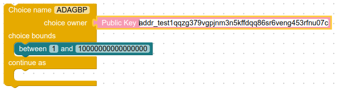
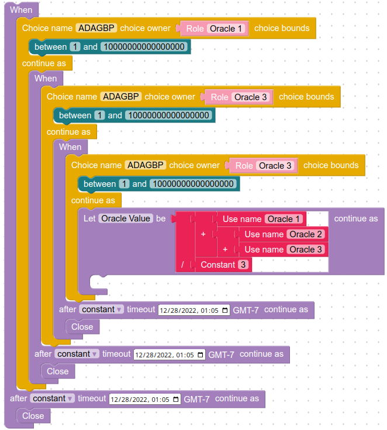
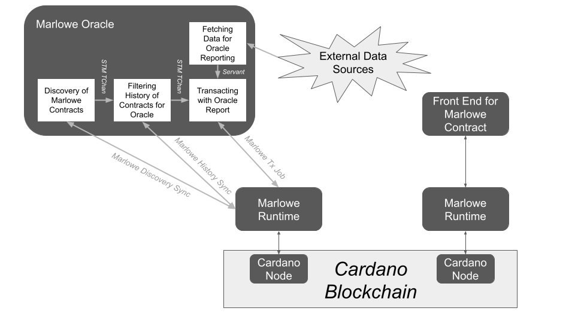

# General-Purpose Oracle for Marlowe Runtime

This oracle watches the blockchain for Marlowe contracts that have a `Choice` action ready for input. The start of the contract remaining on chain must be of the form `When [... (Case (Choice (ChoiceId symbol address) ...)) ...] ...`, where `address` is the address of the oracle and `symbol` is the symbol that the oracle should report a value for (see [the list of data feeds](#data-feeds-available)). If the `When` contract contains several `Case` terms for oracle input, the oracle arbitrarily selects one of them. Note that the `ChosenNum` provided by the oracle is an `Integer` representing the scaled value of the raw real number. For example, a 4.30% annual interest rate might be reported as `4300`. Needless to say, it is *critically important* that the Marlowe contract correctly interpret the integer that the oracle reports to it.




A [video demonstrates the Marlowe oracle](https://youtu.be/n1Mv3I7QoTE).


## Security Considerations

*The security of a Marlowe contract that uses oracle(s) depends upon trust in the oracle(s). For the oracle presented here, this means that the parties to the contract must trust the holder of the signing (private) key for the oracle address and the infrastructure running the oracle.*

The security of an oracle-reliant Marlowe contract might be increased by combining reports from several independent, trusted oracles. The diagram below shows an example of averaging the reports of three oracles. Note that a more secure approach would be to use the [median](https://en.wikipedia.org/wiki/Median) (middle value) of the three reports instead of the [mean](https://en.wikipedia.org/wiki/Mean) (average) of them.




## Data Feeds Available

The `SOFR` data feed provides the [Secured Overnight Financing Rate from the New York Federal Reserve Board](https://www.newyorkfed.org/markets/reference-rates/sofr), *measured in basis points*. Thus a report of `430` corresponds to a 4.30% annual rate.

The `BTCETH`, `BTCEUR`, `BTCGBP`, `BTCJPY`, `BTCUSD`, `ADABTC`, `ADAETH`, `ADAEUR`, `ADAGBP`, `ADAJPY`, `ADAUSD`, `ETHBTC`, `ETHEUR`, `ETHGBP`, `ETHJPY`, and `ETHUSD` data feeds provide cryptocurrency prices from [CoinGecko](https://www.coingecko.com/), measured in parts per hundred million (/ 100,000,000). The first three letters of the symbol are the *base currency* and the last three letters are the *quote currency*. Thus a report of `20970500` for `ADAGBP` corresponds to £0.209705/₳.

One can add data feeds to the oracle by adding a new oracle module (like [`Network.Oracle.Sofr`](oracle/Network/Oracle/Sofr.hs)) modifying [`Network.Oracle`](oracle/Network/Oracle.hs).


## Running the Oracle

The oracle requires two command-line arguments:

1. The address of the oracle.
2. The signing key file for the oracle.

See [Help](#help) for option arguments that select the Cardano network and polling frequency.

For example, executing the oracle as

```bash
marlowe-oracle \
  addr_test1qqzg379vgpjnm3n5kffdqq86sr6veng453rfnu07c8y9umdn3kr657fpa3q8mzwmjqvl9lqdn9g2pm3ejhlgwpprwy2swc7lhj \
  payment.skey \
|& jq 'select(.OracleProcess.fields.action == "wait")'
```

might result in the following output:

```JSON
{
  "OracleProcess": {
    "end": "2022-12-30T18:32:05.385512191Z",
    "event-id": "7645d15a-4d2e-40ff-8f8b-0ef8380d34bb",
    "fields": {
      "action": "wait",
      "availableForOracle": [
        "ADAUSD"
      ],
      "contractId": "fa4dd274fb921dea7f909d363c5331de1f9712e624f9ee7797f3eed5aab7e6db#1",
      "previousTransactionId": "fa4dd274fb921dea7f909d363c5331de1f9712e624f9ee7797f3eed5aab7e6db",
      "readyForOracle": [
        "ADAUSD"
      ],
      "result": "Failed: ApplyInputsConstraintsBuildupFailed (MarloweComputeTransactionFailed \"TEIntervalError (InvalidInterval (POSIXTime {getPOSIXTime = 1672425076000},POSIXTime {getPOSIXTime = 1672424485999}))\")",
      "symbol": "ADAUSD",
      "value": 24407200
    },
    "start": "2022-12-30T18:32:05.063148547Z"
  }
}
```
```JSON
{
  "OracleProcess": {
    "end": "2022-12-30T18:32:05.385600584Z",
    "event-id": "546d30f2-934d-43c1-ae93-184b70580042",
    "fields": {
      "action": "wait",
      "availableForOracle": [],
      "contractId": "22faecc06b460e18a92c628831410131007a988a77dec1562d31a0b8b78d937e#1",
      "previousTransactionId": "22faecc06b460e18a92c628831410131007a988a77dec1562d31a0b8b78d937e",
      "readyForOracle": [
        "XYZ"
      ],
      "result": "Ignored."
    },
    "start": "2022-12-30T18:32:05.385563061Z"
  }
}
```
```JSON
{
  "OracleProcess": {
    "end": "2022-12-30T18:33:42.773918093Z",
    "event-id": "3834f5ab-264b-4e4b-9da5-0873fb3999cf",
    "fields": {
      "action": "wait",
      "availableForOracle": [
        "ADAGBP"
      ],
      "contractId": "25fcc55b8f14442260119fdd2c487e86fc661c717007e250b62cd5cc55b785fd#1",
      "previousTransactionId": "25fcc55b8f14442260119fdd2c487e86fc661c717007e250b62cd5cc55b785fd",
      "readyForOracle": [
        "ADAGBP"
      ],
      "result": "Confirmed.",
      "symbol": "ADAGBP",
      "value": 20229900
    },
    "start": "2022-12-30T18:33:35.102403175Z"
  }
}
```

In the above, the oracle attempted to provide input to the first contract, but the time for oracle input had already passed. The oracle ignored the second contract because the oracle does not provide a feed for the `XYZ` symbol. The oracle confirmed that it reported a value for `ADAGBP` to the third contract.


## Creating Example Contracts

The `bash` script [create-example-contracts.sh](create-example-contracts.sh) is provided for creating Marlowe contracts that require oracle input. It takes three arguments:

1. The symbol that the oracle should report.
2. The address of the oracle.
3. The address creating the transaction.
4. The signing key file for the oracle.

For example,

```bash
./create-example-contract.sh \
  ADAGBP \
  addr_test1qqzg379vgpjnm3n5kffdqq86sr6veng453rfnu07c8y9umdn3kr657fpa3q8mzwmjqvl9lqdn9g2pm3ejhlgwpprwy2swc7lhj \
  addr_test1vq9prvx8ufwutkwxx9cmmuuajaqmjqwujqlp9d8pvg6gupczgtm9j \
  payment.skey
```  

results in the following output:

```console
Address: addr_test1qqzg379vgpjnm3n5kffdqq86sr6veng453rfnu07c8y9umdn3kr657fpa3q8mzwmjqvl9lqdn9g2pm3ejhlgwpprwy2swc7lhj
Symbol: ADAGBP
Timeout: 1672511600000 = Sat Dec 31 11:33:20 AM MST 2022
contractId: 25fcc55b8f14442260119fdd2c487e86fc661c717007e250b62cd5cc55b785fd#1
blockHeaderHash: d40988caf80a338ed6fc08229a9b333638b443a273d716ed76a011b02d224ff3
blockNo: 462090
slotNo: 16742013
```

This creates a minimalist contract `example.contract` that requires oracle input:

```console
$ json2yaml example.contract 
timeout: 1672342136000
timeout_continuation: close
when:
- case:
    choose_between:
    - from: 0
      to: 1000000000000000000
    for_choice:
      choice_name: ADAGBP
      choice_owner:
        address: addr_test1qqzg379vgpjnm3n5kffdqq86sr6veng453rfnu07c8y9umdn3kr657fpa3q8mzwmjqvl9lqdn9g2pm3ejhlgwpprwy2swc7lhj
  then: close
```


## Design

The oracle uses a Marlowe Runtime *discovery follower* to watch the blockchain for new Marlowe contracts. In parallel with that, it examines the creation and subsequent transaction of the contract to see if the contract might ever need input from the oracle. If the contract will not need oracle input, then it stops watching the contract. If the oracle will need oracle input, then it waits for the contract's last unspent transaction and provide oracle input to that if the current state of the contract requires such input. The oracle construction a transaction with input consisting of the correct `IChoice` to report the value for the requested symbol.



A future version of this oracle will allow requiring that a fee be paid to the oracle in return for the oracle's successful report. The diagram below shows that construct. The oracle would ignore contracts that did not have a `Pay` with sufficient Ada to the oracle.


## Help


```console
$ marlowe-oracle --help

marlowe-oracle : run an oracle for Marlowe contracts

Usage: marlowe-oracle [--chain-sync-host HOST_NAME]
                      [--chain-sync-command-port PORT_NUMBER]
                      [--chain-sync-port PORT_NUMBER]
                      [--marlowe-sync-host HOST_NAME]
                      [--marlowe-sync-port PORT_NUMBER]
                      [--marlowe-header-port PORT_NUMBER]
                      [--marlowe-query-port PORT_NUMBER] [--tx-host HOST_NAME]
                      [--tx-command-port PORT_NUMBER]
                      [--timeout-seconds INTEGER] [--build-seconds INTEGER]
                      [--confirm-seconds INTEGER] [--retry-seconds INTEGER]
                      [--retry-limit INTEGER] [--polling SECONDS]
                      [--requeue SECONDS] ADDRESS KEYFILE

  This command-line tool watches the blockchain for Marlowe contracts to which
  it can contribute oracle input, and then it submits an oracle `IChoice` to the
  contract when it is ready for that input.

Available options:
  -h,--help                Show this help text
  --chain-sync-host HOST_NAME
                           The hostname of the Marlowe Runtime chain-sync
                           server. Can be set as the environment variable
                           MARLOWE_CHAIN_SYNC_HOST (default: "127.0.0.1")
  --chain-sync-command-port PORT_NUMBER
                           The port number of the chain-sync server's job API.
                           Can be set as the environment variable
                           MARLOWE_CHAIN_SYNC_COMMAND_PORT (default: 3720)
  --chain-sync-port PORT_NUMBER
                           The port number of the chain-sync server's
                           synchronization API. Can be set as the environment
                           variable MARLOWE_CHAIN_SYNC_PORT (default: 3715)
  --marlowe-sync-host HOST_NAME
                           The hostname of the Marlowe Runtime marlowe-sync
                           server. Can be set as the environment variable
                           MARLOWE_RT_SYNC_HOST (default: "127.0.0.1")
  --marlowe-sync-port PORT_NUMBER
                           The port number of the marlowe-sync server's
                           synchronization API. Can be set as the environment
                           variable MARLOWE_RT_SYNC_MARLOWE_SYNC_PORT
                           (default: 3724)
  --marlowe-header-port PORT_NUMBER
                           The port number of the marlowe-sync server's header
                           synchronization API. Can be set as the environment
                           variable MARLOWE_RT_SYNC_MARLOWE_HEADER_PORT
                           (default: 3725)
  --marlowe-query-port PORT_NUMBER
                           The port number of the marlowe-sync server's query
                           API. Can be set as the environment variable
                           MARLOWE_RT_SYNC_MARLOWE_QUERY_PORT (default: 3726)
  --tx-host HOST_NAME      The hostname of the Marlowe Runtime transaction
                           server. Can be set as the environment variable
                           MARLOWE_RT_TX_HOST (default: "127.0.0.1")
  --tx-command-port PORT_NUMBER
                           The port number of the transaction server's job API.
                           Can be set as the environment variable
                           MARLOWE_RT_TX_COMMAND_PORT (default: 3723)
  --timeout-seconds INTEGER
                           Timeout in seconds for transaction confirmation.
                           (default: 600)
  --build-seconds INTEGER  Wait specified seconds before transaction
                           construction. No waiting occurs if a non-positive
                           number of seconds is specified. The specified wait
                           period is randomly increased up to a factor of two.
                           Increasing this value will increase the probability
                           that Marlowe Runtime's node has seen the transactions
                           that the submitting node has seen. (default: 3)
  --confirm-seconds INTEGER
                           Wait specified seconds after transaction
                           confirmation. No waiting occurs if a non-positive
                           number of seconds is specified. The specified wait
                           period is randomly increased up to a factor of two.
                           Increasing this value will increase the probability
                           that the submitting node has seen the transactions
                           that Marlowe Runtime has seen. (default: 3)
  --retry-seconds INTEGER  Wait specified seconds after after a failed
                           transaction before trying again. No retries occur if
                           a non-positive number of seconds is specified.
                           (default: 10)
  --retry-limit INTEGER    Maximum number of attempts for trying a failed
                           transaction again. Each subsequent retry waits twice
                           as long as the previous retry. No retries occur if a
                           non-positive number of retries is specified.
                           (default: 5)
  --polling SECONDS        The polling frequency for waiting on Marlowe Runtime.
  --requeue SECONDS        The requeuing frequency for reviewing the progress of
                           contracts on Marlowe Runtime.
  ADDRESS                  The Bech32 address of the oracle.
  KEYFILE                  The extended payment signing key file for the oracle.
```
