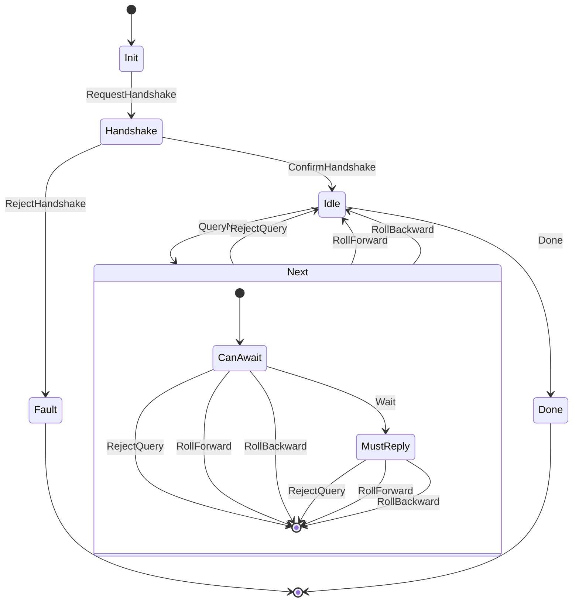

# Chain Sync Protocol

## Introduction

### Purpose

The Chain Sync Protocol is an application-level protocol for efficient,
domain-specific traversal of a blockchain. It is a modification of the Chain
Sync Protocol which allows the client to skip blocks and filter information
using arbitrary queries/seek motions. Provided that the server supports the
specified query, the client is able to dramatically reduce the volume of data it
must process compared to running the Chain Sync Protocol. This is particularly
useful for writing the off-chain code for a smart contract, which only needs to
process a tiny fraction of the full blockchain.

### Requirements

The key words "MUST", "MUST NOT", "REQUIRED", "SHALL", "SHALL NOT", "SHOULD",
"SHOULD NOT", "RECOMMENDED", "MAY", and "OPTIONAL" in this document are to be
interpreted as described in [RFC 2119](https://datatracker.ietf.org/doc/html/rfc2119).

An implementation is not compliant if it fails to satisfy one or more of the
MUST or REQUIRED level requirements for the protocols it implements. An
implementation that satisfies all the MUST or REQUIRED level and all the SHOULD
level requirements for its protocols is said to be "unconditionally compliant";
one that satisfies all the MUST level requirements but not all the SHOULD level
requirements for its protocols is said to be "conditionally compliant."

### Terminology

The following terminology is used to refer to the roles of participands in, and
objects of, the protocol.

- connection: A transport layer channel over which a client and a server exchange messages.
- client: The role played by the participant which sends queries and receives chain data.
- server: The role played by the participant which responds to queries maintains chain data.
- state: A member of the set of states specified by the state machine of the protocol.
- message: A member of the set of state transitions specified by the state maching of the protocol.
- payload: Data associated and sent with a message.
- query: Part of the payload of a query next message which the client sends to the server to tell it what to send next.
- error: A protocol level error which is triggered when one party sends an invalid message. Results in the termination of the connection.
- rejection: An application level error which is triggered when the server rejects a syntactically valid, semantically invalid query sent by the client. Does not result in the termination of the connection.
- roll forward: A message sent by the server to the client to advance its position forward to a new block. One possible response to a query.
- result: Part of the payload of a roll forward message which contains the result of a query.
- roll backward: A messagge sent by the server to the client to revert its position to a previous block. One possible response to a query.
- tip: The latest chronological point in the blockchain that the connected node has recorded.
- point: A point in the blockchain up to and including the tip. The precise representation is implementation-specific.
- position: The point where a client is currently "focused."
- schema version: The version of the query schema supported by the participants in the protocol. Used in the handshake to verify that the server supports the query schema supported by the client.
- handshake: A proceedure used to establish a connection which ensures the client and server understand the same queeries.
- agency: Used to describe which role is permited to send a message in a given state.
- tag: Metadata for serializing queries, errors, and results that explicitly indicates which query the message is related to.

### Operation

The Chain Sync Protocol is a stateful client-server protocol. When a
client establishes a connection with a server, a handshake is performed. If the
handshake succeeds, the idle state is reached. From the idle state, the client
has the agency to send a query or terminate the connection. If the client
terminates the connection, by sending a `Done` message, then the server closes
the connection and the protocol terminates. If the client sends a query, by
sending a `QueryNext` message, the server can choose to respond immediately to
the query, reject the query with a rejection reason, or ask the client to wait
for a response. When the client receives a response or a rejection, it returns
to the idle state, and the loop repeats.

A response can be a roll forward or roll backward message. If the response is a
roll forward, the payload will include the new position of the client and the
result of the query. If the response is a roll backward message, the payload
will include the new position of the client, and the new tip of the blockchain.
The position will be the most recent common ancestor point of the client's
previous position and the new tip.

### A Note on Intersections

The original Chain Sync Protocol provides a way to fast forward the client to
an "intersection point" - that is, a point which intersects with the set of
blocks the client may have already visited during a previous session. This
mechanism allows clients to connect without having to start from the genesis
block each time.

The Chain Sync Protocol does not provide such a mechanism, because the
query mechanism provides a much more flexible way to acheive the same result,
making intersection points redundant.

## State Machine

### States

#### Init State

The `Init` state is the initial state of the protocol. During the `Init` state,
the client has agency. The client MUST send a `RequestHandshake` message with a
schema version payload to the server, which transitions to the `Handshake`
state.

- Agency: client
- Available messages:
  - `RequestHandshake` to server

#### Handshake State

The `Handshake` state follows the `Init` state. During the `Handshake` state,
the server has agency. The server MUST accept the handshake if it supports the
provided schema version by sending a `ConfirmHandshake` message. The server
MUST reject the handshake if it does not support the provided schema version by
sending a `RejectHandshake` message. The `ConfirmHandshake` message transitions
the state machine to the `Idle` state. The `RejectHandshake` message
transitions the state machine to the `Fault` state. The client MUST initialize
its position to `Genesis` when it receives a `ConfirmHandshake` message.

- Agency: server
- Available messages:
  - `ConfirmHandshake` to client
  - `RejectHandshake` to server

#### Idle

The `Idle` state is the state from which a client MAY send a query to the
server. It does so by sending a `QueryNext` message. The payload of the
`QueryNext` MUST include a query. The `QueryNext` message transitions the state
machine to the `Next CanAwait` state. The client MAY request the server
terminates the connection by sending a `Done` message. The `Done` message
transitions the state machine to the `Done` state.

- Agency: client
- Available messages:
  - `QueryNext` to server
  - `Done` to server

#### Next wait state

The `Next wait` state is a state parameterized by a substate `wait` in which the
server has agency. 

##### Next CanAwait state

The `Next CanAwait` state is a sub-state of `Next wait` in which the server MUST
decode and decide how to handle the query receved in the `QueryNext` message.
If the server cannot decode the query, it MUST reject the query with a
`RejectQuery` message. The payload of the message SHOULD indicate that the
query did not conform to the schema. The server MAY decide to send an immediate
response. If so, the proceedure for doing so is outlined in the previous
section. The server MAY decide to wait before responding by sending a `Wait`
message. The server MAY decide to reject the query for other reasons by sending
a `RejectQuery` message. The payload of the message MUST include a rejection
reason.

- Agency: server
- Available messages:
  - `RejectQuery` to client
  - `RollForward` to client
  - `RollBackward` to client
  - `Wait` to client

##### Next MustReply state

The `Next MustReply` state is a sub-state of `Next wait`. The server SHOULD
respond with a `RollForward` message as soon as the query can be responded to.
The server MUST respond with a `RollBackward` if a rollback is encountered that
reverts the tip to a point before the client's current position. The payloads
for these messages are described in the `Next wait` state section. The server
MAY decide to reject the query for other reasons by sending a `RejectQuery`
message. The payload of the message MUST include a rejection reason.

- Agency: server
- Available messages:
  - `RejectQuery` to client
  - `RollForward` to client
  - `RollBackward` to client

#### Done

The `Done` state is the normal terminal state of the protocol.

- Agency: nobody
- Available messages:

#### Fault

The `Fault` state is the failed terminal state of the protocol.

- Agency: nobody
- Available messages:

### Messages

#### RequestHandshake message

The `RequestHandshake` is sent by the client to initiate the handshake.

- Origin State: `Init`
- Target State: `Handshake`
- Payload: Schema version
- Sender: client
- Receiver: server

##### Encoding

The `RequestHandshake` message is encoded as follows, in the following order:

- A `tag` octet consisting of the value `0x01`
- 8 octets containing the length of the following string as a big-endian 64-bit
  integer.
- A UTF-8 encoded string of octets containing the schema version.

#### ConfirmHandshake message

The `ConfirmHandshake` is sent by the server to confirm to the client that the
provided schema version is supported.

- Origin State: `Handshake`
- Target State: `Idle`
- Payload: None
- Sender: server
- Receiver: client

##### Encoding

The `ConfirmHandshake` message is encoded as follows, in the following order:

- A `tag` octet consisting of the value `0x02`

#### RejectHandshake message

The `RejectHandshake` is sent by the server to confirm to the client that the
provided schema version is not supported. The payload MUST include a list of
supported schemas

- Origin State: `Handshake`
- Target State: `Fault`
- Payload: supported schema versions
- Sender: server
- Receiver: client

##### Encoding

The `RejectHandshake` message is encoded as follows, in the following order:

- A `tag` octet consisting of the value `0x03`
- 8 octets containing the length of the following list as a big-endian 64-bit
  integer.
- A sequence of supported versions encoded as described in the `RequestHandshake`
  message (including the 8 octets of length).

#### QueryNext message

The `QueryNext` is sent by the client to request more data from the blockchain.

- Origin State: `Idle`
- Target State: `Next CanAwait`
- Payload: query
- Sender: client
- Receiver: server

##### Encoding

The `QueryNext` message is encoded as follows, in the following order:

- A `tag` octet consisting of the value `0x04`
- The octets representing the query's tag. The encoding of this is determined
  by the query schema.
- The octets representing the query. The encoding of this is determined by the
  query schema.

#### RejectQuery message

The `RejectQuery` is sent by the server to indicate that the query has been
rejected.

- Origin State: `Next CanAwait`
- Target State: `Idle`
- Payload: rejection reason
- Sender: server
- Receiver: client

##### Encoding

The `RejectQuery` message is encoded as follows, in the following order:

- A `tag` octet consisting of the value `0x05`
- The octets representing the query's tag. The encoding of this is determined
  by the query schema.
- The octets representing the rejection reason. The encoding of this is
  determined by the query schema.

#### RollForward message

The `RollForward` is sent by the server with a query result.

- Origin State: `Next (CanAwait | MustReply)`
- Target State: `Idle`
- Payload: result, new position, current tip
- Sender: server
- Receiver: client

##### Encoding

The `RollForward` message is encoded as follows, in the following order:

- A `tag` octet consisting of the value `0x06`
- The octets representing the query's tag. The encoding of this is determined
  by the query schema.
- The octets representing the result of the query. The encoding of this is
  determined by the query schema.
- The octets representing the client's new position. The encoding of this is
  blockchain-specific.
- The octets representing the current tip of the chain. The encoding of this is
  blockchain-specific.

#### RollBackward message

The `RollBackward` is sent by the server to indicate that the client's position
has been rolled back.

- Origin State: `Next (CanAwait | MustReply)`
- Target State: `Idle`
- Payload: new position, current tip
- Sender: server
- Receiver: client

##### Encoding

The `RollBackward` message is encoded as follows, in the following order:

- A `tag` octet consisting of the value `0x07`
- The octets representing the client's new position. The encoding of this is
- The octets representing the current tip of the chain. The encoding of this is
  blockchain-specific.

#### Wait message

The `Wait` is sent by the server to indicate that the client must wait for a
query result.

- Origin State: `Next CanAwait`
- Target State: `Next MustReply`
- Payload: current tip
- Sender: server
- Receiver: client

##### Encoding

The `Wait` message is encoded as follows, in the following order:

- A `tag` octet consisting of the value `0x08`
- The octets representing the current tip of the chain. The encoding of this is
  blockchain-specific.

#### Done message

The `Done` is sent by the client to indicate that the server should terminate
the connection.

- Origin State: `Idle`
- Target State: `Done`
- Payload: None
- Sender: client
- Receiver: server

##### Encoding

The `Done` message is encoded as follows, in the following order:

- A `tag` octet consisting of the value `0x09`

## Appendix

### State Machine Diagram

