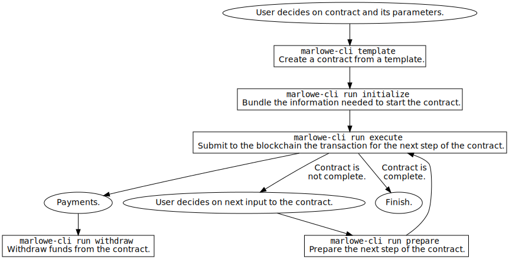

# Marlowe CLI Tool

The `marlowe-cli` tool provides several utilities for serialising Marlowe contracts to validators, datums, and redeemers. It also computes hashes and addresses. It can be used in conjunction with [`cardano-cli`](https://github.com/input-output-hk/cardano-node/blob/master/cardano-cli/README.md) to submit Marlowe transactions to the Cardano blockchain.

## High-Level Workflow

In the high-level workflowe for `marlowe-cli`, the user creates a contract from a template, using Marlowe Playground, programmatically, or by hand.
The user provides input at each step of contract execution.  The tool manages the contract state transitions and handles the construction and submission of transactions.

A [slide presentation](doc/marlowe-overview-tutorial.pdf) describes the high-level workflow for `marlowe-cli` in detail.

## Examples

*   [simple contract](examples/simple/ReadMe.md)
*   [escrow](examples/escrow/ReadMe.md)
*   [swap](examples/swap/ReadMe.md)
*   [zero-coupon bond](examples/zcb/ReadMe.md)
*   [contract for differences](examples/cfd/ReadMe.md)
*   [covered call](examples/coveredCall/ReadMe.md)

## Available Commands

    $ marlowe-cli --help
    
    marlowe-cli : a command-line tool for Marlowe contracts
    
    Usage: marlowe-cli [--version] (COMMAND | COMMAND)
      Utilities for Marlowe.
    
    Available options:
      -h,--help                Show this help text
      --version                Show version.
    
    High-level commands:
      run                      Run a contract.
      pab                      Run a contract via the PAB.
      template                 Create a contract from a template.
      test                     Test contracts.
    
    Low-level commands:
      contract                 Export contract address, validator, datum, or
                               redeemer.
      input                    Create inputs to a contract.
      role                     Export role address, validator, datum, or redeemer.
      query                    Blockchain queries for Marlowe.
      transaction              Create and submit transactions.
      util                     Miscellaneous utilities.

Help for subcommands:

*   high-level commands
    *   [`marlowe-cli run`](#run-commands)
    *   [`marlowe-cli pab`](#pab-commands)
    *   [`marlowe-cli template`](#template-commands)
    *   [`marlowe-cli test`](#test-commands)
*   low-level commands
    *   [`marlowe-cli contract`](#contract-commands)
    *   [`marlowe-cli input`](#input-commands)
    *   [`marlowe-cli role`](#role-commands)
    *   [`marlowe-cli query`](#query-commands)
    *   [`marlowe-cli transaction`](#transaction-commands)
    *   [`marlowe-cli util`](#util-commands)

### High-Level Commands

#### "Run" Commands

    $ marlowe-cli run --help
    
    Usage: marlowe-cli run COMMAND
      Run a contract.
    
    Available options:
      -h,--help                Show this help text
    
    Commands for running contracts:
      execute                  Run a Marlowe transaction.
      initialize               Initialize the first transaction of a Marlowe
                               contract and write output to a JSON file.
      prepare                  Prepare the next step of a Marlowe contract and write
                               the output to a JSON file.
      withdraw                 Withdraw funds from the Marlowe role address.

Individual help pages:

*   [`marlowe-cli run execute`](doc/run-execute.md)
*   [`marlowe-cli run initialize`](doc/run-initialize.md)
*   [`marlowe-cli run prepare`](doc/run-prepare.md)
*   [`marlowe-cli run withdraw`](doc/run-withdraw.md)

#### "PAB" Commands

    $ marlowe-cli pab --help
    
    Usage: marlowe-cli pab COMMAND
      Run a contract via the PAB.
    
    Available options:
      -h,--help                Show this help text
    
    Commands for running contracts on the PAB:
      app                      Start the Marlowe application contract.
      create                   Create a Marlowe contract.
      apply-inputs             Apply inputs to a Marlowe contract.
      redeem                   Redeem funds from a Marlowe contract.
      follower                 Start the Marlowe follower contract.
      follow                   Follow a Marlowe contract.
      companion                Start the Marlowe companion contract.
      stop                     Stop a Marlowe contract.

See [the PAB example](doc/PAB.md) for usage.

#### "Template" Commands

    $ marlowe-cli template --help
    
    Usage: marlowe-cli template COMMAND
      Create a contract from a template.
    
    Available options:
      -h,--help                Show this help text
    
    Commands for creating Marlowe contracts from templates:
      escrow                   Create an escrow contract.
      simple                   Create a simple example contract.
      swap                     Create a swap contract.
      zcb                      Create a zero-coupon bond.
      coveredCall              Create a covered call Option.

See [../marlowe-contracts/src/Marlowe/Contracts](../marlowe-contracts/src/Marlowe/Contracts) for details.

#### "Test" Commands

    $ marlowe-cli test contracts --help
    
    Usage: marlowe-cli test contracts [--testnet-magic INTEGER]
                                      --socket-path SOCKET_FILE --wallet-url URL
                                      --pab-url URL --faucet-key SIGNING_FILE
                                      --faucet-address ADDRESS
                                      --burn-address ADDRESS --passphrase PASSWORD
                                      TEST_FILE
      Test Marlowe contracts using the Marlowe PAB.
    
    Available options:
      --testnet-magic INTEGER  Network magic, or omit for mainnet.
      --socket-path SOCKET_FILE
                               Location of the cardano-node socket file.
      --wallet-url URL         URL for Cardano Wallet.
      --pab-url URL            URL for the Marlowe PAB.
      --faucet-key SIGNING_FILE
                               The file containing the signing key for the faucet.
      --faucet-address ADDRESS The address of the faucet.
      --burn-address ADDRESS   Burn address for discarding used tokens.
      --passphrase PASSWORD    The passphrase used for the Marlowe PAB.
      TEST_FILE                JSON file containing a test case.
      -h,--help                Show this help text

See [../test/](../test/ReadMe.md) for details.

### Low-Level Commands

#### "Contract" Commands

    $ marlowe-cli contract --help
    
    Usage: marlowe-cli contract COMMAND
      Export contract address, validator, datum, or redeemer.
    
    Available options:
      -h,--help                Show this help text
    
    Low-level commands for exporting Marlowe contract information:
      address                  Print a contract validator address.
      datum                    Export a contract datum to a JSON file.
      marlowe                  Export a Marlowe contract to a JSON file.
      redeemer                 Export a contract redeemer to a JSON file.
      validator                Export a contract validator to a JSON file.

Individual help pages:

*   [`marlowe-cli contract address`](doc/export-address.md)
*   [`marlowe-cli contract datum`](doc/export-datum.md)
*   [`marlowe-cli contract marlowe`](doc/export-marlowe.md)
*   [`marlowe-cli contract redeemer`](doc/export-redeemer.md)
*   [`marlowe-cli contract validator`](doc/export-validator.md)

#### "Input" Commands

    $ marlowe-cli input --help
    
    Usage: marlowe-cli input COMMAND
      Create inputs to a contract.
    
    Available options:
      -h,--help                Show this help text
    
    Low-level commands for creating inputs to a contract:
      choose                   Create Marlowe input for a choice.
      deposit                  Create Marlowe input for a deposit.
      notify                   Create Marlowe input for a notification.

Individual help pages:

*   [`marlowe-cli input choose`](doc/input-choose.md)
*   [`marlowe-cli input deposit`](doc/input-deposit.md)
*   [`marlowe-cli input notify`](doc/input-notify.md)

#### "Role" Commands

    $ marlowe-cli role --help
    
    Usage: marlowe-cli role COMMAND
      Export role address, validator, datum, or redeemer.
    
    Available options:
      -h,--help                Show this help text
    
    Low-level commands for exporting Marlowe role information:
      address                  Print a role validator address.
      datum                    Export a role datum to a JSON file.
      redeemer                 Export a role redeemer to a JSON file.
      validator                Export a role validator to a JSON file.

#### "Query" Commands

    $ marlowe-cli query --help
    
    Usage: marlowe-cli query COMMAND
      Blockchain queries for Marlowe.
    
    Available options:
      -h,--help                Show this help text
    
    Query commands:
      address                  Query transactions at an address.
      app                      Query the state of the Marlowe application script.
      history                  Query for the Marlowe contract histories.
      output                   Query output details.
      payout                   Query the state of the Marlowe payout script.
      transaction              Query transaction details.

Individual help pages:

*   [`marlowe-cli query address`](doc/query-address.md)
*   [`marlowe-cli query app`](doc/query-app.md)
*   [`marlowe-cli query history`](doc/query-history.md)
*   [`marlowe-cli query output`](doc/query-output.md)
*   [`marlowe-cli query payout`](doc/query-payout.md)
*   [`marlowe-cli query transaction`](doc/query-transaction.md)

#### "Transaction" Commands

    $ marlowe-cli transaction --help
    
    Usage: marlowe-cli transaction COMMAND
      Create and submit transactions.
    
    Available options:
      -h,--help                Show this help text
    
    Low-level commands for creating and submitting transactions:
      advance                  Build a transaction that both spends from and pays to
                               a Marlowe script.
      close                    Build a transaction that spends from a Marlowe
                               script.
      create                   Build a transaction that pays to a Marlowe script.
      simple                   Build a non-Marlowe transaction.
      submit                   Submit a transaction body.

Individual help pages:

*   [`marlowe-cli transaction advance`](doc/transaction-advance.md)
*   [`marlowe-cli transaction close`](doc/transaction-close.md)
*   [`marlowe-cli transaction create`](doc/transaction-create.md)
*   [`marlowe-cli transaction simple`](doc/transaction-simple.md)
*   [`marlowe-cli transaction submit`](doc/transaction-submit.md)

#### "Util" Commands

    $ marlowe-cli util --help
    
    Usage: marlowe-cli util COMMAND
      Miscellaneous utilities.
    
    Available options:
      -h,--help                Show this help text
    
    Miscellaneous low-level commands:
      clean                    Reorganize the UTxOs at an address, separating
                               tokens.
      decode-bech32            DecodBech32 data.
      encode-bech32            EncodBech32 data.
      mint                     Mint native tokens.
      select                   Select UTxO by asset.

Individual help pages:

*   [`marlowe-cli util clean`](doc/util-clean.md)
*   [`marlowe-cli util decode-bech32`](doc/util-decode-bech32.md)
*   [`marlowe-cli util encode-bech32`](doc/util-encode-bech32.md)
*   [`marlowe-cli util mint`](doc/util-mint.md)
*   [`marlowe-cli util select`](doc/util-select.md)

## Installation

Either install via using Nix and Cabal:

    git clone https://github.com/input-output-hk/marlowe-cardano.git
    nix-shell
    cabal install exe:marlowe-cli

or just using Cabal, if Cabal and GHC are already installed:

    git clone https://github.com/input-output-hk/marlowe-cardano.git
    cabal install exe:marlowe-cli

## Low-Level Workflows for Building Marlowe Scripts, Datums, and Redeemers

The `marlowe-cli` tools supports both granular and monolithic workflows for creating the files and hashes needed to submit Marlowe contracts with `cardano-cli`.

### Monolithic Workflow

The [`export-marlowe`](doc/export.md) command writes a JSON file with sufficient information to run the contract on the blockchain. It contains the following information.

*   Script address
*   Validator hash
*   Datum hash
*   CBOR for Plutus script
*   JSON and CBOR for datum.
*   JSON and CBOR for redeemer.
*   Size of the above CBOR in bytes
*   Execution cost

The diagram below illusrates how the `export` command can be used in conjunction with [`jq`](https://stedolan.github.io/jq/manual/) and `cardano-cli`.

See [example.marlowe](doc/example.marlowe) for an example file containing this information for a simple contract, and see [example-jq.sh](doc/example-jq.sh) for an example bash script embodying this workflow. A tutorial for this workflow is available [here](doc/tutorial-jq.md).

### Granular Workflow

The [`address`](doc/address.md), [`validator`](doc/validator.md), [`datum`](doc/datum.md), and [`redeemer`](doc/redeemer.md) commands write the corresponding subset of information to a JSON file or to the console. These allows finer-grain access to the capabilities of the `export` command. The diagram below illustrates how these commands can be used in conjunction with `cardano-cli`.

See [example.sh](doc/example.sh) for an example bash script embodying this workflow. A tutorial for this workflow is available [here](doc/tutorial.md).

## Testing

*   [simple contract](examples/simple/run-test.sh)
*   escrow
    *   ["everything is alright"](examples/escrow/run-everything-is-alright.sh)
    *   ["confirm problem"](examples/escrow/run-confirm-problem.sh)
    *   ["dismiss claim"](examples/escrow/run-dimiss-claim.sh)
    *   ["confirm claim"](examples/escrow/run-confirm-claim.sh)
*   [swap](examples/swap/run-swap.sh)
*   [zero-coupon bond](examples/zcb/run-zcb.sh)
*   [contract for differences](examples/cfd/run-cfd.sh)
*   [covered call](examples/coveredCall/run-coveredCall.sh)
