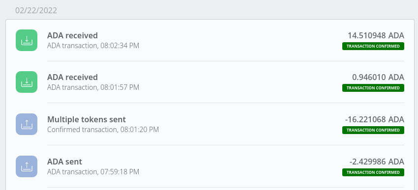

# Example of Using Marlowe CLI to Run Contracts via the Marlowe PAB


The following example illustrates the execution of a simple Marlowe contract using `marlowe-cli pab`, which makes calls a Marlowe PAB server. This mimics the communication between Marlowe Run and the Marlowe PAB. The `marlowe-cli pab` command can be used to run any Marlowe contract in this manner. Contracts in JSON format can be downloaded from the Marlowe Playground.


## Prerequisites

*   Install [`marlowe-cli`](../ReadMe.md).
*   Set up the backend services for Marlowe (instructions [here](../../marlowe-dashboard-client/docs/testnet-deployment.md)).

When the node is started, it will print its configuration:

```console
Node configuration: NodeConfiguration {ncNodeIPv4Addr = Nothing, ncNodeIPv6Addr = Nothing, ncNodePortNumber = Just 3001, ncConfigFile = "marlowe-cardano/bitte/node/config/config.json", ncTopologyFile = "marlowe-cardano/bitte/node/config/topology.yaml", ncDatabaseFile = "node.db", ncProtocolFiles = ProtocolFilepaths {byronCertFile = Nothing, byronKeyFile = Nothing, shelleyKESFile = Nothing, shelleyVRFFile = Nothing, shelleyCertFile = Nothing, shelleyBulkCredsFile = Nothing}, ncValidateDB = False, ncShutdownIPC = Nothing, ncShutdownOnSlotSynced = NoMaxSlotNo, ncProtocolConfig = NodeProtocolConfigurationCardano (NodeByronProtocolConfiguration {npcByronGenesisFile = "marlowe-cardano/bitte/node/config/byron-genesis.json", npcByronGenesisFileHash = Just "2f1e13c4116da44b22e555ca6249ee284788308bdca3ee635dc1b7fff1ca8cc1", npcByronReqNetworkMagic = RequiresMagic, npcByronPbftSignatureThresh = Just 1.1, npcByronApplicationName = ApplicationName {unApplicationName = "cardano-sl"}, npcByronApplicationVersion = 0, npcByronSupportedProtocolVersionMajor = 3, npcByronSupportedProtocolVersionMinor = 0, npcByronSupportedProtocolVersionAlt = 0}) (NodeShelleyProtocolConfiguration {npcShelleyGenesisFile = "marlowe-cardano/bitte/node/config/shelly-genesis.json", npcShelleyGenesisFileHash = Just "56e7a4a5813a270cd4249ff1515ecb15ce444afda33c62c2e862452077d01ea5"}) (NodeAlonzoProtocolConfiguration {npcAlonzoGenesisFile = "marlowe-cardano/bitte/node/config/alonzo-genesis.json", npcAlonzoGenesisFileHash = Just "7e94a15f55d1e82d10f09203fa1d40f8eede58fd8066542cf6566008068ed874"}) (NodeHardForkProtocolConfiguration {npcTestEnableDevelopmentHardForkEras = False, npcTestShelleyHardForkAtEpoch = Just (EpochNo 1), npcTestShelleyHardForkAtVersion = Nothing, npcTestAllegraHardForkAtEpoch = Nothing, npcTestAllegraHardForkAtVersion = Nothing, npcTestMaryHardForkAtEpoch = Nothing, npcTestMaryHardForkAtVersion = Nothing, npcTestAlonzoHardForkAtEpoch = Nothing, npcTestAlonzoHardForkAtVersion = Nothing}), ncSocketPath = Just "node.socket", ncDiffusionMode = InitiatorAndResponderDiffusionMode, ncSnapshotInterval = DefaultSnapshotInterval, ncTestEnableDevelopmentNetworkProtocols = False, ncMaxConcurrencyBulkSync = Nothing, ncMaxConcurrencyDeadline = Just 4, ncLoggingSwitch = True, ncLogMetrics = True, ncTraceConfig = TracingOn (TraceSelection {traceVerbosity = NormalVerbosity, traceAcceptPolicy = OnOff {isOn = True}, traceBlockFetchClient = OnOff {isOn = False}, traceBlockFetchDecisions = OnOff {isOn = False}, traceBlockFetchProtocol = OnOff {isOn = False}, traceBlockFetchProtocolSerialised = OnOff {isOn = False}, traceBlockFetchServer = OnOff {isOn = False}, traceBlockchainTime = OnOff {isOn = False}, traceChainDB = OnOff {isOn = True}, traceChainSyncBlockServer = OnOff {isOn = False}, traceChainSyncClient = OnOff {isOn = False}, traceChainSyncHeaderServer = OnOff {isOn = False}, traceChainSyncProtocol = OnOff {isOn = False}, traceConnectionManager = OnOff {isOn = True}, traceConnectionManagerCounters = OnOff {isOn = True}, traceDebugPeerSelectionInitiatorTracer = OnOff {isOn = False}, traceDebugPeerSelectionInitiatorResponderTracer = OnOff {isOn = False}, traceDiffusionInitialization = OnOff {isOn = True}, traceDnsResolver = OnOff {isOn = False}, traceDnsSubscription = OnOff {isOn = True}, traceErrorPolicy = OnOff {isOn = True}, traceForge = OnOff {isOn = True}, traceForgeStateInfo = OnOff {isOn = True}, traceHandshake = OnOff {isOn = False}, traceInboundGovernor = OnOff {isOn = True}, traceInboundGovernorCounters = OnOff {isOn = True}, traceIpSubscription = OnOff {isOn = False}, traceKeepAliveClient = OnOff {isOn = False}, traceLedgerPeers = OnOff {isOn = True}, traceLocalChainSyncProtocol = OnOff {isOn = False}, traceLocalConnectionManager = OnOff {isOn = False}, traceLocalErrorPolicy = OnOff {isOn = True}, traceLocalHandshake = OnOff {isOn = False}, traceLocalInboundGovernor = OnOff {isOn = False}, traceLocalMux = OnOff {isOn = False}, traceLocalRootPeers = OnOff {isOn = True}, traceLocalServer = OnOff {isOn = False}, traceLocalStateQueryProtocol = OnOff {isOn = False}, traceLocalTxSubmissionProtocol = OnOff {isOn = False}, traceLocalTxSubmissionServer = OnOff {isOn = False}, traceMempool = OnOff {isOn = True}, traceMux = OnOff {isOn = False}, tracePeerSelection = OnOff {isOn = False}, tracePeerSelectionCounters = OnOff {isOn = True}, tracePeerSelectionActions = OnOff {isOn = False}, tracePublicRootPeers = OnOff {isOn = False}, traceServer = OnOff {isOn = True}, traceTxInbound = OnOff {isOn = False}, traceTxOutbound = OnOff {isOn = False}, traceTxSubmissionProtocol = OnOff {isOn = False}, traceTxSubmission2Protocol = OnOff {isOn = False}}), ncMaybeMempoolCapacityOverride = Nothing, ncProtocolIdleTimeout = 5s, ncTimeWaitTimeout = 60s, ncAcceptedConnectionsLimit = AcceptedConnectionsLimit {acceptedConnectionsHardLimit = 512, acceptedConnectionsSoftLimit = 384, acceptedConnectionsDelay = 5s}, ncTargetNumberOfRootPeers = 100, ncTargetNumberOfKnownPeers = 100, ncTargetNumberOfEstablishedPeers = 50, ncTargetNumberOfActivePeers = 20, ncEnableP2P = DisabledP2PMode}
[oryx:cardano.node.basicInfo.protocol:Notice:5] [2022-02-23 02:13:35.24 UTC] Byron; Shelley
[oryx:cardano.node.basicInfo.version:Notice:5] [2022-02-23 02:13:35.24 UTC] 1.33.0
[oryx:cardano.node.basicInfo.commit:Notice:5] [2022-02-23 02:13:35.24 UTC] 814df2c146f5d56f8c35a681fe75e85b905aed5d
[oryx:cardano.node.basicInfo.nodeStartTime:Notice:5] [2022-02-23 02:13:35.24 UTC] 2022-02-23 02:13:35.248452239 UTC
[oryx:cardano.node.basicInfo.systemStartTime:Notice:5] [2022-02-23 02:13:35.24 UTC] 2022-02-15 11:00:00 UTC
[oryx:cardano.node.basicInfo.slotLengthByron:Notice:5] [2022-02-23 02:13:35.24 UTC] 20s
[oryx:cardano.node.basicInfo.epochLengthByron:Notice:5] [2022-02-23 02:13:35.24 UTC] 360
[oryx:cardano.node.basicInfo.slotLengthShelley:Notice:5] [2022-02-23 02:13:35.24 UTC] 1s
[oryx:cardano.node.basicInfo.epochLengthShelley:Notice:5] [2022-02-23 02:13:35.24 UTC] 7200
[oryx:cardano.node.basicInfo.slotsPerKESPeriodShelley:Notice:5] [2022-02-23 02:13:35.24 UTC] 129600
[oryx:cardano.node.basicInfo.slotLengthAllegra:Notice:5] [2022-02-23 02:13:35.24 UTC] 1s
[oryx:cardano.node.basicInfo.epochLengthAllegra:Notice:5] [2022-02-23 02:13:35.24 UTC] 7200
[oryx:cardano.node.basicInfo.slotsPerKESPeriodAllegra:Notice:5] [2022-02-23 02:13:35.24 UTC] 129600
[oryx:cardano.node.basicInfo.slotLengthMary:Notice:5] [2022-02-23 02:13:35.24 UTC] 1s
[oryx:cardano.node.basicInfo.epochLengthMary:Notice:5] [2022-02-23 02:13:35.24 UTC] 7200
[oryx:cardano.node.basicInfo.slotsPerKESPeriodMary:Notice:5] [2022-02-23 02:13:35.24 UTC] 129600
[oryx:cardano.node.basicInfo.slotLengthAlonzo:Notice:5] [2022-02-23 02:13:35.24 UTC] 1s
[oryx:cardano.node.basicInfo.epochLengthAlonzo:Notice:5] [2022-02-23 02:13:35.24 UTC] 7200
[oryx:cardano.node.basicInfo.slotsPerKESPeriodAlonzo:Notice:5] [2022-02-23 02:13:35.24 UTC] 129600
[oryx:cardano.node.nodeconfig:Info:5] [2022-02-23 02:13:35.24 UTC] startup time: 1645582416
[oryx:cardano.node.nodeconfig:Info:5] [2022-02-23 02:13:35.25 UTC]
node addresses:          0.0.0.0:3001, [::]:3001
local socket:            node.socket
node-to-node versions:
NodeToNodeV_6   HardForkNodeToNodeEnabled HardForkSpecificNodeToNodeVersion1 (EraNodeToNodeEnabled ByronNodeToNodeVersion2 :* EraNodeToNodeEnabled ShelleyNodeToNodeVersion1 :* EraNodeToNodeEnabled ShelleyNodeToNodeVersion1 :* EraNodeToNodeEnabled ShelleyNodeToNodeVersion1 :* EraNodeToNodeDisabled :* Nil)
NodeToNodeV_7   HardForkNodeToNodeEnabled HardForkSpecificNodeToNodeVersion1 (EraNodeToNodeEnabled ByronNodeToNodeVersion2 :* EraNodeToNodeEnabled ShelleyNodeToNodeVersion1 :* EraNodeToNodeEnabled ShelleyNodeToNodeVersion1 :* EraNodeToNodeEnabled ShelleyNodeToNodeVersion1 :* EraNodeToNodeEnabled ShelleyNodeToNodeVersion1 :* Nil)
node-to-client versions:
NodeToClientV_1 HardForkNodeToClientDisabled ByronNodeToClientVersion1
NodeToClientV_2 HardForkNodeToClientDisabled ByronNodeToClientVersion1
NodeToClientV_3 HardForkNodeToClientEnabled HardForkSpecificNodeToClientVersion1 (EraNodeToClientEnabled ByronNodeToClientVersion1 :* EraNodeToClientEnabled ShelleyNodeToClientVersion1 :* EraNodeToClientDisabled :* EraNodeToClientDisabled :* EraNodeToClientDisabled :* Nil)
NodeToClientV_4 HardForkNodeToClientEnabled HardForkSpecificNodeToClientVersion2 (EraNodeToClientEnabled ByronNodeToClientVersion1 :* EraNodeToClientEnabled ShelleyNodeToClientVersion2 :* EraNodeToClientDisabled :* EraNodeToClientDisabled :* EraNodeToClientDisabled :* Nil)
NodeToClientV_5 HardForkNodeToClientEnabled HardForkSpecificNodeToClientVersion2 (EraNodeToClientEnabled ByronNodeToClientVersion1 :* EraNodeToClientEnabled ShelleyNodeToClientVersion2 :* EraNodeToClientEnabled ShelleyNodeToClientVersion2 :* EraNodeToClientDisabled :* EraNodeToClientDisabled :* Nil)
NodeToClientV_6 HardForkNodeToClientEnabled HardForkSpecificNodeToClientVersion2 (EraNodeToClientEnabled ByronNodeToClientVersion1 :* EraNodeToClientEnabled ShelleyNodeToClientVersion2 :* EraNodeToClientEnabled ShelleyNodeToClientVersion2 :* EraNodeToClientEnabled ShelleyNodeToClientVersion2 :* EraNodeToClientDisabled :* Nil)
NodeToClientV_7 HardForkNodeToClientEnabled HardForkSpecificNodeToClientVersion2 (EraNodeToClientEnabled ByronNodeToClientVersion1 :* EraNodeToClientEnabled ShelleyNodeToClientVersion3 :* EraNodeToClientEnabled ShelleyNodeToClientVersion3 :* EraNodeToClientEnabled ShelleyNodeToClientVersion3 :* EraNodeToClientDisabled :* Nil)
NodeToClientV_8 HardForkNodeToClientEnabled HardForkSpecificNodeToClientVersion2 (EraNodeToClientEnabled ByronNodeToClientVersion1 :* EraNodeToClientEnabled ShelleyNodeToClientVersion3 :* EraNodeToClientEnabled ShelleyNodeToClientVersion3 :* EraNodeToClientEnabled ShelleyNodeToClientVersion3 :* EraNodeToClientDisabled :* Nil)
NodeToClientV_9 HardForkNodeToClientEnabled HardForkSpecificNodeToClientVersion2 (EraNodeToClientEnabled ByronNodeToClientVersion1 :* EraNodeToClientEnabled ShelleyNodeToClientVersion4 :* EraNodeToClientEnabled ShelleyNodeToClientVersion4 :* EraNodeToClientEnabled ShelleyNodeToClientVersion4 :* EraNodeToClientEnabled ShelleyNodeToClientVersion4 :* Nil)
NodeToClientV_10        HardForkNodeToClientEnabled HardForkSpecificNodeToClientVersion2 (EraNodeToClientEnabled ByronNodeToClientVersion1 :* EraNodeToClientEnabled ShelleyNodeToClientVersion4 :* EraNodeToClientEnabled ShelleyNodeToClientVersion4 :* EraNodeToClientEnabled ShelleyNodeToClientVersion4 :* EraNodeToClientEnabled ShelleyNodeToClientVersion4 :* Nil)
NodeToClientV_11        HardForkNodeToClientEnabled HardForkSpecificNodeToClientVersion2 (EraNodeToClientEnabled ByronNodeToClientVersion1 :* EraNodeToClientEnabled ShelleyNodeToClientVersion5 :* EraNodeToClientEnabled ShelleyNodeToClientVersion5 :* EraNodeToClientEnabled ShelleyNodeToClientVersion5 :* EraNodeToClientEnabled ShelleyNodeToClientVersion5 :* Nil)
[oryx:cardano.node.ChainDB:Info:5] [2022-02-23 02:13:35.25 UTC] Started opening Chain DB
[oryx:cardano.node.ChainDB:Info:5] [2022-02-23 02:13:35.25 UTC] Started opening Immutable DB
[oryx:cardano.node.ChainDB:Info:5] [2022-02-23 02:13:35.28 UTC] Validating chunk no. 1808 out of 1808. Progress: 99.94%
[oryx:cardano.node.ChainDB:Info:5] [2022-02-23 02:13:35.29 UTC] Validated chunk no. 1808 out of 1808. Progress: 100.00%
[oryx:cardano.node.ChainDB:Info:5] [2022-02-23 02:13:35.29 UTC] Found a valid last location at chunk 1808 with tip 42965060fe5f47088fcdc57b2bca1dc67e29c2c5d5cd57254fdd9e7e3aa7c4ce@651000.
[oryx:cardano.node.ChainDB:Info:5] [2022-02-23 02:13:35.29 UTC] Opened imm db with immutable tip at 42965060fe5f47088fcdc57b2bca1dc67e29c2c5d5cd57254fdd9e7e3aa7c4ce at slot 651000 and chunk 1808
[oryx:cardano.node.ChainDB:Info:5] [2022-02-23 02:13:35.29 UTC] Started opening Volatile DB
[oryx:cardano.node.ChainDB:Info:5] [2022-02-23 02:13:35.31 UTC] Opened vol db
[oryx:cardano.node.ChainDB:Info:5] [2022-02-23 02:13:35.31 UTC] Started opening Ledger DB
[oryx:cardano.node.ChainDB:Info:5] [2022-02-23 02:13:35.31 UTC] Replaying ledger from snapshot at e59da134c4615f3f4a478c29b75d246be1be2d715ed0fefb34a3caa328c23656 at slot 650926
[oryx:cardano.node.ChainDB:Info:5] [2022-02-23 02:13:35.31 UTC] Replayed block: slot 651000 out of 651000. Progress: 100.00%
[oryx:cardano.node.ChainDB:Info:5] [2022-02-23 02:13:35.31 UTC] Opened lgr db
[oryx:cardano.node.ChainDB:Info:5] [2022-02-23 02:13:35.31 UTC] Started initial chain selection
[oryx:cardano.node.ChainDB:Info:5] [2022-02-23 02:13:35.31 UTC] Pushing ledger state for block 03f20912ef9ece5f012ce61e1080d5276ef28b2be8b96cbca5b7f1ea71a4acfe at slot 651011. Progress: 0.00%
[oryx:cardano.node.ChainDB:Info:5] [2022-02-23 02:13:35.33 UTC] before next, messages elided = 651016
[oryx:cardano.node.ChainDB:Info:5] [2022-02-23 02:13:35.33 UTC] Pushing ledger state for block ef4c33100195545a145850b90fd0d95fc9898ece3406d6a14da92113b5719260 at slot 651581. Progress: 100.00%
[oryx:cardano.node.ChainDB:Info:5] [2022-02-23 02:13:35.33 UTC] Valid candidate at tip 03f20912ef9ece5f012ce61e1080d5276ef28b2be8b96cbca5b7f1ea71a4acfe at slot 651011
[oryx:cardano.node.ChainDB:Info:5] [2022-02-23 02:13:35.33 UTC] Initial chain selected
[oryx:cardano.node.ChainDB:Info:5] [2022-02-23 02:13:35.33 UTC] Opened db with immutable tip at 42965060fe5f47088fcdc57b2bca1dc67e29c2c5d5cd57254fdd9e7e3aa7c4ce at slot 651000 and tip ef4c33100195545a145850b90fd0d95fc9898ece3406d6a14da92113b5719260 at slot 651581
[oryx:cardano.node.DiffusionInitializationTracer:Info:47] [2022-02-23 02:13:35.33 UTC] CreatingServerSocket [::]:3001
[oryx:cardano.node.DiffusionInitializationTracer:Info:47] [2022-02-23 02:13:35.33 UTC] ConfiguringServerSocket [::]:3001
[oryx:cardano.node.DiffusionInitializationTracer:Info:47] [2022-02-23 02:13:35.33 UTC] ListeningServerSocket [::]:3001
[oryx:cardano.node.DiffusionInitializationTracer:Info:47] [2022-02-23 02:13:35.33 UTC] ServerSocketUp [::]:3001
[oryx:cardano.node.DiffusionInitializationTracer:Info:47] [2022-02-23 02:13:35.33 UTC] RunServer ([::]:3001 :| [])
[oryx:cardano.node.DiffusionInitializationTracer:Info:49] [2022-02-23 02:13:35.33 UTC] CreateSystemdSocketForSnocketPath (LocalAddress "node.socket")
[oryx:cardano.node.DiffusionInitializationTracer:Info:45] [2022-02-23 02:13:35.33 UTC] CreatingServerSocket 0.0.0.0:3001
[oryx:cardano.node.DiffusionInitializationTracer:Info:45] [2022-02-23 02:13:35.33 UTC] ConfiguringServerSocket 0.0.0.0:3001
[oryx:cardano.node.DiffusionInitializationTracer:Info:45] [2022-02-23 02:13:35.33 UTC] ListeningServerSocket 0.0.0.0:3001
[oryx:cardano.node.DiffusionInitializationTracer:Info:45] [2022-02-23 02:13:35.33 UTC] ServerSocketUp 0.0.0.0:3001
[oryx:cardano.node.DiffusionInitializationTracer:Info:45] [2022-02-23 02:13:35.33 UTC] RunServer (0.0.0.0:3001 :| [])
[oryx:cardano.node.DiffusionInitializationTracer:Info:49] [2022-02-23 02:13:35.33 UTC] CreatedLocalSocket (LocalAddress "node.socket")
[oryx:cardano.node.DiffusionInitializationTracer:Info:49] [2022-02-23 02:13:35.33 UTC] ConfiguringLocalSocket (LocalAddress "node.socket") (FileDescriptor 23)
[oryx:cardano.node.DiffusionInitializationTracer:Info:49] [2022-02-23 02:13:35.33 UTC] ListeningLocalSocket (LocalAddress "node.socket") (FileDescriptor 23)
[oryx:cardano.node.DiffusionInitializationTracer:Info:49] [2022-02-23 02:13:35.33 UTC] LocalSocketUp (LocalAddress "node.socket") (FileDescriptor 23)
[oryx:cardano.node.DiffusionInitializationTracer:Info:49] [2022-02-23 02:13:35.33 UTC] RunLocalServer (LocalAddress "node.socket")
[oryx:cardano.node.DnsSubscription:Notice:63] [2022-02-23 02:13:35.41 UTC] Domain: "europe.relays.marlowe-testnet.dev.cardano.org" Connection Attempt Start, destination 3.126.34.143:3001
[oryx:cardano.node.DnsSubscription:Notice:63] [2022-02-23 02:13:35.57 UTC] Domain: "europe.relays.marlowe-testnet.dev.cardano.org" Connection Attempt End, destination 3.126.34.143:3001 outcome: ConnectSuccess
[oryx:cardano.node.ChainDB:Notice:23] [2022-02-23 02:13:36.55 UTC] Chain extended, new tip: bb77d5e27f0726acdf3e71fe9f4f94d8ada28d1485a0977806128984ff7834ae at slot 651640
[oryx:cardano.node.ChainDB:Info:27] [2022-02-23 02:13:36.73 UTC] Took ledger snapshot DiskSnapshot {dsNumber = 651579, dsSuffix = Nothing} at 2c0dca4c1c4af9d35d93f62b10b3fd1a3a162b0ec12bb10271e74bfd98326f7e at slot 651579
```

When the wallet is started, it will show that it has found the existing wallet and is syncing:

```console
[cardano-wallet.main:Info:4] [2022-02-23 02:33:56.33 UTC] Running as v2022-01-18 (git revision: a5085acbd2670c24251cf8d76a4e83c77a2679ba) on x86_64-linux
[cardano-wallet.main:Info:4] [2022-02-23 02:33:56.33 UTC] Command line: /nix/store/s8j07nns9w92886f2wkmnxf2fsbqln2d-cardano-wallet-2022.1.18/bin/cardano-wallet serve --testnet marlowe-cardano/bitte/node/config/byron-genesis.json --database wallet.db --node-socket node.socket --port 8090 --log-level DEBUG
[cardano-wallet.main:Debug:4] [2022-02-23 02:33:56.33 UTC] ServeArgs {_hostPreference = Host "127.0.0.1", _listen = ListenOnPort 8090, _tlsConfig = Nothing, _nodeSocket = CardanoNodeConn "node.socket", _networkConfiguration = TestnetConfig "marlowe-cardano/bitte/node/config/byron-genesis.json", _database = Just "wallet.db", _syncTolerance = SyncTolerance 300s, _enableShutdownHandler = False, _poolMetadataSourceOpt = Nothing, _tokenMetadataSourceOpt = Nothing, _logging = LoggingOptions {loggingMinSeverity = Debug, loggingTracers = Tracers {applicationTracer = Const (Just Info), apiServerTracer = Const (Just Info), tokenMetadataTracer = Const (Just Info), walletEngineTracer = Const (Just Info), walletDbTracer = Const (Just Info), poolsEngineTracer = Const (Just Info), poolsDbTracer = Const (Just Info), ntpClientTracer = Const (Just Info), networkTracer = Const (Just Info)}, loggingTracersDoc = Nothing}}
[cardano-wallet.main:Info:4] [2022-02-23 02:33:56.34 UTC] Wallet databases: Using directory: wallet.db
[cardano-wallet.application:Info:4] [2022-02-23 02:33:56.34 UTC] Wallet backend server starting. Using node.socket.
[cardano-wallet.application:Info:4] [2022-02-23 02:33:56.34 UTC] Node is Haskell Node on testnet (1564).
[cardano-wallet.token-metadata:Notice:4] [2022-02-23 02:33:56.34 UTC] No token metadata server is configured.
[cardano-wallet.token-metadata:Notice:4] [2022-02-23 02:33:56.34 UTC] No token metadata server is configured.
[cardano-wallet.token-metadata:Notice:4] [2022-02-23 02:33:56.35 UTC] No token metadata server is configured.
[cardano-wallet.wallet-db:Info:4] [2022-02-23 02:33:56.35 UTC] Found existing wallet: ffad420107082691531cad6e434ab73dce064edf
[cardano-wallet.wallet-db:Info:24] [2022-02-23 02:33:56.35 UTC] Starting connection pool for wallet.db/she.ffad420107082691531cad6e434ab73dce064edf.sqlite
[cardano-wallet.network:Info:13] [2022-02-23 02:33:56.35 UTC] Protocol parameters for tip are:
 Decentralization level: 75.00%
 Transaction parameters: [Fee policy: 155381.0 + 44.0x, Tx max size: 32768, max exec units: max steps: 10000000000, max memory: 10000000]
 Desired number of pools: 150
 Minimum UTxO value: 0.034482 per word
 Eras:
   - byron from 0
   - shelley from 1
   - allegra from 3
   - mary from 4
   - alonzo from 7
 Execution unit prices: 721 % 10000000 per step, 577 % 10000 per memory unit

Slotting parameters for tip are:
 Slot length:        1s
 Epoch length:       7200
 Active slot coeff:  5.0e-2
 Security parameter: 36 block


[cardano-wallet.main:Info:4] [2022-02-23 02:33:57.13 UTC] Wallet backend server listening on http://127.0.0.1:8090/
[cardano-wallet.pools-engine:Info:355] [2022-02-23 02:33:57.13 UTC] Chain following starting.
[cardano-wallet.wallet-engine:Notice:50] [2022-02-23 02:34:01.41 UTC] ffad4201: In sync. Applied 160 blocks, 1 rollbacks in the last 5.001369757s. Current tip is [point a0112d6e at slot 653989].
```

When the chain index is started, it will show that it is syncing with the node:

```console
Command line config:
AppConfig {acLogConfigPath = Nothing, acMinLogLevel = Nothing, acConfigPath = Nothing, acCLIConfigOverrides = CLIConfigOverrides {ccSocketPath = Just "node.socket", ccDbPath = Just "chain-index.db/ci.sqlite", ccPort = Just 9083, ccNetworkId = Just 1564}, acCommand = StartChainIndex}

Logging config:
Representation {minSeverity = Info, rotation = Nothing, setupScribes = [ScribeDefinition {scKind = StdoutSK, scFormat = ScText, scName = "stdout", scPrivacy = ScPublic, scRotation = Nothing, scMinSev = Debug, scMaxSev = Emergency}], defaultScribes = [(StdoutSK,"stdout")], setupBackends = [KatipBK,AggregationBK,MonitoringBK,EKGViewBK], defaultBackends = [KatipBK,AggregationBK,EKGViewBK], hasEKG = Just (Endpoint ("localhost",12790)), hasGraylog = Nothing, hasPrometheus = Nothing, hasGUI = Nothing, traceForwardTo = Nothing, forwardDelay = Nothing, traceAcceptAt = Nothing, options = fromList []}

Chain Index config:
Socket: node.socket
Db: chain-index.db/ci.sqlite
Port: 9083
Network Id: Testnet (NetworkMagic {unNetworkMagic = 1564})
Security Param: 2160
Store from: BlockNo 0

The tip of the local node: SlotNo 654040
Connecting to the node using socket: node.socket
Starting webserver on port 9083
A Swagger UI for the endpoints are available at http://localhost:9083/swagger/swagger-ui
Syncing (99%)
Syncing (100%)
```

When the Marlowe PAB is started, it will show that it is syncing with the node:

```console
[pab:Info:4] [2022-02-23 02:57:30.55 UTC] Restoring PAB state ...
[pab:Info:4] [2022-02-23 02:57:30.55 UTC] No contract instance were restored in the PAB state.
[pab:Info:4] [2022-02-23 02:57:30.55 UTC] Starting PAB backend server on port 9080
Current block: 229. Current slot: 229000
Current block: 252. Current slot: 420440
Current block: 252. Current slot: 518117
```


## Start the `WalletCompanion` Contract

In a new terminal window, run the companion contract:

```
marlowe-cli pab companion --pab-url http://localhost:9080                   \
                          --wallet ffad420107082691531cad6e434ab73dce064edf \
                          --out-file companion.instance                     \
                          --loop
```

A list of active contracts will appear on the console:

```console
New observable state: CompanionState (fromList [])
New active endpoints: []
Partial transactions that need balancing: []
```

Furthermore, the log for `marlowe-pab` will report that the companion instance has been activated:

```console
[pab:Info:40] [2022-02-23 02:57:36.64 UTC] Initialising contract WalletCompanion with ID 1aa03656-52df-4115-8044-78b1d6824e09
[pab:Info:40] [2022-02-23 02:57:36.71 UTC] Activated instance 1aa03656-52df-4115-8044-78b1d6824e09 on Wffad420
```

The file `companion.instance` contains the instance ID for this companion contract.

```
cat companion.instance
```

```console
{
    "unContractInstanceId": "1aa03656-52df-4115-8044-78b1d6824e09"
}
```


## Start the `MarloweFollower` Contract

In a new terminal window, run the follower contract:

```
marlowe-cli pab follower --pab-url http://localhost:9080                   \
                         --wallet ffad420107082691531cad6e434ab73dce064edf \
                         --out-file follower.instance                      \
                         --loop
```

The console will indicate that now contracts are being followed:

```console
New observable state: ContractHistory {chParams = First {getFirst = Nothing}, chHistory = [], chAddress = First {getFirst = Nothing}}
New active endpoints: [ActiveEndpoint {aeDescription = EndpointDescription {getEndpointDescription = "follow"}, aeMetadata = Nothing}]
Partial transactions that need balancing: []
```

Furthermore, the log for `marlowe-pab` will report that the follower instance has been activated:

```console
[pab:Info:48] [2022-02-23 02:58:08.12 UTC] Initialising contract MarloweFollower with ID 9596a84f-a20e-49c8-bdcb-789d8b1aa8e8
[pab:Info:48] [2022-02-23 02:58:08.19 UTC] Activated instance 9596a84f-a20e-49c8-bdcb-789d8b1aa8e8 on Wffad420
```

The file `follower.instance` contains the instance ID for this follower contract.

```
cat follower.instance
```

```console
{
    "unContractInstanceId": "9596a84f-a20e-49c8-bdcb-789d8b1aa8e8"
}
```


## Start the `MarloweApp` Contract

In a new terminal window, run the Marlowe application contract:

```
marlowe-cli pab app --pab-url http://localhost:9080                   \
                    --wallet ffad420107082691531cad6e434ab73dce064edf \
                    --out-params-file app.params                      \
                    --out-instance-file app.instance                  \
                    --loop
```

A list of active endpoints will appear on the console:

```console
New observable state: Nothing
New active endpoints: [ActiveEndpoint {aeDescription = EndpointDescription {getEndpointDescription = "close"}, aeMetadata = Nothing},ActiveEndpoint {aeDescription = EndpointDescription {getEndpointDescription = "redeem"}, aeMetadata = Nothing},ActiveEndpoint {aeDescription = EndpointDescription {getEndpointDescription = "auto"}, aeMetadata = Nothing},ActiveEndpoint {aeDescription = EndpointDescription {getEndpointDescription = "apply-inputs"}, aeMetadata = Nothing},ActiveEndpoint {aeDescription = EndpointDescription {getEndpointDescription = "create"}, aeMetadata = Nothing}]
Partial transactions that need balancing: []
```

Furthermore, the log for `marlowe-pab` will report that the application instance has been activated:

```console
[pab:Info:54] [2022-02-23 02:58:24.55 UTC] Initialising contract MarloweApp with ID 8cbfc471-99a3-4d5c-82e8-347797477be8
[pab:Info:54] [2022-02-23 02:58:24.64 UTC] Activated instance 8cbfc471-99a3-4d5c-82e8-347797477be8 on Wffad420
```

The file `app.instance` contains the instance ID for this follower contract.

```
cat app.instance
```

```console
{
    "unContractInstanceId": "8cbfc471-99a3-4d5c-82e8-347797477be8"
}
```


### Call the "Create" Endpoint

For illustration, we run a simple contract involving one role:

```
NOW=$(( $(date -u +%s) * 1000 ))
HOUR=$(( 60 * 60 * 1000 ))
cat > contract.json << EOI
{
    "timeout": $(( NOW + 10 * HOUR )),
    "when": [
        {
            "then": {
                "timeout": $(( NOW + 12 * HOUR )),
                "when": [
                    {
                        "then": "close",
                        "case": {
                            "notify_if": true
                        }
                    }
                ],
                "timeout_continuation": "close"
            },
            "case": {
                "deposits": 15000000,
                "party": {
                    "role_token": "PAB"
                },
                "of_token": {
                    "currency_symbol": "",
                    "token_name": ""
                },
                "into_account": {
                    "role_token": "PAB"
                }
            }
        }
    ],
    "timeout_continuation": "close"
}
EOI
```

In a new terminal window, now create this contract:

```
marlowe-cli pab create --pab-url http://localhost:9080                                      \
                       --instance-file app.instance                                         \
                       --contract-file contract.json                                        \
                       --owner PAB=addr_test1qqhsrfkwq3pzwftdd6r8hhent88p5c8t9y6vp74450wm7xkdtcmjhx29ptfrcx5m4y57rmjg3vhwcrte02f5mn55l5vq2pxm5e
```

The terminal for the application contract will show that no endpoints are available while it awaits the transaction's confirmation:

```console
New active endpoints: []
``

The log for the wallet will show that it is selecting UTxOs, balancing the transaction, submitting it, and later detecting the transaction's confirmation:

```console
[cardano-wallet.api-server:Info:369] [2022-02-23 02:57:36.71 UTC] [RequestId 0] [GET] /v2/wallets/ffad420107082691531cad6e434ab73dce064edf/keys/utxo_external/0?hash=true
[cardano-wallet.api-server:Info:369] [2022-02-23 02:57:36.71 UTC] [RequestId 0] GET /v2/wallets/ffad420107082691531cad6e434ab73dce064edf/keys/utxo_external/0 200 OK in 0.000844495s
[cardano-wallet.api-server:Info:372] [2022-02-23 02:59:12.77 UTC] [RequestId 1] [GET] /v2/wallets/ffad420107082691531cad6e434ab73dce064edf/keys/utxo_external/0?hash=true
[cardano-wallet.api-server:Info:372] [2022-02-23 02:59:12.77 UTC] [RequestId 1] GET /v2/wallets/ffad420107082691531cad6e434ab73dce064edf/keys/utxo_external/0 200 OK in 0.00044641s
[cardano-wallet.api-server:Info:372] [2022-02-23 02:59:12.80 UTC] [RequestId 2] [GET] /v2/wallets/ffad420107082691531cad6e434ab73dce064edf/keys/utxo_external/0?hash=true
[cardano-wallet.api-server:Info:372] [2022-02-23 02:59:12.80 UTC] [RequestId 2] GET /v2/wallets/ffad420107082691531cad6e434ab73dce064edf/keys/utxo_external/0 200 OK in 0.000406251s
[cardano-wallet.api-server:Info:372] [2022-02-23 02:59:12.84 UTC] [RequestId 3] [POST] /v2/wallets/ffad420107082691531cad6e434ab73dce064edf/transactions-balance
[cardano-wallet.wallet-engine:Info:372] [2022-02-23 02:59:12.84 UTC] ffad4201: Selection report (summarized):
SelectionReportSummarized:
  computedFee: 0.169329
  adaBalanceOfSelectedInputs: 21876.952331
  adaBalanceOfExtraCoinSource: 0.000000
  adaBalanceOfExtraCoinSink: 0.000000
  adaBalanceOfRequestedOutputs: 2.000000
  adaBalanceOfGeneratedChangeOutputs: 21874.783002
  numberOfSelectedInputs: 1
  numberOfSelectedCollateralInputs: 0
  numberOfRequestedOutputs: 1
  numberOfGeneratedChangeOutputs: 1
  numberOfUniqueNonAdaAssetsInSelectedInputs: 0
  numberOfUniqueNonAdaAssetsInRequestedOutputs: 0
  numberOfUniqueNonAdaAssetsInGeneratedChangeOutputs: 0

[cardano-wallet.api-server:Info:372] [2022-02-23 02:59:12.84 UTC] [RequestId 3] POST /v2/wallets/ffad420107082691531cad6e434ab73dce064edf/transactions-balance 202 Accepted in 0.00265605s
[cardano-wallet.api-server:Info:372] [2022-02-23 02:59:13.00 UTC] [RequestId 4] [POST] /v2/wallets/ffad420107082691531cad6e434ab73dce064edf/transactions-balance
[cardano-wallet.wallet-engine:Info:372] [2022-02-23 02:59:13.00 UTC] ffad4201: Selection report (summarized):
SelectionReportSummarized:
  computedFee: 1.496853
  adaBalanceOfSelectedInputs: 21876.952331
  adaBalanceOfExtraCoinSource: 0.000000
  adaBalanceOfExtraCoinSink: 0.000000
  adaBalanceOfRequestedOutputs: 4.000000
  adaBalanceOfGeneratedChangeOutputs: 21871.455478
  numberOfSelectedInputs: 1
  numberOfSelectedCollateralInputs: 1
  numberOfRequestedOutputs: 2
  numberOfGeneratedChangeOutputs: 2
  numberOfUniqueNonAdaAssetsInSelectedInputs: 0
  numberOfUniqueNonAdaAssetsInRequestedOutputs: 1
  numberOfUniqueNonAdaAssetsInGeneratedChangeOutputs: 0

[cardano-wallet.api-server:Info:372] [2022-02-23 02:59:13.01 UTC] [RequestId 4] POST /v2/wallets/ffad420107082691531cad6e434ab73dce064edf/transactions-balance 202 Accepted in 0.012181365s
[cardano-wallet.api-server:Info:372] [2022-02-23 02:59:13.06 UTC] [RequestId 5] [POST] /v2/wallets/ffad420107082691531cad6e434ab73dce064edf/transactions-sign
[cardano-wallet.api-server:Info:372] [2022-02-23 02:59:13.26 UTC] [RequestId 5] POST /v2/wallets/ffad420107082691531cad6e434ab73dce064edf/transactions-sign 202 Accepted in 0.202783933s
[cardano-wallet.api-server:Info:372] [2022-02-23 02:59:13.27 UTC] [RequestId 6] [POST] /v2/proxy/transactions
[cardano-wallet.wallet-engine:Info:372] [2022-02-23 02:59:13.27 UTC] Submitting external transaction c9b4705e to local node...
[cardano-wallet.wallet-engine:Info:372] [2022-02-23 02:59:13.27 UTC] Transaction c9b4705e accepted by local node
tx:
  c9b4705e
  collateral 2nd f1ab46bd
  inputs 2nd f1ab46bd
  outputs address: 70c2af0f...866c2d78
          coin: 2.000000
          tokens: []
  outputs address: 002f01a6...ce94fd18
          coin: 2.000000
          tokens:
            - policy: c22472fa0a9b8a571fbf8d42f72e8ecd3746367367161f06d398fd53
              tokens:
                - token: 504142
                  quantity: 1
  outputs address: 00995dcc...ce94fd18
          coin: 10936.794606
          tokens: []
  outputs address: 008255fc...ce94fd18
          coin: 10935.727739
          tokens: []
  []
  metadata:
  scriptValidity: valid

[cardano-wallet.api-server:Info:372] [2022-02-23 02:59:13.27 UTC] [RequestId 6] POST /v2/proxy/transactions 202 Accepted in 0.008515597s
[cardano-wallet.wallet-engine:Info:63] [2022-02-23 02:59:18.92 UTC] ffad4201: discovered 1 new transaction(s)
```

Meanwhile, the node log will show the transaction being added to the memory pool and later removed as it is successfully submitted to the block-producing node:

```console
[oryx:cardano.node.Mempool:Info:1406] [2022-02-23 02:59:13.27 UTC] fromList [("tx",Object (fromList [("txid",String "c9b4705e")])),("kind",String "TraceMempoolAddedTx"),("mempoolSize",Object (fromList [("bytes",Number 3921.0),("numTxs",Number 1.0)]))]
[oryx:cardano.node.ChainDB:Notice:23] [2022-02-23 02:59:13.65 UTC] Chain extended, new tip: 0b6e459ce2148ab55ae5a5412fce768588ceab25d1c204d6b9c5d42ae2169c67 at slot 655513
[oryx:cardano.node.ChainDB:Notice:23] [2022-02-23 02:59:18.86 UTC] Chain extended, new tip: 645489d498b26d43f271d23bdec8ba287b3f48915b7dc2c67fd9a6df765db657 at slot 655518
[oryx:cardano.node.Mempool:Info:31] [2022-02-23 02:59:18.87 UTC] fromList [("kind",String "TraceMempoolRemoveTxs"),("txs",Array [Object (fromList [("txid",String "c9b4705e")])]),("mempoolSize",Object (fromList [("bytes",Number 0.0),("numTxs",Number 0.0)]))]
```

Then the terminal for the application contract will show the success of the call to "create".

```console
New observable state: Just (EndpointSuccess 32dbbb67-56fc-40f6-b590-3303959e5ff5 (CreateResponse (MarloweParams {rolePayoutValidatorHash = e1a3eede6df0967a700bf9e2061a78526818447454151c2d98d523e3, rolesCurrency = c22472fa0a9b8a571fbf8d42f72e8ecd3746367367161f06d398fd53})))
New active endpoints: [ActiveEndpoint {aeDescription = EndpointDescription {getEndpointDescription = "close"}, aeMetadata = Nothing},ActiveEndpoint {aeDescription = EndpointDescription {getEndpointDescription = "redeem"}, aeMetadata = Nothing},ActiveEndpoint {aeDescription = EndpointDescription {getEndpointDescription = "auto"}, aeMetadata = Nothing},ActiveEndpoint {aeDescription = EndpointDescription {getEndpointDescription = "apply-inputs-nonmerkleized"}, aeMetadata = Nothing},ActiveEndpoint {aeDescription = EndpointDescription {getEndpointDescription = "apply-inputs"}, aeMetadata = Nothing},ActiveEndpoint {aeDescription = EndpointDescription {getEndpointDescription = "create"}, aeMetadata = Nothing}]
```

Similarly, the terminal for the companion contract will report that this contract has been created:

```console
New observable state: CompanionState (fromList [(MarloweParams {rolePayoutValidatorHash = e1a3eede6df0967a700bf9e2061a78526818447454151c2d98d523e3, rolesCurrency = c22472fa0a9b8a571fbf8d42f72e8ecd3746367367161f06d398fd53},MarloweData {marloweState = State {accounts = Map {unMap = [((PK "2f01a6ce044227256d6e867bdf3359ce1a60eb2934c0fab5a3ddbf1a",Token "" ""),2000000)]}, choices = Map {unMap = []}, boundValues = Map {unMap = []}, minTime = POSIXTime {getPOSIXTime = 1645585152999}}, marloweContract = When [Case (Deposit "PAB" "PAB" (Token "" "") (Constant 15000000)) (When [Case (Notify TrueObs) Close] (POSIXTime {getPOSIXTime = 1645628326000}) Close)] (POSIXTime {getPOSIXTime = 1645621126000}) Close})])
```

Furthermore, the log for `marlowe-pab` will report that the contract was created and that the companion detected it:

```console
[pab:Info:55] [2022-02-23 02:59:12.94 UTC] 8cbfc471-99a3-4d5c-82e8-347797477be8: "Marlowe contract created with parameters: MarloweParams {rolePayoutValidatorHash = e1a3eede6df0967a700bf9e2061a78526818447454151c2d98d523e3, rolesCurrency = c22472fa0a9b8a571fbf8d42f72e8ecd3746367367161f06d398fd53} at POSIXTime {getPOSIXTime = 1645585152999}"
[pab:Info:55] [2022-02-23 02:59:18.87 UTC] 8cbfc471-99a3-4d5c-82e8-347797477be8: "MarloweApp contract creation confirmed for parameters MarloweParams {rolePayoutValidatorHash = e1a3eede6df0967a700bf9e2061a78526818447454151c2d98d523e3, rolesCurrency = c22472fa0a9b8a571fbf8d42f72e8ecd3746367367161f06d398fd53}."
[pab:Info:42] [2022-02-23 02:59:19.17 UTC] 1aa03656-52df-4115-8044-78b1d6824e09: "WalletCompanion found currency symbol c22472fa0a9b8a571fbf8d42f72e8ecd3746367367161f06d398fd53 with on-chain state (MarloweParams {rolePayoutValidatorHash = e1a3eede6df0967a700bf9e2061a78526818447454151c2d98d523e3, rolesCurrency = c22472fa0a9b8a571fbf8d42f72e8ecd3746367367161f06d398fd53},MarloweData {marloweState = State {accounts = Map {unMap = [((PK \"2f01a6ce044227256d6e867bdf3359ce1a60eb2934c0fab5a3ddbf1a\",Token \"\" \"\"),2000000)]}, choices = Map {unMap = []}, boundValues = Map {unMap = []}, minTime = POSIXTime {getPOSIXTime = 1645585152999}}, marloweContract = When [Case (Deposit \"PAB\" \"PAB\" (Token \"\" \"\") (Constant 15000000)) (When [Case (Notify TrueObs) Close] (POSIXTime {getPOSIXTime = 1645628326000}) Close)] (POSIXTime {getPOSIXTime = 1645621126000}) Close})."
```

Also, the application contract now will have written the `app.params` file that contains the Marlowe parameters for this particular contract:

```
cat app.params
```

```console
{
    "rolesCurrency": {
        "unCurrencySymbol": "c22472fa0a9b8a571fbf8d42f72e8ecd3746367367161f06d398fd53"
    },
    "rolePayoutValidatorHash": "e1a3eede6df0967a700bf9e2061a78526818447454151c2d98d523e3"
}
```


## Call the "Follow" Endpoint

In order to follow this contact, we call the "follow" endpoint of the follower contract:

```
marlowe-cli pab follow --pab-url http://localhost:9080   \
                       --instance-file follower.instance \
                       --params-file app.params
```

The terminal for the follower contract will show discovery of the call to "create":

```console
New observable state: ContractHistory {chParams = First {getFirst = Just (MarloweParams {rolePayoutValidatorHash = e1a3eede6df0967a700bf9e2061a78526818447454151c2d98d523e3, rolesCurrency = c22472fa0a9b8a571fbf8d42f72e8ecd3746367367161f06d398fd53},MarloweData {marloweState = State {accounts = Map {unMap = [((PK "2f01a6ce044227256d6e867bdf3359ce1a60eb2934c0fab5a3ddbf1a",Token "" ""),2000000)]}, choices = Map {unMap = []}, boundValues = Map {unMap = []}, minTime = POSIXTime {getPOSIXTime = 1645585152999}}, marloweContract = When [Case (Deposit "PAB" "PAB" (Token "" "") (Constant 15000000)) (When [Case (Notify TrueObs) Close] (POSIXTime {getPOSIXTime = 1645628326000}) Close)] (POSIXTime {getPOSIXTime = 1645621126000}) Close})}, chHistory = [], chAddress = First {getFirst = Just (Address {addressCredential = ScriptCredential c2af0f1f6b8f42fe8c1daf6d73c4f5571e861ff09c62016c866c2d78, addressStakingCredential = Nothing})}}
```

Furthermore, the log for `marlowe-pab` will report that the contract creation was detected by the follower:

```console
[pab:Info:49] [2022-02-23 02:59:50.43 UTC] 9596a84f-a20e-49c8-bdcb-789d8b1aa8e8: "MarloweFollower found contract created with MarloweData {marloweState = State {accounts = Map {unMap = [((PK \"2f01a6ce044227256d6e867bdf3359ce1a60eb2934c0fab5a3ddbf1a\",Token \"\" \"\"),2000000)]}, choices = Map {unMap = []}, boundValues = Map {unMap = []}, minTime = POSIXTime {getPOSIXTime = 1645585152999}}, marloweContract = When [Case (Deposit \"PAB\" \"PAB\" (Token \"\" \"\") (Constant 15000000)) (When [Case (Notify TrueObs) Close] (POSIXTime {getPOSIXTime = 1645628326000}) Close)] (POSIXTime {getPOSIXTime = 1645621126000}) Close} by TxOutRef {txOutRefId = c9b4705ed93fa790443ce98616aedca450940a18abed845ae9d116929aa11a43, txOutRefIdx = 0}."
```


## Call the "Apply-Inputs" Endpoint to Make a Deposit

Now advance the contract by making a deposit:

```
marlowe-cli pab apply-inputs --pab-url http://localhost:9080 \
                             --instance-file app.instance    \
                             --params-file app.params        \
                             --deposit-account Role=PAB      \
                             --deposit-party Role=PAB        \
                             --deposit-amount 15000000       \
                             --invalid-before "$NOW"         \
                             --invalid-hereafter "$((NOW+HOUR))"
```

The terminal for the application contract will show that no endpoints are available while it awaits the transaction's confirmation:

```console
New active endpoints: []
``

The log for the wallet will show that it is selecting UTxOs, balancing the transaction, submitting it, and later detecting the transaction's confirmation:

```console
[cardano-wallet.api-server:Info:375] [2022-02-23 02:59:50.04 UTC] [RequestId 7] [GET] /v2/wallets/ffad420107082691531cad6e434ab73dce064edf/keys/utxo_external/0?hash=true
[cardano-wallet.api-server:Info:375] [2022-02-23 02:59:50.04 UTC] [RequestId 7] GET /v2/wallets/ffad420107082691531cad6e434ab73dce064edf/keys/utxo_external/0 200 OK in 0.000419596s
[cardano-wallet.api-server:Info:378] [2022-02-23 03:00:30.53 UTC] [RequestId 8] [GET] /v2/wallets/ffad420107082691531cad6e434ab73dce064edf/keys/utxo_external/0?hash=true
[cardano-wallet.api-server:Info:378] [2022-02-23 03:00:30.53 UTC] [RequestId 8] GET /v2/wallets/ffad420107082691531cad6e434ab73dce064edf/keys/utxo_external/0 200 OK in 0.000492892s
[cardano-wallet.api-server:Info:378] [2022-02-23 03:00:30.63 UTC] [RequestId 9] [POST] /v2/wallets/ffad420107082691531cad6e434ab73dce064edf/transactions-balance
[cardano-wallet.wallet-engine:Info:378] [2022-02-23 03:00:30.63 UTC] ffad4201: Selection report (summarized):
SelectionReportSummarized:
  computedFee: 1.507501
  adaBalanceOfSelectedInputs: 10939.727739
  adaBalanceOfExtraCoinSource: 0.000000
  adaBalanceOfExtraCoinSink: 0.000000
  adaBalanceOfRequestedOutputs: 19.000000
  adaBalanceOfGeneratedChangeOutputs: 10919.220238
  numberOfSelectedInputs: 3
  numberOfSelectedCollateralInputs: 1
  numberOfRequestedOutputs: 2
  numberOfGeneratedChangeOutputs: 2
  numberOfUniqueNonAdaAssetsInSelectedInputs: 1
  numberOfUniqueNonAdaAssetsInRequestedOutputs: 1
  numberOfUniqueNonAdaAssetsInGeneratedChangeOutputs: 0

[cardano-wallet.api-server:Info:378] [2022-02-23 03:00:30.67 UTC] [RequestId 9] POST /v2/wallets/ffad420107082691531cad6e434ab73dce064edf/transactions-balance 202 Accepted in 0.042873984s
[cardano-wallet.api-server:Info:378] [2022-02-23 03:00:30.73 UTC] [RequestId 10] [POST] /v2/wallets/ffad420107082691531cad6e434ab73dce064edf/transactions-sign
[cardano-wallet.api-server:Info:378] [2022-02-23 03:00:31.03 UTC] [RequestId 10] POST /v2/wallets/ffad420107082691531cad6e434ab73dce064edf/transactions-sign 202 Accepted in 0.293203924s
[cardano-wallet.api-server:Info:378] [2022-02-23 03:00:31.03 UTC] [RequestId 11] [POST] /v2/proxy/transactions
[cardano-wallet.wallet-engine:Info:378] [2022-02-23 03:00:31.03 UTC] Submitting external transaction 6dc11b78 to local node...
[cardano-wallet.wallet-engine:Info:378] [2022-02-23 03:00:31.05 UTC] Transaction 6dc11b78 accepted by local node
tx:
  6dc11b78
  collateral 4th c9b4705e
  inputs 1st c9b4705e
  inputs 2nd c9b4705e
  inputs 4th c9b4705e
  outputs address: 602f01a6...a3ddbf1a
          coin: 2.000000
          tokens:
            - policy: c22472fa0a9b8a571fbf8d42f72e8ecd3746367367161f06d398fd53
              tokens:
                - token: 504142
                  quantity: 1
  outputs address: 70c2af0f...866c2d78
          coin: 17.000000
          tokens: []
  outputs address: 000d5d7f...ce94fd18
          coin: 1150.467493
          tokens: []
  outputs address: 00e4b178...ce94fd18
          coin: 9769.039178
          tokens: []
  []
  metadata:
  scriptValidity: valid

[cardano-wallet.api-server:Info:378] [2022-02-23 03:00:31.05 UTC] [RequestId 11] POST /v2/proxy/transactions 202 Accepted in 0.019210506s
[cardano-wallet.wallet-engine:Info:63] [2022-02-23 03:01:20.70 UTC] ffad4201: discovered 1 new transaction(s)
```

Meanwhile, the node log will show the transaction being added to the memory pool and later removed as it is successfully submitted to the block-producing node:

```console
[oryx:cardano.node.Mempool:Info:1406] [2022-02-23 03:00:31.05 UTC] fromList [("tx",Object (fromList [("txid",String "6dc11b78")])),("kind",String "TraceMempoolAddedTx"),("mempoolSize",Object (fromList [("bytes",Number 14946.0),("numTxs",Number 1.0)]))]
[oryx:cardano.node.ChainDB:Notice:23] [2022-02-23 03:01:20.69 UTC] Chain extended, new tip: ab11aa130897c85c9cbfef046117ffe80c713306bd0e1b18908c29566b318c5b at slot 655640
[oryx:cardano.node.ChainDB:Info:27] [2022-02-23 03:01:20.69 UTC] Took ledger snapshot DiskSnapshot {dsNumber = 655111, dsSuffix = Nothing} at 3e5ac203c63f7eb5e7706453fe55ee2747c366a689067273ffb55b355abf6626 at slot 655111
[oryx:cardano.node.Mempool:Info:31] [2022-02-23 03:01:20.69 UTC] fromList [("kind",String "TraceMempoolRemoveTxs"),("txs",Array [Object (fromList [("txid",String "6dc11b78")])]),("mempoolSize",Object (fromList [("bytes",Number 0.0),("numTxs",Number 0.0)]))]
```

Then the terminal for the application contract will show that inputs have been applied:

```console
New observable state: Just (EndpointSuccess fe1916b5-44f3-4e55-8ecf-4548b4e5097b ApplyInputsResponse)
New active endpoints: [ActiveEndpoint {aeDescription = EndpointDescription {getEndpointDescription = "close"}, aeMetadata = Nothing},ActiveEndpoint {aeDescription = EndpointDescription {getEndpointDescription = "redeem"}, aeMetadata = Nothing},ActiveEndpoint {aeDescription = EndpointDescription {getEndpointDescription = "auto"}, aeMetadata = Nothing},ActiveEndpoint {aeDescription = EndpointDescription {getEndpointDescription = "apply-inputs-nonmerkleized"}, aeMetadata = Nothing},ActiveEndpoint {aeDescription = EndpointDescription {getEndpointDescription = "apply-inputs"}, aeMetadata = Nothing},ActiveEndpoint {aeDescription = EndpointDescription {getEndpointDescription = "create"}, aeMetadata = Nothing}]
```

Similarly, the terminal for the follower contract will show the updated history of the contract:

```console
New observable state: ContractHistory {chParams = First {getFirst = Just (MarloweParams {rolePayoutValidatorHash = e1a3eede6df0967a700bf9e2061a78526818447454151c2d98d523e3, rolesCurrency = c22472fa0a9b8a571fbf8d42f72e8ecd3746367367161f06d398fd53},MarloweData {marloweState = State {accounts = Map {unMap = [((PK "2f01a6ce044227256d6e867bdf3359ce1a60eb2934c0fab5a3ddbf1a",Token "" ""),2000000)]}, choices = Map {unMap = []}, boundValues = Map {unMap = []}, minTime = POSIXTime {getPOSIXTime = 1645585152999}}, marloweContract = When [Case (Deposit "PAB" "PAB" (Token "" "") (Constant 15000000)) (When [Case (Notify TrueObs) Close] (POSIXTime {getPOSIXTime = 1645628326000}) Close)] (POSIXTime {getPOSIXTime = 1645621126000}) Close})}, chHistory = [TransactionInput {txInterval = (POSIXTime {getPOSIXTime = 1645585126000},POSIXTime {getPOSIXTime = 1645588726000}), txInputs = [NormalInput (IDeposit "PAB" "PAB" (Token "" "") 15000000)]}], chAddress = First {getFirst = Just (Address {addressCredential = ScriptCredential c2af0f1f6b8f42fe8c1daf6d73c4f5571e861ff09c62016c866c2d78, addressStakingCredential = Nothing})}}
```

Furthermore, the log for `marlowe-pab` will report that the inputs were applied and that the follower detected it:

```console
[pab:Info:55] [2022-02-23 03:01:20.69 UTC] 8cbfc471-99a3-4d5c-82e8-347797477be8: "MarloweApp contract input-application confirmed for inputs [ClientInput (IDeposit \"PAB\" \"PAB\" (Token \"\" \"\") 15000000)]."
[pab:Info:42] [2022-02-23 03:01:21.35 UTC] 1aa03656-52df-4115-8044-78b1d6824e09: "WalletCompanion found currency symbol c22472fa0a9b8a571fbf8d42f72e8ecd3746367367161f06d398fd53 with on-chain state (MarloweParams {rolePayoutValidatorHash = e1a3eede6df0967a700bf9e2061a78526818447454151c2d98d523e3, rolesCurrency = c22472fa0a9b8a571fbf8d42f72e8ecd3746367367161f06d398fd53},MarloweData {marloweState = State {accounts = Map {unMap = [((PK \"2f01a6ce044227256d6e867bdf3359ce1a60eb2934c0fab5a3ddbf1a\",Token \"\" \"\"),2000000),((\"PAB\",Token \"\" \"\"),15000000)]}, choices = Map {unMap = []}, boundValues = Map {unMap = []}, minTime = POSIXTime {getPOSIXTime = 1645585152999}}, marloweContract = When [Case (Notify TrueObs) Close] (POSIXTime {getPOSIXTime = 1645628326000}) Close})."
[pab:Info:49] [2022-02-23 03:01:21.77 UTC] 9596a84f-a20e-49c8-bdcb-789d8b1aa8e8: "MarloweFollower found contract transitioned with TransactionInput {txInterval = (POSIXTime {getPOSIXTime = 1645585126000},POSIXTime {getPOSIXTime = 1645588726000}), txInputs = [NormalInput (IDeposit \"PAB\" \"PAB\" (Token \"\" \"\") 15000000)]} by TxOutRef {txOutRefId = 6dc11b78e532624b69b52895f1fc9f6a1e430ed07f223775eacff3a40f3d97ae, txOutRefIdx = 1}."
```


## Call the "Apply-Inputs" Endpoint to Make a Notification

Now advance the contract to a close by making a notification:

```
marlowe-cli pab apply-inputs --pab-url http://localhost:9080 \
                             --instance-file app.instance    \
                             --params-file app.params        \
                             --notify                        \
                             --invalid-before "$NOW"         \
                             --invalid-hereafter "$((NOW+HOUR))"
```

The terminal for the application contract will show that no endpoints are available while it awaits the transaction's confirmation:

```console
New active endpoints: []
``

The log for the wallet will show that it is selecting UTxOs, balancing the transaction, submitting it, and later detecting the transaction's confirmation:

```console
[cardano-wallet.api-server:Info:381] [2022-02-23 03:01:46.03 UTC] [RequestId 12] [GET] /v2/wallets/ffad420107082691531cad6e434ab73dce064edf/keys/utxo_external/0?hash=true
[cardano-wallet.api-server:Info:381] [2022-02-23 03:01:46.03 UTC] [RequestId 12] GET /v2/wallets/ffad420107082691531cad6e434ab73dce064edf/keys/utxo_external/0 200 OK in 0.0003455s
[cardano-wallet.api-server:Info:381] [2022-02-23 03:01:46.17 UTC] [RequestId 13] [POST] /v2/wallets/ffad420107082691531cad6e434ab73dce064edf/transactions-balance
[cardano-wallet.wallet-engine:Info:381] [2022-02-23 03:01:46.17 UTC] ffad4201: Selection report (summarized):
SelectionReportSummarized:
  computedFee: 1.498041
  adaBalanceOfSelectedInputs: 9786.039178
  adaBalanceOfExtraCoinSource: 0.000000
  adaBalanceOfExtraCoinSink: 0.000000
  adaBalanceOfRequestedOutputs: 17.000000
  adaBalanceOfGeneratedChangeOutputs: 9767.541137
  numberOfSelectedInputs: 2
  numberOfSelectedCollateralInputs: 1
  numberOfRequestedOutputs: 2
  numberOfGeneratedChangeOutputs: 2
  numberOfUniqueNonAdaAssetsInSelectedInputs: 0
  numberOfUniqueNonAdaAssetsInRequestedOutputs: 0
  numberOfUniqueNonAdaAssetsInGeneratedChangeOutputs: 0

[cardano-wallet.api-server:Info:381] [2022-02-23 03:01:46.21 UTC] [RequestId 13] POST /v2/wallets/ffad420107082691531cad6e434ab73dce064edf/transactions-balance 202 Accepted in 0.040641739s
[cardano-wallet.api-server:Info:381] [2022-02-23 03:01:46.29 UTC] [RequestId 14] [POST] /v2/wallets/ffad420107082691531cad6e434ab73dce064edf/transactions-sign
[cardano-wallet.api-server:Info:381] [2022-02-23 03:01:46.50 UTC] [RequestId 14] POST /v2/wallets/ffad420107082691531cad6e434ab73dce064edf/transactions-sign 202 Accepted in 0.205511965s
[cardano-wallet.api-server:Info:381] [2022-02-23 03:01:46.50 UTC] [RequestId 15] [POST] /v2/proxy/transactions
[cardano-wallet.wallet-engine:Info:381] [2022-02-23 03:01:46.50 UTC] Submitting external transaction 4e2ded0e to local node...
[cardano-wallet.wallet-engine:Info:381] [2022-02-23 03:01:46.52 UTC] Transaction 4e2ded0e accepted by local node
tx:
  4e2ded0e
  collateral 3rd 6dc11b78
  inputs 2nd 6dc11b78
  inputs 4th 6dc11b78
  outputs address: 70e1a3ee...98d523e3
          coin: 15.000000
          tokens: []
  outputs address: 602f01a6...a3ddbf1a
          coin: 2.000000
          tokens: []
  outputs address: 007c8a1a...ce94fd18
          coin: 8618.098012
          tokens: []
  outputs address: 009ee8cd...ce94fd18
          coin: 1149.887176
          tokens: []
  []
  metadata:
  scriptValidity: valid

[cardano-wallet.api-server:Info:381] [2022-02-23 03:01:46.52 UTC] [RequestId 15] POST /v2/proxy/transactions 202 Accepted in 0.019710733s
[cardano-wallet.wallet-engine:Info:63] [2022-02-23 03:01:57.63 UTC] ffad4201: discovered 1 new transaction(s)
```

Meanwhile, the node log will show the transaction being added to the memory pool and later removed as it is successfully submitted to the block-producing node:

```console
[oryx:cardano.node.Mempool:Info:1406] [2022-02-23 03:01:46.52 UTC] fromList [("tx",Object (fromList [("txid",String "4e2ded0e")])),("kind",String "TraceMempoolAddedTx"),("mempoolSize",Object (fromList [("bytes",Number 14689.0),("numTxs",Number 1.0)]))]
[oryx:cardano.node.ChainDB:Notice:23] [2022-02-23 03:01:57.61 UTC] Chain extended, new tip: a417bb0c1fc96e0910a82b1832002327931f11267ff53f606965002f780afb69 at slot 655677
[oryx:cardano.node.Mempool:Info:31] [2022-02-23 03:01:57.61 UTC] fromList [("kind",String "TraceMempoolRemoveTxs"),("txs",Array [Object (fromList [("txid",String "4e2ded0e")])]),("mempoolSize",Object (fromList [("bytes",Number 0.0),("numTxs",Number 0.0)]))]
[oryx:cardano.node.ChainDB:Notice:23] [2022-02-23 03:02:15.57 UTC] Chain extended, new tip: 46e3179d5785c29d6046475e6e552a38256d860700723acd9f1fb77092770193 at slot 655695
[oryx:cardano.node.Mempool:Info:1406] [2022-02-23 03:02:28.11 UTC] fromList [("tx",Object (fromList [("txid",String "a9388ad7")])),("kind",String "TraceMempoolAddedTx"),("mempoolSize",Object (fromList [("bytes",Number 3613.0),("numTxs",Number 1.0)]))]
```

Then the terminal for the application contract will show that inputs have been applied:

```console
New observable state: Just (EndpointSuccess 706ec879-506c-4c3b-925e-6d3c83b380cf ApplyInputsResponse)
New active endpoints: [ActiveEndpoint {aeDescription = EndpointDescription {getEndpointDescription = "close"}, aeMetadata = Nothing},ActiveEndpoint {aeDescription = EndpointDescription {getEndpointDescription = "redeem"}, aeMetadata = Nothing},ActiveEndpoint {aeDescription = EndpointDescription {getEndpointDescription = "auto"}, aeMetadata = Nothing},ActiveEndpoint {aeDescription = EndpointDescription {getEndpointDescription = "apply-inputs-nonmerkleized"}, aeMetadata = Nothing},ActiveEndpoint {aeDescription = EndpointDescription {getEndpointDescription = "apply-inputs"}, aeMetadata = Nothing},ActiveEndpoint {aeDescription = EndpointDescription {getEndpointDescription = "create"}, aeMetadata = Nothing}]
```

Similarly, the terminal for the follower contract will show the updated history of the contract:

```console
New observable state: ContractHistory {chParams = First {getFirst = Just (MarloweParams {rolePayoutValidatorHash = e1a3eede6df0967a700bf9e2061a78526818447454151c2d98d523e3, rolesCurrency = c22472fa0a9b8a571fbf8d42f72e8ecd3746367367161f06d398fd53},MarloweData {marloweState = State {accounts = Map {unMap = [((PK "2f01a6ce044227256d6e867bdf3359ce1a60eb2934c0fab5a3ddbf1a",Token "" ""),2000000)]}, choices = Map {unMap = []}, boundValues = Map {unMap = []}, minTime = POSIXTime {getPOSIXTime = 1645585152999}}, marloweContract = When [Case (Deposit "PAB" "PAB" (Token "" "") (Constant 15000000)) (When [Case (Notify TrueObs) Close] (POSIXTime {getPOSIXTime = 1645628326000}) Close)] (POSIXTime {getPOSIXTime = 1645621126000}) Close})}, chHistory = [TransactionInput {txInterval = (POSIXTime {getPOSIXTime = 1645585126000},POSIXTime {getPOSIXTime = 1645588726000}), txInputs = [NormalInput (IDeposit "PAB" "PAB" (Token "" "") 15000000)]},TransactionInput {txInterval = (POSIXTime {getPOSIXTime = 1645585126000},POSIXTime {getPOSIXTime = 1645588726000}), txInputs = [NormalInput INotify]}], chAddress = First {getFirst = Just (Address {addressCredential = ScriptCredential c2af0f1f6b8f42fe8c1daf6d73c4f5571e861ff09c62016c866c2d78, addressStakingCredential = Nothing})}}
```

Furthermore, the log for `marlowe-pab` will report that the inputs were applied and that the follower detected its closing:

```console
[pab:Info:55] [2022-02-23 03:01:57.62 UTC] 8cbfc471-99a3-4d5c-82e8-347797477be8: "MarloweApp contract input-application confirmed for inputs [ClientInput INotify]."
[pab:Info:49] [2022-02-23 03:01:58.73 UTC] 9596a84f-a20e-49c8-bdcb-789d8b1aa8e8: "MarloweFollower found contract closed with TransactionInput {txInterval = (POSIXTime {getPOSIXTime = 1645585126000},POSIXTime {getPOSIXTime = 1645588726000}), txInputs = [NormalInput INotify]} by TxId 4e2ded0e8665ee557c40d9377dccde6ebb8a268aed534d71959551ae3fe9a2b9."
[pab:Info:49] [2022-02-23 03:01:58.73 UTC] 9596a84f-a20e-49c8-bdcb-789d8b1aa8e8: "MarloweFollower found finished contract with MarloweParams {rolePayoutValidatorHash = e1a3eede6df0967a700bf9e2061a78526818447454151c2d98d523e3, rolesCurrency = c22472fa0a9b8a571fbf8d42f72e8ecd3746367367161f06d398fd53}."
```


## Call the "Redeem" Endpoint to Withdraw the Funds

Now call "redeem" to remove the funds from the payout validator's address:

```
marlowe-cli pab redeem --pab-url http://localhost:9080                                      \
                       --instance-file app.instance                                         \
                       --params-file app.params                                             \
                       --owner PAB=addr_test1qqhsrfkwq3pzwftdd6r8hhent88p5c8t9y6vp74450wm7xkdtcmjhx29ptfrcx5m4y57rmjg3vhwcrte02f5mn55l5vq2pxm5e
```

The terminal for the application contract will show that no endpoints are available while it awaits the transaction's confirmation:

```console
New active endpoints: []
``
The log for the wallet will show that it is selecting UTxOs, balancing the transaction, submitting it, and later detecting the transaction's confirmation:

```console
[cardano-wallet.api-server:Info:395] [2022-02-23 03:02:27.61 UTC] [RequestId 16] [POST] /v2/wallets/ffad420107082691531cad6e434ab73dce064edf/transactions-balance
[cardano-wallet.wallet-engine:Info:395] [2022-02-23 03:02:27.61 UTC] ffad4201: Selection report (summarized):
SelectionReportSummarized:
  computedFee: 1.513441
  adaBalanceOfSelectedInputs: 1169.467493
  adaBalanceOfExtraCoinSource: 0.000000
  adaBalanceOfExtraCoinSink: 0.000000
  adaBalanceOfRequestedOutputs: 17.000000
  adaBalanceOfGeneratedChangeOutputs: 1150.954052
  numberOfSelectedInputs: 4
  numberOfSelectedCollateralInputs: 1
  numberOfRequestedOutputs: 2
  numberOfGeneratedChangeOutputs: 2
  numberOfUniqueNonAdaAssetsInSelectedInputs: 1
  numberOfUniqueNonAdaAssetsInRequestedOutputs: 1
  numberOfUniqueNonAdaAssetsInGeneratedChangeOutputs: 0

[cardano-wallet.api-server:Info:395] [2022-02-23 03:02:27.62 UTC] [RequestId 16] POST /v2/wallets/ffad420107082691531cad6e434ab73dce064edf/transactions-balance 202 Accepted in 0.012110571s
[cardano-wallet.api-server:Info:395] [2022-02-23 03:02:27.72 UTC] [RequestId 17] [POST] /v2/wallets/ffad420107082691531cad6e434ab73dce064edf/transactions-sign
[cardano-wallet.api-server:Info:395] [2022-02-23 03:02:28.10 UTC] [RequestId 17] POST /v2/wallets/ffad420107082691531cad6e434ab73dce064edf/transactions-sign 202 Accepted in 0.378569481s
[cardano-wallet.api-server:Info:395] [2022-02-23 03:02:28.10 UTC] [RequestId 18] [POST] /v2/proxy/transactions
[cardano-wallet.wallet-engine:Info:395] [2022-02-23 03:02:28.10 UTC] Submitting external transaction a9388ad7 to local node...
[cardano-wallet.wallet-engine:Info:395] [2022-02-23 03:02:28.11 UTC] Transaction a9388ad7 accepted by local node
tx:
  a9388ad7
  collateral 4th 4e2ded0e
  inputs 1st 4e2ded0e
  inputs 2nd 4e2ded0e
  inputs 1st 6dc11b78
  inputs 3rd 6dc11b78
  outputs address: 602f01a6...a3ddbf1a
          coin: 2.000000
          tokens:
            - policy: c22472fa0a9b8a571fbf8d42f72e8ecd3746367367161f06d398fd53
              tokens:
                - token: 504142
                  quantity: 1
  outputs address: 002f01a6...ce94fd18
          coin: 15.000000
          tokens: []
  outputs address: 002c80f4...ce94fd18
          coin: 137.195437
          tokens: []
  outputs address: 001c8d66...ce94fd18
          coin: 1014.783004
          tokens: []
  []
  metadata:
  scriptValidity: valid

[cardano-wallet.api-server:Info:395] [2022-02-23 03:02:28.11 UTC] [RequestId 18] POST /v2/proxy/transactions 202 Accepted in 0.00607865s
[cardano-wallet.wallet-engine:Info:63] [2022-02-23 03:02:34.89 UTC] ffad4201: discovered 1 new transaction(s)
```

Meanwhile, the node log will show the transaction being added to the memory pool and later removed as it is successfully submitted to the block-producing node:

```console
[oryx:cardano.node.Mempool:Info:1406] [2022-02-23 03:02:28.11 UTC] fromList [("tx",Object (fromList [("txid",String "a9388ad7")])),("kind",String "TraceMempoolAddedTx"),("mempoolSize",Object (fromList [("bytes",Number 3613.0),("numTxs",Number 1.0)]))]
[oryx:cardano.node.ChainDB:Notice:23] [2022-02-23 03:02:34.86 UTC] Chain extended, new tip: 0665e459b50027b2171399eb11511431674c4a310eba216c17f02859619c4289 at slot 655714
[oryx:cardano.node.ChainDB:Info:27] [2022-02-23 03:02:34.87 UTC] Took ledger snapshot DiskSnapshot {dsNumber = 655175, dsSuffix = Nothing} at 0c9fe44b2105dbb1b25fa181cf0c938408e1e2f0b646b4b3bdea583da913bc88 at slot 655175
[oryx:cardano.node.Mempool:Info:31] [2022-02-23 03:02:34.87 UTC] fromList [("kind",String "TraceMempoolRemoveTxs"),("txs",Array [Object (fromList [("txid",String "a9388ad7")])]),("mempoolSize",Object (fromList [("bytes",Number 0.0),("numTxs",Number 0.0)]))]
```

Then the terminal window for the application contract will show that the funds have been redeemed:

```console
New observable state: Just (EndpointSuccess 66768553-3891-4d06-a1d7-921c009b73e7 RedeemResponse)
New active endpoints: [ActiveEndpoint {aeDescription = EndpointDescription {getEndpointDescription = "close"}, aeMetadata = Nothing},ActiveEndpoint {aeDescription = EndpointDescription {getEndpointDescription = "redeem"}, aeMetadata = Nothing},ActiveEndpoint {aeDescription = EndpointDescription {getEndpointDescription = "auto"}, aeMetadata = Nothing},ActiveEndpoint {aeDescription = EndpointDescription {getEndpointDescription = "apply-inputs-nonmerkleized"}, aeMetadata = Nothing},ActiveEndpoint {aeDescription = EndpointDescription {getEndpointDescription = "apply-inputs"}, aeMetadata = Nothing},ActiveEndpoint {aeDescription = EndpointDescription {getEndpointDescription = "create"}, aeMetadata = Nothing}]
```

Furthermore, the log for `marlowe-pab` will report that the redemption occurred.

```console
[pab:Info:55] [2022-02-23 03:02:34.87 UTC] 8cbfc471-99a3-4d5c-82e8-347797477be8: "MarloweApp contract redemption confirmed for role \"PAB\"."
[pab:Warning:42] [2022-02-23 03:02:35.01 UTC] 1aa03656-52df-4115-8044-78b1d6824e09: "WalletCompanion found currency symbol c22472fa0a9b8a571fbf8d42f72e8ecd3746367367161f06d398fd53 but no on-chain state."
```

At this point, Daedalus will display the four transactions:




## Stop the Contracts

Now stop the three contracts:

```
for f in {app,follower,companion}.instance
do
  marlowe-cli pab stop --pab-url http://localhost:9080 \
                       --instance-file $f
done
```

The terminal windows for the application, follower, and companion contracts will each report `Contract Finished.`.
