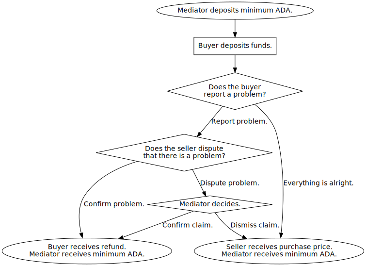
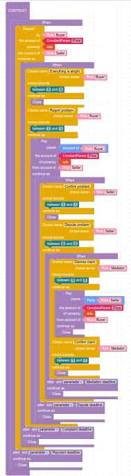
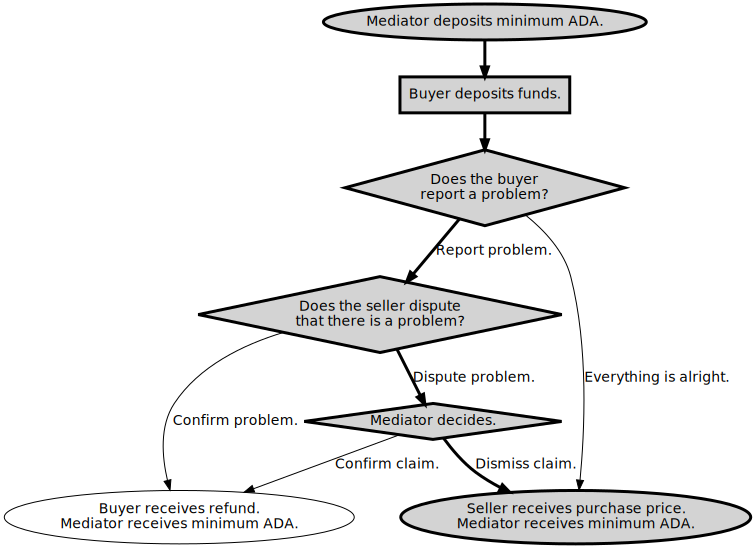
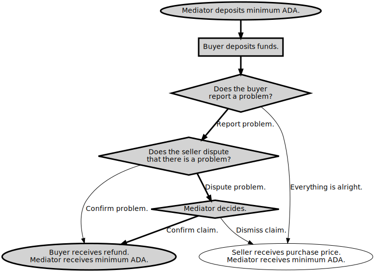

# Example Escrow Contract

This escrow contract is for the purchase of an item at a price. The buyer may complain that there is a problem, asking for a refund. If the seller disputes that complaint, then a mediator decides.
There are four potential outcomes:

*   ["Everything is alright"](everything-is-alright.md): no problem.
*   ["Confirm problem"](confirm-problem.md): seller agrees that there is a problem.
*   ["Dismiss claim"](dismiss-claim.md): mediator decides in favor of seller.
*   ["Confirm claim"](confirm-claim.md): mediator decides in favor of buyer.

The following flow chart illustrates the actions and decisions involved.

## Marlowe Contract

The [Marlowe escrow contract](../../../marlowe-contracts/src/Marlowe/Contracts/Escrow.hs) embodies the logic for this contract:

<table>
<tr>
<td>
<pre>
When
  [
    Case (Deposit (Role "Francis Beaumont (the seller)") (Role "Thomas Middleton (the buyer)") ada 256)
      ( When
        [
          Case (Choice (ChoiceId "Everything is alright" (Role "Thomas Middleton (the buyer)")) [Bound 0 0])
            Close
        , Case (Choice (ChoiceId "Report problem" (Role "Thomas Middleton (the buyer)")) [Bound 1 1])
            ( Pay (Role "Francis Beaumont (the seller)") (Account (Role "Thomas Middleton (the buyer)")) ada 256 )
            ( When
              [
                Case (Choice (ChoiceId "Confirm problem" (Role "Francis Beaumont (the seller)")) [Bound 1 1])
                  Close
              , Case (Choice (ChoiceId "Dispute problem" (Role "Francis Beaumont (the seller)")) [Bound 0 0])
                ( When
                  [
                    Case (Choice (ChoiceId "Dismiss claim" (Role "Christopher Marlowe (the mediator)")) [Bound 0 0])
                      ( Pay (Role "Thomas Middleton (the buyer)") (Account (Role "Francis Beaumont (the seller)")) ada 256 )
                      Close
                  , Case (Choice (ChoiceId "Confirm claim" (Role "Christopher Marlowe (the mediator)")) [Bound 1 1])
                      Close
                  ]
                  (TimeParam "Mediation deadline")
                  Close
                )
              ]
              (TimeParam "Dispute deadline")
            ) Close
        ]
        (TimeParam "Complaint deadline")
        Close
      )
  ]
  (TimeParam "Payment deadline")
  Close
</pre>
</td>
<td>

</td>
</tr>
</table>

## Transactions

The four paths through the flow chart variously involve three, four, or five transactions:

|         | ["Everything is alright"](everything-is-alright.md)                   | ["Confirm problem"](confirm-problem.md)                   | ["Dismiss claim"](dismiss-claim.md)                   | ["Confirm claim"](confirm-claim.md)                   |
|---------|-----------------------------------------------------------------------|-----------------------------------------------------------|-------------------------------------------------------|-------------------------------------------------------|
|         |  |  |  |  |
| 1.      | Mediator provides minimum ADA.                                        | Mediator provides minimum ADA.                            | Mediator provides minimum ADA.                        | Mediator provides minimum ADA.                        |
| 2.      | Buyer deposits funds into seller's account.                           | Buyer deposits funds into seller's account.               | Buyer deposits funds into seller's account.           | Buyer deposits funds into seller's account.           |
| 3.      | Buyer reports that everything is alright.                             | Buyer reports that there is a problem.                    | Buyer reports that there is a problem.                | Buyer reports that there is a problem.                |
| 4.      | - - -                                                                 | Seller confirms that there is a problem.                  | Seller disputes that there is a problem.              | Seller disputes that there is a problem.              |
| 5.      | - - -                                                                 | - - -                                                     | Mediator dismisses the buyer's claim.                 | Mediator confirms the buyer's claim.                  |
| Outcome | Seller receives purchase price.                                       | Buyer receives refund.                                    | Seller receives purchase price.                       | Buyer receives refund.                                |
|         | Mediator receives their minimum ADA back.                             | Mediator receives their minimum ADA back.                 | Mediator receives their minimum ADA back.             | Mediator receives their minimum ADA back.             |
