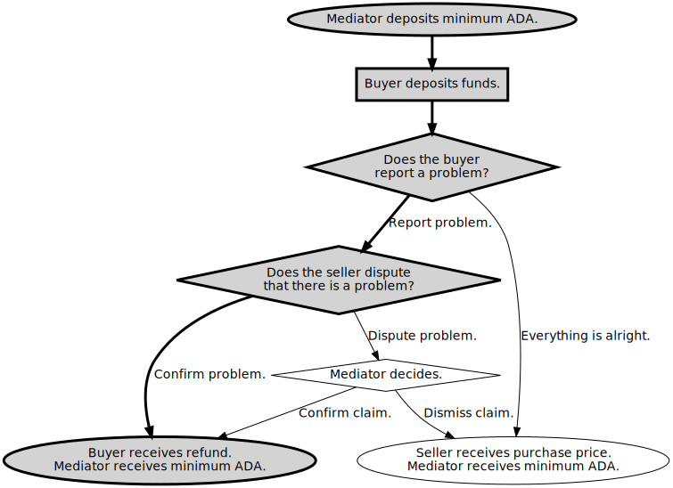

# Example Escrow Contract: "Confirm Problem"

In this example execution of [an escrow contract](ReadMe.md), the buyer reports a problem and the seller confirms the problem.



## Prerequisites

The environment variable `CARDANO_NODE_SOCKET_PATH` must be set to the path to the cardano node's socket.
See below for how to set `MAGIC` to select the network.

The following tools must be on the PATH:
* [marlowe-cli](../../ReadMe.md)
* [cardano-cli](https://github.com/input-output-hk/cardano-node/blob/master/cardano-cli/README.md)
* [jq](https://stedolan.github.io/jq/manual/)
* sed

Signing and verification keys must be provided below for the bystander and party roles, or they will be created automatically: to do this, set the environment variables `SELLER_PREFIX`, `BUYER_PREFIX`, and `MEDIATOR_PREFIX` where they appear below.

## Preliminaries

```
: "${FAUCET_ADDRESS:?FAUCET_ADDRESS not set}"
: "${FAUCET_SKEY_FILE:?FAUCET_SKEY_FILE not set}"
```

### Select Network

```
: "${MAGIC:=2}"
```

MAGIC=2

```
SLOT_LENGTH=$(marlowe-cli util slotting --testnet-magic "$MAGIC" --socket-path "$CARDANO_NODE_SOCKET_PATH" | jq .scSlotLength)
SLOT_OFFSET=$(marlowe-cli util slotting --testnet-magic "$MAGIC" --socket-path "$CARDANO_NODE_SOCKET_PATH" | jq .scSlotZeroTime)
```

### Tip of the Blockchain

```
TIP=$(cardano-cli query tip --testnet-magic "$MAGIC" | jq '.slot')
NOW="$((TIP*SLOT_LENGTH+SLOT_OFFSET))"
HOUR="$((3600*1000))"
```

The tip is at slot 3419202. The current POSIX time implies that the tip of the blockchain should be slightly before slot 3419205. Tests may fail if this is not the case.

### Participants

#### The Seller

The seller sells an item for a price.

```
SELLER_PREFIX="$TREASURY/francis-beaumont"
SELLER_NAME="Francis Beaumont"
SELLER_ROLE=FB
SELLER_PAYMENT_SKEY="$SELLER_PREFIX".skey
SELLER_PAYMENT_VKEY="$SELLER_PREFIX".vkey
```

Create the seller's keys, if necessary.

```
if [[ ! -e "$SELLER_PAYMENT_SKEY" ]]
then
  cardano-cli address key-gen --signing-key-file "$SELLER_PAYMENT_SKEY"      \
                              --verification-key-file "$SELLER_PAYMENT_VKEY"
fi
SELLER_ADDRESS=$(cardano-cli address build --testnet-magic "$MAGIC" --payment-verification-key-file "$SELLER_PAYMENT_VKEY")
```

Fund the seller's address.

```
marlowe-cli util faucet --testnet-magic "$MAGIC"                  \
                        --socket-path "$CARDANO_NODE_SOCKET_PATH" \
                        --out-file /dev/null                      \
                        --submit 600                              \
                        --lovelace 50000000                       \
                        --faucet-address "$FAUCET_ADDRESS"        \
                        --required-signer "$FAUCET_SKEY_FILE"     \
                        "$SELLER_ADDRESS"
```

```console
TxId "be7785ace150d76f1b3cb3be1cf97a6f758a208f0943e71a392e26cdd703bdc9"
```

#### The Buyer

```
BUYER_PREFIX="$TREASURY/thomas-middleton"
BUYER_NAME="Thomas Middleton"
BUYER_ROLE=TM
BUYER_PAYMENT_SKEY="$BUYER_PREFIX".skey
BUYER_PAYMENT_VKEY="$BUYER_PREFIX".vkey
```

Create the buyer's keys, if necessary.

```
if [[ ! -e "$BUYER_PAYMENT_SKEY" ]]
then
  cardano-cli address key-gen --signing-key-file "$BUYER_PAYMENT_SKEY"      \
                              --verification-key-file "$BUYER_PAYMENT_VKEY"
fi
BUYER_ADDRESS=$(cardano-cli address build --testnet-magic "$MAGIC" --payment-verification-key-file "$BUYER_PAYMENT_VKEY")
```

Fund the buyer's address.

```
marlowe-cli util faucet --testnet-magic "$MAGIC"                  \
                        --socket-path "$CARDANO_NODE_SOCKET_PATH" \
                        --out-file /dev/null                      \
                        --submit 600                              \
                        --lovelace 350000000                      \
                        --faucet-address "$FAUCET_ADDRESS"        \
                        --required-signer "$FAUCET_SKEY_FILE"     \
                        "$BUYER_ADDRESS"
```

```console
TxId "e54f7b90a49759862983009824237c80e323fbf8583b52af61b7d0f5f914c89e"
```

#### The Mediator

```
MEDIATOR_PREFIX="$TREASURY/christopher-marlowe"
MEDIATOR_NAME="Christopher Marlowe"
MEDIATOR_ROLE=CM
MEDIATOR_PAYMENT_SKEY="$MEDIATOR_PREFIX".skey
MEDIATOR_PAYMENT_VKEY="$MEDIATOR_PREFIX".vkey
```

Create the mediator's keys, if necessary.

```
if [[ ! -e "$MEDIATOR_PAYMENT_SKEY" ]]
then
  cardano-cli address key-gen --signing-key-file "$MEDIATOR_PAYMENT_SKEY"      \
                              --verification-key-file "$MEDIATOR_PAYMENT_VKEY"
fi
MEDIATOR_ADDRESS=$(cardano-cli address build --testnet-magic "$MAGIC" --payment-verification-key-file "$MEDIATOR_PAYMENT_VKEY")
```

Fund the mediator's address.

```
marlowe-cli util faucet --testnet-magic "$MAGIC"                  \
                        --socket-path "$CARDANO_NODE_SOCKET_PATH" \
                        --out-file /dev/null                      \
                        --submit 600                              \
                        --lovelace 120000000                      \
                        --faucet-address "$FAUCET_ADDRESS"        \
                        --required-signer "$FAUCET_SKEY_FILE"     \
                        "$MEDIATOR_ADDRESS"
```

```console
TxId "d653abce588dc05ae1c99739d9bff675fc7463ee78da1d0c62f303d9d311c22e"
```

### Role Tokens

The mediator mints the role tokens.

```
MINT_EXPIRES=$((TIP + 1000000))
ROLE_CURRENCY=$(
marlowe-cli util mint --testnet-magic "$MAGIC" \
                      --socket-path "$CARDANO_NODE_SOCKET_PATH"     \
                      --required-signer "$MEDIATOR_PAYMENT_SKEY"    \
                      --change-address  "$MEDIATOR_ADDRESS"         \
                      --expires "$MINT_EXPIRES"                     \
                      --out-file /dev/null                          \
                      --submit=600                                  \
                      "$MEDIATOR_ROLE" "$SELLER_ROLE" "$BUYER_ROLE" \
| sed -e 's/^PolicyID "\(.*\)"$/\1/'                                \
)
MEDIATOR_TOKEN="$ROLE_CURRENCY.$MEDIATOR_ROLE"
SELLER_TOKEN="$ROLE_CURRENCY.$SELLER_ROLE"
BUYER_TOKEN="$ROLE_CURRENCY.$BUYER_ROLE"
```

Find the transaction output with the seller's role token.

```
TX_MINT_SELLER=$(
marlowe-cli util select --testnet-magic "$MAGIC"                  \
                        --socket-path "$CARDANO_NODE_SOCKET_PATH" \
                        --asset-only "$SELLER_TOKEN"              \
                        "$MEDIATOR_ADDRESS"                       \
| sed -n -e '1{s/^TxIn "\(.*\)" (TxIx \(.*\))$/\1#\2/;p}'         \
)
```

Send the seller their role token.

```
marlowe-cli transaction simple --testnet-magic "$MAGIC"                           \
                               --socket-path "$CARDANO_NODE_SOCKET_PATH"          \
                               --tx-in "$TX_MINT_SELLER"                          \
                               --tx-out "$SELLER_ADDRESS+2000000+1 $SELLER_TOKEN" \
                               --required-signer "$MEDIATOR_PAYMENT_SKEY"         \
                               --change-address "$MEDIATOR_ADDRESS"               \
                               --out-file /dev/null                               \
                               --submit 600
```

```console
TxId "78539ae604898c7cfcfbca0b41b722258189da3252607bfa2fb77335d841bac8"
```

Find the transaction output with the buyer's role token.

```
TX_MINT_BUYER=$(
marlowe-cli util select --testnet-magic "$MAGIC"                  \
                        --socket-path "$CARDANO_NODE_SOCKET_PATH" \
                        --asset-only "$BUYER_TOKEN"               \
                        "$MEDIATOR_ADDRESS"                       \
| sed -n -e '1{s/^TxIn "\(.*\)" (TxIx \(.*\))$/\1#\2/;p}'         \
)
```

Send the buyer their role token.

```
marlowe-cli transaction simple --testnet-magic "$MAGIC"                         \
                               --socket-path "$CARDANO_NODE_SOCKET_PATH"        \
                               --tx-in "$TX_MINT_BUYER"                         \
                               --tx-out "$BUYER_ADDRESS+2000000+1 $BUYER_TOKEN" \
                               --required-signer "$MEDIATOR_PAYMENT_SKEY"       \
                               --change-address "$MEDIATOR_ADDRESS"             \
                               --out-file /dev/null                             \
                               --submit 600
```

```console
TxId "77c4bc4a8446fa9514eb4b5b982e54a3c4a05b560776d3265f777a7f671320cb"
```

### Available UTxOs

The mediator Christopher Marlowe is the minimum-ADA provider and has the address `addr_test1vrssw4edcts00kk6lp7p5n64666m23tpprqaarmdwkaq69gfvqnpz` and role token named `CM`. They have the following UTxOs in their wallet:

```
marlowe-cli util clean --testnet-magic "$MAGIC"                  \
                       --socket-path "$CARDANO_NODE_SOCKET_PATH" \
                       --required-signer "$MEDIATOR_PAYMENT_SKEY"\
                       --change-address "$MEDIATOR_ADDRESS"      \
                       --out-file /dev/null                      \
                       --submit=600                              \
> /dev/null
cardano-cli query utxo --testnet-magic "$MAGIC" --address "$MEDIATOR_ADDRESS"
```

```console
                           TxHash                                 TxIx        Amount
--------------------------------------------------------------------------------------
a4d79d35b5ac39baa8ac733d6819f7b99c1e9864c83878fae1495b649b490ed8     0        113294700 lovelace + TxOutDatumNone
a4d79d35b5ac39baa8ac733d6819f7b99c1e9864c83878fae1495b649b490ed8     1        2000000 lovelace + 1 315c5457ecd0f8dbcb28a9e2b0d0ea9c3dfd2e88a5f6b26acb56aad8.434d + TxOutDatumNone
```

We select the UTxO with the mediator Christopher Marlowe's role token.

```
TX_0_MEDIATOR_ADA=$(
marlowe-cli util select --testnet-magic "$MAGIC"                  \
                        --socket-path "$CARDANO_NODE_SOCKET_PATH" \
                        --lovelace-only 80000000                  \
                        "$MEDIATOR_ADDRESS"                       \
| sed -n -e '1{s/^TxIn "\(.*\)" (TxIx \(.*\))$/\1#\2/;p}'         \
)
TX_0_MEDIATOR_TOKEN=$(
marlowe-cli util select --testnet-magic "$MAGIC"                  \
                        --socket-path "$CARDANO_NODE_SOCKET_PATH" \
                        --asset-only "$MEDIATOR_TOKEN"            \
                        "$MEDIATOR_ADDRESS"                       \
| sed -n -e '1{s/^TxIn "\(.*\)" (TxIx \(.*\))$/\1#\2/;p}'         \
)
```

Christopher Marlowe will spend the UTxOs `a4d79d35b5ac39baa8ac733d6819f7b99c1e9864c83878fae1495b649b490ed8#0` and `a4d79d35b5ac39baa8ac733d6819f7b99c1e9864c83878fae1495b649b490ed8#1`.

The seller Francis Beaumont has the address `addr_test1vzzpzll6gsl9npf8wfhk2zg8sy2we50jcqc7w8w46gua2pqq7cw2q` and role token named `FB`. They have the following UTxOs in their wallet:

```
marlowe-cli util clean --testnet-magic "$MAGIC"                  \
                       --socket-path "$CARDANO_NODE_SOCKET_PATH" \
                       --required-signer "$SELLER_PAYMENT_SKEY"  \
                       --change-address "$SELLER_ADDRESS"        \
                       --out-file /dev/null                      \
                       --submit=600                              \
> /dev/null
cardano-cli query utxo --testnet-magic "$MAGIC" --address "$SELLER_ADDRESS"
```

```console
                           TxHash                                 TxIx        Amount
--------------------------------------------------------------------------------------
bc154927f4cf0275f49a1b4693775c8490524be4a875e0e2d816f1d162faefc3     0        49824907 lovelace + TxOutDatumNone
bc154927f4cf0275f49a1b4693775c8490524be4a875e0e2d816f1d162faefc3     1        2000000 lovelace + 1 315c5457ecd0f8dbcb28a9e2b0d0ea9c3dfd2e88a5f6b26acb56aad8.4642 + TxOutDatumNone
```

We select the UTxO with the lender Francis Beaumont's role token.

```
TX_0_SELLER_ADA=$(
marlowe-cli util select --testnet-magic "$MAGIC"                  \
                        --socket-path "$CARDANO_NODE_SOCKET_PATH" \
                        --lovelace-only 20000000                  \
                        "$SELLER_ADDRESS"                         \
| sed -n -e '1{s/^TxIn "\(.*\)" (TxIx \(.*\))$/\1#\2/;p}'         \
)
TX_0_SELLER_TOKEN=$(
marlowe-cli util select --testnet-magic "$MAGIC"                  \
                        --socket-path "$CARDANO_NODE_SOCKET_PATH" \
                        --asset-only "$SELLER_TOKEN"              \
                        "$SELLER_ADDRESS"                         \
| sed -n -e '1{s/^TxIn "\(.*\)" (TxIx \(.*\))$/\1#\2/;p}'         \
)
```

Francis Beaumont will spend the UTxOs `bc154927f4cf0275f49a1b4693775c8490524be4a875e0e2d816f1d162faefc3#0` and `bc154927f4cf0275f49a1b4693775c8490524be4a875e0e2d816f1d162faefc3#1`.

The buyer Thomas Middleton has the address `addr_test1vqetzradrerxgqu6xcuk35qckxkl4hwdz8h82zpld226t8ce30xxn` and role token named `TM`. They have the following UTxOs in their wallet:

```
marlowe-cli util clean --testnet-magic "$MAGIC"                  \
                       --socket-path "$CARDANO_NODE_SOCKET_PATH" \
                       --required-signer "$BUYER_PAYMENT_SKEY"   \
                       --change-address "$BUYER_ADDRESS"         \
                       --out-file /dev/null                      \
                       --submit=600                              \
> /dev/null
cardano-cli query utxo --testnet-magic "$MAGIC" --address "$BUYER_ADDRESS"
```

```console
                           TxHash                                 TxIx        Amount
--------------------------------------------------------------------------------------
22e0c41ceda3d41598948f4262411e98ba759f326add7b6d469f29e9224f9a95     0        349824907 lovelace + TxOutDatumNone
22e0c41ceda3d41598948f4262411e98ba759f326add7b6d469f29e9224f9a95     1        2000000 lovelace + 1 315c5457ecd0f8dbcb28a9e2b0d0ea9c3dfd2e88a5f6b26acb56aad8.544d + TxOutDatumNone
```

We select the UTxO with the lender Thomas Middleton's role token.

```
TX_0_BUYER_ADA=$(
marlowe-cli util select --testnet-magic "$MAGIC"                  \
                        --socket-path "$CARDANO_NODE_SOCKET_PATH" \
                        --lovelace-only 20000000                  \
                        "$BUYER_ADDRESS"                          \
| sed -n -e '1{s/^TxIn "\(.*\)" (TxIx \(.*\))$/\1#\2/;p}'         \
)
TX_0_BUYER_TOKEN=$(
marlowe-cli util select --testnet-magic "$MAGIC"                  \
                        --socket-path "$CARDANO_NODE_SOCKET_PATH" \
                        --asset-only "$BUYER_TOKEN"               \
                        "$BUYER_ADDRESS"                          \
| sed -n -e '1{s/^TxIn "\(.*\)" (TxIx \(.*\))$/\1#\2/;p}'         \
)
```

Thomas Middleton will spend the UTxOs `22e0c41ceda3d41598948f4262411e98ba759f326add7b6d469f29e9224f9a95#0` and `22e0c41ceda3d41598948f4262411e98ba759f326add7b6d469f29e9224f9a95#1`.

## The Contract

The contract has a minimum slot and several deadlines.

```
PAYMENT_DEADLINE=$((NOW+1*24*HOUR))
COMPLAINT_DEADLINE=$((NOW+2*24*HOUR))
DISPUTE_DEADLINE=$((NOW+3*24*HOUR))
MEDIATION_DEADLINE=$((NOW+4*24*HOUR))
```

* The current slot is 3419202.
* The buyer Thomas Middleton must pay before Sun, 18 Sep 2022 13:46:42 +0000.
* They buyer Thomas Middleton has until Mon, 19 Sep 2022 13:46:42 +0000 to complain.
* The seller Francis Beaumont has until Tue, 20 Sep 2022 13:46:42 +0000 to dispute a complaint.
* The mediator Christopher Marlowe has until Wed, 21 Sep 2022 13:46:42 +0000 to decide on a disputed complaint.

The contract also involves the price of the good exchanged and a minimum-ADA value.

```
MINIMUM_ADA=3000000
PRICE=256000000
```

The selling price is 256000000 lovelace.

We create the contract for the previously specified parameters.

```
marlowe-cli template escrow --minimum-ada "$MINIMUM_ADA"               \
                            --price "$PRICE"                           \
                            --seller "$SELLER_ROLE"                    \
                            --buyer "$BUYER_ROLE"                      \
                            --mediator "$MEDIATOR_ROLE"                \
                            --payment-deadline "$PAYMENT_DEADLINE"     \
                            --complaint-deadline "$COMPLAINT_DEADLINE" \
                            --dispute-deadline "$DISPUTE_DEADLINE"     \
                            --mediation-deadline "$MEDIATION_DEADLINE" \
                            --out-contract-file tx-1.contract          \
                            --out-state-file    tx-1.state
```

## Transaction 1. Create the Contract by Providing the Minimum ADA.

First we create a `.marlowe` file that contains the initial information needed to run the contract. The bare size and cost of the script provide a lower bound on the resources that running it will require.

```
marlowe-cli run initialize --testnet-magic "$MAGIC"                  \
                           --socket-path "$CARDANO_NODE_SOCKET_PATH" \
                           --roles-currency "$ROLE_CURRENCY"         \
                           --contract-file tx-1.contract             \
                           --state-file    tx-1.state                \
                           --out-file      tx-1.marlowe              \
                           --print-stats
```

```console
Validator size: 12668
Base-validator cost: ExBudget {exBudgetCPU = ExCPU 18653100, exBudgetMemory = ExMemory 81200}
```

In particular, we can extract the contract's address from the `.marlowe` file.

```
CONTRACT_ADDRESS=$(jq -r '.tx.marloweValidator.address' tx-1.marlowe)
```

The Marlowe contract resides at address `addr_test1wrv0vwr4megau50ujjwsktvajmsu6dzza2rnalufd3husaqs9v6rv`.

Because this is a role-based contract, we compute the address of the script for roles.

```
ROLE_ADDRESS=$(jq -r '.tx.rolesValidator.address' tx-1.marlowe)
```

The role address is `addr_test1wpkmnxz4aylglk57j9mf90r5dj0kmde7n6frfgatam4fw8qyrah58`.

The mediator Christopher Marlowe submits the transaction along with the minimum ADA 3000000 lovelace required for the contract's initial state. Submitting with the `--print-stats` switch reveals the network fee for the contract, the size of the transaction, and the execution requirements, relative to the protocol limits.

```
TX_1=$(
marlowe-cli run execute --testnet-magic "$MAGIC"                   \
                        --socket-path "$CARDANO_NODE_SOCKET_PATH"  \
                        --tx-in "$TX_0_MEDIATOR_ADA"               \
                        --change-address "$MEDIATOR_ADDRESS"       \
                        --required-signer "$MEDIATOR_PAYMENT_SKEY" \
                        --marlowe-out-file tx-1.marlowe            \
                        --out-file tx-1.raw                        \
                        --print-stats                              \
                        --submit=600                               \
| sed -e 's/^TxId "\(.*\)"$/\1/'                                   \
)
```

```console
Fee: Lovelace 199513
Size: 758 / 16384 = 4%
Execution units:
  Memory: 0 / 14000000 = 0%
  Steps: 0 / 10000000000 = 0%
```

The contract received the minimum ADA of 3000000 lovelace from the mediator Christopher Marlowe in the transaction `7642e2d7ffd612d2b3759e543204bf6aee08ba5aaed8ec5367569ca36d88f6f2`.  Here is the UTxO at the contract address:

```
cardano-cli query utxo --testnet-magic "$MAGIC" --address "$CONTRACT_ADDRESS" | sed -n -e "1p;2p;/$TX_1/p"
```

```console
                           TxHash                                 TxIx        Amount
--------------------------------------------------------------------------------------
7642e2d7ffd612d2b3759e543204bf6aee08ba5aaed8ec5367569ca36d88f6f2     1        3000000 lovelace + TxOutDatumHash ScriptDataInBabbageEra "fb698bc72b30dbdd8ebbd346b7d631cf2a5ea64f26db4ca32af3cf9004962da6"
```

Here is the UTxO at the mediator Christopher Marlowe's address:

```
cardano-cli query utxo --testnet-magic "$MAGIC" --address "$MEDIATOR_ADDRESS" | sed -n -e "1p;2p;/$TX_1/p"
```

```console
                           TxHash                                 TxIx        Amount
--------------------------------------------------------------------------------------
7642e2d7ffd612d2b3759e543204bf6aee08ba5aaed8ec5367569ca36d88f6f2     0        110095187 lovelace + TxOutDatumNone
```

## Transaction 2. Buyer Deposits Funds into Seller's Account.

First we compute the Marlowe input required to make the initial deposit by the buyer.

```
marlowe-cli run prepare --marlowe-file tx-1.marlowe           \
                        --deposit-account "$SELLER_ROLE"      \
                        --deposit-party "$BUYER_ROLE"         \
                        --deposit-amount "$PRICE"             \
                        --invalid-before "$NOW"               \
                        --invalid-hereafter "$((NOW+4*HOUR))" \
                        --out-file tx-2.marlowe               \
                        --print-stats
```

```console
Datum size: 499
```

Now the buyer Thomas Middleton submits the transaction along with their deposit:

```
TX_2=$(
marlowe-cli run execute --testnet-magic "$MAGIC"                              \
                        --socket-path "$CARDANO_NODE_SOCKET_PATH"             \
                        --marlowe-in-file tx-1.marlowe                        \
                        --tx-in-marlowe "$TX_1"#1                             \
                        --tx-in-collateral "$TX_0_BUYER_ADA"                  \
                        --tx-in "$TX_0_BUYER_ADA"                             \
                        --tx-in "$TX_0_BUYER_TOKEN"                           \
                        --required-signer "$BUYER_PAYMENT_SKEY"               \
                        --marlowe-out-file tx-2.marlowe                       \
                        --tx-out "$BUYER_ADDRESS+$MINIMUM_ADA+1 $BUYER_TOKEN" \
                        --change-address "$BUYER_ADDRESS"                     \
                        --out-file tx-2.raw                                   \
                        --print-stats                                         \
                        --submit=600                                          \
| sed -e 's/^TxId "\(.*\)"$/\1/'                                              \
)
```

```console
Fee: Lovelace 1275337
Size: 14175 / 16384 = 86%
Execution units:
  Memory: 6181214 / 14000000 = 44%
  Steps: 1662178020 / 10000000000 = 16%
```

The contract received the deposit of 256000000 lovelace from Thomas Middleton in the transaction `15cf1d2a591fb16e4bb84ed8ff11b5881ae0a89a80486e57b825acb41dc229d2`. Here is the UTxO at the contract address:

```
cardano-cli query utxo --testnet-magic "$MAGIC" --address "$CONTRACT_ADDRESS" | sed -n -e "1p;2p;/$TX_2/p"
```

```console
                           TxHash                                 TxIx        Amount
--------------------------------------------------------------------------------------
15cf1d2a591fb16e4bb84ed8ff11b5881ae0a89a80486e57b825acb41dc229d2     1        259000000 lovelace + TxOutDatumHash ScriptDataInBabbageEra "f5d0560e9fac1fc4bb8e2a960610c2613f4224d1a013266e9405e4c11543091e"
```

Here is the UTxO at Thomas Middleton's address:

```
cardano-cli query utxo --testnet-magic "$MAGIC" --address "$BUYER_ADDRESS" | sed -n -e "1p;2p;/$TX_2/p"
```

```console
                           TxHash                                 TxIx        Amount
--------------------------------------------------------------------------------------
15cf1d2a591fb16e4bb84ed8ff11b5881ae0a89a80486e57b825acb41dc229d2     0        91549570 lovelace + TxOutDatumNone
15cf1d2a591fb16e4bb84ed8ff11b5881ae0a89a80486e57b825acb41dc229d2     2        3000000 lovelace + 1 315c5457ecd0f8dbcb28a9e2b0d0ea9c3dfd2e88a5f6b26acb56aad8.544d + TxOutDatumNone
```

## Transaction 3. The Buyer Reports that There is a Problem

First we compute the input for the contract to transition forward.

```
marlowe-cli run prepare --marlowe-file tx-2.marlowe           \
                        --choice-name "Report problem"        \
                        --choice-party "$BUYER_ROLE"          \
                        --choice-number 1                     \
                        --invalid-before "$NOW"               \
                        --invalid-hereafter "$((NOW+4*HOUR))" \
                        --out-file tx-3.marlowe               \
                        --print-stats
```

```console
Datum size: 377
Payment 1
  Acccount: "FB"
  Payee: Account "TM"
  Ada: Lovelace {getLovelace = 256000000}
```

Now the buyer Thomas Middleton can submit a transaction to report that there is a problem:

```
TX_3=$(
marlowe-cli run execute --testnet-magic "$MAGIC"                              \
                        --socket-path "$CARDANO_NODE_SOCKET_PATH"             \
                        --marlowe-in-file tx-2.marlowe                        \
                        --tx-in-marlowe "$TX_2"#1                             \
                        --tx-in-collateral "$TX_2"#0                          \
                        --tx-in "$TX_2"#0                                     \
                        --tx-in "$TX_2"#2                                     \
                        --required-signer "$BUYER_PAYMENT_SKEY"               \
                        --marlowe-out-file tx-3.marlowe                       \
                        --tx-out "$BUYER_ADDRESS+$MINIMUM_ADA+1 $BUYER_TOKEN" \
                        --change-address "$BUYER_ADDRESS"                     \
                        --out-file tx-3.raw                                   \
                        --print-stats                                         \
                        --submit=600                                          \
| sed -e 's/^TxId "\(.*\)"$/\1/'
)
```

```console
Fee: Lovelace 1355385
Size: 14030 / 16384 = 85%
Execution units:
  Memory: 7330052 / 14000000 = 52%
  Steps: 1941518520 / 10000000000 = 19%
```

The reporting of a problem was recorded in the transaction `84d7aff19f9faa82c8c9590433cf3e58419383b15e4040435d4090b0e0347265`. Here is the UTxO at the contract address:

```
cardano-cli query utxo --testnet-magic "$MAGIC" --address "$CONTRACT_ADDRESS" | sed -n -e "1p;2p;/$TX_3/p"
```

```console
                           TxHash                                 TxIx        Amount
--------------------------------------------------------------------------------------
84d7aff19f9faa82c8c9590433cf3e58419383b15e4040435d4090b0e0347265     1        259000000 lovelace + TxOutDatumHash ScriptDataInBabbageEra "5932d01edbba54cdb2c7567a11c7d1e6ed11ca7a1e7f081ea25e990708865a10"
```

Here is the UTxO at Thomas Middleton's address:

```
cardano-cli query utxo --testnet-magic "$MAGIC" --address "$BUYER_ADDRESS" | sed -n -e "1p;2p;/$TX_3/p"
```

```console
                           TxHash                                 TxIx        Amount
--------------------------------------------------------------------------------------
84d7aff19f9faa82c8c9590433cf3e58419383b15e4040435d4090b0e0347265     0        90194185 lovelace + TxOutDatumNone
84d7aff19f9faa82c8c9590433cf3e58419383b15e4040435d4090b0e0347265     2        3000000 lovelace + 1 315c5457ecd0f8dbcb28a9e2b0d0ea9c3dfd2e88a5f6b26acb56aad8.544d + TxOutDatumNone
```

## Transaction 4. The Seller Confirms that There is a Problem

Funds are released to the seller and mediator, closing the contract.

First we compute the input for the contract to transition forward.

```
marlowe-cli run prepare --marlowe-file tx-3.marlowe        \
                        --choice-name "Confirm problem"    \
                        --choice-party "$SELLER_ROLE"      \
                        --choice-number 1                  \
                        --invalid-before "$NOW"                \
                        --invalid-hereafter "$((NOW+4*HOUR))"  \
                        --out-file tx-4.marlowe                \
                        --print-stats
```

```console
Datum size: 114
Payment 1
  Acccount: "CM"
  Payee: Party "CM"
  Ada: Lovelace {getLovelace = 3000000}
Payment 2
  Acccount: "TM"
  Payee: Party "TM"
  Ada: Lovelace {getLovelace = 256000000}
```

Now the seller Francis Beaumont can submit a transaction to release funds:

```
TX_4=$(
marlowe-cli run execute --testnet-magic "$MAGIC"                                \
                        --socket-path "$CARDANO_NODE_SOCKET_PATH"               \
                        --marlowe-in-file tx-3.marlowe                          \
                        --tx-in-marlowe "$TX_3"#1                               \
                        --tx-in-collateral "$TX_0_SELLER_ADA"                   \
                        --tx-in "$TX_0_SELLER_ADA"                              \
                        --tx-in "$TX_0_SELLER_TOKEN"                            \
                        --required-signer "$SELLER_PAYMENT_SKEY"                \
                        --marlowe-out-file tx-4.marlowe                         \
                        --tx-out "$SELLER_ADDRESS+$MINIMUM_ADA+1 $SELLER_TOKEN" \
                        --change-address "$SELLER_ADDRESS"                      \
                        --out-file tx-4.raw                                     \
                        --print-stats                                           \
                        --submit=600                                            \
| sed -e 's/^TxId "\(.*\)"$/\1/'                                                \
)
```

```console
Fee: Lovelace 1259404
Size: 13684 / 16384 = 83%
Execution units:
  Memory: 6302990 / 14000000 = 45%
  Steps: 1643388515 / 10000000000 = 16%
```

The confirmation of the claim resulted in closing the contract, paying 256000000 lovelace to the role address for the benefit of the buyer Thomas Middleton and 3000000 lovelace for the benefit of the mediator Christopher Marlowe in the transaction `ba2d797f277c23fa4c914c253574adcaf5a0181983a0f84bc33728e5579b9ad7`.  There is no UTxO at the contract address:

```
cardano-cli query utxo --testnet-magic "$MAGIC" --address "$CONTRACT_ADDRESS" | sed -n -e "1p;2p;/$TX_1/p;/$TX_2/p;/$TX_3/p;/$TX_4/p"
```

```console
                           TxHash                                 TxIx        Amount
--------------------------------------------------------------------------------------
```

Here are the UTxOs at the role address:

```
cardano-cli query utxo --testnet-magic "$MAGIC" --address "$ROLE_ADDRESS" | sed -n -e "1p;2p;/$TX_4/p"
```

```console
                           TxHash                                 TxIx        Amount
--------------------------------------------------------------------------------------
ba2d797f277c23fa4c914c253574adcaf5a0181983a0f84bc33728e5579b9ad7     1        3000000 lovelace + TxOutDatumHash ScriptDataInBabbageEra "023f6b2ee4a0d4a7428e3a70fb8ec824ee6a88e2e58f9fb952e0c8ae83b2c2cb"
ba2d797f277c23fa4c914c253574adcaf5a0181983a0f84bc33728e5579b9ad7     2        256000000 lovelace + TxOutDatumHash ScriptDataInBabbageEra "9d977f465589e1bd3b96af8fb451ac3567b702954b3d12bd6205820b58e80e34"
```

Here is the UTxO at the seller Francis Beaumont's address:

```
cardano-cli query utxo --testnet-magic "$MAGIC" --address "$SELLER_ADDRESS" | sed -n -e "1p;2p;/$TX_4/p"
```

```console
                           TxHash                                 TxIx        Amount
--------------------------------------------------------------------------------------
ba2d797f277c23fa4c914c253574adcaf5a0181983a0f84bc33728e5579b9ad7     0        47565503 lovelace + TxOutDatumNone
ba2d797f277c23fa4c914c253574adcaf5a0181983a0f84bc33728e5579b9ad7     3        3000000 lovelace + 1 315c5457ecd0f8dbcb28a9e2b0d0ea9c3dfd2e88a5f6b26acb56aad8.4642 + TxOutDatumNone
```

## Transactions 5 and 6. Buyer and Mediator Withdraw Funds.

The buyer Thomas Middleton submits a transaction to withdraw the repayment from the role address.

```
TX_5=$(
marlowe-cli run withdraw --testnet-magic "$MAGIC"                              \
                         --socket-path "$CARDANO_NODE_SOCKET_PATH"             \
                         --marlowe-file tx-4.marlowe                           \
                         --role-name "$BUYER_ROLE"                             \
                         --tx-in "$TX_3"#0                                     \
                         --tx-in "$TX_3"#2                                     \
                         --tx-in-collateral "$TX_3"#0                          \
                         --required-signer "$BUYER_PAYMENT_SKEY"               \
                         --tx-out "$BUYER_ADDRESS+$MINIMUM_ADA+1 $BUYER_TOKEN" \
                         --change-address "$BUYER_ADDRESS"                     \
                         --out-file tx-5.raw                                   \
                         --print-stats                                         \
                         --submit=600                                          \
| sed -e 's/^TxId "\(.*\)"$/\1/'                                               \
)
```

```console
Fee: Lovelace 432223
Size: 3083 / 16384 = 18%
Execution units:
  Memory: 1552162 / 14000000 = 11%
  Steps: 442070090 / 10000000000 = 4%
```

The mediator Christopher Marlowe submits a transaction to withdraw the minimum ADA from the role address.

```
TX_6=$(
marlowe-cli run withdraw --testnet-magic "$MAGIC"                                    \
                         --socket-path "$CARDANO_NODE_SOCKET_PATH"                   \
                         --marlowe-file tx-4.marlowe                                 \
                         --role-name "$MEDIATOR_ROLE"                                \
                         --tx-in "$TX_1"#0                                           \
                         --tx-in "$TX_0_MEDIATOR_TOKEN"                              \
                         --tx-in-collateral "$TX_1"#0                                \
                         --required-signer "$MEDIATOR_PAYMENT_SKEY"                  \
                         --tx-out "$MEDIATOR_ADDRESS+$MINIMUM_ADA+1 $MEDIATOR_TOKEN" \
                         --change-address "$MEDIATOR_ADDRESS"                        \
                         --out-file tx-6.raw                                         \
                         --print-stats                                               \
                         --submit=600                                                \
| sed -e 's/^TxId "\(.*\)"$/\1/'                                                     \
)
```

```console
Fee: Lovelace 432223
Size: 3083 / 16384 = 18%
Execution units:
  Memory: 1552162 / 14000000 = 11%
  Steps: 442070090 / 10000000000 = 4%
```

There is no UTxO at the role address:

```
cardano-cli query utxo --testnet-magic "$MAGIC" --address "$ROLE_ADDRESS" | sed -n -e "1p;2p;/$TX_1/p;/$TX_2/p;/$TX_3/p;/$TX_4/p;/$TX_5/p;/$TX_6/p"
```

```console
                           TxHash                                 TxIx        Amount
--------------------------------------------------------------------------------------
```

Here are the UTxOs at the seller Francis Beaumont's address:

```
cardano-cli query utxo --testnet-magic "$MAGIC" --address "$SELLER_ADDRESS" | sed -n -e "1p;2p;/$TX_1/p;/$TX_2/p;/$TX_3/p;/$TX_4/p;/$TX_5/p;/$TX_6/p"
```

```console
                           TxHash                                 TxIx        Amount
--------------------------------------------------------------------------------------
ba2d797f277c23fa4c914c253574adcaf5a0181983a0f84bc33728e5579b9ad7     0        47565503 lovelace + TxOutDatumNone
ba2d797f277c23fa4c914c253574adcaf5a0181983a0f84bc33728e5579b9ad7     3        3000000 lovelace + 1 315c5457ecd0f8dbcb28a9e2b0d0ea9c3dfd2e88a5f6b26acb56aad8.4642 + TxOutDatumNone
```

Here are the UTxOs at the buyer Thomas Middleton's address:

```
cardano-cli query utxo --testnet-magic "$MAGIC" --address "$BUYER_ADDRESS" | sed -n -e "1p;2p;/$TX_1/p;/$TX_2/p;/$TX_3/p;/$TX_4/p;/$TX_5/p;/$TX_6/p"
```

```console
                           TxHash                                 TxIx        Amount
--------------------------------------------------------------------------------------
a785878df5425907d2633f18f9ad5138b671ff65a0124032cef002fb74516e4f     0        89761962 lovelace + TxOutDatumNone
a785878df5425907d2633f18f9ad5138b671ff65a0124032cef002fb74516e4f     1        256000000 lovelace + TxOutDatumNone
a785878df5425907d2633f18f9ad5138b671ff65a0124032cef002fb74516e4f     2        3000000 lovelace + 1 315c5457ecd0f8dbcb28a9e2b0d0ea9c3dfd2e88a5f6b26acb56aad8.544d + TxOutDatumNone
```

Here are the UTxOs at the mediator Christopher Marlowe's address:

```
cardano-cli query utxo --testnet-magic "$MAGIC" --address "$MEDIATOR_ADDRESS" | sed -n -e "1p;2p;/$TX_1/p;/$TX_2/p;/$TX_3/p;/$TX_4/p;/$TX_5/p;/$TX_6/p"
```

```console
                           TxHash                                 TxIx        Amount
--------------------------------------------------------------------------------------
a48780da53b5a83f44a0e6cf017b6ba7c4c9e88204081cca66bdb214fedb4865     0        108662964 lovelace + TxOutDatumNone
a48780da53b5a83f44a0e6cf017b6ba7c4c9e88204081cca66bdb214fedb4865     1        3000000 lovelace + TxOutDatumNone
a48780da53b5a83f44a0e6cf017b6ba7c4c9e88204081cca66bdb214fedb4865     2        3000000 lovelace + 1 315c5457ecd0f8dbcb28a9e2b0d0ea9c3dfd2e88a5f6b26acb56aad8.434d + TxOutDatumNone
```

## Clean Up

```
BURN_ADDRESS=addr_test1vqxdw4rlu6krp9fwgwcnld6y84wdahg585vrdy67n5urp9qyts0y7
TX=$(
marlowe-cli util clean --testnet-magic "$MAGIC"                  \
                       --socket-path "$CARDANO_NODE_SOCKET_PATH" \
                       --required-signer "$MEDIATOR_PAYMENT_SKEY"\
                       --change-address "$MEDIATOR_ADDRESS"      \
                       --out-file /dev/null                      \
                       --submit=600                              \
| sed -e 's/^TxId "\(.*\)"$/\1/'                                 \
)
marlowe-cli transaction simple --testnet-magic "$MAGIC"                   \
                               --socket-path "$CARDANO_NODE_SOCKET_PATH"  \
                               --tx-in "$TX#0"                              \
                               --tx-in "$TX#1"                              \
                               --required-signer "$MEDIATOR_PAYMENT_SKEY" \
                               --change-address "$FAUCET_ADDRESS"         \
                               --tx-out "$BURN_ADDRESS+1400000+1 $MEDIATOR_TOKEN" \
                               --out-file /dev/null                       \
                               --submit 600
```

```console
TxId "3757ff4726ebaf6161267ec854a53ef5c57413ed544821fbadf763c19c3da8a8"
```

cardano-cli query utxo --testnet-magic "$MAGIC" --address "$MEDIATOR_ADDRESS"
```

```console
                           TxHash                                 TxIx        Amount
--------------------------------------------------------------------------------------
TX=$(
marlowe-cli util clean --testnet-magic "$MAGIC"                  \
                       --socket-path "$CARDANO_NODE_SOCKET_PATH" \
                       --required-signer "$SELLER_PAYMENT_SKEY"\
                       --change-address "$SELLER_ADDRESS"      \
                       --out-file /dev/null                      \
                       --submit=600                              \
| sed -e 's/^TxId "\(.*\)"$/\1/'                                 \
)
marlowe-cli transaction simple --testnet-magic "$MAGIC"                   \
                               --socket-path "$CARDANO_NODE_SOCKET_PATH"  \
                               --tx-in "$TX#0"                              \
                               --tx-in "$TX#1"                              \
                               --required-signer "$SELLER_PAYMENT_SKEY" \
                               --change-address "$FAUCET_ADDRESS"         \
                               --tx-out "$BURN_ADDRESS+1400000+1 $SELLER_TOKEN" \
                               --out-file /dev/null                       \
                               --submit 600
```

```console
TxId "b47512bb5f26781f458cc0bdbf14c6a2c2793ae4af313df82381b76b702f4b57"
cardano-cli query utxo --testnet-magic "$MAGIC" --address "$SELLER_ADDRESS"
```

```console
                           TxHash                                 TxIx        Amount
--------------------------------------------------------------------------------------
TX=$(
marlowe-cli util clean --testnet-magic "$MAGIC"                  \
                       --socket-path "$CARDANO_NODE_SOCKET_PATH" \
                       --required-signer "$BUYER_PAYMENT_SKEY"\
                       --change-address "$BUYER_ADDRESS"      \
                       --out-file /dev/null                      \
                       --submit=600                              \
| sed -e 's/^TxId "\(.*\)"$/\1/'                                 \
)
marlowe-cli transaction simple --testnet-magic "$MAGIC"                   \
                               --socket-path "$CARDANO_NODE_SOCKET_PATH"  \
                               --tx-in "$TX#0"                              \
                               --tx-in "$TX#1"                              \
                               --required-signer "$BUYER_PAYMENT_SKEY" \
                               --change-address "$FAUCET_ADDRESS"         \
                               --tx-out "$BURN_ADDRESS+1400000+1 $BUYER_TOKEN" \
                               --out-file /dev/null                       \
                               --submit 600
```

```console
TxId "3c5807108ebfa071e68d701222c135ad90da13fda2326c782a062cfcd42e562a"
cardano-cli query utxo --testnet-magic "$MAGIC" --address "$BUYER_ADDRESS"
```

```console
                           TxHash                                 TxIx        Amount
--------------------------------------------------------------------------------------
