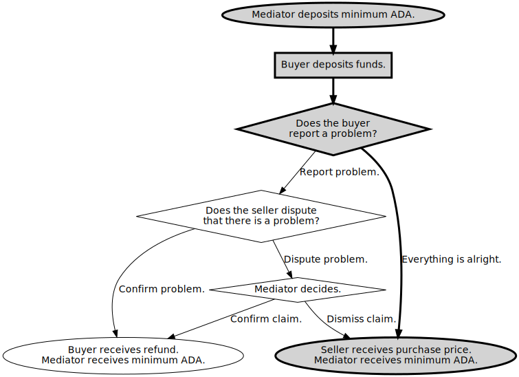

# Example Escrow Contract: "Everything is alright"

In this example execution of [an escrow contract](ReadMe.md), the buyer does not report a problem.



## Prerequisites

The environment variable `CARDANO_NODE_SOCKET_PATH` must be set to the path to the cardano node's socket.
See below for how to set `MAGIC` to select the network.

The following tools must be on the PATH:
* [marlowe-cli](../../ReadMe.md)
* [cardano-cli](https://github.com/input-output-hk/cardano-node/blob/master/cardano-cli/README.md)
* [jq](https://stedolan.github.io/jq/manual/)
* sed

Signing and verification keys must be provided below for the bystander and party roles, or they will be created automatically: to do this, set the environment variables `SELLER_PREFIX`, `BUYER_PREFIX`, and `MEDIATOR_PREFIX` where they appear below.

## Preliminaries

```
: "${FAUCET_ADDRESS:?FAUCET_ADDRESS not set}"
: "${FAUCET_SKEY_FILE:?FAUCET_SKEY_FILE not set}"
```

### Select Network

```
: "${MAGIC:=2}"
```

MAGIC=2

```
SLOT_LENGTH=$(marlowe-cli util slotting --testnet-magic "$MAGIC" --socket-path "$CARDANO_NODE_SOCKET_PATH" | jq .scSlotLength)
SLOT_OFFSET=$(marlowe-cli util slotting --testnet-magic "$MAGIC" --socket-path "$CARDANO_NODE_SOCKET_PATH" | jq .scSlotZeroTime)
```

### Tip of the Blockchain

```
TIP=$(cardano-cli query tip --testnet-magic "$MAGIC" | jq '.slot')
NOW="$((TIP*SLOT_LENGTH+SLOT_OFFSET))"
HOUR="$((3600*1000))"
```

The tip is at slot 3420253. The current POSIX time implies that the tip of the blockchain should be slightly before slot 3420254. Tests may fail if this is not the case.

### Participants

#### The Seller

The seller sells an item for a price.

```
SELLER_PREFIX="$TREASURY/francis-beaumont"
SELLER_NAME="Francis Beaumont"
SELLER_ROLE=FB
SELLER_PAYMENT_SKEY="$SELLER_PREFIX".skey
SELLER_PAYMENT_VKEY="$SELLER_PREFIX".vkey
```

Create the seller's keys, if necessary.

```
if [[ ! -e "$SELLER_PAYMENT_SKEY" ]]
then
  cardano-cli address key-gen --signing-key-file "$SELLER_PAYMENT_SKEY"      \
                              --verification-key-file "$SELLER_PAYMENT_VKEY"
fi
SELLER_ADDRESS=$(cardano-cli address build --testnet-magic "$MAGIC" --payment-verification-key-file "$SELLER_PAYMENT_VKEY")
```

Fund the seller's address.

```
marlowe-cli util faucet --testnet-magic "$MAGIC"                  \
                        --socket-path "$CARDANO_NODE_SOCKET_PATH" \
                        --out-file /dev/null                      \
                        --submit 600                              \
                        --lovelace 50000000                       \
                        --faucet-address "$FAUCET_ADDRESS"        \
                        --required-signer "$FAUCET_SKEY_FILE"     \
                        "$SELLER_ADDRESS"
```

```console
TxId "65dfb347030be4a58e8683d882981e4e27aebe1745900c7c33a3f9ba94a51040"
```

#### The Buyer

```
BUYER_PREFIX="$TREASURY/thomas-middleton"
BUYER_NAME="Thomas Middleton"
BUYER_ROLE=TM
BUYER_PAYMENT_SKEY="$BUYER_PREFIX".skey
BUYER_PAYMENT_VKEY="$BUYER_PREFIX".vkey
```

Create the buyer's keys, if necessary.

```
if [[ ! -e "$BUYER_PAYMENT_SKEY" ]]
then
  cardano-cli address key-gen --signing-key-file "$BUYER_PAYMENT_SKEY"      \
                              --verification-key-file "$BUYER_PAYMENT_VKEY"
fi
BUYER_ADDRESS=$(cardano-cli address build --testnet-magic "$MAGIC" --payment-verification-key-file "$BUYER_PAYMENT_VKEY")
```

Fund the buyer's address.

```
marlowe-cli util faucet --testnet-magic "$MAGIC"                  \
                        --socket-path "$CARDANO_NODE_SOCKET_PATH" \
                        --out-file /dev/null                      \
                        --submit 600                              \
                        --lovelace 350000000                      \
                        --faucet-address "$FAUCET_ADDRESS"        \
                        --required-signer "$FAUCET_SKEY_FILE"     \
                        "$BUYER_ADDRESS"
```

```console
TxId "67f68309ad1ad244ed4e196ca4cfded56d2eff580f8e86c8c2bbdf2e66dca69a"
```

#### The Mediator

```
MEDIATOR_PREFIX="$TREASURY/christopher-marlowe"
MEDIATOR_NAME="Christopher Marlowe"
MEDIATOR_ROLE=CM
MEDIATOR_PAYMENT_SKEY="$MEDIATOR_PREFIX".skey
MEDIATOR_PAYMENT_VKEY="$MEDIATOR_PREFIX".vkey
```

Create the mediator's keys, if necessary.

```
if [[ ! -e "$MEDIATOR_PAYMENT_SKEY" ]]
then
  cardano-cli address key-gen --signing-key-file "$MEDIATOR_PAYMENT_SKEY"      \
                              --verification-key-file "$MEDIATOR_PAYMENT_VKEY"
fi
MEDIATOR_ADDRESS=$(cardano-cli address build --testnet-magic "$MAGIC" --payment-verification-key-file "$MEDIATOR_PAYMENT_VKEY")
```

Fund the mediator's address.

```
marlowe-cli util faucet --testnet-magic "$MAGIC"                  \
                        --socket-path "$CARDANO_NODE_SOCKET_PATH" \
                        --out-file /dev/null                      \
                        --submit 600                              \
                        --lovelace 120000000                      \
                        --faucet-address "$FAUCET_ADDRESS"        \
                        --required-signer "$FAUCET_SKEY_FILE"     \
                        "$MEDIATOR_ADDRESS"
```

```console
TxId "a33429eb5beb2a3321b28bf644f64035cff8428f26b3f7809173c6bde9db29a2"
```

### Role Tokens

The mediator mints the role tokens.

```
MINT_EXPIRES=$((TIP + 1000000))
ROLE_CURRENCY=$(
marlowe-cli util mint --testnet-magic "$MAGIC" \
                      --socket-path "$CARDANO_NODE_SOCKET_PATH"     \
                      --required-signer "$MEDIATOR_PAYMENT_SKEY"    \
                      --change-address  "$MEDIATOR_ADDRESS"         \
                      --expires "$MINT_EXPIRES"                     \
                      --out-file /dev/null                          \
                      --submit=600                                  \
                      "$MEDIATOR_ROLE" "$SELLER_ROLE" "$BUYER_ROLE" \
| sed -e 's/^PolicyID "\(.*\)"$/\1/'                                \
)
MEDIATOR_TOKEN="$ROLE_CURRENCY.$MEDIATOR_ROLE"
SELLER_TOKEN="$ROLE_CURRENCY.$SELLER_ROLE"
BUYER_TOKEN="$ROLE_CURRENCY.$BUYER_ROLE"
```

Find the transaction output with the seller's role token.

```
TX_MINT_SELLER=$(
marlowe-cli util select --testnet-magic "$MAGIC"                  \
                        --socket-path "$CARDANO_NODE_SOCKET_PATH" \
                        --asset-only "$SELLER_TOKEN"              \
                        "$MEDIATOR_ADDRESS"                       \
| sed -n -e '1{s/^TxIn "\(.*\)" (TxIx \(.*\))$/\1#\2/;p}'         \
)
```

Send the seller their role token.

```
marlowe-cli transaction simple --testnet-magic "$MAGIC"                           \
                               --socket-path "$CARDANO_NODE_SOCKET_PATH"          \
                               --tx-in "$TX_MINT_SELLER"                          \
                               --tx-out "$SELLER_ADDRESS+2000000+1 $SELLER_TOKEN" \
                               --required-signer "$MEDIATOR_PAYMENT_SKEY"         \
                               --change-address "$MEDIATOR_ADDRESS"               \
                               --out-file /dev/null                               \
                               --submit 600
```

```console
TxId "415d4b473ce3ac49afc10c6b7bbb37e19452562031a91d445d659d4ef228ed1e"
```

Find the transaction output with the buyer's role token.

```
TX_MINT_BUYER=$(
marlowe-cli util select --testnet-magic "$MAGIC"                  \
                        --socket-path "$CARDANO_NODE_SOCKET_PATH" \
                        --asset-only "$BUYER_TOKEN"               \
                        "$MEDIATOR_ADDRESS"                       \
| sed -n -e '1{s/^TxIn "\(.*\)" (TxIx \(.*\))$/\1#\2/;p}'         \
)
```

Send the buyer their role token.

```
marlowe-cli transaction simple --testnet-magic "$MAGIC"                         \
                               --socket-path "$CARDANO_NODE_SOCKET_PATH"        \
                               --tx-in "$TX_MINT_BUYER"                         \
                               --tx-out "$BUYER_ADDRESS+2000000+1 $BUYER_TOKEN" \
                               --required-signer "$MEDIATOR_PAYMENT_SKEY"       \
                               --change-address "$MEDIATOR_ADDRESS"             \
                               --out-file /dev/null                             \
                               --submit 600
```

```console
TxId "d959991c65161dafeb9dc27fd940c6dd1516ead8a6c87209afc397ef133aba60"
```

### Available UTxOs

The mediator Christopher Marlowe is the minimum-ADA provider and has the address `addr_test1vrssw4edcts00kk6lp7p5n64666m23tpprqaarmdwkaq69gfvqnpz` and role token named `CM`. They have the following UTxOs in their wallet:

```
marlowe-cli util clean --testnet-magic "$MAGIC"                  \
                       --socket-path "$CARDANO_NODE_SOCKET_PATH" \
                       --required-signer "$MEDIATOR_PAYMENT_SKEY"\
                       --change-address "$MEDIATOR_ADDRESS"      \
                       --out-file /dev/null                      \
                       --submit=600                              \
> /dev/null
cardano-cli query utxo --testnet-magic "$MAGIC" --address "$MEDIATOR_ADDRESS"
```

```console
                           TxHash                                 TxIx        Amount
--------------------------------------------------------------------------------------
31790ab782cd34b460108d1ed4702996c1589b51e85b40d8e0efc6f73580251e     0        113294700 lovelace + TxOutDatumNone
31790ab782cd34b460108d1ed4702996c1589b51e85b40d8e0efc6f73580251e     1        2000000 lovelace + 1 658e1b09882c0562eb4d34fc748e86535885dd9fc5b49a53a4fee2fc.434d + TxOutDatumNone
```

We select the UTxO with the mediator Christopher Marlowe's role token.

```
TX_0_MEDIATOR_ADA=$(
marlowe-cli util select --testnet-magic "$MAGIC"                  \
                        --socket-path "$CARDANO_NODE_SOCKET_PATH" \
                        --lovelace-only 80000000                  \
                        "$MEDIATOR_ADDRESS"                       \
| sed -n -e '1{s/^TxIn "\(.*\)" (TxIx \(.*\))$/\1#\2/;p}'         \
)
TX_0_MEDIATOR_TOKEN=$(
marlowe-cli util select --testnet-magic "$MAGIC"                  \
                        --socket-path "$CARDANO_NODE_SOCKET_PATH" \
                        --asset-only "$MEDIATOR_TOKEN"            \
                        "$MEDIATOR_ADDRESS"                       \
| sed -n -e '1{s/^TxIn "\(.*\)" (TxIx \(.*\))$/\1#\2/;p}'         \
)
```

Christopher Marlowe will spend the UTxOs `31790ab782cd34b460108d1ed4702996c1589b51e85b40d8e0efc6f73580251e#0` and `31790ab782cd34b460108d1ed4702996c1589b51e85b40d8e0efc6f73580251e#1`.

The seller Francis Beaumont has the address `addr_test1vzzpzll6gsl9npf8wfhk2zg8sy2we50jcqc7w8w46gua2pqq7cw2q` and role token named `FB`. They have the following UTxOs in their wallet:

```
marlowe-cli util clean --testnet-magic "$MAGIC"                  \
                       --socket-path "$CARDANO_NODE_SOCKET_PATH" \
                       --required-signer "$SELLER_PAYMENT_SKEY"  \
                       --change-address "$SELLER_ADDRESS"        \
                       --out-file /dev/null                      \
                       --submit=600                              \
> /dev/null
cardano-cli query utxo --testnet-magic "$MAGIC" --address "$SELLER_ADDRESS"
```

```console
                           TxHash                                 TxIx        Amount
--------------------------------------------------------------------------------------
4550f07329c7c40f37564f4973051f1c125c86c9fe15081fc7ef2053103dc930     0        49824907 lovelace + TxOutDatumNone
4550f07329c7c40f37564f4973051f1c125c86c9fe15081fc7ef2053103dc930     1        2000000 lovelace + 1 658e1b09882c0562eb4d34fc748e86535885dd9fc5b49a53a4fee2fc.4642 + TxOutDatumNone
```

We select the UTxO with the lender Francis Beaumont's role token.

```
TX_0_SELLER_ADA=$(
marlowe-cli util select --testnet-magic "$MAGIC"                  \
                        --socket-path "$CARDANO_NODE_SOCKET_PATH" \
                        --lovelace-only 20000000                  \
                        "$SELLER_ADDRESS"                         \
| sed -n -e '1{s/^TxIn "\(.*\)" (TxIx \(.*\))$/\1#\2/;p}'         \
)
TX_0_SELLER_TOKEN=$(
marlowe-cli util select --testnet-magic "$MAGIC"                  \
                        --socket-path "$CARDANO_NODE_SOCKET_PATH" \
                        --asset-only "$SELLER_TOKEN"              \
                        "$SELLER_ADDRESS"                         \
| sed -n -e '1{s/^TxIn "\(.*\)" (TxIx \(.*\))$/\1#\2/;p}'         \
)
```

Francis Beaumont will spend the UTxOs `4550f07329c7c40f37564f4973051f1c125c86c9fe15081fc7ef2053103dc930#0` and `4550f07329c7c40f37564f4973051f1c125c86c9fe15081fc7ef2053103dc930#1`.

The buyer Thomas Middleton has the address `addr_test1vqetzradrerxgqu6xcuk35qckxkl4hwdz8h82zpld226t8ce30xxn` and role token named `TM`. They have the following UTxOs in their wallet:

```
marlowe-cli util clean --testnet-magic "$MAGIC"                  \
                       --socket-path "$CARDANO_NODE_SOCKET_PATH" \
                       --required-signer "$BUYER_PAYMENT_SKEY"   \
                       --change-address "$BUYER_ADDRESS"         \
                       --out-file /dev/null                      \
                       --submit=600                              \
> /dev/null
cardano-cli query utxo --testnet-magic "$MAGIC" --address "$BUYER_ADDRESS"
```

```console
                           TxHash                                 TxIx        Amount
--------------------------------------------------------------------------------------
66be280ffd2e6fb42ff89b16d4d1dffe9b063eb105f05ca1b3439ed57e7db85b     0        349824907 lovelace + TxOutDatumNone
66be280ffd2e6fb42ff89b16d4d1dffe9b063eb105f05ca1b3439ed57e7db85b     1        2000000 lovelace + 1 658e1b09882c0562eb4d34fc748e86535885dd9fc5b49a53a4fee2fc.544d + TxOutDatumNone
```

We select the UTxO with the lender Thomas Middleton's role token.

```
TX_0_BUYER_ADA=$(
marlowe-cli util select --testnet-magic "$MAGIC"                  \
                        --socket-path "$CARDANO_NODE_SOCKET_PATH" \
                        --lovelace-only 20000000                  \
                        "$BUYER_ADDRESS"                          \
| sed -n -e '1{s/^TxIn "\(.*\)" (TxIx \(.*\))$/\1#\2/;p}'         \
)
TX_0_BUYER_TOKEN=$(
marlowe-cli util select --testnet-magic "$MAGIC"                  \
                        --socket-path "$CARDANO_NODE_SOCKET_PATH" \
                        --asset-only "$BUYER_TOKEN"               \
                        "$BUYER_ADDRESS"                          \
| sed -n -e '1{s/^TxIn "\(.*\)" (TxIx \(.*\))$/\1#\2/;p}'         \
)
```

Thomas Middleton will spend the UTxOs `66be280ffd2e6fb42ff89b16d4d1dffe9b063eb105f05ca1b3439ed57e7db85b#0` and `66be280ffd2e6fb42ff89b16d4d1dffe9b063eb105f05ca1b3439ed57e7db85b#1`.

## The Contract

The contract has a minimum slot and several deadlines.

```
PAYMENT_DEADLINE=$((NOW+1*24*HOUR))
COMPLAINT_DEADLINE=$((NOW+2*24*HOUR))
DISPUTE_DEADLINE=$((NOW+3*24*HOUR))
MEDIATION_DEADLINE=$((NOW+4*24*HOUR))
```

* The current slot is 3420253.
* The buyer Thomas Middleton must pay before Sun, 18 Sep 2022 14:04:13 +0000.
* They buyer Thomas Middleton has until Mon, 19 Sep 2022 14:04:13 +0000 to complain.
* The seller Francis Beaumont has until Tue, 20 Sep 2022 14:04:13 +0000 to dispute a complaint.
* The mediator Christopher Marlowe has until Wed, 21 Sep 2022 14:04:13 +0000 to decide on a disputed complaint.

The contract also involves the price of the good exchanged and a minimum-ADA value.

```
MINIMUM_ADA=3000000
PRICE=256000000
```

The selling price is 256000000 lovelace.

We create the contract for the previously specified parameters.

```
marlowe-cli template escrow --minimum-ada "$MINIMUM_ADA"               \
                            --price "$PRICE"                           \
                            --seller "$SELLER_ROLE"                    \
                            --buyer "$BUYER_ROLE"                      \
                            --mediator "$MEDIATOR_ROLE"                \
                            --payment-deadline "$PAYMENT_DEADLINE"     \
                            --complaint-deadline "$COMPLAINT_DEADLINE" \
                            --dispute-deadline "$DISPUTE_DEADLINE"     \
                            --mediation-deadline "$MEDIATION_DEADLINE" \
                            --out-contract-file tx-1.contract          \
                            --out-state-file    tx-1.state
```

## Transaction 1. Create the Contract by Providing the Minimum ADA.

First we create a `.marlowe` file that contains the initial information needed to run the contract. The bare size and cost of the script provide a lower bound on the resources that running it will require.

```
marlowe-cli run initialize --testnet-magic "$MAGIC"                  \
                           --socket-path "$CARDANO_NODE_SOCKET_PATH" \
                           --roles-currency "$ROLE_CURRENCY"         \
                           --contract-file tx-1.contract             \
                           --state-file    tx-1.state                \
                           --out-file      tx-1.marlowe              \
                           --print-stats
```

```console
Validator size: 12668
Base-validator cost: ExBudget {exBudgetCPU = ExCPU 18653100, exBudgetMemory = ExMemory 81200}
```

In particular, we can extract the contract's address from the `.marlowe` file.

```
CONTRACT_ADDRESS=$(jq -r '.tx.marloweValidator.address' tx-1.marlowe)
```

The Marlowe contract resides at address `addr_test1wrv0vwr4megau50ujjwsktvajmsu6dzza2rnalufd3husaqs9v6rv`.

Because this is a role-based contract, we compute the address of the script for roles.

```
ROLE_ADDRESS=$(jq -r '.tx.rolesValidator.address' tx-1.marlowe)
```

The role address is `addr_test1wpkmnxz4aylglk57j9mf90r5dj0kmde7n6frfgatam4fw8qyrah58`.

The mediator Christopher Marlowe submits the transaction along with the minimum ADA 3000000 lovelace required for the contract's initial state. Submitting with the `--print-stats` switch reveals the network fee for the contract, the size of the transaction, and the execution requirements, relative to the protocol limits.

```
TX_1=$(
marlowe-cli run execute --testnet-magic "$MAGIC"                   \
                        --socket-path "$CARDANO_NODE_SOCKET_PATH"  \
                        --tx-in "$TX_0_MEDIATOR_ADA"               \
                        --change-address "$MEDIATOR_ADDRESS"       \
                        --required-signer "$MEDIATOR_PAYMENT_SKEY" \
                        --marlowe-out-file tx-1.marlowe            \
                        --out-file tx-1.raw                        \
                        --print-stats                              \
                        --submit=600                               \
| sed -e 's/^TxId "\(.*\)"$/\1/'                                   \
)
```

```console
Fee: Lovelace 199513
Size: 758 / 16384 = 4%
Execution units:
  Memory: 0 / 14000000 = 0%
  Steps: 0 / 10000000000 = 0%
```

The contract received the minimum ADA of 3000000 lovelace from the mediator Christopher Marlowe in the transaction `853d22af1673c841c3b29f4235fcde3528f8375f4c340a3f4e808c49a1a31e7b`.  Here is the UTxO at the contract address:

```
cardano-cli query utxo --testnet-magic "$MAGIC" --address "$CONTRACT_ADDRESS" | sed -n -e "1p;2p;/$TX_1/p"
```

```console
                           TxHash                                 TxIx        Amount
--------------------------------------------------------------------------------------
853d22af1673c841c3b29f4235fcde3528f8375f4c340a3f4e808c49a1a31e7b     1        3000000 lovelace + TxOutDatumHash ScriptDataInBabbageEra "5d28ec7f83449b9f727eff43aaa7055d7f7607d3a1689b0b7e181a42f6324382"
```

Here is the UTxO at the mediator Christopher Marlowe's address:

```
cardano-cli query utxo --testnet-magic "$MAGIC" --address "$MEDIATOR_ADDRESS" | sed -n -e "1p;2p;/$TX_1/p"
```

```console
                           TxHash                                 TxIx        Amount
--------------------------------------------------------------------------------------
853d22af1673c841c3b29f4235fcde3528f8375f4c340a3f4e808c49a1a31e7b     0        110095187 lovelace + TxOutDatumNone
```

## Transaction 2. Buyer Deposits Funds into Seller's Account.

First we compute the Marlowe input required to make the initial deposit by the buyer.

```
marlowe-cli run prepare --marlowe-file tx-1.marlowe           \
                        --deposit-account "$SELLER_ROLE"      \
                        --deposit-party "$BUYER_ROLE"         \
                        --deposit-amount "$PRICE"             \
                        --invalid-before "$NOW"               \
                        --invalid-hereafter "$((NOW+4*HOUR))" \
                        --out-file tx-2.marlowe               \
                        --print-stats
```

```console
Datum size: 499
```

Now the buyer Thomas Middleton submits the transaction along with their deposit:

```
TX_2=$(
marlowe-cli run execute --testnet-magic "$MAGIC"                              \
                        --socket-path "$CARDANO_NODE_SOCKET_PATH"             \
                        --marlowe-in-file tx-1.marlowe                        \
                        --tx-in-marlowe "$TX_1"#1                             \
                        --tx-in-collateral "$TX_0_BUYER_ADA"                  \
                        --tx-in "$TX_0_BUYER_ADA"                             \
                        --tx-in "$TX_0_BUYER_TOKEN"                           \
                        --required-signer "$BUYER_PAYMENT_SKEY"               \
                        --marlowe-out-file tx-2.marlowe                       \
                        --tx-out "$BUYER_ADDRESS+$MINIMUM_ADA+1 $BUYER_TOKEN" \
                        --change-address "$BUYER_ADDRESS"                     \
                        --out-file tx-2.raw                                   \
                        --print-stats                                         \
                        --submit=600                                          \
| sed -e 's/^TxId "\(.*\)"$/\1/'                                              \
)
```

```console
Fee: Lovelace 1275337
Size: 14175 / 16384 = 86%
Execution units:
  Memory: 6181214 / 14000000 = 44%
  Steps: 1662178020 / 10000000000 = 16%
```

The contract received the deposit of 256000000 lovelace from Thomas Middleton in the transaction `91e3e3491071b3dccd881915ddb0cdf0ff61ef494b716a24b1972b971881003a`. Here is the UTxO at the contract address:

```
cardano-cli query utxo --testnet-magic "$MAGIC" --address "$CONTRACT_ADDRESS" | sed -n -e "1p;2p;/$TX_2/p"
```

```console
                           TxHash                                 TxIx        Amount
--------------------------------------------------------------------------------------
91e3e3491071b3dccd881915ddb0cdf0ff61ef494b716a24b1972b971881003a     1        259000000 lovelace + TxOutDatumHash ScriptDataInBabbageEra "32cd681ed99f156c7f67286fe4c50c4d23feadf859c8e3ad0efc58dbdc4c6f07"
```

Here is the UTxO at Thomas Middleton's address:

```
cardano-cli query utxo --testnet-magic "$MAGIC" --address "$BUYER_ADDRESS" | sed -n -e "1p;2p;/$TX_2/p"
```

```console
                           TxHash                                 TxIx        Amount
--------------------------------------------------------------------------------------
91e3e3491071b3dccd881915ddb0cdf0ff61ef494b716a24b1972b971881003a     0        91549570 lovelace + TxOutDatumNone
91e3e3491071b3dccd881915ddb0cdf0ff61ef494b716a24b1972b971881003a     2        3000000 lovelace + 1 658e1b09882c0562eb4d34fc748e86535885dd9fc5b49a53a4fee2fc.544d + TxOutDatumNone
```

## Transaction 3. The Buyer Reports that Everything is Alright

Funds are released to the seller and mediator, closing the contract.

First we compute the input for the contract to transition forward.

```
marlowe-cli run prepare --marlowe-file tx-2.marlowe           \
                        --choice-name "Everything is alright" \
                        --choice-party "$BUYER_ROLE"          \
                        --choice-number 0                     \
                        --invalid-before "$NOW"               \
                        --invalid-hereafter "$((NOW+4*HOUR))" \
                        --out-file tx-3.marlowe               \
                        --print-stats
```

```console
Datum size: 93
Payment 1
  Acccount: "CM"
  Payee: Party "CM"
  Ada: Lovelace {getLovelace = 3000000}
Payment 2
  Acccount: "FB"
  Payee: Party "FB"
  Ada: Lovelace {getLovelace = 256000000}
```

Now the buyer Thomas Middleton can submit a transaction to release funds:

```
TX_3=$(
marlowe-cli run execute --testnet-magic "$MAGIC"                              \
                        --socket-path "$CARDANO_NODE_SOCKET_PATH"             \
                        --marlowe-in-file tx-2.marlowe                        \
                        --tx-in-marlowe "$TX_2"#1                             \
                        --tx-in-collateral "$TX_2"#0                          \
                        --tx-in "$TX_2"#0                                     \
                        --tx-in "$TX_2"#2                                     \
                        --required-signer "$BUYER_PAYMENT_SKEY"               \
                        --marlowe-out-file tx-3.marlowe                       \
                        --tx-out "$BUYER_ADDRESS+$MINIMUM_ADA+1 $BUYER_TOKEN" \
                        --change-address "$BUYER_ADDRESS"                     \
                        --out-file tx-3.raw                                   \
                        --print-stats                                         \
                        --submit=600                                          \
| sed -e 's/^TxId "\(.*\)"$/\1/'
)
```

```console
Fee: Lovelace 1287523
Size: 13812 / 16384 = 84%
Execution units:
  Memory: 6575494 / 14000000 = 46%
  Steps: 1737196088 / 10000000000 = 17%
```

The closing of the contract paid 256000000 lovelace to the role address for the benefit of the seller Francis Beaumont and 3000000 lovelace for the benefit of the mediator Christopher Marlowe in the transaction `14b8331d108fd40b6774a187041526289c6cb75516daf185a447657a379763e0`. There is no UTxO at the contract address:

```
cardano-cli query utxo --testnet-magic "$MAGIC" --address "$CONTRACT_ADDRESS" | sed -n -e "1p;2p;/$TX_1/p;/$TX_2/p;/$TX_3/p"
```

```console
                           TxHash                                 TxIx        Amount
--------------------------------------------------------------------------------------
```

Here are the UTxOs at the role address:

```
cardano-cli query utxo --testnet-magic "$MAGIC" --address "$ROLE_ADDRESS" | sed -n -e "1p;2p;/$TX_3/p"
```

```console
                           TxHash                                 TxIx        Amount
--------------------------------------------------------------------------------------
14b8331d108fd40b6774a187041526289c6cb75516daf185a447657a379763e0     1        3000000 lovelace + TxOutDatumHash ScriptDataInBabbageEra "c0ffa4662e4aaeb998282f330b77373e83abbad429652233775d1f213701d8a8"
14b8331d108fd40b6774a187041526289c6cb75516daf185a447657a379763e0     2        256000000 lovelace + TxOutDatumHash ScriptDataInBabbageEra "631c6f5d2b4cbed1be5604fcbc614e7c0c0d5b3c0c9ee03718d54092935602f0"
```

Here is the UTxO at the buyer Thomas Middleton's address:

```
cardano-cli query utxo --testnet-magic "$MAGIC" --address "$BUYER_ADDRESS" | sed -n -e "1p;2p;/$TX_3/p"
```

```console
                           TxHash                                 TxIx        Amount
--------------------------------------------------------------------------------------
14b8331d108fd40b6774a187041526289c6cb75516daf185a447657a379763e0     0        90262047 lovelace + TxOutDatumNone
14b8331d108fd40b6774a187041526289c6cb75516daf185a447657a379763e0     3        3000000 lovelace + 1 658e1b09882c0562eb4d34fc748e86535885dd9fc5b49a53a4fee2fc.544d + TxOutDatumNone
```

## Transactions 4 and 5. Seller and Mediator Withdraw Funds.

The seller Francis Beaumont submits a transaction to withdraw the payment from the role address.

```
TX_4=$(
marlowe-cli run withdraw --testnet-magic "$MAGIC"                                \
                         --socket-path "$CARDANO_NODE_SOCKET_PATH"               \
                         --marlowe-file tx-3.marlowe                             \
                         --role-name "$SELLER_ROLE"                              \
                         --tx-in "$TX_0_SELLER_ADA"                              \
                         --tx-in "$TX_0_SELLER_TOKEN"                            \
                         --tx-in-collateral "$TX_0_SELLER_ADA"                   \
                         --required-signer "$SELLER_PAYMENT_SKEY"                \
                         --tx-out "$SELLER_ADDRESS+$MINIMUM_ADA+1 $SELLER_TOKEN" \
                         --change-address "$SELLER_ADDRESS"                      \
                         --out-file tx-4.raw                                     \
                         --print-stats                                           \
                         --submit=600                                            \
| sed -e 's/^TxId "\(.*\)"$/\1/'                                                 \
)
```

```console
Fee: Lovelace 436285
Size: 3083 / 16384 = 18%
Execution units:
  Memory: 1606962 / 14000000 = 11%
  Steps: 454555011 / 10000000000 = 4%
```

The mediator Christopher Marlowe submits a transaction to withdraw the minimum ADA from the role address.

```
TX_5=$(
marlowe-cli run withdraw --testnet-magic "$MAGIC"                                    \
                         --socket-path "$CARDANO_NODE_SOCKET_PATH"                   \
                         --marlowe-file tx-3.marlowe                                 \
                         --role-name "$MEDIATOR_ROLE"                                \
                         --tx-in "$TX_1"#0                                           \
                         --tx-in "$TX_0_MEDIATOR_TOKEN"                              \
                         --tx-in-collateral "$TX_1"#0                                \
                         --required-signer "$MEDIATOR_PAYMENT_SKEY"                  \
                         --tx-out "$MEDIATOR_ADDRESS+$MINIMUM_ADA+1 $MEDIATOR_TOKEN" \
                         --change-address "$MEDIATOR_ADDRESS"                        \
                         --out-file tx-5.raw                                         \
                         --print-stats                                               \
                         --submit=600                                                \
| sed -e 's/^TxId "\(.*\)"$/\1/'                                                     \
)
```

```console
Fee: Lovelace 432223
Size: 3083 / 16384 = 18%
Execution units:
  Memory: 1552162 / 14000000 = 11%
  Steps: 442070090 / 10000000000 = 4%
```

There is no UTxO at the role address:

```
cardano-cli query utxo --testnet-magic "$MAGIC" --address "$ROLE_ADDRESS" | sed -n -e "1p;2p;/$TX_1/p;/$TX_2/p;/$TX_3/p;/$TX_4/p;/$TX_5/p"
```

```console
                           TxHash                                 TxIx        Amount
--------------------------------------------------------------------------------------
```

Here are the UTxOs at the seller Francis Beaumont's address:

```
cardano-cli query utxo --testnet-magic "$MAGIC" --address "$SELLER_ADDRESS" | sed -n -e "1p;2p;/$TX_1/p;/$TX_2/p;/$TX_3/p;/$TX_4/p;/$TX_5/p"
```

```console
                           TxHash                                 TxIx        Amount
--------------------------------------------------------------------------------------
712854c2288da6abbb333eefc6e3d33a2fdd37c221ff75bdbdb870a5d0f123c8     0        48388622 lovelace + TxOutDatumNone
712854c2288da6abbb333eefc6e3d33a2fdd37c221ff75bdbdb870a5d0f123c8     1        256000000 lovelace + TxOutDatumNone
712854c2288da6abbb333eefc6e3d33a2fdd37c221ff75bdbdb870a5d0f123c8     2        3000000 lovelace + 1 658e1b09882c0562eb4d34fc748e86535885dd9fc5b49a53a4fee2fc.4642 + TxOutDatumNone
```

Here are the UTxOs at the buyer Thomas Middleton's address:

```
cardano-cli query utxo --testnet-magic "$MAGIC" --address "$BUYER_ADDRESS" | sed -n -e "1p;2p;/$TX_1/p;/$TX_2/p;/$TX_3/p;/$TX_4/p;/$TX_5/p"
```

```console
                           TxHash                                 TxIx        Amount
--------------------------------------------------------------------------------------
14b8331d108fd40b6774a187041526289c6cb75516daf185a447657a379763e0     0        90262047 lovelace + TxOutDatumNone
14b8331d108fd40b6774a187041526289c6cb75516daf185a447657a379763e0     3        3000000 lovelace + 1 658e1b09882c0562eb4d34fc748e86535885dd9fc5b49a53a4fee2fc.544d + TxOutDatumNone
```

Here are the UTxOs at the mediator Christopher Marlowe's address:

```
cardano-cli query utxo --testnet-magic "$MAGIC" --address "$MEDIATOR_ADDRESS" | sed -n -e "1p;2p;/$TX_1/p;/$TX_2/p;/$TX_3/p;/$TX_4/p;/$TX_5/p"
```

```console
                           TxHash                                 TxIx        Amount
--------------------------------------------------------------------------------------
f770b71b61a24ff56096b5988cfa43c1afe574a9b4bb330bd1d20367ba1d95c9     0        108662964 lovelace + TxOutDatumNone
f770b71b61a24ff56096b5988cfa43c1afe574a9b4bb330bd1d20367ba1d95c9     1        3000000 lovelace + TxOutDatumNone
f770b71b61a24ff56096b5988cfa43c1afe574a9b4bb330bd1d20367ba1d95c9     2        3000000 lovelace + 1 658e1b09882c0562eb4d34fc748e86535885dd9fc5b49a53a4fee2fc.434d + TxOutDatumNone
```

## Clean Up

```
BURN_ADDRESS=addr_test1vqxdw4rlu6krp9fwgwcnld6y84wdahg585vrdy67n5urp9qyts0y7
TX=$(
marlowe-cli util clean --testnet-magic "$MAGIC"                  \
                       --socket-path "$CARDANO_NODE_SOCKET_PATH" \
                       --required-signer "$MEDIATOR_PAYMENT_SKEY"\
                       --change-address "$MEDIATOR_ADDRESS"      \
                       --out-file /dev/null                      \
                       --submit=600                              \
| sed -e 's/^TxId "\(.*\)"$/\1/'                                 \
)
marlowe-cli transaction simple --testnet-magic "$MAGIC"                   \
                               --socket-path "$CARDANO_NODE_SOCKET_PATH"  \
                               --tx-in "$TX#0"                              \
                               --tx-in "$TX#1"                              \
                               --required-signer "$MEDIATOR_PAYMENT_SKEY" \
                               --change-address "$FAUCET_ADDRESS"         \
                               --tx-out "$BURN_ADDRESS+1400000+1 $MEDIATOR_TOKEN" \
                               --out-file /dev/null                       \
                               --submit 600
```

```console
TxId "a491e16211e499efc95c2fd3a49dd061c0e5eb7639d5d9dd0bf3df6b30f5e837"
```

cardano-cli query utxo --testnet-magic "$MAGIC" --address "$MEDIATOR_ADDRESS"
```

```console
                           TxHash                                 TxIx        Amount
--------------------------------------------------------------------------------------
TX=$(
marlowe-cli util clean --testnet-magic "$MAGIC"                  \
                       --socket-path "$CARDANO_NODE_SOCKET_PATH" \
                       --required-signer "$SELLER_PAYMENT_SKEY"\
                       --change-address "$SELLER_ADDRESS"      \
                       --out-file /dev/null                      \
                       --submit=600                              \
| sed -e 's/^TxId "\(.*\)"$/\1/'                                 \
)
marlowe-cli transaction simple --testnet-magic "$MAGIC"                   \
                               --socket-path "$CARDANO_NODE_SOCKET_PATH"  \
                               --tx-in "$TX#0"                              \
                               --tx-in "$TX#1"                              \
                               --required-signer "$SELLER_PAYMENT_SKEY" \
                               --change-address "$FAUCET_ADDRESS"         \
                               --tx-out "$BURN_ADDRESS+1400000+1 $SELLER_TOKEN" \
                               --out-file /dev/null                       \
                               --submit 600
```

```console
TxId "0319e53280300f3dc0e568295a1f7fdd4a1dca5f87d1eb620f4c0df2d7f144de"
cardano-cli query utxo --testnet-magic "$MAGIC" --address "$SELLER_ADDRESS"
```

```console
                           TxHash                                 TxIx        Amount
--------------------------------------------------------------------------------------
TX=$(
marlowe-cli util clean --testnet-magic "$MAGIC"                  \
                       --socket-path "$CARDANO_NODE_SOCKET_PATH" \
                       --required-signer "$BUYER_PAYMENT_SKEY"\
                       --change-address "$BUYER_ADDRESS"      \
                       --out-file /dev/null                      \
                       --submit=600                              \
| sed -e 's/^TxId "\(.*\)"$/\1/'                                 \
)
marlowe-cli transaction simple --testnet-magic "$MAGIC"                   \
                               --socket-path "$CARDANO_NODE_SOCKET_PATH"  \
                               --tx-in "$TX#0"                              \
                               --tx-in "$TX#1"                              \
                               --required-signer "$BUYER_PAYMENT_SKEY" \
                               --change-address "$FAUCET_ADDRESS"         \
                               --tx-out "$BURN_ADDRESS+1400000+1 $BUYER_TOKEN" \
                               --out-file /dev/null                       \
                               --submit 600
```

```console
TxId "d5c241c33539a15cfbe3a5396b17a26057251aa38cfed92f314d1d002de25b32"
cardano-cli query utxo --testnet-magic "$MAGIC" --address "$BUYER_ADDRESS"
```

```console
                           TxHash                                 TxIx        Amount
--------------------------------------------------------------------------------------
