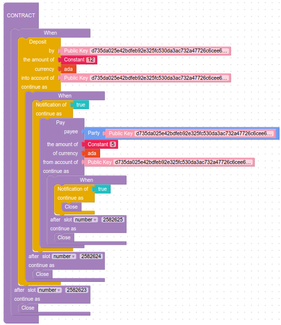

# Test of a Simple Contract

[This simple contract](../../../marlowe-contracts/src/Marlowe/Contracts/Trivial.hs) takes as deposit, waits for a notification, makes a payment, waits for another notification, and then closes the contract:

```
When
    [Case
        (Deposit
            (PK "d735da025e42bdfeb92e325fc530da3ac732a47726c6cee666a6ea5a")
            (PK "d735da025e42bdfeb92e325fc530da3ac732a47726c6cee666a6ea5a")
            (Token "" "")
            (Constant 12)
        )
        (When
            [Case
                (Notify TrueObs)
                (Pay
                    (PK "d735da025e42bdfeb92e325fc530da3ac732a47726c6cee666a6ea5a")
                    (Party (PK "d735da025e42bdfeb92e325fc530da3ac732a47726c6cee666a6ea5a"))
                    (Token "" "")
                    (Constant 5)
                    (When
                        [Case
                            (Notify TrueObs)
                            Close ]
                        2582625 Close 
                    )
                )]
            2582624 Close 
        )]
    2582623 Close 
```



## Prerequisites

The environment variable `CARDANO_NODE_SOCKET_PATH` must be set to the path to the cardano node's socket.
See below for how to set `MAGIC` to select the network.

The following tools must be on the PATH:
* [marlowe-cli](../../ReadMe.md)
* [cardano-cli](https://github.com/input-output-hk/cardano-node/blob/master/cardano-cli/README.md)
* [jq](https://stedolan.github.io/jq/manual/)
* sed

Signing and verification keys must be provided below for the bystander and party roles, or they will be created automatically: to do this, set the environment variables `BYSTANDER_PREFIX` and `PARTY_PREFIX` where they appear below.

## Preliminaries

```
: "${FAUCET_ADDRESS:?FAUCET_ADDRESS not set}"
: "${FAUCET_SKEY_FILE:?FAUCET_SKEY_FILE not set}"
```

### Select Network

```
: "${MAGIC:=2}"
```

MAGIC=2

```
SLOT_LENGTH=$(marlowe-cli util slotting --testnet-magic "$MAGIC" --socket-path "$CARDANO_NODE_SOCKET_PATH" | jq .scSlotLength)
SLOT_OFFSET=$(marlowe-cli util slotting --testnet-magic "$MAGIC" --socket-path "$CARDANO_NODE_SOCKET_PATH" | jq .scSlotZeroTime)
```

### Participants

#### The Bystander

The bystander simply provides the minimum ada to be held in the contract while it is active.

```
BYSTANDER_PREFIX="$TREASURY/christopher-marlowe"
BYSTANDER_PREFIX="$TREASURY/christopher-marlowe"
BYSTANDER_NAME="Christopher Marlowe"
BYSTANDER_PAYMENT_SKEY="$BYSTANDER_PREFIX".skey
BYSTANDER_PAYMENT_VKEY="$BYSTANDER_PREFIX".vkey
if [[ ! -e "$BYSTANDER_PAYMENT_SKEY" ]]
then
  cardano-cli address key-gen --signing-key-file "$BYSTANDER_PAYMENT_SKEY"      \
                              --verification-key-file "$BYSTANDER_PAYMENT_VKEY"
fi
BYSTANDER_ADDRESS=$(
  cardano-cli address build --testnet-magic "$MAGIC"                                  \
                            --payment-verification-key-file "$BYSTANDER_PAYMENT_VKEY" \
)
marlowe-cli util faucet --testnet-magic "$MAGIC"                  \
                        --socket-path "$CARDANO_NODE_SOCKET_PATH" \
                        --out-file /dev/null                      \
                        --submit 600                              \
                        --lovelace 50000000                       \
                        --faucet-address "$FAUCET_ADDRESS"        \
                        --required-signer "$FAUCET_SKEY_FILE"     \
                        "$BYSTANDER_ADDRESS"
```

```console
TxId "81347fc94090a9f0ad9f30cddc54128d5738ad319010b14fa40374c5f009c85d"
```

The bystander Christopher Marlowe is the minimum-ADA provider and has the address `addr_test1vrssw4edcts00kk6lp7p5n64666m23tpprqaarmdwkaq69gfvqnpz`. They have the following UTxOs in their wallet:

```
marlowe-cli util clean --testnet-magic "$MAGIC"                    \
                       --socket-path "$CARDANO_NODE_SOCKET_PATH"   \
                       --required-signer "$BYSTANDER_PAYMENT_SKEY" \
                       --change-address "$BYSTANDER_ADDRESS"       \
                       --out-file /dev/null                        \
                       --submit=600                                \
> /dev/null
cardano-cli query utxo --testnet-magic "$MAGIC" --address "$BYSTANDER_ADDRESS"
```

```console
                           TxHash                                 TxIx        Amount
--------------------------------------------------------------------------------------
9d0514b06583ccc5c62423b12d89db3b577cf81e6718c36b752f3cfbd43eef42     0        49834279 lovelace + TxOutDatumNone
```

We select a UTxO with sufficient funds to use in executing the contract.

```
TX_0_BYSTANDER=$(
marlowe-cli util select --testnet-magic "$MAGIC"                  \
                        --socket-path "$CARDANO_NODE_SOCKET_PATH" \
                        --lovelace-only 20000000                  \
                        "$BYSTANDER_ADDRESS"                      \
| sed -n -e '1{s/^TxIn "\(.*\)" (TxIx \(.*\))$/\1#\2/;p}'
)
```

Christopher Marlowe will spend the UTxO `9d0514b06583ccc5c62423b12d89db3b577cf81e6718c36b752f3cfbd43eef42#0`.

#### The Party

The party deposits and removes funds from the contract.

```
PARTY_PREFIX="$TREASURY/francis-beaumont"
PARTY_NAME="Francis Beaumont"
PARTY_PAYMENT_SKEY="$PARTY_PREFIX".skey
PARTY_PAYMENT_VKEY="$PARTY_PREFIX".vkey
if [[ ! -e "$PARTY_PAYMENT_SKEY" ]]
then
  cardano-cli address key-gen --signing-key-file "$PARTY_PAYMENT_SKEY"      \
                              --verification-key-file "$PARTY_PAYMENT_VKEY"
fi
PARTY_ADDRESS=$(
  cardano-cli address build --testnet-magic "$MAGIC"                              \
                            --payment-verification-key-file "$PARTY_PAYMENT_VKEY" \
)
marlowe-cli util faucet --testnet-magic "$MAGIC"                  \
                        --socket-path "$CARDANO_NODE_SOCKET_PATH" \
                        --out-file /dev/null                      \
                        --submit 600                              \
                        --lovelace 50000000                       \
                        --faucet-address "$FAUCET_ADDRESS"        \
                        --required-signer "$FAUCET_SKEY_FILE"     \
                        "$PARTY_ADDRESS"
```

```console
TxId "038ad2e532da2f1950746bf23e0c554afc9c576580084511ac4c6ec31830ca34"
```

The party Francis Beaumont has the address `addr_test1vzzpzll6gsl9npf8wfhk2zg8sy2we50jcqc7w8w46gua2pqq7cw2q`. They have the following UTxOs in their wallet:

```
marlowe-cli util clean --testnet-magic "$MAGIC"                  \
                       --socket-path "$CARDANO_NODE_SOCKET_PATH" \
                       --required-signer "$PARTY_PAYMENT_SKEY"   \
                       --change-address "$PARTY_ADDRESS"         \
                       --out-file /dev/null                      \
                       --submit=600                              \
> /dev/null
cardano-cli query utxo --testnet-magic "$MAGIC" --address "$PARTY_ADDRESS"
```

```console
                           TxHash                                 TxIx        Amount
--------------------------------------------------------------------------------------
523c55d401365df7ce5e353a13c233ea43116a32f63820f72e292120a2ab4285     0        49834279 lovelace + TxOutDatumNone
```

We select the UTxO with the most funds to use in executing the contract.

```
TX_0_PARTY=$(
marlowe-cli util select --testnet-magic "$MAGIC"                  \
                        --socket-path "$CARDANO_NODE_SOCKET_PATH" \
                        --lovelace-only 20000000                  \
                        "$PARTY_ADDRESS"                          \
| sed -n -e '1{s/^TxIn "\(.*\)" (TxIx \(.*\))$/\1#\2/;p}'
)
```

Francis Beaumont will spend the UTxO `523c55d401365df7ce5e353a13c233ea43116a32f63820f72e292120a2ab4285#0`.

### Tip of the Blockchain

```
TIP=$(cardano-cli query tip --testnet-magic "$MAGIC" | jq '.slot')
NOW="$((TIP*SLOT_LENGTH+SLOT_OFFSET))"
HOUR="$((3600*1000))"
```

The tip is at slot 3421084. The current POSIX time implies that the tip of the blockchain should be slightly before slot 3421084. Tests may fail if this is not the case.

## The Contract

The contract has a minimum time and a timeout.

```
TIMEOUT_TIME="$((NOW+24*HOUR))"
```

The contract will automatically close at Sun, 18 Sep 2022 14:18:04 +0000.

The contract also involves various payments.

```
MINIMUM_ADA=3000000
DEPOSIT_LOVELACE=12000000
WITHDRAWAL_LOVELACE=5000000
CLOSE_LOVELACE=$((DEPOSIT_LOVELACE-WITHDRAWAL_LOVELACE))
```

The bystander Christopher Marlowe will provide 3000000 lovelace during the contract's operation, so that it satisfies the minimmum-ADA requirement. The party Francis Beaumont will deposit 12000000 lovelace at the start of the contract. They will wait until notified to withdraw 5000000 lovelace. After another notification, the party Francis Beaumont will withdrawn the remaining 7000000 lovelace and the bystander Christopher Marlowe will receive their 3000000 lovelace back. This is expressed in the Marlowe language [here](../../src/Language/Marlowe/CLI/Examples/Trivial.hs).

We create the contract for the previously specified parameters.

```
marlowe-cli template simple --bystander "$BYSTANDER_ADDRESS"             \
                            --minimum-ada "$MINIMUM_ADA"                 \
                            --party "$PARTY_ADDRESS"                     \
                            --deposit-lovelace "$DEPOSIT_LOVELACE"       \
                            --withdrawal-lovelace "$WITHDRAWAL_LOVELACE" \
                            --timeout "$TIMEOUT_TIME"                    \
                            --out-contract-file tx-1.contract            \
                            --out-state-file    tx-1.state
```

## Transaction 1. Create the Contract by Providing the Minimum ADA

First we create a `.marlowe` file that contains the initial information needed to run the contract. The bare size and cost of the script provide a lower bound on the resources that running it will require.

```
marlowe-cli run initialize --testnet-magic "$MAGIC"                  \
                           --socket-path "$CARDANO_NODE_SOCKET_PATH" \
                           --contract-file tx-1.contract             \
                           --state-file    tx-1.state                \
                           --out-file      tx-1.marlowe              \
                           --merkleize                               \
                           --print-stats
```

```console
Validator size: 12668
Base-validator cost: ExBudget {exBudgetCPU = ExCPU 18653100, exBudgetMemory = ExMemory 81200}
```

In particular, we can extract the contract's address from the `.marlowe` file.

```
CONTRACT_ADDRESS=$(jq -r '.tx.marloweValidator.address' tx-1.marlowe)
```

The Marlowe contract resides at address `addr_test1wrv0vwr4megau50ujjwsktvajmsu6dzza2rnalufd3husaqs9v6rv`.

The bystander Christopher Marlowe submits the transaction along with the minimum ADA 3000000 lovelace required for the contract's initial state. Submitting with the `--print-stats` switch reveals the network fee for the contract, the size of the transaction, and the execution requirements, relative to the protocol limits.

```
TX_1=$(
marlowe-cli run auto-execute \
  --testnet-magic "$MAGIC" \
  --socket-path "$CARDANO_NODE_SOCKET_PATH" \
  --required-signer "$BYSTANDER_PAYMENT_SKEY" \
  --marlowe-out-file tx-1.marlowe \
  --change-address "$BYSTANDER_ADDRESS" \
  --out-file tx-1.raw \
  --print-stats \
  --submit=600 \
| sed -e 's/^TxId "\(.*\)"$/\1/'                                    \
)
```

```console
Fee: Lovelace 193705
Size: 525 / 16384 = 3%
Execution units:
  Memory: 0 / 14000000 = 0%
  Steps: 0 / 10000000000 = 0%
```

The contract received the minimum ADA of 3000000 lovelace from the bystander Christopher Marlowe in the transaction `212325550af7e39e8317994d72068b990b701cb0246177a7bb155c4ab83c19eb`. Here is the UTxO at the contract address:

```
cardano-cli query utxo --testnet-magic "$MAGIC" --address "$CONTRACT_ADDRESS" | sed -n -e "1p;2p;/$TX_1/p"
```

```console
                           TxHash                                 TxIx        Amount
--------------------------------------------------------------------------------------
212325550af7e39e8317994d72068b990b701cb0246177a7bb155c4ab83c19eb     1        3000000 lovelace + TxOutDatumHash ScriptDataInBabbageEra "c9132e2b16095077934a341dd2a70d2da8fe656cf38e71aa916918e8fc888972"
```

Here is the UTxO at the bystander Christopher Marlowe's address:

```
cardano-cli query utxo --testnet-magic "$MAGIC" --address "$BYSTANDER_ADDRESS" | sed -n -e "1p;2p;/$TX_1/p"
```

```console
                           TxHash                                 TxIx        Amount
--------------------------------------------------------------------------------------
212325550af7e39e8317994d72068b990b701cb0246177a7bb155c4ab83c19eb     0        46640574 lovelace + TxOutDatumNone
```

## Transaction 2. Make the Initial Deposit

First we compute the Marlowe input required to make the initial deposit by the party.

```
marlowe-cli run prepare --marlowe-file tx-1.marlowe              \
                        --deposit-account "$PARTY_ADDRESS"       \
                        --deposit-party "$PARTY_ADDRESS"         \
                        --deposit-amount "$DEPOSIT_LOVELACE"     \
                        --invalid-before "$NOW"                  \
                        --invalid-hereafter "$((NOW+4*HOUR))"    \
                        --out-file tx-2.marlowe                  \
                        --print-stats
```

```console
Datum size: 217
```

Now the party Francis Beaumont submits the transaction along with their deposit:

```
TX_2=$(
marlowe-cli run auto-execute \
  --testnet-magic "$MAGIC" \
  --socket-path "$CARDANO_NODE_SOCKET_PATH" \
  --marlowe-in-file tx-1.marlowe \
  --tx-in-marlowe "$TX_1"#1 \
  --required-signer "$PARTY_PAYMENT_SKEY" \
  --marlowe-out-file tx-2.marlowe \
  --change-address "$PARTY_ADDRESS" \
  --out-file tx-2.raw \
  --print-stats \
  --submit=600 \
| sed -e 's/^TxId "\(.*\)"$/\1/' \
)
```

```console
Fee: Lovelace 1112237
Size: 13766 / 16384 = 84%
Execution units:
  Memory: 4355198 / 14000000 = 31%
  Steps: 1172607711 / 10000000000 = 11%
```

The contract received the deposit of 12000000 lovelace from the party Francis Beaumont in the transaction `8f18ad7500b83d3c98eabb2ab29a1cca1e606f41c22af2bced6061cd7c1ba547`. Here is the UTxO at the contract address:

```
cardano-cli query utxo --testnet-magic "$MAGIC" --address "$CONTRACT_ADDRESS" | sed -n -e "1p;2p;/$TX_2/p"
```

```console
                           TxHash                                 TxIx        Amount
--------------------------------------------------------------------------------------
8f18ad7500b83d3c98eabb2ab29a1cca1e606f41c22af2bced6061cd7c1ba547     1        15000000 lovelace + TxOutDatumHash ScriptDataInBabbageEra "6b7e43a47b6716cf89a6b0f42717606bb5bc614600e74a4b7e38522fac21af17"
```

Here is the UTxO at the party Francis Beaumont's address:

```
cardano-cli query utxo --testnet-magic "$MAGIC" --address "$PARTY_ADDRESS" | sed -n -e "1p;2p;/$TX_2/p"
```

```console
                           TxHash                                 TxIx        Amount
--------------------------------------------------------------------------------------
8f18ad7500b83d3c98eabb2ab29a1cca1e606f41c22af2bced6061cd7c1ba547     0        35222042 lovelace + TxOutDatumNone
8f18ad7500b83d3c98eabb2ab29a1cca1e606f41c22af2bced6061cd7c1ba547     2        1500000 lovelace + TxOutDatumHash ScriptDataInBabbageEra "72a7975ff62ff5e333d9f3c2785b3574fa73692869e1886b2efe303c025f05e5"
```

## Transaction 3. Make the First Withdrawal

First we compute the input for the contract to transition forward.

```
marlowe-cli run prepare --marlowe-file tx-2.marlowe           \
                        --notify                              \
                        --invalid-before "$NOW"               \
                        --invalid-hereafter "$((NOW+4*HOUR))" \
                        --out-file tx-3.marlowe               \
                        --print-stats
```

```console
Datum size: 186
Payment 1
  Acccount: Address ""addr_test1vzzpzll6gsl9npf8wfhk2zg8sy2we50jcqc7w8w46gua2pqq7cw2q""
  Payee: Party (Address ""addr_test1vzzpzll6gsl9npf8wfhk2zg8sy2we50jcqc7w8w46gua2pqq7cw2q"")
  Ada: Lovelace {getLovelace = 5000000}
```

Now the party Francis Beaumont can submit a transaction to withdraw funds:

```
TX_3=$(
marlowe-cli run auto-execute \
  --testnet-magic "$MAGIC" \
  --socket-path "$CARDANO_NODE_SOCKET_PATH" \
  --marlowe-in-file tx-2.marlowe \
  --tx-in-marlowe "$TX_2"#1 \
  --required-signer "$PARTY_PAYMENT_SKEY" \
  --marlowe-out-file tx-3.marlowe \
  --change-address "$PARTY_ADDRESS" \
  --out-file tx-3.raw \
  --print-stats \
  --submit=600 \
| sed -e 's/^TxId "\(.*\)"$/\1/' \
)
```

```console
Fee: Lovelace 1324912
Size: 13718 / 16384 = 83%
Execution units:
  Memory: 7170282 / 14000000 = 51%
  Steps: 1898775640 / 10000000000 = 18%
```

The contract made a payment of 5000000 lovelace to the party Francis Beaumont in the transaction `82a84c2d7752ff0d928609cecbdb779df9bb50215906b413a1d4aa7bb6213f50`. Here is the UTxO at the contract address:

```
cardano-cli query utxo --testnet-magic "$MAGIC" --address "$CONTRACT_ADDRESS" | sed -n -e "1p;2p;/$TX_3/p"
```

```console
                           TxHash                                 TxIx        Amount
--------------------------------------------------------------------------------------
82a84c2d7752ff0d928609cecbdb779df9bb50215906b413a1d4aa7bb6213f50     1        10000000 lovelace + TxOutDatumHash ScriptDataInBabbageEra "ac261620fc8ee04bcceed3074d788a27bb66e1255a4ee80b95a83aad56391d18"
```

Here is the UTxO at the party Francis Beaumont's address:

```
cardano-cli query utxo --testnet-magic "$MAGIC" --address "$PARTY_ADDRESS" | sed -n -e "1p;2p;/$TX_3/p"
```

```console
                           TxHash                                 TxIx        Amount
--------------------------------------------------------------------------------------
82a84c2d7752ff0d928609cecbdb779df9bb50215906b413a1d4aa7bb6213f50     0        32397130 lovelace + TxOutDatumNone
82a84c2d7752ff0d928609cecbdb779df9bb50215906b413a1d4aa7bb6213f50     2        5000000 lovelace + TxOutDatumNone
82a84c2d7752ff0d928609cecbdb779df9bb50215906b413a1d4aa7bb6213f50     3        1500000 lovelace + TxOutDatumHash ScriptDataInBabbageEra "afaaba9a14ff10daa5bc8e9bb10d70755f5f37313eccb2a4053a82aae09fe24f"
```

## Transaction 4. Close the contract

As in the third transaction, we compute the input for the contract to transition forward.

```
marlowe-cli run prepare --marlowe-file tx-3.marlowe           \
                        --notify                              \
                        --invalid-before "$NOW"               \
                        --invalid-hereafter "$((NOW+4*HOUR))" \
                        --out-file tx-4.marlowe               \
                        --print-stats
```

```console
Datum size: 30
Payment 1
  Acccount: Address ""addr_test1vrssw4edcts00kk6lp7p5n64666m23tpprqaarmdwkaq69gfvqnpz""
  Payee: Party (Address ""addr_test1vrssw4edcts00kk6lp7p5n64666m23tpprqaarmdwkaq69gfvqnpz"")
  Ada: Lovelace {getLovelace = 3000000}
Payment 2
  Acccount: Address ""addr_test1vzzpzll6gsl9npf8wfhk2zg8sy2we50jcqc7w8w46gua2pqq7cw2q""
  Payee: Party (Address ""addr_test1vzzpzll6gsl9npf8wfhk2zg8sy2we50jcqc7w8w46gua2pqq7cw2q"")
  Ada: Lovelace {getLovelace = 7000000}
```

Now the party Francis Beaumont can submit a transaction to close the contract and disperse the remaining funds:

```
TX_4=$(
marlowe-cli run auto-execute \
  --testnet-magic "$MAGIC" \
  --socket-path "$CARDANO_NODE_SOCKET_PATH" \
  --marlowe-in-file tx-3.marlowe \
  --tx-in-marlowe "$TX_3"#1 \
  --required-signer "$PARTY_PAYMENT_SKEY" \
  --marlowe-out-file tx-4.marlowe \
  --change-address "$PARTY_ADDRESS" \
  --out-file tx-4.raw \
  --print-stats \
  --submit=600 \
| sed -e 's/^TxId "\(.*\)"$/\1/' \
)
```

```console
Fee: Lovelace 1074187
Size: 13204 / 16384 = 80%
Execution units:
  Memory: 4221518 / 14000000 = 30%
  Steps: 1094808021 / 10000000000 = 10%
```

The closing of the contract paid 7000000 lovelace to the the party Francis Beaumont and 3000000 lovelace to the bystander Christopher Marlowe in the transaction `1af1f1bc42f5a4223bf19d2ccef11ab8ac7057c526d056b065513615c0d24552`. There is no UTxO at the contract address:

```
cardano-cli query utxo --testnet-magic "$MAGIC" --address "$CONTRACT_ADDRESS" | sed -n -e "1p;2p;/$TX_1/p;/$TX_2/p;/$TX_3/p;/$TX_4/p"
```

```console
                           TxHash                                 TxIx        Amount
--------------------------------------------------------------------------------------
```

Here is the UTxO at the bystander Christopher Marlowe's address:

```
cardano-cli query utxo --testnet-magic "$MAGIC" --address "$BYSTANDER_ADDRESS" | sed -n -e "1p;2p;/$TX_1/p;/$TX_2/p;/$TX_3/p;/$TX_4/p"
```

```console
                           TxHash                                 TxIx        Amount
--------------------------------------------------------------------------------------
1af1f1bc42f5a4223bf19d2ccef11ab8ac7057c526d056b065513615c0d24552     2        3000000 lovelace + TxOutDatumNone
212325550af7e39e8317994d72068b990b701cb0246177a7bb155c4ab83c19eb     0        46640574 lovelace + TxOutDatumNone
```

Here is the UTxO at the party Francis Beaumont's address:

```
cardano-cli query utxo --testnet-magic "$MAGIC" --address "$PARTY_ADDRESS" | sed -n -e "1p;2p;/$TX_1/p;/$TX_2/p;/$TX_3/p;/$TX_4/p"
```

```console
                           TxHash                                 TxIx        Amount
--------------------------------------------------------------------------------------
1af1f1bc42f5a4223bf19d2ccef11ab8ac7057c526d056b065513615c0d24552     0        31322943 lovelace + TxOutDatumNone
1af1f1bc42f5a4223bf19d2ccef11ab8ac7057c526d056b065513615c0d24552     1        7000000 lovelace + TxOutDatumNone
82a84c2d7752ff0d928609cecbdb779df9bb50215906b413a1d4aa7bb6213f50     2        5000000 lovelace + TxOutDatumNone
82a84c2d7752ff0d928609cecbdb779df9bb50215906b413a1d4aa7bb6213f50     3        1500000 lovelace + TxOutDatumHash ScriptDataInBabbageEra "afaaba9a14ff10daa5bc8e9bb10d70755f5f37313eccb2a4053a82aae09fe24f"
8f18ad7500b83d3c98eabb2ab29a1cca1e606f41c22af2bced6061cd7c1ba547     2        1500000 lovelace + TxOutDatumHash ScriptDataInBabbageEra "72a7975ff62ff5e333d9f3c2785b3574fa73692869e1886b2efe303c025f05e5"
```

## Clean Up

```
cleanup() {
  SRC_SKEY="$1"
  SRC_ADDR="$2"
  DEST_ADDR="$3"
  # Combine all ADA together in the source address
  marlowe-cli util clean \
    --testnet-magic "$MAGIC" \
    --socket-path "$CARDANO_NODE_SOCKET_PATH" \
    --required-signer "$SRC_SKEY" \
    --change-address "$SRC_ADDR" \
    --out-file /dev/null \
    --submit 600
  # Get the TxHash#TxIx of these combined funds in a variable we can use as a
  # --tx-in argument
  TX_CLEANUP=$(
  marlowe-cli util select \
    --testnet-magic "$MAGIC" \
    --all "$SRC_ADDR" \
  | sed -e 's/^TxIn "\(.*\)" (TxIx \(.*\))$/\1#\2/' \
  )
  # Send the funds back to the dest address
  marlowe-cli transaction simple \
    --testnet-magic "$MAGIC" \
    --socket-path "$CARDANO_NODE_SOCKET_PATH" \
    --tx-in "$TX_CLEANUP" \
    --required-signer "$SRC_SKEY" \
    --change-address "$DEST_ADDR" \
    --out-file /dev/null \
    --submit 600
  cardano-cli query utxo --testnet-magic "$MAGIC" --address "$SRC_ADDR"
}
cleanup "$BYSTANDER_PAYMENT_SKEY" "$BYSTANDER_ADDRESS" "$FAUCET_ADDRESS"
```

```console
TxId "02e78f3351033df76f57d7dae28e03832b4593de14b14398d06f609fa68e7354"
TxId "bb1a4c8074252d467b454d93082c938aaffd173c20cdbf66f2322019efdf316a"
                           TxHash                                 TxIx        Amount
--------------------------------------------------------------------------------------
```

cleanup "$PARTY_PAYMENT_SKEY" "$PARTY_ADDRESS" "$FAUCET_ADDRESS"
```

```console
TxId "ae895ece7372e0b7de73311405809eb3d214d238e402280619489038e87afd03"
TxId "8b98bb529a416022ef46ff44aa71bfdc5bbafc522235a9b85fb3646cd8ae0eca"
                           TxHash                                 TxIx        Amount
--------------------------------------------------------------------------------------
