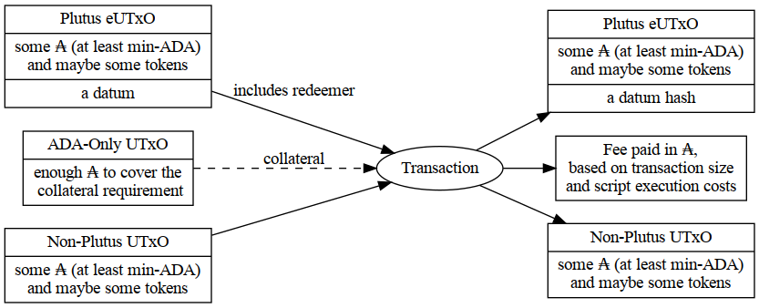
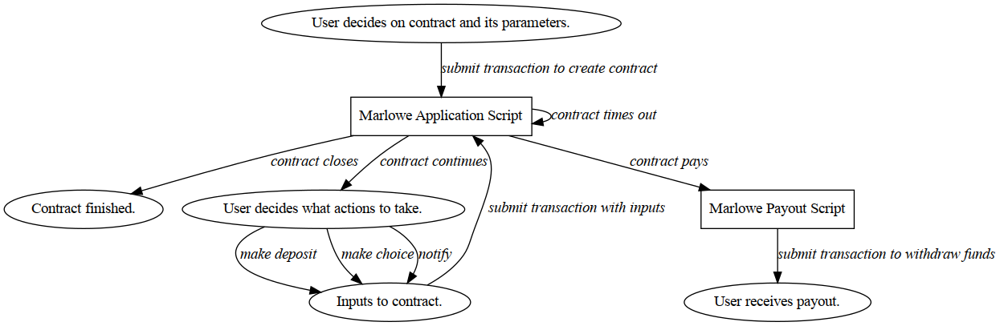

<div class="cell markdown" tags="[]">

# Overview of Marlowe CLI

This lecture provides an introduction to the `marlowe-cli` tool, which
allows one to create and interact with Marlowe contracts on the
blockchain. It summarizes uses of the tool, the levels at which it can
interact with Marlowe on the blockchain, and how Marlowe transactions
relate to the Cardano's eUTxO model.

</div>

<div class="cell markdown" jp-MarkdownHeadingCollapsed="true" tags="[]">

## Purpose

The `marlowe-cli` tool enables developers to submit transactions and
interact from the command line with Marlowe contracts on the Cardano
blockchain, just as the `cardano-cli` tool has enabled them to do so for
plain transactions, simple scripts, and Plutus scripts.

***Use Cases***

1.  Facilitation of internal development and testing of Marlowe
    contracts.
    1.  Measuring transaction size.
    2.  Submitting transactions.
    3.  Testing wallet integrations.
    4.  Debugging validators.
2.  Early access to Marlowe capabilities on testnet and mainnet.
3.  Integration with external developer’s workflows and toolsets for
    Marlowe contracts, similar to how the Cardano development community
    has heavily integrated `cardano-cli` into various services
    (libraries, faucets, token minting, marketplaces, etc.).
4.  Incorporation into training for use of Marlowe.

</div>

<div class="cell markdown">

## Three Levels of Interaction with Marlowe on the Blockchain

| Low Level                                                                                                                             | High Level                                                                                             | Marlowe Backend                                                                                               |
|---------------------------------------------------------------------------------------------------------------------------------------|--------------------------------------------------------------------------------------------------------|---------------------------------------------------------------------------------------------------------------|
| • Supports developer workflows for debugging and fine-grained control of each atomic operation involved in running Marlowe contracts. | • Supports a straightforward workflow for users that just want to run contracts from the command line. | • Supports direct interaction with backend contracts and endpoints for running Marlowe from the command line. |
| • Controls modification of Marlowe state and construction of Marlowe input.                                                           | • Hides details of input and state of Marlowe contracts.                                               | • Hides details of UTxO management by interacting with a Cardano Wallet or Daedalus.                          |
| • Controls construction and submission of validators, datums, and redeemers.                                                          | • Hides and automates many aspects of Plutus and interaction with the Cardano node.                    | • Mimics the workflow for using Marlowe Run.                                                                  |
| • Focus on the mechanics of Marlowe on Plutus and Cardano.                                                                            | • Focuses on the Marlowe contract.                                                                     | • Focuses on user interaction.                                                                                |

</div>

<div class="cell markdown">

## Review of eUTxO Model



</div>

<div class="cell markdown">

## Marlowe Roles: Currency, Tokens, and Payouts

-   Each Marlowe contract has a currency symbol for its roles and a
    payout validator script for receiving and disbursing payments to
    participants.
-   Participants typically interact with Marlowe contracts by including
    a role token in transactions that the participant authorizes.
    -   Role tokens are a concatenation of the currency symbol and the
        role name as the token name.
-   Participants withdraw funds from a special payout script using their
    role token.
    -   The payout Plutus script is unique to each role currency symbol.
    -   The datum at the payout address is simply the token name for the
        participant that is allowed to spend that UTxO.
    -   The redeemer for spending from the payout script is empty.
-   Roles provide a flexible and secure way for participants to interact
    with Marlowe.
-   Role tokens can be transferred from one wallet to another.

</div>

<div class="cell markdown">

## Marlowe on the Blockchain

| Component           | Plutus Validator Script                                                                           | Datum                                                                                                 | Redeemer                                                                            |
|---------------------|---------------------------------------------------------------------------------------------------|-------------------------------------------------------------------------------------------------------|-------------------------------------------------------------------------------------|
| Minting role tokens | One-shot monetary policy                                                                          | n/a                                                                                                   | n/a                                                                                 |
| Marlowe application | Generic for all Marlowe contracts, but whose address is specialized to the roles for the contract | Unexecuted parts of the contract; balances for accounts; records of past inputs; values of parameters | Input to the next step of the contract, such as deposits, choices, or notifications |
| Marlowe payouts     | Specific to particular role currency                                                              | Role that is to be paid.                                                                              | n/a                                                                                 |

</div>

<div class="cell markdown" tags="[]">

## Life Cycle of a Marlowe Contract



</div>

<div class="cell markdown">

### Using Marlowe CLI to Study Transitions of a Marlowe Contract


</div>

<div class="cell markdown" jp-MarkdownHeadingCollapsed="true" tags="[]">

### Using Marlowe CLI to Execute Transactions for a Marlowe Contract


</div>

<div class="cell markdown" jp-MarkdownHeadingCollapsed="true" tags="[]">

### Transaction that Creates a Marlowe Contract

Use `marlowe-cli run execute` to create a Marlowe contract.


</div>

<div class="cell markdown">

### Transaction that Applies Inputs to a Marlowe Contract

Use `marlowe-cli run execute` to apply inputs to a Marlowe contract.


</div>

<div class="cell markdown" tags="[]">

### Transaction that Redeems a Marlowe Payout

Use `marlowe-cli run withdraw` to redeem funds of a Marlowe payout.


</div>

<div class="cell markdown">

## Example UTxOs for a Contract's Life Cycle


</div>

<div class="cell markdown">

## Merkleization

-   Because the Marlowe Domain-Specific Language (DSL) has limited
    capabilities, primarily for provable safety, Marlowe contracts
    involving many parties or choices may become quiet lengthy.
-   Because the Cardano blockchain protocol parameters limit the size of
    transactions, a lengthy Marlowe contract will not fit in a
    transaction.
-   To alleviate this problem, Marlowe supports a technique called
    "Merkleization" where only the immediately needed part of the
    contract is stored in the contract's most recent transaction on the
    blockchain.
-   The continuation of the contract in `Case` statements is referenced
    securely by the hash of that continuation.
-   When a choice is made that would necessitate executing that
    continuation, it is provided as input to the transaction and the
    Marlowe validator verifies that its hash matches the hash required
    by the on-chain contract.
-   This Merkleization technique can radically reduce the on-chain size
    of a contract from hundreds of megabytes down to less than a
    kilobyte.

</div>

<div class="cell markdown">

## Getting Help for Marlowe CLI

</div>

<div class="cell code" execution_count="1">

``` bash
marlowe-cli --help
```

<div class="output stream stdout">

    marlowe-cli : a command-line tool for Marlowe contracts

    Usage: marlowe-cli [--version] (COMMAND | COMMAND)

      Utilities for Marlowe.

    Available options:
      -h,--help                Show this help text
      --version                Show version.

    High-level commands:
      run                      Run a contract.
      pab                      Run a contract via the PAB.
      template                 Create a contract from a template.
      test                     Test contracts.

    Low-level commands:
      contract                 Export contract address, validator, datum, or
                               redeemer.
      input                    Create inputs to a contract.
      role                     Export role address, validator, datum, or redeemer.
      query                    Blockchain queries for Marlowe.
      transaction              Create and submit transactions.
      util                     Miscellaneous utilities.

</div>

</div>

<div class="cell markdown" jp-MarkdownHeadingCollapsed="true" tags="[]">

## High-Level Marlowe CLI Commands

| Command                | Description                                                                             |
|------------------------|-----------------------------------------------------------------------------------------|
| `run`                  | Run a contract.                                                                         |
| `run execute`          | Run a Marlowe transaction.                                                              |
| `run initialize`       | Initialize the first transaction of a Marlowe contract and write output to a JSON file. |
| `run prepare`          | Prepare the next step of a Marlowe contract and write the output to a JSON file.        |
| `run withdraw`         | Withdraw funds from the Marlowe role address.                                           |
| `template`             | Create a contract from a template.                                                      |
| `template coveredCall` | Create a covered call Option.                                                           |
| `template escrow`      | Create an escrow contract.                                                              |
| `template simple`      | Create a simple example contract.                                                       |
| `template swap`        | Create a swap contract.                                                                 |
| `template zcb`         | Create a zero-coupon bond.                                                              |

</div>

<div class="cell markdown" tags="[]">

## Marlowe CLI Commands for the Marlowe Backend

| Command            | Description                                   |
|--------------------|-----------------------------------------------|
| `pab`              | Run a contract via the PAB.                   |
| `pab app`          | Start the Marlowe application contract.       |
| `pab apply-inputs` | Apply inputs to a Marlowe contract.           |
| `pab companion`    | Start the Marlowe companion contract.         |
| `pab create`       | Create a Marlowe contract.                    |
| `pab follow`       | Follow a Marlowe contract.                    |
| `pab follower`     | Start the Marlowe follower contract.          |
| `pab redeem`       | Redeem funds from a Marlowe contract.         |
| `pab stop`         | Stop a Marlowe contract.                      |
| `test`             | Test contracts.                               |
| `test contracts`   | Test Marlowe contracts using the Marlowe PAB. |

</div>

<div class="cell markdown">

## Low-Level Marlowe CLI Commands (1 of 2)

| Command              | Description                                             |
|----------------------|---------------------------------------------------------|
| `contract`           | Export contract address, validator, datum, or redeemer. |
| `contract address`   | Print a contract validator address.                     |
| `contract datum`     | Export a contract datum to a JSON file.                 |
| `contract marlowe`   | Export a Marlowe contract to a JSON file.               |
| `contract redeemer`  | Export a contract redeemer to a JSON file.              |
| `contract validator` | Export a contract validator to a JSON file.             |
| `input`              | Create inputs to a contract.                            |
| `input choose`       | Create Marlowe input for a choice.                      |
| `input deposit`      | Create Marlowe input for a deposit.                     |
| `input notify`       | Create Marlowe input for a notification.                |

</div>

<div class="cell markdown">

## Low-Level Marlowe CLI Commands (2 of 2)

| Command               | Description                                                             |
|-----------------------|-------------------------------------------------------------------------|
| `role`                | Export role address, validator, datum, or redeemer.                     |
| `role address`        | Print a role validator address.                                         |
| `role datum`          | Export a role datum to a JSON file.                                     |
| `role redeemer`       | Export a role redeemer to a JSON file.                                  |
| `role validator`      | Export a role validator to a JSON file.                                 |
| `transaction`         | Create and submit transactions.                                         |
| `transaction advance` | Build a transaction that both spends from and pays to a Marlowe script. |
| `transaction close`   | Build a transaction that spends from a Marlowe script.                  |
| `transaction create`  | Build a transaction that pays to a Marlowe script.                      |
| `transaction simple`  | Build a non-Marlowe transaction.                                        |
| `transaction submit`  | Submit a transaction body.                                              |

</div>

<div class="cell markdown">

## Query Commands

| Command             | Description                                        |
|---------------------|----------------------------------------------------|
| `query`             | Blockchain queries for Marlowe.                    |
| `query address`     | Query transactions at an address.                  |
| `query app`         | Query the state of the Marlowe application script. |
| `query history`     | Query for the Marlowe contract histories.          |
| `query output`      | Query output details.                              |
| `query payout`      | Query the state of the Marlowe payout script.      |
| `query transaction` | Query transaction details.                         |

</div>

<div class="cell markdown">

## Miscellaneous Marlowe CLI Commands

| Command              | Description                                               |
|----------------------|-----------------------------------------------------------|
| `util`               | Miscellaneous utilities.                                  |
| `util clean`         | Reorganize the UTxOs at an address, separating tokens.    |
| `util decode-bech32` | Decode Bech32 data.                                       |
| `util demerkleize`   | Remove merkleization from a contract.                     |
| `util encode-bech32` | Encode Bech32 data.                                       |
| `util faucet`        | Fund an address from a faucet.                            |
| `util merkleize`     | Deeply merkleize a contract.                              |
| `util mint`          | Mint native tokens.                                       |
| `util select`        | Select UTxO by asset.                                     |
| `util slotting`      | Find the slot-to-time relationship for the current epoch. |
| `util watch`         | Watch Marlowe transactions on a Cardano node.             |

</div>

<div class="cell markdown">

## Troubleshooting

-   Run the contract in the Marlowe Playground simulator before running
    it at the command line.
-   Pay attention to the timeouts in `When` clauses of a contract:
    -   Does the timeout trigger the intendent movement of funds between
        accounts?
    -   Is the timeout consistent with other timeouts in `Case`
        statements?

</div>

<div class="cell markdown">

## Resources

-   Marlowe CLI documentation:
    <https://github.com/input-output-hk/marlowe-cardano/blob/mpp-cli-lectures/marlowe-cli/ReadMe.md>.
-   Marlowe Cardano repository:
    <https://github.com/input-output-hk/marlowe-cardano/>.
-   Cardano Docs for Marlowe:
    <https://docs.cardano.org/marlowe/learn-about-marlowe>.
-   Marlowe Playground: <https://playground.marlowe.iohkdev.io/#/>.
-   Marlowe Run
    -   On pioneers testnet:
        <https://marlowe-run-marlowe-pioneers.plutus.aws.iohkdev.io/>.
    -   On mock network: <https://marlowe-finance.io/>.

</div>

<div class="cell markdown">

## Summary

-   Marlowe CLI can be used at various level of interaction with the
    blockchain.
    -   Run contracts without actually making blockchain transactions.
    -   Submit Marlowe transactions on the blockchain.
        -   At high level, without explicitly using Plutus.
        -   At low level, dealing directly with Plutus constructs.
    -   Interact with the Marlowe Backend.
-   There are three types of Marlowe transactions on the blockchain:
    -   Creating a contract.
    -   Applying inputs to a contract.
    -   Withdrawing funds from the contract's role-payout address.
-   Use `marlowe-cli --help` to print information on Marlowe Cli
    commands.

</div>

<div class="cell markdown" tags="[]">

## Other Lectures

Lectures on Marlowe CLI:
<https://github.com/input-output-hk/marlowe-cardano/blob/mpp-cli-lectures/marlowe-cli/lectures/ReadMe.md>

-   ~~Overview of Marlowe CLI~~
-   [Installing Marlowe CLI and Associated
    Tools](02-marlowe-cli-installation.ipynb)
-   [Running Marlowe Contracts without Blockchain
    Transactions](03-marlowe-cli-abstract.ipynb)
-   [Running Marlowe Contacts on the
    Blockchain](04-marlowe-cli-concrete.ipynb)

</div>
