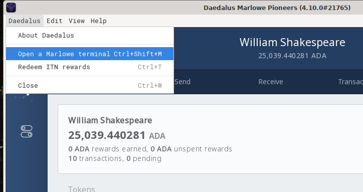

<div class="cell markdown" tags="[]">

# Installing Marlowe CLI and Associated Tools

This lecture describes how to install `marlowe-cli` and the other tools
needed to run Marlowe contracts.

</div>

<div class="cell markdown">

## Prerequisites

In addition to `marlowe-cli` and other Cardano tools, the following
common command-line tools are used in these lectures. Install these if
they aren't already installed.

-   `bash`
-   `git`
-   `curl`
-   `sed`
-   `tr`
-   `basenc`
-   `jq`
-   `json2yaml`

</div>

<div class="cell markdown" tags="[]">

## Installating Daedalus

Daedalus is the Cardano full-node wallet. The version for Marlowe
Pioneers runs a Cardano node on the Marlowe Pioneers test network.

1.  Download the version of Daedalus for your operating system.
    -   [Linux](https://pioneers.marlowe-finance.io/daedalus/linux)
    -   [Mac](https://pioneers.marlowe-finance.io/daedalus/macOS)
    -   [Windows](https://pioneers.marlowe-finance.io/daedalus/windows)
2.  Run the Daedalus installer.
3.  Launch Daedalus from the menu of programs installed in your
    operating system.

</div>

<div class="cell markdown">

## Creating a Cardano Wallet using Daedalus

1.  Click "Add wallet" on the main screen.
2.  Click "Create".
3.  Enter a nickname for the wallet and a password.
4.  Daedalus will display a seed phrase and instructions for securing
    it. Keep a record of this seed phrase so that you can use the wallet
    at the command line or in Marlowe Run.

If you previously created a wallet using Marlowe Run, instead of
creating a new wallet you can use the "Restore" function in place of
"Create".

🚫 Never reuse the seed phrase from any `mainnet` wallet on a test
network like the Marlowe Pioneers testnet.

</div>

<div class="cell markdown">

### Funding a Daedalus Wallet on the Marlowe Pioneers Testnet

Choose the first address in the Daedalus wallet, and call that
`$ADDRESS`. Execute the following cURL command to fund the wallet.

</div>

<div class="cell code" execution_count="1">

``` bash
curl -k -X POST https://faucet.pioneers.testnet.marlowe-finance.io/send-money/$ADDRESS
```

</div>

<div class="cell markdown" tags="[]">

## Installing Marlowe CLI and Cardano Tools

</div>

<div class="cell markdown">

### Using Daedalus for Linux or Mac

The Marlowe Daedalus for Linux or Mac comes with `marlowe-cli` and other
tools pre-installed. Use the "Open a Marlowe terminal" menu item in the
"Daedalus" menu. This feature is not available in Marlowe Daedalus for
Windows.




</div>

<div class="cell markdown" tags="[]">

### Using the Nix

NixOS and the Nix package manager are available at <https://nixos.org/>.
See also the Plutus Community Docs at
<https://plutus-community.readthedocs.io/en/latest/>.

👉 See
<https://github.com/input-output-hk/marlowe-cardano/blob/main/README.adoc#how-to-set-up-the-iohk-binary-caches>
on how to set up binary caches for the Nix build. This will greatly
speed the build process.

Once the binary caches have been set up, clone the Marlowe Git
repository.

The Marlowe repository for Cardano is located at
<https://github.com/input-output-hk/marlowe-cardano.git>.

-   This repository contains the Marlowe source code, documentation,
    examples, and test cases.
-   The repository is needed if you want to use Marlowe from a Nix
    shell.
-   It is convenient, but not strictly required, if you install Marlowe
    tools from the Marlowe Pioneers Daedalus installation.

The following `git` command will copy the repository onto your machine.

</div>

<div class="cell code" execution_count="2" tags="[]">

``` bash
git clone https://github.com/input-output-hk/marlowe-cardano.git -b mpp-cli-lectures
```

<div class="output stream stdout">

    Cloning into 'marlowe-cardano'...
    remote: Enumerating objects: 127844, done.ote: Counting objects: 100% (617/617), done.ote: Compressing objects: 100% (327/327), done.ote: Total 127844 (delta 294), reused 583 (delta 276), pack-reused 127227

</div>

</div>

<div class="cell markdown">

After the git repository has been cloned. Change the default directory
to its top folder and open a Nix shell.

</div>

<div class="cell code" execution_count="3">

``` bash
cd marlowe-cardano
nix develop
```

</div>

<div class="cell markdown">

The `marlowe-cli` and the other required executable programs are all
available within that shell.

</div>

<div class="cell code" execution_count="4">

``` bash
marlowe-cli --version
```

<div class="output stream stdout">

    marlowe-cli 0.0.4.3

</div>

</div>

<div class="cell code" execution_count="5">

``` bash
cardano-cli --version
```

<div class="output stream stdout">

    cardano-cli 1.34.1 - linux-x86_64 - ghc-8.10
    git rev 0000000000000000000000000000000000000000

</div>

</div>

<div class="cell code" execution_count="6">

``` bash
cardano-wallet version
```

<div class="output stream stdout">

    v2022-01-18 (git revision: 0000000000000000000000000000000000000000)

</div>

</div>

<div class="cell markdown">

## Creating Payment and Signing Keys

In order to sign transactions in `marlowe-cli`, we need the payment and
signing keys for the first address in the wallet. In this example, let's
assume that the seed phrase for the wallet is stored in a file name
`my-wallet.seed`. (The seed phrase could have been generated by
Daedalus, by Marlowe, or by the command
`cardano-wallet recovery-phrase generate`.) The following sequence of
commands, which much be executed within the Nix shell for Marlowe CLI,
will create payment and signing keys.

</div>

<div class="cell code" execution_count="7">

``` bash
# View the seed phrase.
cat my-wallet.seed
```

<div class="output stream stdout">

    broccoli tool napkin scale lab liquid staff turn equal city sail company govern hold rent act nurse orbit torch normal update master valley twenty

</div>

</div>

<div class="cell code" execution_count="8">

``` bash
# Store the payment signing key in the file `my-walley.skey`.
cat my-wallet.seed | cardano-wallet key from-recovery-phrase Shelley | cardano-wallet key child 1852H/1815H/0H/0/0 > my-wallet.prv
cardano-cli key convert-cardano-address-key --shelley-payment-key --signing-key-file my-wallet.prv --out-file my-wallet.skey
rm my-wallet.prv

# Store the payment verification key in the file `my-wallet.vkey`.
cardano-cli key verification-key --signing-key-file my-wallet.skey --verification-key-file my-wallet.vkey

# Compute the address.
cardano-cli address build --testnet-magic 1567 --payment-verification-key-file my-wallet.vkey > my-wallet.address
```

</div>

<div class="cell markdown">

Here are the keys:

</div>

<div class="cell code" execution_count="9">

``` bash
ls -l my-wallet.skey my-wallet.vkey
```

<div class="output stream stdout">

    -rw------- 1 bbush bbush-upg 367 Jun 23 10:39 my-wallet.skey
    -rw------- 1 bbush bbush-upg 244 Jun 23 10:39 my-wallet.vkey

</div>

</div>

<div class="cell markdown">

Here is the address:

</div>

<div class="cell code" execution_count="10">

``` bash
cat my-wallet.address
```

<div class="output stream stdout">

    addr_test1vzhk6c3qwlgh6dtdmrhhe2857pvzw73t2q8gdyd95f6mvsq9msxgv

</div>

</div>

<div class="cell markdown">

## Funding the Address of the Daedalus Wallet

Run the following command to request test ADA.

</div>

<div class="cell code" execution_count="11">

``` bash
curl -k -X POST https://faucet.pioneers.testnet.marlowe-finance.io/send-money/$(cat my-wallet.address)
```

<div class="output stream stdout">

    {"success":true,"amount":1000000000,"unit":"lovelace","fee":167789,"minLovelace":999978,"txid":"2395ff913b98019cb7fa8ad87e72a449cad9f026aebb976073e86c72f1849406"}

</div>

</div>

<div class="cell markdown">

In a minute or so, Daedalus should list the transaction that sent the
funds and update the wallet's balance.

</div>

<div class="cell markdown" tags="[]">

## Finding the Cardano Node Socket

Start Daedalus, which will run a Cardano node on the Marlowe Pioneers
test network. Some `marlowe-cli` commands require a connection to the
*node socket*.

-   On Linux systems, the node socket will be located at
    `~/.local/share/Daedalus/marlowe_pioneers/cardano-node.socket`.
-   On MacOS systems, the node socket will be located at
    `~/Library/Application Support/Daedalus Marlowe Pioneers/cardano-node.socket`.

Set the shell variable `CARDANO_NODE_SOCKET_PATH` to equal the location
of this socket file.

</div>

<div class="cell code" execution_count="12">

``` bash
export CARDANO_NODE_SOCKET_PATH=~/.local/share/Daedalus/marlowe_pioneers/cardano-node.socket
```

</div>

<div class="cell markdown">

Set the shell variable `CARDANO_TESTNET_MAGIC` to the magic number for
the test network.

</div>

<div class="cell code" execution_count="13">

``` bash
export CARDANO_TESTNET_MAGIC=1567
```

</div>

<div class="cell markdown">

Now we can check that `marlowe-cli` can communicate with the cardano
node.

</div>

<div class="cell code" execution_count="14">

``` bash
marlowe-cli util select $(cat my-wallet.address)
```

<div class="output stream stdout">

    TxIn "2395ff913b98019cb7fa8ad87e72a449cad9f026aebb976073e86c72f1849406" (TxIx 0)
    TxIn "4876f07f767c78557ef7a8379d5dafc2b4e1572f6b4f52f9e9c278f2423dc4e2" (TxIx 0)
    TxIn "4876f07f767c78557ef7a8379d5dafc2b4e1572f6b4f52f9e9c278f2423dc4e2" (TxIx 1)
    TxIn "4876f07f767c78557ef7a8379d5dafc2b4e1572f6b4f52f9e9c278f2423dc4e2" (TxIx 2)
    TxIn "4876f07f767c78557ef7a8379d5dafc2b4e1572f6b4f52f9e9c278f2423dc4e2" (TxIx 3)
    TxIn "beb74e6f1973506bdd460806b0b4851c4c305476eeb707a51b60bdf191aa50b9" (TxIx 0)

</div>

</div>

<div class="cell markdown">

Also check that `cardano-cli` can communicate with the cardano node.

</div>

<div class="cell code" execution_count="15">

``` bash
cardano-cli query utxo --testnet-magic "$CARDANO_TESTNET_MAGIC" --address $(cat my-wallet.address)
```

<div class="output stream stdout">

                               TxHash                                 TxIx        Amount
    --------------------------------------------------------------------------------------
    2395ff913b98019cb7fa8ad87e72a449cad9f026aebb976073e86c72f1849406     0        1000000000 lovelace + TxOutDatumNone
    4876f07f767c78557ef7a8379d5dafc2b4e1572f6b4f52f9e9c278f2423dc4e2     0        346602935 lovelace + TxOutDatumNone
    4876f07f767c78557ef7a8379d5dafc2b4e1572f6b4f52f9e9c278f2423dc4e2     1        2000000 lovelace + 1 1c964b2b89b6c9d2a8e2d564a3541b3b355d0451825ad0481a63f86c.434d + TxOutDatumNone
    4876f07f767c78557ef7a8379d5dafc2b4e1572f6b4f52f9e9c278f2423dc4e2     2        2000000 lovelace + 1 1c964b2b89b6c9d2a8e2d564a3541b3b355d0451825ad0481a63f86c.544d + TxOutDatumNone
    4876f07f767c78557ef7a8379d5dafc2b4e1572f6b4f52f9e9c278f2423dc4e2     3        2000000 lovelace + 1 1c964b2b89b6c9d2a8e2d564a3541b3b355d0451825ad0481a63f86c.4642 + TxOutDatumNone
    beb74e6f1973506bdd460806b0b4851c4c305476eeb707a51b60bdf191aa50b9     0        639627462 lovelace + TxOutDatumNone

</div>

</div>

<div class="cell markdown">

## Troubleshooting

👉 Installation assistance is available on the Marlowe Discord channel
<https://discord.com/channels/826816523368005654/936295815926927390/936316494042779698>.

</div>

<div class="cell markdown">

## Resources

-   General installation instructions for Marlowe:
    <https://github.com/input-output-hk/marlowe-cardano/blob/main/README.adoc>.
-   Plutus Community:
    <https://plutus-community.readthedocs.io/en/latest/>.
-   Nix package manage and NixOs: <https://nixos.org/>.
-   Marlowe CLI documentation:
    <https://github.com/input-output-hk/marlowe-cardano/blob/mpp-cli-lectures/marlowe-cli/ReadMe.md>.

</div>

<div class="cell markdown">

## Summary

-   The Daedalus wallet and the Marlowe git repository provide the
    necessities for running Marlowe contracts.
-   Marlowe CLI requires access to a Cardano node such as the one
    bundled with the Daedalus wallet.
-   Several Cardano tools are useful for running Marlowe contracts from
    the command line:
    -   `marlowe-cli`
    -   `cardano-cli`
    -   `cardano-wallet`
-   One needs to create payment and signing keys in order to submit
    transactions to the blockchain.

</div>

<div class="cell markdown">

## Other Lectures

Lectures on Marlowe CLI:
<https://github.com/input-output-hk/marlowe-cardano/blob/mpp-cli-lectures/marlowe-cli/lectures/ReadMe.md>

-   [Overview of Marlowe CLI](01-marlowe-cli-overview.ipynb)
-   ~~Installing Marlowe CLI and Associated Tools~~
-   [Running Marlowe Contracts without Blockchain
    Transactions](03-marlowe-cli-abstract.ipynb)
-   [Running Marlowe Contacts on the
    Blockchain](04-marlowe-cli-concrete.ipynb)

</div>
