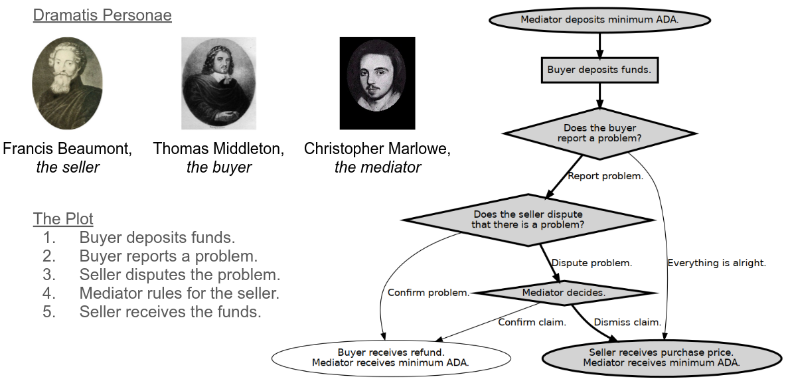
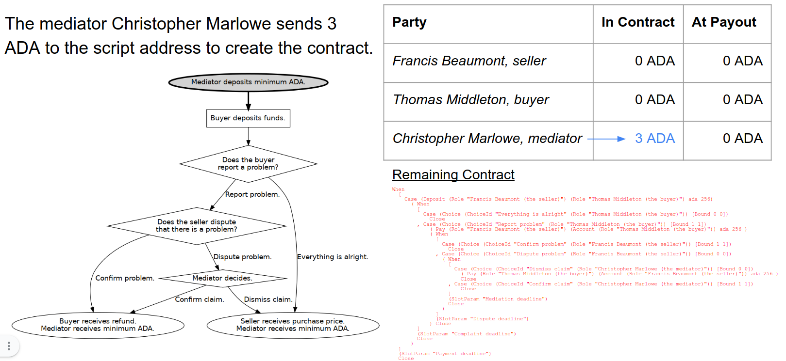
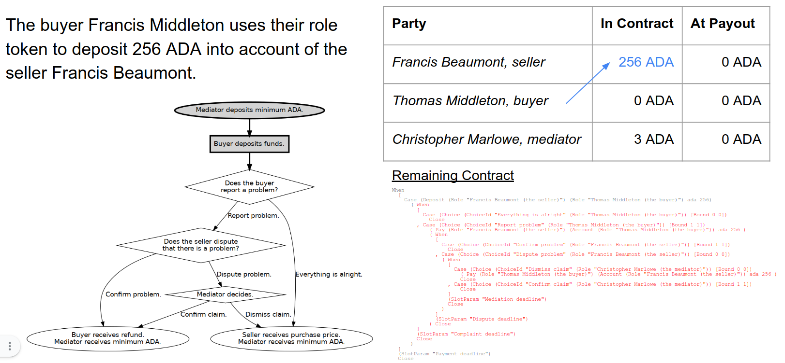
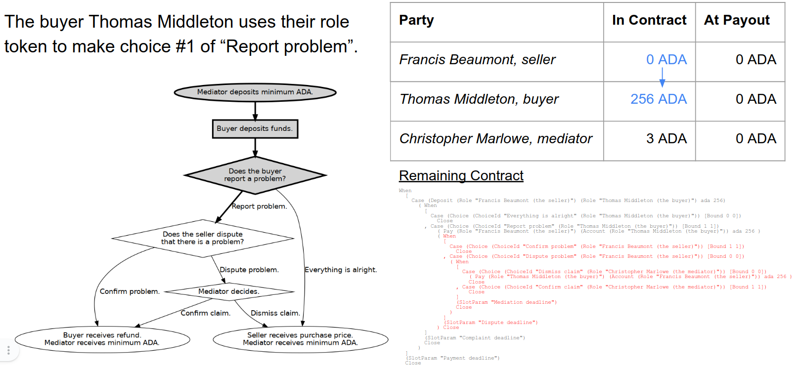
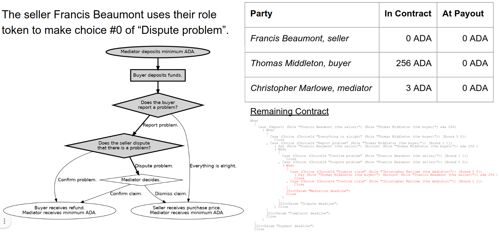
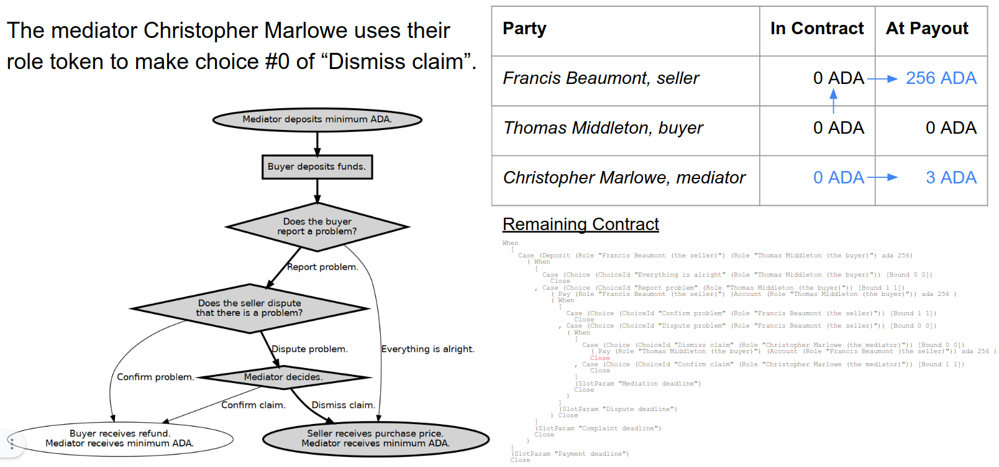

<div class="cell markdown">

# Running Marlowe Contracts without Blockchain Transactions

This lecture shows how to execute a contract using `marlowe-cli`, but
without submitting transactions on the blockchain. This lets one
simulate the operation of a contract.

</div>

<div class="cell markdown">

## Escrow Contract

-   A buyer wishes to purchase an item.
-   They deposit funds.
-   After they deposit funds they may report a problem with the
    purchase.
-   If they don’t report a problem, then the funds are released to the
    seller.
-   If they do report a problem, the seller may agree that there is a
    problem (in which case the buyer receives a refund) or they may
    dispute that there is a problem.
-   If the seller disputes the problem, then a mediator decides who
    receives the funds.
-   The contract has logic to handle situations where a party fails to
    act in a timely manner.

</div>

<div class="cell markdown">

### Flow Chart for Escrow Example


</div>

<div class="cell markdown">

### Escrow Example in Marlowe Format

``` haskell
When
  [
    Case (Deposit (Role "Francis Beaumont (the seller)") (Role "Thomas Middleton (the buyer)") ada 256)
      ( When
        [
          Case (Choice (ChoiceId "Everything is alright" (Role "Thomas Middleton (the buyer)")) [Bound 0 0])
            Close
        , Case (Choice (ChoiceId "Report problem" (Role "Thomas Middleton (the buyer)")) [Bound 1 1])
            ( Pay (Role "Francis Beaumont (the seller)") (Account (Role "Thomas Middleton (the buyer)")) ada 256 )
            ( When
              [
                Case (Choice (ChoiceId "Confirm problem" (Role "Francis Beaumont (the seller)")) [Bound 1 1])
                  Close
              , Case (Choice (ChoiceId "Dispute problem" (Role "Francis Beaumont (the seller)")) [Bound 0 0])
                ( When
                  [
                    Case (Choice (ChoiceId "Dismiss claim" (Role "Christopher Marlowe (the mediator)")) [Bound 0 0])
                      ( Pay (Role "Thomas Middleton (the buyer)") (Account (Role "Francis Beaumont (the seller)")) ada 256 )
                      Close
                  , Case (Choice (ChoiceId "Confirm claim" (Role "Christopher Marlowe (the mediator)")) [Bound 1 1])
                      Close
                  ]
                  (SlotParam "Mediation deadline")
                  Close
                )
              ]
              (SlotParam "Dispute deadline")
            ) Close
        ]
        (SlotParam "Complaint deadline")
        Close
      )
  ]
  (SlotParam "Payment deadline")
  Close
```

</div>

<div class="cell markdown">

### Escrow Example in Blockly


</div>

<div class="cell markdown">

### Four of the Eight Pathways through the Escrow Contract


</div>

<div class="cell markdown">

## Scenario



</div>

<div class="cell markdown">

## Select the Parameters for the Contract

First use some environment variables to store some values

</div>

<div class="cell code" execution_count="1">

``` bash
INITIAL_LOVELACE=3000000             # The creation transaction will deposit 3₳.
PRICE=256000000                      # The prices of the item is 256₳.

SELLER_ROLE=FB                       # Francis Beaumont (FB) is the seller.
BUYER_ROLE=TM                        # Thomas Middleton is the buyer.
MEDIATOR_ROLE=CM                     # Christopher Marlowe is the mediator.

NOW=$(($(date -u +%s)*1000))         # The current time in POSIX milliseconds.
HOUR=$((60*60*1000))                 # One hour, in POSIX milliseconds.
PAYMENT_DEADLINE=$((NOW+10*HOUR))    # The payment deadline, ten hours from now.
COMPLAINT_DEADLINE=$((NOW+12*HOUR))  # The complaint deadline, twelve hours from now.
DISPUTE_DEADLINE=$((NOW+14*HOUR))    # The dispute deadline, fourteen hours from now.
MEDIATION_DEADLINE=$((NOW+16*HOUR))  # The mediation deadline, sixteen hours from now.
```

</div>

<div class="cell markdown">

## Create the Contract and Its Initial State

Now create the contract:

-   The contract is stored in the JSON file `tx-1.contract`.
-   The initial state is stored in the JSON file `tx-1.state`.

</div>

<div class="cell code" execution_count="2">

``` bash
marlowe-cli template escrow --minimum-ada "$INITIAL_LOVELACE"          \
                            --price "$PRICE"                           \
                            --seller "Role=$SELLER_ROLE"               \
                            --buyer "Role=$BUYER_ROLE"                 \
                            --mediator "Role=$MEDIATOR_ROLE"           \
                            --payment-deadline "$PAYMENT_DEADLINE"     \
                            --complaint-deadline "$COMPLAINT_DEADLINE" \
                            --dispute-deadline "$DISPUTE_DEADLINE"     \
                            --mediation-deadline "$MEDIATION_DEADLINE" \
                            --out-contract-file tx-1.contract          \
                            --out-state-file    tx-1.state
```

</div>

<div class="cell markdown">

Examine the contract.

</div>

<div class="cell code" execution_count="3">

``` bash
json2yaml tx-1.contract
```

<div class="output stream stdout">

    timeout: 1656041997000
    timeout_continuation: close
    when:
    - case:
        deposits: 256000000
        into_account:
          role_token: FB
        of_token:
          currency_symbol: ''
          token_name: ''
        party:
          role_token: TM
      then:
        timeout: 1656049197000
        timeout_continuation: close
        when:
        - case:
            choose_between:
            - from: 0
              to: 0
            for_choice:
              choice_name: Everything is alright
              choice_owner:
                role_token: TM
          then: close
        - case:
            choose_between:
            - from: 1
              to: 1
            for_choice:
              choice_name: Report problem
              choice_owner:
                role_token: TM
          then:
            from_account:
              role_token: FB
            pay: 256000000
            then:
              timeout: 1656056397000
              timeout_continuation: close
              when:
              - case:
                  choose_between:
                  - from: 1
                    to: 1
                  for_choice:
                    choice_name: Confirm problem
                    choice_owner:
                      role_token: FB
                then: close
              - case:
                  choose_between:
                  - from: 0
                    to: 0
                  for_choice:
                    choice_name: Dispute problem
                    choice_owner:
                      role_token: FB
                then:
                  timeout: 1656063597000
                  timeout_continuation: close
                  when:
                  - case:
                      choose_between:
                      - from: 0
                        to: 0
                      for_choice:
                        choice_name: Dismiss claim
                        choice_owner:
                          role_token: CM
                    then:
                      from_account:
                        role_token: TM
                      pay: 256000000
                      then: close
                      to:
                        account:
                          role_token: FB
                      token:
                        currency_symbol: ''
                        token_name: ''
                  - case:
                      choose_between:
                      - from: 1
                        to: 1
                      for_choice:
                        choice_name: Confirm claim
                        choice_owner:
                          role_token: CM
                    then: close
            to:
              account:
                role_token: TM
            token:
              currency_symbol: ''
              token_name: ''

</div>

</div>

<div class="cell markdown">

Examine the initial state of the contract.

</div>

<div class="cell code" execution_count="4">

``` bash
json2yaml tx-1.state
```

<div class="output stream stdout">

    accounts:
    - - - role_token: CM
        - currency_symbol: ''
          token_name: ''
      - 3000000
    boundValues: []
    choices: []
    minTime: 1

</div>

</div>

<div class="cell markdown">

## Alternative: Download a Contract from Marlowe Playground

Instead of using the `marlowe-cli template` command, one can create a
contract in Marlowe Playground using Haskell, JavaScript, or Blockly.

1.  Design the contract in Marlowe Playground.
2.  Press the "Send to Simulator" button.
3.  Click "Download as JSON" to download the contract, saving it as
    `tx-1.contract`.

One also needs to create the initial state `tx-1.state`, which consists
of (a) account balances, (b) preexisting choices, (c) preexisting
assignments of variables, and the minimum POSIX time when the contract
can be started.

Simply create a JSON file with no choices or bound values and just one
account with the minimum ADA deposit for the role that creates the
contract (in this case, `$MEDIATOR_ROLE`).

</div>

<div class="cell code" execution_count="5">

``` bash
cat << EOI > tx-1.state
{
    "accounts": [
        [[{"role_token": "$MEDIATOR_ROLE"}, {"currency_symbol": "", "token_name": ""}], $INITIAL_LOVELACE]
    ],
    "choices": [],
    "boundValues": [],
    "minTime": 1
}
EOI
```

</div>

<div class="cell code" execution_count="6">

``` bash
json2yaml tx-1.state
```

<div class="output stream stdout">

    accounts:
    - - - role_token: CM
        - currency_symbol: ''
          token_name: ''
      - 3000000
    boundValues: []
    choices: []
    minTime: 1

</div>

</div>

<div class="cell markdown">

## Minting the Role Currency

Previously we created a wallet with a signing key file `my-wallet.skey`
and address file `my-wallet.address`. We also located the Cardano node
socket path at `$CARDANO_NODE_SOCKET_PATH`. Now we use these to mint
role tokens for use in the Marlowe contract.

</div>

<div class="cell code" execution_count="7">

``` bash
export CARDANO_TESTNET_MAGIC=1567
```

</div>

<div class="cell code" execution_count="8">

``` bash
export CARDANO_NODE_SOCKET_PATH=~/.local/share/Daedalus/marlowe_pioneers/cardano-node.socket
```

</div>

<div class="cell code" execution_count="9">

``` bash
marlowe-cli util mint --required-signer my-wallet.skey          \
                      --change-address $(cat my-wallet.address) \
                      --out-file /dev/null                      \
                      --submit 600                              \
                      "$MEDIATOR_ROLE" "$SELLER_ROLE" "$BUYER_ROLE"
```

<div class="output stream stdout">

    PolicyID "1c964b2b89b6c9d2a8e2d564a3541b3b355d0451825ad0481a63f86c"

</div>

</div>

<div class="cell markdown">

The policy ID will be used for the Marlowe roles currency.

</div>

<div class="cell code" execution_count="10">

``` bash
ROLES_CURRENCY=1c964b2b89b6c9d2a8e2d564a3541b3b355d0451825ad0481a63f86c
```

</div>

<div class="cell markdown">

We can query the address to see that the tokens have been minted. These
will also be visible in Daedalus.

</div>

<div class="cell code" execution_count="11">

``` bash
cardano-cli query utxo --testnet-magic "$CARDANO_TESTNET_MAGIC" --address $(cat my-wallet.address)
```

<div class="output stream stdout">

                               TxHash                                 TxIx        Amount
    --------------------------------------------------------------------------------------
    acd0cd4e234f7d34d1de79c5d640b88cb85d4244f6b60bf260e0a4ac73425429     0        1957654914 lovelace + TxOutDatumNone
    acd0cd4e234f7d34d1de79c5d640b88cb85d4244f6b60bf260e0a4ac73425429     1        10000000 lovelace + 1 1c964b2b89b6c9d2a8e2d564a3541b3b355d0451825ad0481a63f86c.434d + TxOutDatumNone
    acd0cd4e234f7d34d1de79c5d640b88cb85d4244f6b60bf260e0a4ac73425429     2        10000000 lovelace + 1 1c964b2b89b6c9d2a8e2d564a3541b3b355d0451825ad0481a63f86c.4642 + TxOutDatumNone
    acd0cd4e234f7d34d1de79c5d640b88cb85d4244f6b60bf260e0a4ac73425429     3        10000000 lovelace + 1 1c964b2b89b6c9d2a8e2d564a3541b3b355d0451825ad0481a63f86c.544d + TxOutDatumNone

</div>

</div>

<div class="cell markdown">

## Step 1: Mediator Creates Escrow Contract with Initial ADA



</div>

<div class="cell markdown">

## Initializing Step 1

Marlowe CLI uses `.marlowe` JSON files to store information about the
progression of a Marlowe contract. Now that we have created the
contract, we can bundle the contract, state, Plutus data, and network
information into such a file.

</div>

<div class="cell code" execution_count="12">

``` bash
marlowe-cli run initialize --roles-currency "$ROLES_CURRENCY"        \
                           --contract-file tx-1.contract             \
                           --state-file    tx-1.state                \
                           --out-file      tx-1.marlowe              \
                           --print-stats
```

<div class="output stream stdout">


    Validator size: 12611
    Base-validator cost: ExBudget {exBudgetCPU = ExCPU 24562825, exBudgetMemory = ExMemory 82600}

</div>

</div>

<div class="cell code" execution_count="13">

``` bash
ls -lrt tx-1.*
```

<div class="output stream stdout">

    -rw-rw-r-- 1 bbush bbush-upg  8286 Jun 23 11:41 tx-1.contract
    -rw-rw-r-- 1 bbush bbush-upg   173 Jun 23 11:44 tx-1.state
    -rw-rw-r-- 1 bbush bbush-upg 40759 Jun 23 11:48 tx-1.marlowe

</div>

</div>

<div class="cell code" execution_count="14">

``` bash
json2yaml tx-1.marlowe
```

<div class="output stream stdout">

    continuations: []
    contract:
      timeout: 1656041997000
      timeout_continuation: close
      when:
      - case:
          deposits: 256000000
          into_account:
            role_token: FB
          of_token:
            currency_symbol: ''
            token_name: ''
          party:
            role_token: TM
        then:
          timeout: 1656049197000
          timeout_continuation: close
          when:
          - case:
              choose_between:
              - from: 0
                to: 0
              for_choice:
                choice_name: Everything is alright
                choice_owner:
                  role_token: TM
            then: close
          - case:
              choose_between:
              - from: 1
                to: 1
              for_choice:
                choice_name: Report problem
                choice_owner:
                  role_token: TM
            then:
              from_account:
                role_token: FB
              pay: 256000000
              then:
                timeout: 1656056397000
                timeout_continuation: close
                when:
                - case:
                    choose_between:
                    - from: 1
                      to: 1
                    for_choice:
                      choice_name: Confirm problem
                      choice_owner:
                        role_token: FB
                  then: close
                - case:
                    choose_between:
                    - from: 0
                      to: 0
                    for_choice:
                      choice_name: Dispute problem
                      choice_owner:
                        role_token: FB
                  then:
                    timeout: 1656063597000
                    timeout_continuation: close
                    when:
                    - case:
                        choose_between:
                        - from: 0
                          to: 0
                        for_choice:
                          choice_name: Dismiss claim
                          choice_owner:
                            role_token: CM
                      then:
                        from_account:
                          role_token: TM
                        pay: 256000000
                        then: close
                        to:
                          account:
                            role_token: FB
                        token:
                          currency_symbol: ''
                          token_name: ''
                    - case:
                        choose_between:
                        - from: 1
                          to: 1
                        for_choice:
                          choice_name: Confirm claim
                          choice_owner:
                            role_token: CM
                      then: close
              to:
                account:
                  role_token: TM
              token:
                currency_symbol: ''
                token_name: ''
    inputs: []
    marloweValidator:
      address: addr_test1wzkcad2ay3lhr5x3xtjx5895grlfpjp3czf8vlnn9yraafsuy7nk8
      cost:
        exBudgetCPU: 24562825
        exBudgetMemory: 82600
      hash: ad8eb55d247f71d0d132e46a1cb440fe90c831c092767e732907dea6
      script:
        cborHex: 5931435931400100003323232332232323232323232323232323232323233223232323232323232323232323233223232323232323232323233223322323232323232332232323232323232323232323233223322323232323232323232323232323232323232323232323232323232323232323232323232332232323232323232323232323232323232323232232222323253353332223500a2235005232322350072323232323223353235001223500223223355335333573466e2000400c23404230044c0d0c8488c00400ccd542180400c00454cd4ccd5cd19b88001501008d0108c0113034332212233002004003501033550860100300113322122330010040033355086015002001350112222333308901004003002500623033122222300200622533335333333305308e0100200101000650a00150a001130341222220051303412222200313034122222004222221533500513333038004003002001153333335015221303b03c13501822225335333355307612001505e2209901004098011303d03e1333303c0080070060052221303c03d2221303c03d222221303e03f2221303c03d15335333573466e24005403822c0422804540384004cc8848cc00400c008d4d401c888888888801088d4008894ccd400884d4010894ccd400884cd54220040100044c1d926130764984c1cd2613073499401494ccccd40044c98d4cd5ce24810245310007609a0113263533573892010245320007609a0113263533573892010245360007609a012133500122326353357389210245340007909d0123263533573892010245330007809c0113263533573892010245350007609a0122322253355335533535010222233355306e120013503b503a23500122333573466e2400520000920109301004108c0113357389210242300008b0115335333034042500e35353550092200222001222002108c01133573892010242310008b01108b011533533355306a12001350375036253335335001222003200122135002223010001222213010003108d01500a1533533355306a12001350375036235001223350022533533303805900233355306912001502e50a101350102222222222333553073120012235002222350032233500225335333573466e3c04c00428804284044cd42c80401401c401c801d42ac040244240044cd5ce248101500008f012533533355306e120013506c50703232235001222533500121533533303f22333573466e20008004260042640400c02454cd54cd401884cc250040040084258044cc13001001c425804425804425404cc0ccdd48010089983f98410080b284000a805884800899ab9c49101520008f01500315333333500122153355335355335333553067120012253353500222233048500f00313350a0010020011001509f015009130774988854cd40044008884c1ed26222533500121533533303a048003333031032333031032501433355307012001502f253335335001222003200122150a6012222135002223350a9013355092010023350a90133550920100100350aa0150aa01150a40150103304904a33355307012001502f55033500915335533533034304433045008007012213308f01001002109101133047004500e109101109101109001108e011335738921024c310008d01108e0113357389201034c312b0008d01108c01222153355335355335333553068120012253353500222233049501000313350a101002001100150a001500a130794988854cd40044008884c1f526222533500121533533303b0490033330320333330320335015333553071120015030253335335001222003200122150a7012222135002223350aa013355093010023350aa0133550930100100350ab0150ab01150a50150113304a04b33355307112001503055034500a15335533533035304533046009008013213309001001002109201133048004500f109201109201109101108f0113357389201024c310008e01108f0113357389201034c312b0008e01222153355335355335333553068120012253353500222233049501000313350a101002001100150a001500a1307a4988854cd40044008884c1f926222533500121533533303b0490033330320333330320335015333553071120015030253335335001222003200122150a7012222135002223350aa013355093010023350aa0133550930100100350ab0150ab01150a50150113304a04b33355307112001503055034500a15335533533035304533046009008013213309001001002109201133048004500f109201109201109101108f0113357389201024c310008e01108f0113357389201034c312b0008e012222215335533535533533355306a12001225335350022223304b501200313350a301002001100150a201500c1307d4988854cd40044008884c2040526222533500121533533303d04b0033330340353330340355017333553073120015032253335335001222003200122150a9012222135002223350ac013355095010023350ac0133550950100100350ad0150ad01150a70150133304c04d33355307312001503255036500c1533553353303730473304800b00a01521330920100100210940113304a004501110940110940110930110910113357389201024c31000900110910113357389201034c312b0009001222153355335355335333553068120012253353500222233049501000313350a101002001100150a001500a1307c4988854cd40044008884c2000526222533500121533533303b0490033330320333330320335015333553071120015030253335335001222003200122150a7012222135002223350aa013355093010023350aa0133550930100100350ab0150ab01150a50150113304a04b33355307112001503055034500a15335533533035304533046009008013213309001001002109201133048004500f109201109201109101108f0113357389201024c310008e01108f0113357389201034c312b0008e01108b01108b01108b0113335530671200132335069335506108501001509b0150272350012223350022509f01233509e01335508701001002509f01001135005222222222200913550012200113553353500a223500222222222223333500b250800125080012508001233355306e1200150332533535001223304700200413508201001150810100b21533533355305d120012253353500322350012223500322335002208d0123500a2235001222350032233500220950123309201009001133509601002001100150950135004222222222200a130464988854cd40044008884c129261326353357389210249300007109501223500122233550810153353500f223500222222222223333500b25085012508501250850123335530731200150382533535001223304c00200413508701001150860100b21533533355306212001225335350032235001222350032233500220920123500a22350012223500322335002209a0123309701009001133509b010020011001509a0135009222222222200a1304c4988854cd40044008884c1412613263533573892010249300007609a0100313355305f12001233500121223001003225335350052222222222533533355306d120015032235001225335333573466e3c00803824804244044d420c0400c542080400884d420404d400488004541fc84c8488ccc00801801400cc0c80044c98d4cd5ce2490148000730970100a233500125335350032222222222533533355306b12001503025335333573466e3c03000423804234044d41fc004541f800c8423804423004420c044cd5ce249015300082012533533302b04c33509301335507c00833509301335507c00148009425005425004d400c8888888888ccd54c1ac4800540a88d400488d4004888008028420c044cd5ce2490154000820113233355305d12001501c235001223500222350012233509601335507f00233509601335507f001005509701509701001350022222004135001222200132323333573466e1cd55cea8012400046605a64646464646666ae68cdc39aab9d5004480008cccc1e0ccd5404ccd540700ec0f1d69aba150043335501303a75a6ae85400cccd5404c0c5d69aba15002375a6ae84d5d1280111931a99ab9c03d06e0920109101135744a00226ae8940044d55cf280089baa00135742a004604c6ae84d5d1280111931a99ab9c03706808c0108b01135573ca00226ea8014c018010cccd5cd19b8735573aa004900011991091980080180119191919191919191919191999ab9a3370e6aae754029200023333333333222222222212333333333300100b00a009008007006005004003002335032232323333573466e1cd55cea80124000466442466002006004603a6ae854008c064d5d09aba2500223263533573808a0ec134021320226aae7940044dd50009aba1500a33503201535742a012666aa02eeb94058d5d0a804199aa80bbae501635742a00e66a06403a6ae854018cd40c8cd54080079d69aba150053232323333573466e1cd55cea801240004664424660020060046464646666ae68cdc39aab9d5002480008cc8848cc00400c008cd408dd69aba150023024357426ae8940088c98d4cd5ce02483d04f0084e8089aab9e5001137540026ae854008c8c8c8cccd5cd19b8735573aa004900011991091980080180119a811bad35742a00460486ae84d5d1280111931a99ab9c04907a09e0109d01135573ca00226ea8004d5d09aba2500223263533573808a0ec134021320226aae7940044dd50009aba1500433503275c6ae85400ccd40c8cd54081d710009aba15002301a357426ae8940088c98d4cd5ce02083904b0084a8089aba25001135744a00226ae8940044d5d1280089aba25001135744a00226ae8940044d5d1280089aab9e5001137540026ae854008c8c8c8cccd5cd19b875001480188c848888c010014c054d5d09aab9e500323333573466e1d400920042321222230020053017357426aae7940108cccd5cd19b875003480088c848888c004014c04cd5d09aab9e500523333573466e1d40112000232122223003005375c6ae84d55cf280311931a99ab9c03c06d091010900108f0108e0108d01135573aa00226ea8004d5d09aba2500223263533573806a0cc114021120220ca264c6a66ae71241035054350006508901135573ca00226ea8004d407c8c8c8c8cccd5cd19b875001480088cc88488cc00401000cc0bcd5d0a8019bae357426ae89400c8cccd5cd19b875002480008c8488c00800cc0c0d5d09aab9e50052326353357380680ca112021100210e0226aae7540084d55cf280089baa00123232323333573466e1cd55cea801a40004666444246660020080060046464646666ae68cdc39aab9d5002480008cc19cc04cd5d0a80119a8060091aba135744a004464c6a66ae700d419822804224044d55cf280089baa00135742a006666aa00eeb94018d5d0a80119a8043ae357426ae8940088c98d4cd5ce018831043008428089aba25001135573ca00226ea80044cd54005d73ad112232230023756002640026aa1040244646666aae7c00894210048cd420c04cd541b0c018d55cea80118029aab9e50023004357440060c026ae84004488c8c8cccd5cd19b875001480008d4188c014d5d09aab9e500323333573466e1d400920022506223263533573805e0c010802106021040226aae7540044dd5000919191999ab9a3370e6aae7540092000233221233001003002300535742a0046eb4d5d09aba250022326353357380580ba102021000226aae7940044dd50009191999ab9a3370e6aae75400520002375c6ae84d55cf280111931a99ab9c02a05b07f07e1375400224464646666ae68cdc3a800a40084244400246666ae68cdc3a8012400446424446006008600c6ae84d55cf280211999ab9a3370ea00690001091100111931a99ab9c02d05e08201081010800107f135573aa00226ea80048c8cccd5cd19b8750014800881ac8cccd5cd19b8750024800081ac8c98d4cd5ce01482d03f03e83e09aab9d3754002464646464646666ae68cdc3a800a401842444444400646666ae68cdc3a8012401442444444400846666ae68cdc3a801a40104664424444444660020120106eb8d5d0a8029bad357426ae8940148cccd5cd19b875004480188cc8848888888cc008024020dd71aba15007375c6ae84d5d1280391999ab9a3370ea00a900211991091111111980300480418061aba15009375c6ae84d5d1280491999ab9a3370ea00c900111909111111180380418069aba135573ca01646666ae68cdc3a803a400046424444444600a010601c6ae84d55cf280611931a99ab9c0310620860108501084010830108201081010800107f135573aa00826aae79400c4d55cf280109aab9e5001137540024646464646666ae68cdc3a800a4004466644424466600200a0080066eb4d5d0a8021bad35742a0066eb4d5d09aba2500323333573466e1d4009200023212230020033008357426aae7940188c98d4cd5ce01502d83f83f03e89aab9d5003135744a00226aae7940044dd5000919191999ab9a3370ea00290011182d9bae357426aae79400c8cccd5cd19b875002480008c8488c00800cdd71aba135573ca008464c6a66ae7009c1601f01ec1e84d55cea80089baa0011122232323333573466e1cd55cea80124000466aa0c6600c6ae854008c014d5d09aba2500223263533573804e0b00f80f626aae7940044dd5000899a8212800a83a0980080111119aa98208900091a8009119aa83000119aa98220900091a8009119aa831801199a8009198052400000244660160040024660140029000000998068010009119b80002001112350012200122350012222222222533533355304812001500d235001225335333573466ebc00403c1b41b04d417800c5417400884d4170d400488008541684cd40f0894cd40088400c400541348488c00800c8888488cccc00401801401000c4888880048488c00800c888ccd54c0e448004d401940148d400488ccd54c0f048004d402540208d400488ccd40048cc0292000001223300b00200123300a00148000004cc01000800488cd54c0d8480048d400488cd54154008ccd40048cd54c0e8480048d400488cd54164008d540ec00400488ccd5540d81680080048cd54c0e8480048d400488cd54164008d540e8004004ccd5540c4154008004448cc004894cd40084004416015c48cd40d488ccd400c88008008004d400488004c8004d5419c88c8c8c8c8c8c8c8c8c8c8c8c8c8cccd5cd19b875001480288cc884888888cc01802001cc04cd5d0a80198081aba135744a00646666ae68cdc3a801240104666444244444466600601201000e602c6ae854018cd4c05448004050d5d0a80298089aba135744a00a46666ae68cdc3a801a400c4666444244444466600201201000e66a0284646464646666ae68cdc3a800a4004466442446600200800660326ae85400cdd71aba135744a00646666ae68cdc3a80124000466442446600400800660346ae854014c064d5d09aba250052326353357380540b60fe0fc0fa26aae75400c4d55cf280109aab9e5001137540026ae854024dd69aba150083012357426ae8940208cccd5cd19b875004480108ccc8884888888ccc01002402001cc058d5d0a80618099aba1500b3013357426ae89402c8cccd5cd19b875005480088ccccc888884888888ccccc00802c02802402001cc08cd5d0a8089919191999ab9a3370ea00290011183918139aba135573ca00646666ae68cdc3a80124000464244600400660506ae84d55cf280211931a99ab9c02a05b07f07e07d135573aa00226ea8004d5d0a80818121aba1500f33530181200101735742a01c60286ae84d5d1280711999ab9a3370ea00c9000103711931a99ab9c02605707b07a079078077076075135573aa01826aae79402c4d5d1280089aab9e5009135744a00226aae79401c4d5d1280089aab9e5005135744a00226ae8940044d5d1280089aab9e50011375400246464646464646666ae68cdc3a800a40084642444600200860146ae84d55cf280391999ab9a3370ea004900111991091119801802802180b1aba1500433500a232323333573466e1cd55cea801240004664424660020060046eb4d5d0a8011bad357426ae8940088c98d4cd5ce00e82703903889aab9e5001137540026ae84d5d1280211999ab9a3370ea006900011999911109111999801003803002802180c1aba15008301835742a00e60326ae854018cd4c03448004030d5d09aba250062326353357380340960de0dc0da0d826aae7540144d55cf280209aba25001135744a00226aae7940044dd50008919118011bac001320013550662233335573e0024a0ce466a0cc60086ae84008c00cd5d1001021990009aa832111919191919191919191999ab9a3370ea002900a109111111111100491999ab9a3370ea0049009109111111111100311999ab9a3370ea0069008119910911111111111980280680619a9807890008071aba15005335300f1200100e357426ae8940148cccd5cd19b875004480388cc88488888888888cc008034030cd4c0404800403cd5d0a80399a9808090008079aba135744a00e46666ae68cdc3a802a4018466442444444444446600201a01866a6022240020206ae854024cd4c04448004040d5d09aba2500923333573466e1d4019200a233221222222222223300300d00c33530121200101135742a01666a6024240020226ae84d5d1280591999ab9a3370ea00e9004119910911111111111980200680619a9809890008091aba1500d335301312001012357426ae8940348cccd5cd19b875008480188c8488888888888c028030c078d5d09aab9e501123333573466e1d40252004232122222222222300800c3014357426aae7940488cccd5cd19b87500a480088cc88488888888888cc01c034030c054d5d0a808980a9aba135744a02246666ae68cdc3a805a4000466442444444444446601601a018602c6ae85404cc058d5d09aba250132326353357380480aa0f20f00ee0ec0ea0e80e60e40e20e00de0dc26aae7540204d55cf280389aab9e5006135573ca00a26aae7940104d55cf280189aab9e5002135573ca00226ea8004c8004d5418c88488c8c8c8c8c8c8c8c8c8cccd5cd19b875001480588ccc8884888888888888ccc02403c038034c030d5d0a80219a9807090008061aba15003335300e1200100c357426ae89400c8cccd5cd19b875002480508c84888888888888c004034c040d5d09aab9e500b23333573466e1d400d20122122222222222200323333573466e1d401120102122222222222200223333573466e1d4015200e2321222222222222300a00d301c357426aae7940388cccd5cd19b875006480308cc884888888888888cc01c038034cd4c04c48004044d5d0a80519a9809890008089aba135744a01446666ae68cdc3a803a40144664424444444444446600c01c01a66a6028240020246ae854030cd4c05048004048d5d09aba2500c23333573466e1d402120082332212222222222223300400e00d33530151200101335742a01c66a602a240020266ae84d5d1280711999ab9a3370ea01290031199109111111111111980600700699a980b0900080a1aba15010335301612001014357426ae8940408cccd5cd19b87500a480108c84888888888888c014034cd4c05c48004054d5d09aab9e501323333573466e1d402d20022321222222222222300800d375a6ae84d55cf280a11999ab9a3370ea01890001199109111111111111980580700698121aba150143025357426ae8940508c98d4cd5ce01302b83d83d03c83c03b83b03a83a03983903883803789aab9d5008135744a00226aae7940184d55cf280289aab9e5004135573ca00626aae7940084d55cf280089baa0012323333573466e1cd55cea800a400046eb8d5d09aab9e500223263533573801e0800c80c626ea80048d400488cdd2a400066ae80d40088888cdd2a400066ae80dd3180980219aba0374c602800666ae80dd3180a80119aba037500026ec419ccd5d0182a0009bb1063221233001003002225335333573466e3cd400888008d4004880081381344ccd5cd19b873500222001350012200104e04d104d223500222350032232335005233500425335333573466e3c00800415014c5400c414c814c8cd4010814c94cd4ccd5cd19b8f002001054053150031053153350032153350022133500223350022335002233500223305300200120562335002205623305300200122205622233500420562225335333573466e1c01800c16416054cd4ccd5cd19b8700500205905813300f0040011058105810511533500121051105122333573466e1c00800413012c88cd54c0a0480048d400488cd5411c008cd54c0ac480048d400488cd54128008cdc1004000800800a400246464646464646666ae68cdc3a800a40084244400246666ae68cdc3a801240044664424446600600a00860146ae854010dd69aba135744a00846666ae68cdc3a801a40004666644442444666600400e00c00a00860186ae854020c030d5d0a80398069aba15006375a6ae84d5d1280311931a99ab9c00e03f063062061060135573aa00a26aae7940104d5d1280089aba25001135573ca00226ea80048c8c8cccd5cd19b8735573aa00490001199109198008018011bae35742a004600a6ae84d5d1280111931a99ab9c00703805c05b135573ca00226ea80048c8c8cccd5cd19b875001480088c8488c00400cdd71aba135573ca00646666ae68cdc3a8012400046424460040066eb8d5d09aab9e500423263533573800e0700b80b60b426aae7540044dd5000919191999ab9a3370e6aae7540092000233053375c6ae854008dd71aba135744a004464c6a66ae700140d81681644d55cf280089baa00149103505431003200135505522533500115005221350022233574066ec0d400888cdd2a400066ae80c160008cd5d0182a0009bb105c3750002600c006640026aa0a844a66a0022a0084426a0044466ae80cdd8182a0011ba800130060033200135505322533500115003221350022233574066ec0c148008dd4000980300189bb205123263533573892010249310002d05123263533573892010249310002c0503200135504f22222222533533333301504300600500450555055222221533500813332221222233333001007006005009008533500c104910053335530221200150593500e0040073350190060032215333333500322101c101a222101d222101d22222101f22215333533330150100070050032221333333301505101300200100733355302a12001506133355302a120015061533500315062222213503612233002122222333300400b00a0090080013501600c00f33502100e00b112222003101d11222200412333355301a120015002225333335002133504e12222200500110012222133505212222233330030090080070060052222213350531222223333300200a0090080070060062221335051122222333001008007006004001504d13350192223003300200120013200135504c22222533500111222001232232133500422300300222300300223350062225335333300d00b00a003004221330080020011333300c00b00a00900525335333300b009008001002221330060020011333300a0090080070032233500522233500622012225335333573466e3c0100041181144ccc04c01c01800c40488cd401088ccc0440140100048804088894ccd4008884ccd400c894cd4cc0e801000854cd4ccd54c07848004d407140808d4004894cd4ccd5cd19b8800600204204313300c006001104200113300b00e350072222333303c00433335501a03e008007003002001100a100a222200c20092222133350052200c2222323233500a233500725335333573466e3c00800412011c5400c404880488cd401c804894cd4ccd5cd19b8f0020010480471500310121335008233500525335333573466e3c00800411c1185400c404480448cd4014804494cd4ccd5cd19b8f002001047046150031011153353303b00600215335333573466e1c014ccc0dc03002c00411010c4cc03d4cd4ccd5cd19b890054800010c11040484488cccc00401401801001cd402c8888cccc100cccc07003002802401000c00800440384038802c4ccd400488020888802894cd4ccc0c40140100044cc02002c010401c88ccd5cd19b890020010390382212233002004003122001222122233300300600500412220021220021222200212233355300b120015042001002320013550422222322225333553333335003221333301b533533302d0080070021020112222200501e00700113500522225335300e00421350012235002223333022027302433302600230460020013333038003008007006045101e2221333301c02101f008533533302e0090080031002100122323221333301e300250090213500a2222333303800400333335501603c0095007500d0010013200135504d225335001102322135002225335333573466e3c0080241000fc4c8488888ccc00403c01c019401c4c01800c4ccc0b002001c004888c88c8c8c8c8854cd4ccd5cd19b895005480001041004cccc08cc8488888cccc00c04003c038019401409803c0044cccc08d4cd4ccd5cd19b8850045005041040133221222223333300201101000f007006500450051028355002220023500f2222333303d3550062200100300200100113500622335503a302533302700a009335051335503a002335051335503a001500450525052335009233330160013304d00300250055004250041333301300700533702a008a0026a01844440082a66a666ae68cdc4a801a80081e81e0a8018a800899981780580500089a804111119981a0038028021110a99a999ab9a337106a01244002004074072203a2a66a666ae68cdc48011a8049100101d01c8999980e01080f80400088911001889100089991091199998010058020018048039a8048011a8048009111099999980601d805001000a99999a802099a82580200308031111099a82780400511111099a828004805911099a827003804a99a80188029099a82600080309a8009111001099119801000a820990009aa820911299a80108009109980280099a821801001990009aa82011299a8008a80f9109a801111a801111a80091299a999ab9a3371200a900001b01b89a81419aa81819aa81800219a82399aa81800119a82399aa818000802a8242824003898050039111299a999ab9a33712004900001801788008999980280200199b80333026004003001002001223225335333573466e24005200002f02e1230030011333550052235002223500322335004233500325335333573466e3c0080040dc0d84cc0b801400c40d880d88cd400c80d894cd4ccd5cd19b8f00200103703613302e0050031036335502800400300132001355040225335001150402213500222350022232335003233500c25335333573466e3c0080040e00dc5400c4cd4120cd540c401c018c02c0208cd4120cd540c401c018c02c0208cd40308cd4120cd540c401c018c02c02094cd4ccd5cd19b8f0020010380371500313350483355031007006300b008153353302c00100910051335045335502e0040033008005112222333355005004220010013500f1223300233550290050040011122223355300a12001235001223355029002333500120012233008002001200133355500500400200111122233355300412001503b335530081200123500122335502700235500900133355300412001223500222533533355300d120013500b500f235001223300a0020050061003133503f004003503c001335530081200123500122323355028003300100532001355041225335001135500a003221350022253353300c002008112223300200a004130060030023200135503a22112225335001100222133005002333553007120010050040011121222300300411212223001004123350042233350032200200200135001220013200135503622112253350011503822133503930040023355300612001004001320013550352211222533500113500322001221333500522002300400233355300712001005004001122123300100300211233001225335002102310010201233500150305031122200222221222333300100700600500412200221223001003222123330010040030021222220042326353357389210252300000702b2326353357389201024f300000602a2326353357389201024f30000050292326353357389201024f30000040282326353357389201024f30000030272326353357389201024f300000202612001221233001003002121223002003112200121223001003350022200135001220023555501f12223300322253333333333350012215335333007005004002133300700500400110122321300135004222200332001355025225335001101322135002225335330120020071018130060031010215335333006004003001101110122215335333007005004002101313330070050040011011221333573466e1cccc018014010008ccc01801401000404c048884ccd5cd19b88333006005004002333006005004001012013221333573466e24ccc018014010008ccc01801401000404804c884ccd5cd19b89333006005004002333006005004001013012221333573466e20ccc018014010008ccc01801401000404c0488894cccccccccccd4004884cdc01998030028020011998030028020009109a8021111199806803002802119098009a8021111001990009aa8129119a800a4000446a00444a66a6602400400e20022600c0064442a66a66601000c00a006266600e00c00a004266600e00c00a002420024644646464642a66a666ae68cdc3a8032400003002e290000a99a999ab9a3370ea008900000c00b8a40002a66a666ae68cdc42801a80080c00b8a8010a99a999ab9a33712a006a00202e030266e014008cdc1180aa803180aa8020a99a999ab9a3370e66e15400920044800006005c540084cdc0280119b823015500630155004130155003133708a008a004266e08c04ccdc2a801a800a4008266600e00c00a002266600a00800600244266e08ccc018014010008ccc01801401000484cdc080999980280200180091099b8133300600500400233300600500400113500322001135003220022321300135004222200232001355025223350014800088d4008894cd4ccd5cd19b8f0020070180171001130060032232230020013200135501f223350014800088d400888d400888cd40088cd402c94cd4ccd5cd19b8f002001016015153353300d00300b10051300a0071300a0072300a007233500b2300a00725335333573466e3c00800405805454cd4cc03400c02c40144c02801c4c02801c88d400888d400c894cd4ccd5cd19b8f00400200f00e13300b003001100e22221233330010050040030021122123300100300222350022235003225335333573466e3c01000803002c4cc01c00c004402c88cd40088cd40088cc01400800480208cd400880208cc01400800488ccd5cd19b8f00200100600525335333573466e2400520000030041480084cd4ccd5cd19b870014800001000d20004800494cd4ccd5cd19b880014800000800c40044cdc0802000891001091000a40006a004440026a002440046aaaa0202444660064a666666a00244266e95200a335740601400466ae80c014004dd880a099ba548000dd8809111099ba548010cd5d0180580199aba03006002335740600c0026ec40548884cdd2a401066ae80c03c00ccd5d019a98060900080580119aba03006001376202a44444266e952002335740602600a66ae80cd40108cdd2a400066ae80c050004dd880c119ba548008cd5d0180a0009bb1018335740601e00666ae80cd4c03848004034008cd5d018040009bb101722213374a900319aba0374e600a00666ae80dd400119aba03006001376202a4a66a00226ec4048884cd5d019a8011119ba548000cd5d0180580119aba03007001376202c4466e952002335740601600466ae80dd48009bb1016300400112222220052122300100323335001223374a900119aba030090023357406e9cc02c004dd8807111119ba548000cd5d0180600219aba0300c003335740601000466ae80cd4c01c48004018004dd8808119ba548010cd5d018018009bb100d3200135500b2253333333333350012213374a900019aba0300400233574060080026ec403884cdd2a400c66ae80c020004dd8806899ba548050dd88061099ba548010cd5d018018009bb100d2213374a900119aba0300400233574060080026ec40384cdd2a40246ec4030884cdd2a402066ae80cd4c01448004010008cd5d019a9802890008020009bb100e2213374a900419aba033530051200100400233574066a600a240020080026ec4038884cdd2a401466ae80cd4c01448004010008cd5d019a9802890008020009bb100e2213374a900719aba033530051200100400233574066a600a240020080026ec4038884cdd2a401866ae80cd4c01448004010008cd5d019a9802890008020009bb100e3200135500a22122533333333333350012213374a900319aba033530061200100400233574066a600c240020080026ec403c884cdd2a400066ae80c02c008cd5d018038009bb100f213374a900719aba03009001376201c444266e952016335740600a00666ae80cd4c01c48004014008cd5d019a9803890008028009bb1010213374a900119aba037500026ec4038884cdd2a401866ae80cd4c01848004010008cd5d019a9803090008020009bb100f2213374a900519aba033530061200100400233574066a600c240020080026ec403c84cdd2a400866ae80cd4c0144800400c004dd880711099ba548020cd5d019a98030900080200119aba0335300612001004001376201e266e952012376201a266e952010376201a4266e95201433574060100026ec40388d400488cdd2a400066ae80dd480119aba037520026ec402c8848cc00400c0088cdd2a400066ae80dd48009bb1007235001223374a900019aba0375200466ae80c010004dd8804119a800919ba548000cd5d01ba9001376200c466e9520023357406ea4004dd8803190009aa80211299a80089bb10052213357406a0044466e9520003357406ea0008cd5d01ba80013762012600800222440042442446600200800693089191800800911980198010010008888919918008009119091a99091980091a80191180100191a801911800801891a98018021a802000800980100100099a8911980124411cefc34c639cac28ff2acbccba09b05d9e6bc18fbb5d76238485e582d20048811c1c964b2b89b6c9d2a8e2d564a3541b3b355d0451825ad0481a63f86c0022123300100300220011
        description: ''
        type: PlutusScriptV1
      size: 12611
    payments: []
    range: null
    roles:
      unCurrencySymbol: 1c964b2b89b6c9d2a8e2d564a3541b3b355d0451825ad0481a63f86c
    rolesValidator:
      address: addr_test1wrhuxnrrnjkz3le2e0xt5zdstk0xhsv0hdwhvguyshjc95sajj7wh
      cost:
        exBudgetCPU: 4317185
        exBudgetMemory: 14600
      hash: efc34c639cac28ff2acbccba09b05d9e6bc18fbb5d76238485e582d2
      script:
        cborHex: 5909a55909a20100003323233223232332232323322323232323232323232323232323232323232322222323253353232323232333573466e24c8c010004c8d40048888888888ccd54c0b448004cd40c088cd54c0b8480048d400488cd540b4008cd54c0c4480048d400488cd540c0008ccd40048cc0f52000001223303e00200123303d00148000004cd54c0b8480048d400488cd540b4008ccd40048cd54c0c8480048d400488cd540c4008d540d000400488ccd5540b80e00080048cd54c0c8480048d400488cd540c4008d540cc004004ccd5540a40cc00800540bc8d400488d4004888008028d40048800920000270283333573466e1cd55cea8032400046644246600200600464646464646464646464646666ae68cdc39aab9d500a480008cccccccccc888888888848cccccccccc00402c02802402001c01801401000c008cd40608c8c8cccd5cd19b8735573aa004900011991091980080180118109aba15002301d357426ae8940088c98d4cd5ce01581501481409aab9e5001137540026ae854028cd4060064d5d0a804999aa80dbae501a35742a010666aa036eb94068d5d0a80399a80c0109aba15006335018335502402275a6ae854014c8c8c8cccd5cd19b8735573aa00490001199109198008018011919191999ab9a3370e6aae754009200023322123300100300233502775a6ae854008c0a0d5d09aba2500223263533573805e05c05a05826aae7940044dd50009aba150023232323333573466e1cd55cea8012400046644246600200600466a04eeb4d5d0a80118141aba135744a004464c6a66ae700bc0b80b40b04d55cf280089baa001357426ae8940088c98d4cd5ce01581501481409aab9e5001137540026ae854010cd4061d71aba15003335018335502475c40026ae854008c078d5d09aba2500223263533573804e04c04a04826ae8940044d5d1280089aba25001135744a00226ae8940044d5d1280089aba25001135744a00226aae7940044dd50009aba150063232323333573466e1d400520062321222230040053019357426aae79400c8cccd5cd19b875002480108c848888c008014c06cd5d09aab9e500423333573466e1d400d20022321222230010053017357426aae7940148cccd5cd19b875004480008c848888c00c014dd71aba135573ca00c464c6a66ae7008808408007c0780740704d55cea80089baa001357426ae8940188c98d4cd5ce00d80d00c80c1999ab9a3370e6aae74dd5003a40004032464c6a66ae7006806406005cc8004d5409c88cd400520002235002225335333573466e3c0080380ac0a84c01c0044c01800cc8004d5409888cd400520002235002225335333573466e3c00801c0a80a440044c01800cdd7002880a89931a99ab9c4910350543500015014135573ca00226ea800448c88c008dd6000990009aa80f911999aab9f0012501c233501b30043574200460066ae880080448c8c8c8cccd5cd19b8735573aa00690001199911091998008020018011919191999ab9a3370e6aae7540092000233221233001003002301335742a00466a0180246ae84d5d1280111931a99ab9c017016015014135573ca00226ea8004d5d0a801999aa803bae500635742a00466a010eb8d5d09aba2500223263533573802602402202026ae8940044d55cf280089baa0011335500175ceb44488c88c008dd5800990009aa80e91191999aab9f0022501b233501a3355014300635573aa004600a6aae794008c010d5d100180809aba100112232323333573466e1d4005200023212230020033005357426aae79400c8cccd5cd19b8750024800884880048c98d4cd5ce00880800780700689aab9d500113754002464646666ae68cdc39aab9d5002480008cc8848cc00400c008c014d5d0a8011bad357426ae8940088c98d4cd5ce00700680600589aab9e5001137540024646666ae68cdc39aab9d5001480008dd71aba135573ca004464c6a66ae7003002c0280244dd500089119191999ab9a3370ea00290021091100091999ab9a3370ea00490011190911180180218031aba135573ca00846666ae68cdc3a801a400042444004464c6a66ae7003c03803403002c0284d55cea80089baa0012323333573466e1d40052002201723333573466e1d40092000201723263533573801601401201000e26aae74dd5000919191919191999ab9a3370ea002900610911111100191999ab9a3370ea004900510911111100211999ab9a3370ea00690041199109111111198008048041bae35742a00a6eb4d5d09aba2500523333573466e1d40112006233221222222233002009008375c6ae85401cdd71aba135744a00e46666ae68cdc3a802a400846644244444446600c01201060186ae854024dd71aba135744a01246666ae68cdc3a8032400446424444444600e010601a6ae84d55cf280591999ab9a3370ea00e900011909111111180280418071aba135573ca018464c6a66ae7004c04804404003c03803403002c0284d55cea80209aab9e5003135573ca00426aae7940044dd50009191919191999ab9a3370ea002900111999110911998008028020019bad35742a0086eb4d5d0a8019bad357426ae89400c8cccd5cd19b875002480008c8488c00800cc020d5d09aab9e500623263533573801801601401201026aae75400c4d5d1280089aab9e500113754002464646666ae68cdc3a800a400446424460020066eb8d5d09aab9e500323333573466e1d400920002321223002003375c6ae84d55cf280211931a99ab9c009008007006005135573aa00226ea800444888c8c8cccd5cd19b8735573aa0049000119aa80598031aba150023005357426ae8940088c98d4cd5ce00480400380309aab9e5001137540029309000a481035054310011122233355300512001500a335530081200123500122335500700235500a00133355300512001223500222533533355300d1200132335011223335003220020020013500122001123300122533500210161001013235001223300a0020050061003133500e004003500b001335530081200123500122323355008003300100532001355014225335001135500b003221350022253353300c002008112223300200a00413006003002112212330010030023200135500c221122253350011002221330050023335530071200100500400111212223003004112122230010043200135500922112253350011500722133500830040023355300612001004001320013550082211222533500113500322001221333500522002300400233355300712001005004001112200212212233001004003122123300100300222333573466e3c00800401000c48800848800488cdc000100088919180080091198019801001000a4411c1c964b2b89b6c9d2a8e2d564a3541b3b355d0451825ad0481a63f86c0001
        description: ''
        type: PlutusScriptV1
      size: 2469
    slotConfig:
      scSlotLength: 1000
      scSlotZeroTime: 1649949631000
    state:
      accounts:
      - - - role_token: CM
          - currency_symbol: ''
            token_name: ''
        - 3000000
      boundValues: []
      choices: []
      minTime: 1

</div>

</div>

<div class="cell markdown">

## Step 2: Buyer Deposits Funds into Seller’s Account



</div>

<div class="cell markdown">

## Transition from Step 1 to Step 2

</div>

<div class="cell code" execution_count="15">

``` bash
marlowe-cli run prepare --marlowe-file tx-1.marlowe           \
                        --deposit-account "Role=$SELLER_ROLE" \
                        --deposit-party "Role=$BUYER_ROLE"    \
                        --deposit-amount "$PRICE"             \
                        --invalid-before "$NOW"               \
                        --invalid-hereafter "$((NOW+9*HOUR))" \
                        --out-file tx-2.marlowe               \
                        --print-stats
```

<div class="output stream stdout">


    Datum size: 463

</div>

</div>

<div class="cell code" execution_count="16">

``` bash
ls -lrt tx-?.*
```

<div class="output stream stdout">

    -rw-rw-r-- 1 bbush bbush-upg  8286 Jun 23 11:41 tx-1.contract
    -rw-rw-r-- 1 bbush bbush-upg   173 Jun 23 11:44 tx-1.state
    -rw-rw-r-- 1 bbush bbush-upg 40759 Jun 23 11:48 tx-1.marlowe
    -rw-rw-r-- 1 bbush bbush-upg 39100 Jun 23 11:52 tx-2.marlowe

</div>

</div>

<div class="cell markdown">

Examine the input that is being applied to the contract.

</div>

<div class="cell code" execution_count="17">

``` bash
jq '.inputs' tx-2.marlowe | json2yaml
```

<div class="output stream stdout">

    - input_from_party:
        role_token: TM
      into_account:
        role_token: FB
      of_token:
        currency_symbol: ''
        token_name: ''
      that_deposits: 256000000

</div>

</div>

<div class="cell markdown">

Examine the new state of the contract.

</div>

<div class="cell code" execution_count="18">

``` bash
jq '.state' tx-2.marlowe | json2yaml
```

<div class="output stream stdout">

    accounts:
    - - - role_token: CM
        - currency_symbol: ''
          token_name: ''
      - 3000000
    - - - role_token: FB
        - currency_symbol: ''
          token_name: ''
      - 256000000
    boundValues: []
    choices: []
    minTime: 1656005997000

</div>

</div>

<div class="cell markdown">

Examine the contract that remains to be executed.

</div>

<div class="cell code" execution_count="19">

``` bash
jq '.contract' tx-2.marlowe | json2yaml
```

<div class="output stream stdout">

    timeout: 1656049197000
    timeout_continuation: close
    when:
    - case:
        choose_between:
        - from: 0
          to: 0
        for_choice:
          choice_name: Everything is alright
          choice_owner:
            role_token: TM
      then: close
    - case:
        choose_between:
        - from: 1
          to: 1
        for_choice:
          choice_name: Report problem
          choice_owner:
            role_token: TM
      then:
        from_account:
          role_token: FB
        pay: 256000000
        then:
          timeout: 1656056397000
          timeout_continuation: close
          when:
          - case:
              choose_between:
              - from: 1
                to: 1
              for_choice:
                choice_name: Confirm problem
                choice_owner:
                  role_token: FB
            then: close
          - case:
              choose_between:
              - from: 0
                to: 0
              for_choice:
                choice_name: Dispute problem
                choice_owner:
                  role_token: FB
            then:
              timeout: 1656063597000
              timeout_continuation: close
              when:
              - case:
                  choose_between:
                  - from: 0
                    to: 0
                  for_choice:
                    choice_name: Dismiss claim
                    choice_owner:
                      role_token: CM
                then:
                  from_account:
                    role_token: TM
                  pay: 256000000
                  then: close
                  to:
                    account:
                      role_token: FB
                  token:
                    currency_symbol: ''
                    token_name: ''
              - case:
                  choose_between:
                  - from: 1
                    to: 1
                  for_choice:
                    choice_name: Confirm claim
                    choice_owner:
                      role_token: CM
                then: close
        to:
          account:
            role_token: TM
        token:
          currency_symbol: ''
          token_name: ''

</div>

</div>

<div class="cell markdown">

## Step 3: The Buyer Reports That There is a Problem



</div>

<div class="cell markdown">

## Transition from Step 2 to Step 3

</div>

<div class="cell code" execution_count="20">

``` bash
marlowe-cli run prepare --marlowe-file tx-2.marlowe           \
                        --choice-name "Report problem"        \
                        --choice-party "Role=$BUYER_ROLE"     \
                        --choice-number 1                     \
                        --invalid-before "$NOW"               \
                        --invalid-hereafter "$((NOW+9*HOUR))" \
                        --out-file tx-3.marlowe               \
                        --print-stats
```

<div class="output stream stdout">


    Datum size: 341
    Payment 1
      Acccount: "FB"
      Payee: Account "TM"
      Ada: 256.000000

</div>

</div>

<div class="cell code" execution_count="21">

``` bash
ls -lrt tx-?.*
```

<div class="output stream stdout">

    -rw-rw-r-- 1 bbush bbush-upg  8286 Jun 23 11:41 tx-1.contract
    -rw-rw-r-- 1 bbush bbush-upg   173 Jun 23 11:44 tx-1.state
    -rw-rw-r-- 1 bbush bbush-upg 40759 Jun 23 11:48 tx-1.marlowe
    -rw-rw-r-- 1 bbush bbush-upg 39100 Jun 23 11:52 tx-2.marlowe
    -rw-rw-r-- 1 bbush bbush-upg 36852 Jun 23 11:55 tx-3.marlowe

</div>

</div>

<div class="cell markdown">

Examine the input that is being applied to the contract.

</div>

<div class="cell code" execution_count="22">

``` bash
jq '.inputs' tx-3.marlowe | json2yaml
```

<div class="output stream stdout">

    - for_choice_id:
        choice_name: Report problem
        choice_owner:
          role_token: TM
      input_that_chooses_num: 1

</div>

</div>

<div class="cell markdown">

Examine the new state of the contract.

</div>

<div class="cell code" execution_count="23">

``` bash
jq '.state' tx-3.marlowe | json2yaml
```

<div class="output stream stdout">

    accounts:
    - - - role_token: CM
        - currency_symbol: ''
          token_name: ''
      - 3000000
    - - - role_token: TM
        - currency_symbol: ''
          token_name: ''
      - 256000000
    boundValues: []
    choices:
    - - choice_name: Report problem
        choice_owner:
          role_token: TM
      - 1
    minTime: 1656005997000

</div>

</div>

<div class="cell markdown">

Examine the contract that remains to be executed.

</div>

<div class="cell code" execution_count="24">

``` bash
jq '.contract' tx-3.marlowe | json2yaml
```

<div class="output stream stdout">

    timeout: 1656056397000
    timeout_continuation: close
    when:
    - case:
        choose_between:
        - from: 1
          to: 1
        for_choice:
          choice_name: Confirm problem
          choice_owner:
            role_token: FB
      then: close
    - case:
        choose_between:
        - from: 0
          to: 0
        for_choice:
          choice_name: Dispute problem
          choice_owner:
            role_token: FB
      then:
        timeout: 1656063597000
        timeout_continuation: close
        when:
        - case:
            choose_between:
            - from: 0
              to: 0
            for_choice:
              choice_name: Dismiss claim
              choice_owner:
                role_token: CM
          then:
            from_account:
              role_token: TM
            pay: 256000000
            then: close
            to:
              account:
                role_token: FB
            token:
              currency_symbol: ''
              token_name: ''
        - case:
            choose_between:
            - from: 1
              to: 1
            for_choice:
              choice_name: Confirm claim
              choice_owner:
                role_token: CM
          then: close

</div>

</div>

<div class="cell markdown" tags="[]">

## Step 4: The Seller Disputes that There is a Problem



</div>

<div class="cell markdown">

## Transition from Step 3 to Step 4

</div>

<div class="cell code" execution_count="25">

``` bash
marlowe-cli run prepare --marlowe-file tx-3.marlowe            \
                        --choice-name "Dispute problem"        \
                        --choice-party "Role=$SELLER_ROLE"     \
                        --choice-number 0                      \
                        --invalid-before "$NOW"                \
                        --invalid-hereafter "$((NOW+9*HOUR))"  \
                        --out-file tx-4.marlowe                \
                        --print-stats
```

<div class="output stream stdout">


    Datum size: 262

</div>

</div>

<div class="cell code" execution_count="26">

``` bash
ls -lrt tx-?.*
```

<div class="output stream stdout">

    -rw-rw-r-- 1 bbush bbush-upg  8286 Jun 23 11:41 tx-1.contract
    -rw-rw-r-- 1 bbush bbush-upg   173 Jun 23 11:44 tx-1.state
    -rw-rw-r-- 1 bbush bbush-upg 40759 Jun 23 11:48 tx-1.marlowe
    -rw-rw-r-- 1 bbush bbush-upg 39100 Jun 23 11:52 tx-2.marlowe
    -rw-rw-r-- 1 bbush bbush-upg 36852 Jun 23 11:55 tx-3.marlowe
    -rw-rw-r-- 1 bbush bbush-upg 34554 Jun 23 11:58 tx-4.marlowe

</div>

</div>

<div class="cell markdown">

Examine the input that is being applied to the contract.

</div>

<div class="cell code" execution_count="27">

``` bash
jq '.inputs' tx-4.marlowe | json2yaml
```

<div class="output stream stdout">

    - for_choice_id:
        choice_name: Dispute problem
        choice_owner:
          role_token: FB
      input_that_chooses_num: 0

</div>

</div>

<div class="cell markdown">

Examine the new state of the contract.

</div>

<div class="cell code" execution_count="28">

``` bash
jq '.state' tx-4.marlowe | json2yaml
```

<div class="output stream stdout">

    accounts:
    - - - role_token: CM
        - currency_symbol: ''
          token_name: ''
      - 3000000
    - - - role_token: TM
        - currency_symbol: ''
          token_name: ''
      - 256000000
    boundValues: []
    choices:
    - - choice_name: Report problem
        choice_owner:
          role_token: TM
      - 1
    - - choice_name: Dispute problem
        choice_owner:
          role_token: FB
      - 0
    minTime: 1656005997000

</div>

</div>

<div class="cell markdown">

Examine the contract that remains to be executed.

</div>

<div class="cell code" execution_count="29">

``` bash
jq '.contract' tx-4.marlowe | json2yaml
```

<div class="output stream stdout">

    timeout: 1656063597000
    timeout_continuation: close
    when:
    - case:
        choose_between:
        - from: 0
          to: 0
        for_choice:
          choice_name: Dismiss claim
          choice_owner:
            role_token: CM
      then:
        from_account:
          role_token: TM
        pay: 256000000
        then: close
        to:
          account:
            role_token: FB
        token:
          currency_symbol: ''
          token_name: ''
    - case:
        choose_between:
        - from: 1
          to: 1
        for_choice:
          choice_name: Confirm claim
          choice_owner:
            role_token: CM
      then: close

</div>

</div>

<div class="cell markdown">

## Step 5: The Mediator Dismisses the Claim



</div>

<div class="cell markdown">

## Transition from Step 4 to Step 5

</div>

<div class="cell code" execution_count="30">

``` bash
marlowe-cli run prepare --marlowe-file tx-4.marlowe           \
                        --choice-name "Dismiss claim"         \
                        --choice-party "Role=$MEDIATOR_ROLE"  \
                        --choice-number 0                     \
                        --invalid-before "$NOW"               \
                        --invalid-hereafter "$((NOW+9*HOUR))" \
                        --out-file tx-5.marlowe               \
                        --print-stats
```

<div class="output stream stdout">


    Datum size: 104
    Payment 1
      Acccount: "TM"
      Payee: Account "FB"
      Ada: 256.000000
    Payment 2
      Acccount: "CM"
      Payee: Party "CM"
      Ada: 3.000000
    Payment 3
      Acccount: "FB"
      Payee: Party "FB"
      Ada: 256.000000

</div>

</div>

<div class="cell code" execution_count="31">

``` bash
ls -lrt tx-?.*
```

<div class="output stream stdout">

    -rw-rw-r-- 1 bbush bbush-upg  8286 Jun 23 11:41 tx-1.contract
    -rw-rw-r-- 1 bbush bbush-upg   173 Jun 23 11:44 tx-1.state
    -rw-rw-r-- 1 bbush bbush-upg 40759 Jun 23 11:48 tx-1.marlowe
    -rw-rw-r-- 1 bbush bbush-upg 39100 Jun 23 11:52 tx-2.marlowe
    -rw-rw-r-- 1 bbush bbush-upg 36852 Jun 23 11:55 tx-3.marlowe
    -rw-rw-r-- 1 bbush bbush-upg 34554 Jun 23 11:58 tx-4.marlowe
    -rw-rw-r-- 1 bbush bbush-upg 34710 Jun 23 12:00 tx-5.marlowe

</div>

</div>

<div class="cell markdown">

Examine the input that is being applied to the contract.

</div>

<div class="cell code" execution_count="32">

``` bash
jq '.inputs' tx-5.marlowe | json2yaml
```

<div class="output stream stdout">

    - for_choice_id:
        choice_name: Dismiss claim
        choice_owner:
          role_token: CM
      input_that_chooses_num: 0

</div>

</div>

<div class="cell markdown">

Examine the new state of the contract.

</div>

<div class="cell code" execution_count="33">

``` bash
jq '.state' tx-5.marlowe | json2yaml
```

<div class="output stream stdout">

    accounts: []
    boundValues: []
    choices:
    - - choice_name: Report problem
        choice_owner:
          role_token: TM
      - 1
    - - choice_name: Dispute problem
        choice_owner:
          role_token: FB
      - 0
    - - choice_name: Dismiss claim
        choice_owner:
          role_token: CM
      - 0
    minTime: 1656005997000

</div>

</div>

<div class="cell markdown">

Examine the contract remaining to be executed.

</div>

<div class="cell code" execution_count="34">

``` bash
jq '.contract' tx-5.marlowe | json2yaml
```

<div class="output stream stdout">

    close
    ...

</div>

</div>

<div class="cell markdown">

## Other Contract Templates

Marlowe CLI provides several other templates for contracts.

</div>

<div class="cell code" execution_count="35">

``` bash
marlowe-cli template --help
```

<div class="output stream stdout">

    Usage: marlowe-cli template COMMAND

      Create a contract from a template.

    Available options:
      -h,--help                Show this help text

    Commands for creating Marlowe contracts from templates:
      escrow                   Create an escrow contract.
      simple                   Create a simple example contract.
      swap                     Create a swap contract.
      zcb                      Create a zero-coupon bond.
      coveredCall              Create a covered call Option.

</div>

</div>

<div class="cell markdown">

Additional templates are available in Marlowe Playground or in the
Marlowe example contracts
<https://github.com/input-output-hk/marlowe-cardano/tree/main/marlowe-contracts>.

</div>

<div class="cell markdown">

## Troubleshooting

-   Run the contract in the Marlowe Playground simulator before running
    it at the command line.
-   Pay attention to the timeouts in `When` clauses of a contract:
    -   Does the timeout trigger the intendent movement of funds between
        accounts?
    -   Is the timeout consistent with other timeouts in `Case`
        statements?
-   At the semantic level, these Marlowe errors can occur:
    -   `TEAmbiguousTimeIntervalError`: The time interval for a
        transaction straddles the timeout of a `When` clause.
    -   `TEApplyNoMatchError`: The attempted application of input to the
        contract was illegal.
    -   `TEIntervalError IntervalError`
        -   `InvalidInterval`: The start of the time interval is after
            its end.
        -   `IntervalInPast`: The interval falls before the current
            time.
    -   `TEUselessTransaction`: The attempted application of input does
        not change the state of the contract.
    -   `TEHashMismatch`: An incorrect contract was provided for the
        merkleized continuation.

</div>

<div class="cell markdown">

## Resources

-   Marlowe CLI documentation:
    <https://github.com/input-output-hk/marlowe-cardano/blob/mpp-cli-lectures/marlowe-cli/ReadMe.md>.
-   Marlowe Debugging Cookbook:
    <https://github.com/input-output-hk/marlowe-cardano/blob/mpp-cli-lectures/marlowe/debugging-cookbook.md>.
-   Example contracts with `marlowe-cli`:
    <https://github.com/input-output-hk/marlowe-cardano/blob/mpp-cli-lectures/marlowe-cli/examples/ReadMe.md>.
-   Marlowe contract examples:
    <https://github.com/input-output-hk/marlowe-cardano/tree/main/marlowe-contracts>.
-   Marlowe Playground: <https://playground.marlowe.iohkdev.io/#/>.
-   Marlowe Run
    -   On pioneers testnet:
        <https://marlowe-run-marlowe-pioneers.plutus.aws.iohkdev.io/>.
    -   On mock network: <https://marlowe-finance.io/>.
-   Cardano Docs for Marlowe:
    <https://docs.cardano.org/marlowe/learn-about-marlowe>.
-   Plutus Pioneers Program:
    <https://github.com/input-output-hk/plutus-pioneer-program>.
-   Plutus Community:
    <https://plutus-community.readthedocs.io/en/latest/>.
-   The Plutonomicon:
    <https://github.com/Plutonomicon/plutonomicon/blob/main/README.md>.

</div>

<div class="cell markdown">

## Exercises

1.  Simulate the escrow contract in Marlowe Playground and compare its
    simulation output to that of `marlowe-cli`.
2.  Alter the inputs (either the deposit, a choice, or the
    `--invalid-before`/`--invalid-hereafter` settings) in the above
    simulation of the escrow contract so that Marlowe rejects the input
    as being invalid.
3.  Repeat the above simulation of the escrow contract, but have the
    seller choose to confirm the problem instead of disputing it.
4.  Repeat the above simulation of the escrow contract, but have one of
    the steps time out because no input is provided before the deadline.
5.  Run a similar simulation using a different contract from
    `marlowe-cli template --help`, Marlowe Playground, or
    <https://github.com/input-output-hk/marlowe-cardano/tree/main/marlowe-contracts>.

</div>

<div class="cell markdown">

## Summary

-   Use `marlowe-cli template` instantiate a contract from a template.
-   Alternatively, use Marlowe Playground to design a contract and
    download it as a JSON file.
-   The initial state for a contract consists of . . .
    -   Account balances.
    -   Preexisting choices.
    -   Preexisting assignments of variables.
    -   The minimum POSIX time when the contract can be started.
-   Use `marlowe-cli run initialize` to package the contract, initial
    state, Plutus data, and network information into a `.marlowe` file
    that can be used to run the contract.
-   Use `marlowe-cli run prepare` to apply input to a contract, which
    causes it to transition from one state to another.
-   Use `marlowe-cli util mint` if you need to mint role tokens.

</div>

<div class="cell markdown">

## Other Lectures

Lectures on Marlowe CLI:
<https://github.com/input-output-hk/marlowe-cardano/blob/mpp-cli-lectures/marlowe-cli/lectures/ReadMe.md>

-   [Overview of Marlowe CLI](01-marlowe-cli-overview.ipynb)
-   [Installing Marlowe CLI and Associated
    Tools](02-marlowe-cli-installation.ipynb)
-   ~~Running Marlowe Contracts without Blockchain Transactions~~
-   [Running Marlowe Contacts on the
    Blockchain](04-marlowe-cli-concrete.ipynb)

</div>
