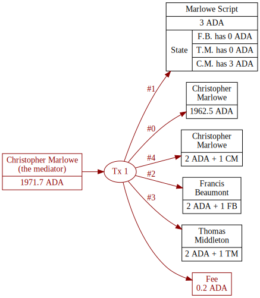
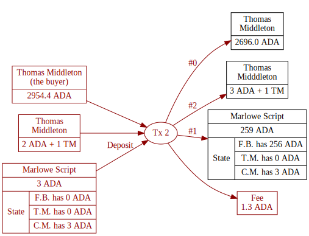
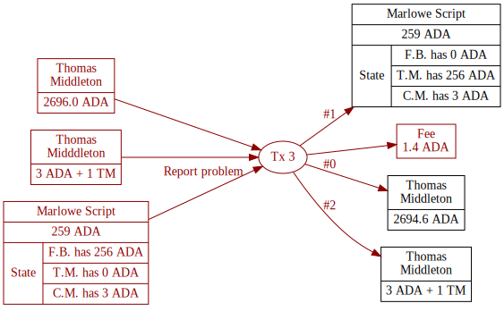
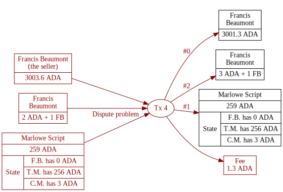
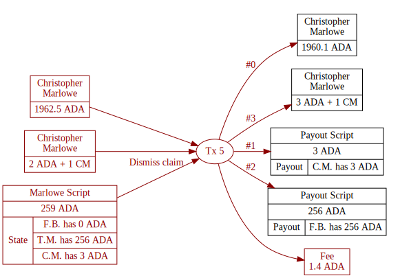
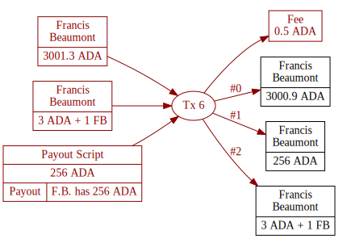
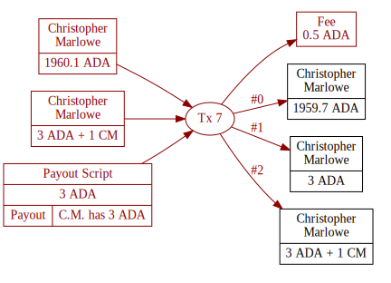

# Running Marlowe Contracts on the Blockchain

In this lecture we demonstrate how to use `marlowe-cli` to run Marlowe
contracts on the blockchain, but without using the Marlowe Backend. We
do this for the escrow contract of the previous lecture.

## Contract Parameters

In the previous lecture, we ran the contract without submitting
transactions. There we set the following parameters.

``` bash
INITIAL_LOVELACE=3000000             # The creation transaction will deposit 3₳.
PRICE=256000000                      # The prices of the item is 256₳.
MINIMUM_ADA=2000000                  # The minimum lovelace to be included with native token ouptut.

MEDIATOR_ROLE=CM                     # Christopher Marlowe is the mediator.
BUYER_ROLE=TM                        # Thomas Middleton is the buyer.
SELLER_ROLE=FB                       # Francis Beaumont (FB) is the seller.

NOW=$(($(date -u +%s)*1000))         # The current time in POSIX milliseconds.
HOUR=$((60*60*1000))                 # One hour, in POSIX milliseconds.
PAYMENT_DEADLINE=$((NOW+10*HOUR))    # The payment deadline, ten hours from now.
COMPLAINT_DEADLINE=$((NOW+12*HOUR))  # The complaint deadline, twelve hours from now.
DISPUTE_DEADLINE=$((NOW+14*HOUR))    # The dispute deadline, fourteen hours from now.
MEDIATION_DEADLINE=$((NOW+16*HOUR))  # The mediation deadline, sixteen hours from now.

ROLES_CURRENCY=1c964b2b89b6c9d2a8e2d564a3541b3b355d0451825ad0481a63f86c

MEDIATOR_TOKEN="$ROLES_CURRENCY.$MEDIATOR_ROLE"
BUYER_TOKEN="$ROLES_CURRENCY.$BUYER_ROLE"
SELLER_TOKEN="$ROLES_CURRENCY.$SELLER_ROLE"
```

``` bash
WALLET_SKEY=my-wallet.skey
WALLET_ADDRESS=$(cat my-wallet.address)
```

``` bash
export CARDANO_TESTNET_MAGIC=1567
```

``` bash
export CARDANO_NODE_SOCKET_PATH=~/.local/share/Daedalus/marlowe_pioneers/cardano-node.socket
```

## Creating Signing Keys for Roles

The escrow contract involves three participants (Mediator, Buyer,
Seller), so a real-life scenario for it involves three wallets.

-   The next sections shows to create signing keys and addresses for
    these roles.
-   Alternatively, one can create the signing keys for three wallets
    using the instructions in the lecture on installing Marlowe tools.

### Keys and Address for the Mediator

First set variables related to the mediator.

``` bash
MEDIATOR_ROLE="$MEDIATOR_ROLE"
MEDIATOR_SKEY=mediator.skey
MEDIATOR_VKEY=mediator.vkey
```

Generate keys for the mediator and compute their address.

``` bash
cardano-cli address key-gen --signing-key-file "$MEDIATOR_SKEY" --verification-key-file "$MEDIATOR_VKEY"
MEDIATOR_ADDRESS=$(cardano-cli address build --testnet-magic "$CARDANO_TESTNET_MAGIC" --payment-verification-key-file "$MEDIATOR_VKEY")
echo $MEDIATOR_ADDRESS
```

    addr_test1vzx02m47g6phgswsrsslpla4srem5jrr0qehvme52pgsgpslvf74m

### Keys and Address for the Buyer and Seller

``` bash
BUYER_ROLE="$BUYER_ROLE"
BUYER_SKEY=buyer.skey
BUYER_VKEY=buyer.vkey
cardano-cli address key-gen --signing-key-file "$BUYER_SKEY" --verification-key-file "$BUYER_VKEY"
BUYER_ADDRESS=$(cardano-cli address build --testnet-magic "$CARDANO_TESTNET_MAGIC" --payment-verification-key-file "$BUYER_VKEY")
echo $BUYER_ADDRESS
```

    addr_test1vq6c2ra4uy3n0n23yy4nhuwl7s5xntw5scc0edtfmc66u2grfpg5c

``` bash
SELLER_ROLE="$SELLER_ROLE"
SELLER_SKEY=seller.skey
SELLER_VKEY=seller.vkey
cardano-cli address key-gen --signing-key-file "$SELLER_SKEY" --verification-key-file "$SELLER_VKEY"
SELLER_ADDRESS=$(cardano-cli address build --testnet-magic "$CARDANO_TESTNET_MAGIC" --payment-verification-key-file "$SELLER_VKEY")
echo $SELLER_ADDRESS
```

    addr_test1vp6caftktaxlwngf7pj28yp0avads233gu95xy2c28au5uggc75r7

### Distribute Role Tokens and Ada

In the previous lecture we minted role tokens for this contract. They
are in UTxOs held at the address in `WALLET_ADDRESS=my-wallet.address`.

``` bash
cardano-cli query utxo --testnet-magic "$CARDANO_TESTNET_MAGIC" --address "$WALLET_ADDRESS"
```

                               TxHash                                 TxIx        Amount
    --------------------------------------------------------------------------------------
    acd0cd4e234f7d34d1de79c5d640b88cb85d4244f6b60bf260e0a4ac73425429     0        1957654914 lovelace + TxOutDatumNone
    acd0cd4e234f7d34d1de79c5d640b88cb85d4244f6b60bf260e0a4ac73425429     1        10000000 lovelace + 1 1c964b2b89b6c9d2a8e2d564a3541b3b355d0451825ad0481a63f86c.434d + TxOutDatumNone
    acd0cd4e234f7d34d1de79c5d640b88cb85d4244f6b60bf260e0a4ac73425429     2        10000000 lovelace + 1 1c964b2b89b6c9d2a8e2d564a3541b3b355d0451825ad0481a63f86c.4642 + TxOutDatumNone
    acd0cd4e234f7d34d1de79c5d640b88cb85d4244f6b60bf260e0a4ac73425429     3        10000000 lovelace + 1 1c964b2b89b6c9d2a8e2d564a3541b3b355d0451825ad0481a63f86c.544d + TxOutDatumNone

Here is the correspondence between the role names and their hexadecimal
representations.

Now distribute the tokens and some ADA, 20 ADA to the mediator, 300 ADA
to the buyer, and 40 ADA to the seller.

``` bash
TX_IN=acd0cd4e234f7d34d1de79c5d640b88cb85d4244f6b60bf260e0a4ac73425429

marlowe-cli transaction simple --required-signer "$WALLET_SKEY"                                       \
                               --tx-in "$TX_IN#0"                                                     \
                               --tx-in "$TX_IN#1"                                                     \
                               --tx-in "$TX_IN#2"                                                     \
                               --tx-in "$TX_IN#3"                                                     \
                               --change-address "$WALLET_ADDRESS"                                     \
                               --tx-out "$MEDIATOR_ADDRESS+20000000+1 $ROLES_CURRENCY.$MEDIATOR_ROLE" \
                               --tx-out "$BUYER_ADDRESS+300000000+1 $ROLES_CURRENCY.$BUYER_ROLE"      \
                               --tx-out "$SELLER_ADDRESS+40000000+1 $ROLES_CURRENCY.$SELLER_ROLE"     \
                               --out-file /dev/null                                                   \
                               --submit 600
```

    TxId "d80b74a12aca93e1178acc54006343bce2505f9358f91b3667ba37b85c620d27"

### Ensure That Each Address Has a Tokenless UTxO for Collateral

The command `marlowe-cli util clean` reorganizes UTxOs at an address so
that there is a tokenless UTxO that is suitable for use as collateral.

``` bash
marlowe-cli util clean --required-signer "$MEDIATOR_SKEY"         \
                       --change-address "$MEDIATOR_ADDRESS"       \
                       --out-file /dev/null                       \
                       --submit=600
```

    TxId "38ac0d8404542e45b9f23acb967169aed4ce5f5f65a20b8de79fbed5fc1593f0"

``` bash
marlowe-cli util clean --required-signer "$BUYER_SKEY"           \
                       --change-address "$BUYER_ADDRESS"         \
                       --out-file /dev/null                      \
                       --submit=600
```

    TxId "e730ef6a49c90733baf470f439004296796b679563568804142b736ccd26a61b"

``` bash
marlowe-cli util clean --required-signer "$SELLER_SKEY"          \
                       --change-address "$SELLER_ADDRESS"        \
                       --out-file /dev/null                      \
                       --submit=600
```

    TxId "471bef7858cd2bd3e44368511f0b0b1d4f7e0714c5a7b52a9773a1cdd12536af"

### Check That Funds Have Been Distributed Correctly

The `cardano-cli` tool outputs token names in hexadecimal instead of
ASCII. Here is the correspondence between the role names and their
hexadecimal representations.

``` bash
for n in "$MEDIATOR_ROLE" "$BUYER_ROLE" "$SELLER_ROLE"
do
  echo "$n=$(echo -n $n | basenc --base16 | tr '[:upper:]' '[:lower:]')"
done
```

    CM=434d
    TM=544d
    FB=4642

``` bash
cardano-cli query utxo --testnet-magic "$CARDANO_TESTNET_MAGIC" --address "$MEDIATOR_ADDRESS"
```

                               TxHash                                 TxIx        Amount
    --------------------------------------------------------------------------------------
    38ac0d8404542e45b9f23acb967169aed4ce5f5f65a20b8de79fbed5fc1593f0     0        17831023 lovelace + TxOutDatumNone
    38ac0d8404542e45b9f23acb967169aed4ce5f5f65a20b8de79fbed5fc1593f0     1        2000000 lovelace + 1 1c964b2b89b6c9d2a8e2d564a3541b3b355d0451825ad0481a63f86c.434d + TxOutDatumNone

``` bash
cardano-cli query utxo --testnet-magic "$CARDANO_TESTNET_MAGIC" --address "$BUYER_ADDRESS"
```

                               TxHash                                 TxIx        Amount
    --------------------------------------------------------------------------------------
    e730ef6a49c90733baf470f439004296796b679563568804142b736ccd26a61b     0        297831023 lovelace + TxOutDatumNone
    e730ef6a49c90733baf470f439004296796b679563568804142b736ccd26a61b     1        2000000 lovelace + 1 1c964b2b89b6c9d2a8e2d564a3541b3b355d0451825ad0481a63f86c.544d + TxOutDatumNone

``` bash
cardano-cli query utxo --testnet-magic "$CARDANO_TESTNET_MAGIC" --address "$SELLER_ADDRESS"
```

                               TxHash                                 TxIx        Amount
    --------------------------------------------------------------------------------------
    471bef7858cd2bd3e44368511f0b0b1d4f7e0714c5a7b52a9773a1cdd12536af     0        37831023 lovelace + TxOutDatumNone
    471bef7858cd2bd3e44368511f0b0b1d4f7e0714c5a7b52a9773a1cdd12536af     1        2000000 lovelace + 1 1c964b2b89b6c9d2a8e2d564a3541b3b355d0451825ad0481a63f86c.4642 + TxOutDatumNone

``` bash
TX_0_MEDIATOR_ADA="38ac0d8404542e45b9f23acb967169aed4ce5f5f65a20b8de79fbed5fc1593f0#0"
TX_0_MEDIATOR_TOKEN="38ac0d8404542e45b9f23acb967169aed4ce5f5f65a20b8de79fbed5fc1593f0#1"

TX_0_BUYER_ADA="e730ef6a49c90733baf470f439004296796b679563568804142b736ccd26a61b#0"
TX_0_BUYER_TOKEN="e730ef6a49c90733baf470f439004296796b679563568804142b736ccd26a61b#1"

TX_0_SELLER_ADA="471bef7858cd2bd3e44368511f0b0b1d4f7e0714c5a7b52a9773a1cdd12536af#0"
TX_0_SELLER_TOKEN="471bef7858cd2bd3e44368511f0b0b1d4f7e0714c5a7b52a9773a1cdd12536af#1"
```

## Create the Contract and Its Initial State

``` bash
marlowe-cli template escrow --minimum-ada "$INITIAL_LOVELACE"          \
                            --price "$PRICE"                           \
                            --seller "Role=$SELLER_ROLE"               \
                            --buyer "Role=$BUYER_ROLE"                 \
                            --mediator "Role=$MEDIATOR_ROLE"           \
                            --payment-deadline "$PAYMENT_DEADLINE"     \
                            --complaint-deadline "$COMPLAINT_DEADLINE" \
                            --dispute-deadline "$DISPUTE_DEADLINE"     \
                            --mediation-deadline "$MEDIATION_DEADLINE" \
                            --out-contract-file tx-1.contract          \
                            --out-state-file    tx-1.state
```

## Transaction 1: Mediator Creates Escrow Contract with Initial ADA

First create the `.marlowe` file that containts the contract, its state,
Plutus data, and network information.

``` bash
marlowe-cli run initialize --roles-currency "$ROLES_CURRENCY"        \
                           --contract-file tx-1.contract             \
                           --state-file    tx-1.state                \
                           --out-file      tx-1.marlowe              \
                           --print-stats
```


    Validator size: 12611
    Base-validator cost: ExBudget {exBudgetCPU = ExCPU 24562825, exBudgetMemory = ExMemory 82600}

👉 If you are planning to run a large contract on chain, use the
`--merkleize` flag with `marlowe-cli run initialize`. This will break
the contract into a Merkle DAG where only the immediately relevant part
of the contract is stored on chain and the rest of the contract is
supplied on-chain in a just-in-time manner.

The mediator uses their tokenless UTxO to fund the contract.

``` bash
marlowe-cli run execute --testnet-magic "$CARDANO_TESTNET_MAGIC"  \
                        --socket-path "$CARDANO_NODE_SOCKET_PATH" \
                        --tx-in "$TX_0_MEDIATOR_ADA"              \
                        --change-address "$MEDIATOR_ADDRESS"      \
                        --required-signer "$MEDIATOR_SKEY"        \
                        --marlowe-out-file tx-1.marlowe           \
                        --out-file tx-1.raw                       \
                        --print-stats                             \
                        --submit=600
```


    Fee: Lovelace 197709
    Size: 719 / 32768 = 2%
    Execution units:
      Memory: 0 / 30000000 = 0%
      Steps: 0 / 10000000000 = 0%
    TxId "384b93dedbe32fb48921853c0365c9a8f0be3425d5211e020952da08ff1cb6fa"

``` bash
TX_1=384b93dedbe32fb48921853c0365c9a8f0be3425d5211e020952da08ff1cb6fa
```

### UTxOs in Transaction 1



### Results of Transaction 1

The mediator now has a little less ADA because they deposited 3 ADA.

``` bash
cardano-cli query utxo --testnet-magic "$CARDANO_TESTNET_MAGIC" --address "$MEDIATOR_ADDRESS"
```

                               TxHash                                 TxIx        Amount
    --------------------------------------------------------------------------------------
    384b93dedbe32fb48921853c0365c9a8f0be3425d5211e020952da08ff1cb6fa     0        14633314 lovelace + TxOutDatumNone
    38ac0d8404542e45b9f23acb967169aed4ce5f5f65a20b8de79fbed5fc1593f0     1        2000000 lovelace + 1 1c964b2b89b6c9d2a8e2d564a3541b3b355d0451825ad0481a63f86c.434d + TxOutDatumNone

The Plutus script for the Marlowe contract now contains the 3 ADA that
the mediator deposited.

``` bash
CONTRACT_ADDRESS=$(jq -r '.marloweValidator.address' tx-1.marlowe)
echo "$CONTRACT_ADDRESS"
```

    addr_test1wzkcad2ay3lhr5x3xtjx5895grlfpjp3czf8vlnn9yraafsuy7nk8

``` bash
cardano-cli query utxo --testnet-magic "$CARDANO_TESTNET_MAGIC" --address "$CONTRACT_ADDRESS"
```

                               TxHash                                 TxIx        Amount
    --------------------------------------------------------------------------------------
    384b93dedbe32fb48921853c0365c9a8f0be3425d5211e020952da08ff1cb6fa     1        3000000 lovelace + TxOutDatumHash ScriptDataInAlonzoEra "6e380a227e612bef7c95581cdb072cddb6baa55886e783ce3f7d08da07a3c8d2"

## Transaction 2: Buyer Deposits Funds into Seller's Account

``` bash
marlowe-cli run prepare --marlowe-file tx-1.marlowe           \
                        --deposit-account "Role=$SELLER_ROLE" \
                        --deposit-party "Role=$BUYER_ROLE"    \
                        --deposit-amount "$PRICE"             \
                        --invalid-before "$NOW"               \
                        --invalid-hereafter "$((NOW+9*HOUR))" \
                        --out-file tx-2.marlowe               \
                        --print-stats
```


    Datum size: 463

The buyer uses their UTxOs and the script UTxO to deposit their funds.

``` bash
marlowe-cli run execute --marlowe-in-file tx-1.marlowe                        \
                        --tx-in-marlowe "$TX_1#1"                             \
                        --tx-in-collateral "$TX_0_BUYER_ADA"                  \
                        --tx-in "$TX_0_BUYER_ADA"                             \
                        --tx-in "$TX_0_BUYER_TOKEN"                           \
                        --required-signer "$BUYER_SKEY"                       \
                        --marlowe-out-file tx-2.marlowe                       \
                        --tx-out "$BUYER_ADDRESS+$MINIMUM_ADA+1 $BUYER_TOKEN" \
                        --change-address "$BUYER_ADDRESS"                     \
                        --out-file tx-2.raw                                   \
                        --print-stats                                         \
                        --submit=600
```


    Fee: Lovelace 1296004
    Size: 14041 / 32768 = 42%
    Execution units:
      Memory: 6041956 / 30000000 = 20%
      Steps: 2143271103 / 10000000000 = 21%
    TxId "75e3c5e2960b1486100b7318bc892d25060447b7e94af4264055f703e11356a4"

``` bash
TX_2=75e3c5e2960b1486100b7318bc892d25060447b7e94af4264055f703e11356a4
```

## UTxOs in Transaction 2



## Results of Transaction 2

The buyer now has a less ADA because they deposited 256 ADA.

``` bash
cardano-cli query utxo --testnet-magic "$CARDANO_TESTNET_MAGIC" --address "$BUYER_ADDRESS"
```

                               TxHash                                 TxIx        Amount
    --------------------------------------------------------------------------------------
    75e3c5e2960b1486100b7318bc892d25060447b7e94af4264055f703e11356a4     0        40535019 lovelace + TxOutDatumNone
    75e3c5e2960b1486100b7318bc892d25060447b7e94af4264055f703e11356a4     2        2000000 lovelace + 1 1c964b2b89b6c9d2a8e2d564a3541b3b355d0451825ad0481a63f86c.544d + TxOutDatumNone

The Plutus script for the Marlowe contract now contains the additional
256 ADA that the buyer deposited.

``` bash
cardano-cli query utxo --testnet-magic "$CARDANO_TESTNET_MAGIC" --address "$CONTRACT_ADDRESS"
```

                               TxHash                                 TxIx        Amount
    --------------------------------------------------------------------------------------
    75e3c5e2960b1486100b7318bc892d25060447b7e94af4264055f703e11356a4     1        259000000 lovelace + TxOutDatumHash ScriptDataInAlonzoEra "064c013ad3c6680e8988f11d6a86a2b85f863a98c7638ee279f5d8475480625e"

## Transaction 3: The Buyer Reports That There is a Problem

``` bash
marlowe-cli run prepare --marlowe-file tx-2.marlowe           \
                        --choice-name "Report problem"        \
                        --choice-party "Role=$BUYER_ROLE"     \
                        --choice-number 1                     \
                        --invalid-before "$NOW"               \
                        --invalid-hereafter "$((NOW+9*HOUR))" \
                        --out-file tx-3.marlowe               \
                        --print-stats
```


    Datum size: 341
    Payment 1
      Acccount: "FB"
      Payee: Account "TM"
      Ada: 256.000000

The buyer uses their UTxOs and the script UTxO to report that there is a
problem.

``` bash
marlowe-cli run execute --marlowe-in-file tx-2.marlowe                        \
                        --tx-in-marlowe "$TX_2#1"                             \
                        --tx-in-collateral "$TX_2#0"                          \
                        --tx-in "$TX_2#0"                                     \
                        --tx-in "$TX_2#2"                                     \
                        --required-signer "$BUYER_SKEY"                       \
                        --marlowe-out-file tx-3.marlowe                       \
                        --tx-out "$BUYER_ADDRESS+$MINIMUM_ADA+1 $BUYER_TOKEN" \
                        --change-address "$BUYER_ADDRESS"                     \
                        --out-file tx-3.raw                                   \
                        --print-stats                                         \
                        --submit=600
```


    Fee: Lovelace 1371485
    Size: 13896 / 32768 = 42%
    Execution units:
      Memory: 7092394 / 30000000 = 23%
      Steps: 2438012013 / 10000000000 = 24%
    TxId "ec7ada2334eb94e7f5922f7d764853f60ca6936754a37439675f6f2f33fa241a"

``` bash
TX_3=ec7ada2334eb94e7f5922f7d764853f60ca6936754a37439675f6f2f33fa241a
```

## UTxOs in Transaction 3



## Results of Transaction 3

The buyer now has a approximately the same amount of ADA because they
only reported the problem and didn\'t deposit anything.

``` bash
cardano-cli query utxo --testnet-magic "$CARDANO_TESTNET_MAGIC" --address "$BUYER_ADDRESS"
```

                               TxHash                                 TxIx        Amount
    --------------------------------------------------------------------------------------
    ec7ada2334eb94e7f5922f7d764853f60ca6936754a37439675f6f2f33fa241a     0        39163534 lovelace + TxOutDatumNone
    ec7ada2334eb94e7f5922f7d764853f60ca6936754a37439675f6f2f33fa241a     2        2000000 lovelace + 1 1c964b2b89b6c9d2a8e2d564a3541b3b355d0451825ad0481a63f86c.544d + TxOutDatumNone

The ADA at the Plutus script hasn\'t changed, but the datum there has
changed.

``` bash
cardano-cli query utxo --testnet-magic "$CARDANO_TESTNET_MAGIC" --address "$CONTRACT_ADDRESS"
```

                               TxHash                                 TxIx        Amount
    --------------------------------------------------------------------------------------
    ec7ada2334eb94e7f5922f7d764853f60ca6936754a37439675f6f2f33fa241a     1        259000000 lovelace + TxOutDatumHash ScriptDataInAlonzoEra "d9c96497784109bbfae3ff3e4693082cb38b917d0e56c9d1613cd663d071ba42"

## Transaction 4: The Seller Disputes that There is a Problem

``` bash
marlowe-cli run prepare --marlowe-file tx-3.marlowe            \
                        --choice-name "Dispute problem"        \
                        --choice-party "Role=$SELLER_ROLE"     \
                        --choice-number 0                      \
                        --invalid-before "$NOW"                \
                        --invalid-hereafter "$((NOW+9*HOUR))"  \
                        --out-file tx-4.marlowe                \
                        --print-stats
```


    Datum size: 262

The seller uses their UTxOs and the script UTxO to dispute that there is
a problem.

``` bash
marlowe-cli run execute --marlowe-in-file tx-3.marlowe                          \
                        --tx-in-marlowe "$TX_3#1"                               \
                        --tx-in-collateral "$TX_0_SELLER_ADA"                   \
                        --tx-in "$TX_0_SELLER_ADA"                              \
                        --tx-in "$TX_0_SELLER_TOKEN"                            \
                        --required-signer "$SELLER_SKEY"                        \
                        --marlowe-out-file tx-4.marlowe                         \
                        --tx-out "$SELLER_ADDRESS+$MINIMUM_ADA+1 $SELLER_TOKEN" \
                        --change-address "$SELLER_ADDRESS"                      \
                        --out-file tx-4.raw                                     \
                        --print-stats                                           \
                        --submit=600
```


    Fee: Lovelace 1243679
    Size: 13696 / 32768 = 41%
    Execution units:
      Memory: 5646268 / 30000000 = 18%
      Steps: 1944739687 / 10000000000 = 19%
    TxId "77d328a6042d24876b6943ebbf263d1457d83a537ab9bfe80af5daf6068c983a"

``` bash
TX_4=77d328a6042d24876b6943ebbf263d1457d83a537ab9bfe80af5daf6068c983a
```

## UTxOs in Transaction 4



## Results of Transaction 4

The seller now has a approximately the same amount of ADA because they
only disputed the problem and didn\'t deposit anything.

``` bash
cardano-cli query utxo --testnet-magic "$CARDANO_TESTNET_MAGIC" --address "$SELLER_ADDRESS"
```

                               TxHash                                 TxIx        Amount
    --------------------------------------------------------------------------------------
    77d328a6042d24876b6943ebbf263d1457d83a537ab9bfe80af5daf6068c983a     0        36587344 lovelace + TxOutDatumNone
    77d328a6042d24876b6943ebbf263d1457d83a537ab9bfe80af5daf6068c983a     2        2000000 lovelace + 1 1c964b2b89b6c9d2a8e2d564a3541b3b355d0451825ad0481a63f86c.4642 + TxOutDatumNone

The ADA at the Plutus script hasn\'t changed, but the datum there has
changed.

``` bash
cardano-cli query utxo --testnet-magic "$CARDANO_TESTNET_MAGIC" --address "$CONTRACT_ADDRESS"
```

                               TxHash                                 TxIx        Amount
    --------------------------------------------------------------------------------------
    77d328a6042d24876b6943ebbf263d1457d83a537ab9bfe80af5daf6068c983a     1        259000000 lovelace + TxOutDatumHash ScriptDataInAlonzoEra "285403ff2e05a649eb8aa6bed12945d4d47efc1b660cf7cfa4ccc02939a98263"

## Transaction 5: The Mediator Dismisses the Claim

``` bash
marlowe-cli run prepare --marlowe-file tx-4.marlowe           \
                        --choice-name "Dismiss claim"         \
                        --choice-party "Role=$MEDIATOR_ROLE"  \
                        --choice-number 0                     \
                        --invalid-before "$NOW"               \
                        --invalid-hereafter "$((NOW+9*HOUR))" \
                        --out-file tx-5.marlowe               \
                        --print-stats
```


    Datum size: 104
    Payment 1
      Acccount: "TM"
      Payee: Account "FB"
      Ada: 256.000000
    Payment 2
      Acccount: "CM"
      Payee: Party "CM"
      Ada: 3.000000
    Payment 3
      Acccount: "FB"
      Payee: Party "FB"
      Ada: 256.000000

The mediator user their UTxOs and the script UTxO to dismiss the claim,
in favor of the seller.

``` bash
marlowe-cli run execute --marlowe-in-file tx-4.marlowe                              \
                        --tx-in-marlowe "$TX_4#1"                                   \
                        --tx-in-collateral "$TX_1#0"                                \
                        --tx-in "$TX_1#0"                                           \
                        --tx-in "$TX_0_MEDIATOR_TOKEN"                              \
                        --required-signer "$MEDIATOR_SKEY"                          \
                        --marlowe-out-file tx-5.marlowe                             \
                        --tx-out "$MEDIATOR_ADDRESS+$MINIMUM_ADA+1 $MEDIATOR_TOKEN" \
                        --change-address "$MEDIATOR_ADDRESS"                        \
                        --out-file tx-5.raw                                         \
                        --print-stats                                               \
                        --submit=600
```


    Fee: Lovelace 1234387
    Size: 13430 / 32768 = 40%
    Execution units:
      Memory: 5706864 / 30000000 = 19%
      Steps: 1929702732 / 10000000000 = 19%
    TxId "baa487b158dbf4add2e90e03c40ad869b1c3a9163a28cbee1be8c43ba6a24737"

``` bash
TX_5=baa487b158dbf4add2e90e03c40ad869b1c3a9163a28cbee1be8c43ba6a24737
```

## UTxOs in Transaction 5



## Results of Transaction 5

The mediator now has a approximately the same amount of ADA because they
only settled the claim and didn\'t deposit anything.

``` bash
cardano-cli query utxo --testnet-magic "$CARDANO_TESTNET_MAGIC" --address "$MEDIATOR_ADDRESS"
```

                               TxHash                                 TxIx        Amount
    --------------------------------------------------------------------------------------
    baa487b158dbf4add2e90e03c40ad869b1c3a9163a28cbee1be8c43ba6a24737     0        13398927 lovelace + TxOutDatumNone
    baa487b158dbf4add2e90e03c40ad869b1c3a9163a28cbee1be8c43ba6a24737     3        2000000 lovelace + 1 1c964b2b89b6c9d2a8e2d564a3541b3b355d0451825ad0481a63f86c.434d + TxOutDatumNone

The contract is complete, so there is no ADA at the Plutus script
address.

``` bash
cardano-cli query utxo --testnet-magic "$CARDANO_TESTNET_MAGIC" --address "$CONTRACT_ADDRESS"
```

                               TxHash                                 TxIx        Amount
    --------------------------------------------------------------------------------------

The payout script address now contains payments that the seller and
mediator can claim.

``` bash
ROLE_ADDRESS=$(jq -r '.rolesValidator.address' tx-1.marlowe)
echo "$ROLE_ADDRESS"
```

    addr_test1wrhuxnrrnjkz3le2e0xt5zdstk0xhsv0hdwhvguyshjc95sajj7wh

``` bash
cardano-cli query utxo --testnet-magic "$CARDANO_TESTNET_MAGIC" --address "$ROLE_ADDRESS"
```

                               TxHash                                 TxIx        Amount
    --------------------------------------------------------------------------------------
    baa487b158dbf4add2e90e03c40ad869b1c3a9163a28cbee1be8c43ba6a24737     1        3000000 lovelace + TxOutDatumHash ScriptDataInAlonzoEra "1d8ad8b0a642297fa38291e4522015f82d47774e9a9829345a0952c654f427a3"
    baa487b158dbf4add2e90e03c40ad869b1c3a9163a28cbee1be8c43ba6a24737     2        256000000 lovelace + TxOutDatumHash ScriptDataInAlonzoEra "f605a13bb90b0f530748173887182b9135318402c3d5c989e40cca12b283664b"

## Transaction 6: The Seller Withdraws Their Funds

The `marlowe-cli run withdraw` command lets the seller withdraw their
funds from the payout script address.

``` bash
marlowe-cli run withdraw --marlowe-file tx-5.marlowe                             \
                         --role-name "$SELLER_ROLE"                              \
                         --tx-in "$TX_4#0"                                       \
                         --tx-in "$TX_4#2"                                       \
                         --tx-in-collateral "$TX_4#0"                            \
                         --required-signer "$SELLER_SKEY"                        \
                         --tx-out "$SELLER_ADDRESS+$MINIMUM_ADA+1 $SELLER_TOKEN" \
                         --change-address "$SELLER_ADDRESS"                      \
                         --out-file tx-6.raw                                     \
                         --print-stats                                           \
                         --submit=600
```


    Fee: Lovelace 422221
    Size: 2885 / 32768 = 8%
    Execution units:
      Memory: 1407010 / 30000000 = 4%
      Steps: 541567360 / 10000000000 = 5%
    TxId "f92e098a405fc1db52a12a2df2a98ecccc9002dc8c0dc12ec07e106dfc641dc3"

``` bash
TX_6=f92e098a405fc1db52a12a2df2a98ecccc9002dc8c0dc12ec07e106dfc641dc3
```

## UTxOs in Transaction 6



## Transaction 7: The Mediator Withdraws Their Funds

``` bash
marlowe-cli run withdraw --marlowe-file tx-5.marlowe                                 \
                         --role-name "$MEDIATOR_ROLE"                                \
                         --tx-in "$TX_5#0"                                           \
                         --tx-in "$TX_5#3"                                          \
                         --tx-in-collateral "$TX_5#0"                                \
                         --required-signer "$MEDIATOR_SKEY"                          \
                         --tx-out "$MEDIATOR_ADDRESS+$MINIMUM_ADA+1 $MEDIATOR_TOKEN" \
                         --change-address "$MEDIATOR_ADDRESS"                        \
                         --out-file tx-7.raw                                         \
                         --print-stats                                               \
                         --submit=600
```


    Fee: Lovelace 426563
    Size: 2885 / 32768 = 8%
    Execution units:
      Memory: 1461810 / 30000000 = 4%
      Steps: 557930172 / 10000000000 = 5%
    TxId "98c5ab8be5b78513b9313a568b70e86473da7618dd91c0a265b83be1bc73e6eb"

``` bash
TX_7=98c5ab8be5b78513b9313a568b70e86473da7618dd91c0a265b83be1bc73e6eb
```

## UTxOs in Transactions 7



## Results of Transactions 6 and 7

The payout script address has no funds.

``` bash
cardano-cli query utxo --testnet-magic "$CARDANO_TESTNET_MAGIC" --address "$ROLE_ADDRESS"
```

                               TxHash                                 TxIx        Amount
    --------------------------------------------------------------------------------------

The mediator and seller have the funds they withdrew.

``` bash
cardano-cli query utxo --testnet-magic "$CARDANO_TESTNET_MAGIC" --address "$MEDIATOR_ADDRESS"
```

                               TxHash                                 TxIx        Amount
    --------------------------------------------------------------------------------------
    98c5ab8be5b78513b9313a568b70e86473da7618dd91c0a265b83be1bc73e6eb     0        12972364 lovelace + TxOutDatumNone
    98c5ab8be5b78513b9313a568b70e86473da7618dd91c0a265b83be1bc73e6eb     1        3000000 lovelace + TxOutDatumNone
    98c5ab8be5b78513b9313a568b70e86473da7618dd91c0a265b83be1bc73e6eb     2        2000000 lovelace + 1 1c964b2b89b6c9d2a8e2d564a3541b3b355d0451825ad0481a63f86c.434d + TxOutDatumNone

``` bash
cardano-cli query utxo --testnet-magic "$CARDANO_TESTNET_MAGIC" --address "$SELLER_ADDRESS"
```

                               TxHash                                 TxIx        Amount
    --------------------------------------------------------------------------------------
    f92e098a405fc1db52a12a2df2a98ecccc9002dc8c0dc12ec07e106dfc641dc3     0        36165123 lovelace + TxOutDatumNone
    f92e098a405fc1db52a12a2df2a98ecccc9002dc8c0dc12ec07e106dfc641dc3     1        256000000 lovelace + TxOutDatumNone
    f92e098a405fc1db52a12a2df2a98ecccc9002dc8c0dc12ec07e106dfc641dc3     2        2000000 lovelace + 1 1c964b2b89b6c9d2a8e2d564a3541b3b355d0451825ad0481a63f86c.4642 + TxOutDatumNone

## Clean Up

We send the funds and role tokens back to the wallet.

``` bash
marlowe-cli transaction simple --required-signer "$MEDIATOR_SKEY"                                  \
                               --tx-in "$TX_7#0" --tx-in "$TX_7#1" --tx-in "$TX_7#2"               \
                               --required-signer "$BUYER_SKEY"                                     \
                               --tx-in "$TX_3#0" --tx-in "$TX_3#2"                                 \
                               --required-signer "$SELLER_SKEY"                                    \
                               --tx-in "$TX_6#0" --tx-in "$TX_6#1" --tx-in "$TX_6#2"               \
                               --tx-out "$WALLET_ADDRESS+2000000+1 $ROLES_CURRENCY.$MEDIATOR_ROLE" \
                               --tx-out "$WALLET_ADDRESS+2000000+1 $ROLES_CURRENCY.$BUYER_ROLE"    \
                               --tx-out "$WALLET_ADDRESS+2000000+1 $ROLES_CURRENCY.$SELLER_ROLE"   \
                               --change-address "$WALLET_ADDRESS"                                  \
                               --out-file /dev/null                                                \
                               --submit=600
```

    TxId "1c53b73469335276e67c7bd59f64e7d01a3cf7ec21c801aee3c2709185395465"

## Viewing Transactions on Cardano Explorer

``` bash
echo 'Transaction 1: https://explorer.pioneers.testnet.marlowe-finance.io/en/transaction?id='"$TX_1"
echo 'Transaction 2: https://explorer.pioneers.testnet.marlowe-finance.io/en/transaction?id='"$TX_2"
echo 'Transaction 3: https://explorer.pioneers.testnet.marlowe-finance.io/en/transaction?id='"$TX_3"
echo 'Transaction 4: https://explorer.pioneers.testnet.marlowe-finance.io/en/transaction?id='"$TX_4"
echo 'Transaction 5: https://explorer.pioneers.testnet.marlowe-finance.io/en/transaction?id='"$TX_5"
echo 'Transaction 6: https://explorer.pioneers.testnet.marlowe-finance.io/en/transaction?id='"$TX_6"
echo 'Transaction 7: https://explorer.pioneers.testnet.marlowe-finance.io/en/transaction?id='"$TX_7"
```

    Transaction 1: https://explorer.pioneers.testnet.marlowe-finance.io/en/transaction?id=384b93dedbe32fb48921853c0365c9a8f0be3425d5211e020952da08ff1cb6fa
    Transaction 2: https://explorer.pioneers.testnet.marlowe-finance.io/en/transaction?id=75e3c5e2960b1486100b7318bc892d25060447b7e94af4264055f703e11356a4
    Transaction 3: https://explorer.pioneers.testnet.marlowe-finance.io/en/transaction?id=ec7ada2334eb94e7f5922f7d764853f60ca6936754a37439675f6f2f33fa241a
    Transaction 4: https://explorer.pioneers.testnet.marlowe-finance.io/en/transaction?id=77d328a6042d24876b6943ebbf263d1457d83a537ab9bfe80af5daf6068c983a
    Transaction 5: https://explorer.pioneers.testnet.marlowe-finance.io/en/transaction?id=baa487b158dbf4add2e90e03c40ad869b1c3a9163a28cbee1be8c43ba6a24737
    Transaction 6: https://explorer.pioneers.testnet.marlowe-finance.io/en/transaction?id=f92e098a405fc1db52a12a2df2a98ecccc9002dc8c0dc12ec07e106dfc641dc3
    Transaction 7: https://explorer.pioneers.testnet.marlowe-finance.io/en/transaction?id=98c5ab8be5b78513b9313a568b70e86473da7618dd91c0a265b83be1bc73e6eb

## Progression of eUTxOs


## Troubleshooting

-   See the previous lecture, \"Running Marlowe Contracts without
    Blockchain Transactions\", for hints at troubleshooting the semantic
    aspects of a Marlowe contract.
-   If the contract is too large to fit on the blockhain, use the
    `--merkleize` flag in `marlowe-cli run initialize` to minimize its
    on-chain size.
-   If a transaction fails phase two validation, a terse Marlowe error
    will be reported:
    -   `"B0"`: All accounts must have positive balances.
    -   `"B1"`: The value input from the script does not match that
        specified in its datum.
    -   If these errors occur during Plutus validation but not outside
        of it, then there likely is a clock inconsistency between local
        time and the node.
        -   `"E1" = TEAmbiguousTimeIntervalError`: The time interval for
            a transaction straddles the timeout of a `When` clause.
        -   `"E2" = TEApplyNoMatchError`: The attempted application of
            input to the contract was illegal.
        -   `"E3" = TEIntervalError InvalidInterval`: The start of the
            time interval is after its end.
        -   `"E4" = IntervalInPast`: The interval falls before the
            current time.
        -   `"E5" = TEUselessTransaction`: The attempted application of
            input does not change the state of the contract.
        -   `"E6" = TEHashMismatch`: An incorrect contract was provided
            for the merkleized continuation.
    -   `"H"`: The merkleized continuation for the contract is missing
        from the transaction.
    -   `"I0"`: The input datum was not provided to the script.
    -   `"I1"`: Inputting from two Marlowe scripts with the same address
        in the same transaction is forbidden.
    -   `"L1+"`: The datum or value at the script output does not match
        the contract\'s transition.
    -   `"O0"`: Outputing to two Marlowe scripts with the same address
        in the same transaction is forbidden.
    -   `"P"`: Insufficient value is paid to a public-key address.
    -   `"R"`: Insufficient value is paid in a role payout.
    -   `"R0"`: The slot/time validity range for the transaction is
        infinite or semi-infinite. The range should be finite/bounded.
    -   `"S"`: A required public-key signature was not present in the
        transaction.
    -   `"T"`: The role token authorizing the application of input is
        not present in the transaction.
-   Validation error codes not mentioned above result from Plutus or
    Plutus Apps functions.

## Resources

-   Marlowe CLI documentation:
    \<<https://github.com/input-output-hk/marlowe-cardano/blob/mpp-cli-lectures/marlowe-cli/ReadMe.md>\>.
-   Marlowe Debugging Cookbook:
    \<<https://github.com/input-output-hk/marlowe-cardano/blob/mpp-cli-lectures/marlowe/debugging-cookbook.md>\>.
-   Example contracts with `marlowe-cli`:
    \<<https://github.com/input-output-hk/marlowe-cardano/blob/mpp-cli-lectures/marlowe-cli/examples/ReadMe.md>\>.
-   Marlowe contract examples:
    \<<https://github.com/input-output-hk/marlowe-cardano/tree/main/marlowe-contracts>\>.
-   Marlowe Playground: \<<https://playground.marlowe.iohkdev.io/#/>\>.
-   Marlowe Run
    -   On pioneers testnet:
        \<<https://marlowe-run-marlowe-pioneers.plutus.aws.iohkdev.io/>\>.
    -   On mock network: \<<https://marlowe-finance.io/>\>.
-   Cardano Docs for Marlowe:
    \<<https://docs.cardano.org/marlowe/learn-about-marlowe>\>.
-   Plutus Pioneers Program:
    \<<https://github.com/input-output-hk/plutus-pioneer-program>\>.
-   Plutus Community:
    \<<https://plutus-community.readthedocs.io/en/latest/>\>.
-   The Plutonomicon:
    \<<https://github.com/Plutonomicon/plutonomicon/blob/main/README.md>\>.

## Exercises

1.  Alter the one or more of the command flags in
    `marlowe-cli run execute` in the above execution of the escrow
    contract so that the blockchain rejects the transaction because it
    fails validation by the Marlowe script. For example, omit including
    the required role token, sign with the wrong key, submit the
    transaction outside of the range between `--invalid-before` and
    `--invalid-hereafter`, or provide insufficient funds.
2.  Repeat the above execution of the escrow contract, but have the
    seller choose to confirm the problem instead of disputing it.
3.  Run a similar execution using a different contract from
    `marlowe-cli template --help`, Marlowe Playground, or
    \<<https://github.com/input-output-hk/marlowe-cardano/tree/main/marlowe-contracts>\>.
4.  Draw a eUTxO diagram for a contract you have run with `marlowe-cli`,
    Marlowe Run, or Marlowe Playground.

## Summary

-   Role tokens must be distributed to the parties involved in the
    transactions of a Marlowe contract.
-   The `marlowe-cli run execute` command submits Marlowe transactions
    to the blockchain.
-   The `marlowe-cli run withdraw` command submits a transaction to
    withdraw funds from Marlowe\'s payout script address.
-   If the contract is large, use the `--merkleize` flag with
    `marlowe-cli run initialize`, so that the contract\'s on-chain
    storage is minimized.
-   Transactions can be viewed on the Cardano explore at
    \<<https://explorer.pioneers.testnet.marlowe-finance.io/en>\>.

## Other Lectures

Lectures on Marlowe CLI:
\<<https://github.com/input-output-hk/marlowe-cardano/blob/mpp-cli-lectures/marlowe-cli/lectures/ReadMe.md>\>

-   [Overview of Marlowe CLI](01-marlowe-cli-overview.md)
-   [Installing Marlowe CLI and Associated
    Tools](02-marlowe-cli-installation.md)
-   [Running Marlowe Contracts without Blockchain
    Transactions](03-marlowe-cli-abstract.md)
-   ~~Running Marlowe Contacts on the Blockchain~~
-   [Running Marlowe Contracts with the Marlowe
    Backend](05-marlowe-cli-pab.md)
