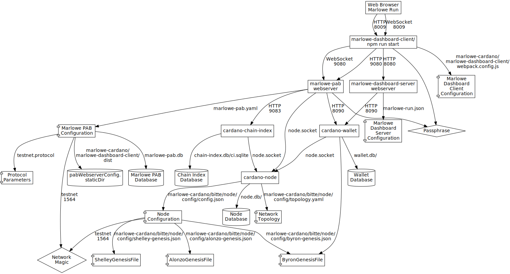

# Development Environment for Marlowe Run


## Install Prerequisites


### Marlowe PAB and WBE

Use the `marlowe-run-development` branch of marlowe.

```bash
# Clone marlowe-cardano on the correct branch.
git clone git@github.com:input-output-hk/marlowe-cardano.git -b sprint-49

# Build the PAB.
nix-build marlowe-cardano/default.nix -A marlowe-pab -o build-pab

# Create the PAB configuration.
cat > marlowe-pab.yaml << EOI
dbConfig:
  dbConfigFile: marlowe-pab.db
  dbConfigPoolSize: 20
pabWebserverConfig:
  baseUrl: http://localhost:9080
  staticDir: marlowe-cardano/marlowe-dashboard-client/dist
  permissiveCorsPolicy: False
walletServerConfig:
  tag: LocalWalletConfig
  walletSettings:
    baseUrl: http://localhost:8090
nodeServerConfig:
  pscSocketPath: node.socket
  pscBaseUrl: "localhost"
  pscKeptBlocks: 2160
  pscNetworkId: "1564"
  pscSlotConfig:
    scSlotZeroTime: 1638215277000
    scSlotLength: 1000
  pscFeeConfig:
    fcConstantFee:
      getLovelace: 10
    fcScriptsFeeFactor: 1.0
  pscInitialTxWallets: []
  pscNodeMode: AlonzoNode
  pscProtocolParametersJsonPath: testnet.protocol
chainIndexConfig:
  ciBaseUrl: http://localhost:9083
  ciWatchedAddresses: []
requestProcessingConfig:
  requestProcessingInterval: 1
signingProcessConfig:
  spBaseUrl: http://localhost:9084
  spWallet:
    getWallet: 1
metadataServerConfig:
  mdBaseUrl: http://localhost:9085
developmentOptions:
  pabRollbackHistory: null
  pabResumeFrom:
    tag: PointAtGenesis
EOI

# Build the marlowe dashboard server.
nix-build marlowe-cardano/default.nix -A marlowe-dashboard.marlowe-run-backend-invoker -o build-run

# Create the configuration file for the dashboard server.
cat > marlowe-run.json << EOI
{
  "wbeConfig": { "host": "localhost", "port": 8090 },
  "staticPath": "/var/empty"
}
EOI
```


### Cardano Node

```bash
# Clone cardano-node at the correct revision.
git clone git@github.com:input-output-hk/cardano-node.git -b 1.33.0

# Build the executable.
nix-build cardano-node/default.nix -A cardano-node -o build-node

# Optionally, patch the configuration file so logging is more verbose.
patch marlowe-cardano/bitte/node/config/config.json << EOI
36,37c36,37
<   "TraceDNSResolver": true,
<   "TraceDNSSubscription": true,
---
>   "TraceDNSResolver": false,
>   "TraceDNSSubscription": false,
43c43
<   "TraceIpSubscription": true,
---
>   "TraceIpSubscription": false,
51c51
<   "TraceMempool": false,
---
>   "TraceMempool": true,
53,55c53,55
<   "TracePeerSelection": true,
<   "TracePeerSelectionActions": true,
<   "TracePublicRootPeers": true,
---
>   "TracePeerSelection": false,
>   "TracePeerSelectionActions": false,
>   "TracePublicRootPeers": false,
68,69c68,69
<       "JournalSK",
<       "cardano"
---
>       "StdoutSK",
>       "stdout"
77c77
<   "minSeverity": "Debug",
---
>   "minSeverity": "Info",
104,105c104,106
<       "scKind": "JournalSK",
<       "scName": "cardano"
---
>       "scKind": "StdoutSK",
>       "scName": "stdout",
>       "scRotation": null
EOI
```


### Cardano CLI

```
# Build the cardano-cli tool.
nix-build cardano-node/default.nix -A cardano-cli -o build-cli
```


### Cardano Wallet

```bash
# Clone cardano-wallet at the correct revision.
git clone git@github.com:input-output-hk/cardano-wallet.git -b v2022-01-18

# Build the executable.
nix-build cardano-wallet/default.nix -A cardano-wallet -o build-wallet
```


### Cardano Chain Index

```bash
# Clone plutus-apps at the correct revision.
git clone git@github.com:input-output-hk/plutus-apps.git -b marlowe-run-development

# Build the executable.
nix-shell plutus-apps/shell.nix --run "cd plutus-apps; cabal install --installdir=../build-chain-index exe:plutus-chain-index"

# Create the database directory.
mkdir chain-index.db
```

### Daedalus

Optionally, one can build Daedalus.

```bash
# Clone the Daedalus repository.
git clone git@github.com:input-output-hk/daedalus.git -b 4.7.0

# Patch Daedalus for use with the Marlowe testnet.
pushd daedalus.git
git apply << EOI
diff --git a/nix/launcher-config.nix b/nix/launcher-config.nix
index 905e636fd..9f995d904 100644
--- a/nix/launcher-config.nix
+++ b/nix/launcher-config.nix
@@ -27,7 +27,41 @@ let
       networkName = "mainnet";
     };
     alonzo_purple = {
-      cardanoEnv = cardanoLib.environments.alonzo-purple;
+      cardanoEnv = rec {
+        private = true;
+        nodeConfig = networkConfig // cardanoLib.defaultLogConfig;
+        networkConfig = {
+          ByronGenesisFile = ../../node/byron-genesis.json;
+          ByronGenesisHash = "0cb403802a38d5ca4609517e4837c81b42f4760015d450fd33193e8c8b76c579";
+          ShelleyGenesisFile = ../../node/shelley-genesis.json;
+          ShelleyGenesisHash = "40de53f76f83eb808e08b3bf5c3183868f0bf8c61f1f38be656cdbb7b48c588d";
+          AlonzoGenesisFile = ../../node/alonzo-genesis.json;
+          AlonzoGenesisHash = "7e94a15f55d1e82d10f09203fa1d40f8eede58fd8066542cf6566008068ed874";
+          Protocol = "Cardano";
+          RequiresNetworkMagic = "RequiresMagic";
+          MaxKnownMajorProtocolVersion = 5;
+          LastKnownBlockVersion-Major = 5;
+          LastKnownBlockVersion-Minor = 1;
+          LastKnownBlockVersion-Alt = 0;
+          ApplicationName = "cardano-sl";
+          ApplicationVersion = 0;
+          MaxConcurrencyDeadline = 4;
+          PBftSignatureThreshold = 1.1;
+          TestAllegraHardForkAtEpoch = 2;
+          TestAlonzoHardForkAtEpoch = 4;
+          TestEnableDevelopmentHardForkEras = false;
+          TestEnableDevelopmentNetworkProtocols = false;
+          TestMaryHardForkAtEpoch = 3;
+          TestShelleyHardForkAtEpoch = 1;
+        };
+        relays = "europe.relays.marlowe-testnet.dev.cardano.org";
+        relaysNew = "europe.relays.marlowe-testnet.dev.cardano.org";
+        edgeNodes = [
+          "3.126.34.143"
+          "3.126.34.143"
+        ];
+        edgePort = 3001;
+      };
       cluster = "alonzo-purple";
       networkName = "alonzo-purple";
     };
diff --git a/source/common/types/environment.types.js b/source/common/types/environment.types.js
index 218b9b278..1fb68d2f6 100644
--- a/source/common/types/environment.types.js
+++ b/source/common/types/environment.types.js
@@ -74,7 +74,7 @@ export const networkPrettyNames = {
   testnet: 'Testnet',
   staging: 'Staging',
   shelley_qa: 'Shelley QA',
-  alonzo_purple: 'Alonzo Purple',
+  alonzo_purple: 'Marlowe Testnet',
   selfnode: 'Selfnode',
   development: 'Development',
 };
diff --git a/source/renderer/app/i18n/locales/en-US.json b/source/renderer/app/i18n/locales/en-US.json
index c193bf71b..3bda328b7 100755
--- a/source/renderer/app/i18n/locales/en-US.json
+++ b/source/renderer/app/i18n/locales/en-US.json
@@ -143,8 +143,8 @@
   "discreetMode.discreetToggle.on": "Toggle discreet mode on.",
   "environment.apiName.cardano": "Cardano",
   "environment.currency.ada": "Ada",
-  "environment.network.alonzo_purple": "Alonzo Purple",
-  "environment.network.development": "Development",
+  "environment.network.alonzo_purple": "Marlowe Testnet",
+  "environment.network.development": "Marlowe Testnet",
   "environment.network.mainnet": "Mainnet",
   "environment.network.selfnode": "Selfnode",
   "environment.network.shelley_qa": "Shelley QA",
@@ -624,9 +624,9 @@
   "systemTime.error.overlayTitle": "Unable to sync - incorrect time",
   "systemTime.error.supportPortalLink": "Support Portal",
   "systemTime.error.supportPortalLinkUrl": "https://daedaluswallet.io/clock-sync/",
-  "test.environment.alonzoPurpleLabel": "Alonzo Purple",
+  "test.environment.alonzoPurpleLabel": "Marlowe Testnet",
   "test.environment.daedalusFlightLabel": "Cardano mainnet - Daedalus Flight",
-  "test.environment.developmentLabel": "Development",
+  "test.environment.developmentLabel": "Marlowe Testnet",
   "test.environment.mainnetLabel": "Mainnet",
   "test.environment.selfnodeLabel": "Selfnode",
   "test.environment.shelleyQaLabel": "Shelley QA",
@@ -1248,4 +1248,4 @@
   "wallet.transferFunds.dialog2.total.label": "Total",
   "widgets.itemsDropdown.syncingLabel": "Syncing",
   "widgets.itemsDropdown.syncingLabelProgress": "Syncing {syncingProgress}%"
-}
\ No newline at end of file
+}
EOI
popd

# Build Daedalus.
pushd daedalus
NETWORK=alonzo_purple nix-shell shell.nix --argstr nodeImplementation cardano --argstr cluster alonzo_purple --command 'yarn build'
popd
```


## Setup Wallet(s)

For each wallet, generate a seed phrase:

```console
$ ./build-wallet/bin/cardano-wallet recovery-phrase generate
success riot top midnight sauce present sport shadow million canyon finger slam refuse dad december forget picture onion problem bid setup skull master vessel
```

## Run Services

### Cardano Node

In a terminal for the node, run the following:

```bash
./build-node/bin/cardano-node run --config marlowe-cardano/bitte/node/config/config.json     \
                                  --topology marlowe-cardano/bitte/node/config/topology.yaml \
                                  --database-path node.db                                    \
                                  --socket-path node.socket                                  \
                                  --port 3001
```

You should see log messages appear as the node synchronizes.

*Initially and after each hard fork,* retrieve the protocol parameters.

```bash
CARDANO_NODE_SOCKET_PATH=node.socket ./build-cli/bin/cardano-cli query protocol-parameters        \
                                                                       --testnet-magic 1564       \
                                                                       --out-file testnet.protocol
```

### Cardano Wallet

In a terminal for the wallet, run the following:

```bash
./build-wallet/bin/cardano-wallet serve --testnet marlowe-cardano/bitte/node/config/byron-genesis.json \
                                        --database wallet.db                                           \
                                        --node-socket node.socket                                      \
                                        --port 8090
```

You should see log messages appear as the wallet synchronizes.


### Cardano Chain Index

In a terminal for the chain index, run the following:

```bash
./build-chain-index/plutus-chain-index start-index --network-id 1564                  \
                                                   --db-path chain-index.db/ci.sqlite \
                                                   --socket-path node.socket          \
                                                   --port 9083
```


### Marlowe PAB

*Initially and after removing the database `marlowe-pab.db`*, recreate the PAB database.

```bash
rm marlowe-pab.db
./build-pab/bin/marlowe-pab migrate                   \
                            --config marlowe-pab.yaml
```

In a terminal for the PAB, run the following, where "pab123456789" is the previously chosen wallet password:

```bash
./build-pab/bin/marlowe-pab webserver                                \
                            --config marlowe-pab.yaml                \
                            --passphrase fixme-allow-pass-per-wallet \
                            --verbose
```

You should see a list of blocks and slots. Wait until the slot number is close to the tip of the blockchain.

### Marlowe Dashboard Server

In a terminal for the dashboard server, run the following:

```bash
./build-run/bin/marlowe-dashboard-server webserver --config marlowe-run.json
```

The server is generally silent, except for a few messages like when wallets are created.


### Marlowe Dashboard Client

In a terminal for the dashboard client, run the following:

```bash
nix-shell marlowe-cardano/shell.nix --run "cd marlowe-cardano/marlowe-dashboard-client; spago build; npm run start"
```

Compilation and other messages will appear. Visit http://localhost:8009.


### Daedalus

Optionally, run Daedalus:
```bash
pushd daedalus
NETWORK=alonzo_purple nix-shell shell.nix --argstr nodeImplementation cardano --argstr cluster alonzo_purple --command 'yarn start; exit'
popd
```

## Deployment Diagram




## Notes and Troubleshooting

*   Cardano Node
    1.  The node is very reliable, but check the log file if it fails.
    2.  The log will show when transactions are added to and removed from the memory pool.
*   Cardano Wallet
    1.  The wallet will only start syncing after the node is syncing. If the wallet is started prematurely, it will report that it cannot connect to the node, but once the node is available the messages will go away.
    2.  HTTP API documentation is available at https://input-output-hk.github.io/cardano-wallet/api/edge.
    3.  The log file will show wallet restoration, transaction creation and submission, and detection of transactions.
*   Cardano Chain Sync
    1.  Syncing with the private testnet is fast, but it takes ~2 days on the public testnet and ~7 days on mainnet.
    2.  A Swagger UI is available at http://localhost:9083/swagger/swagger-ui/.
    4.  Use `curl -H 'accept: application/json;charset=utf-8' http://localhost:9083/tip` to check whether the chain index is synchronized with the node. Its slot value should be close to that reported by the node.
*   Marlowe PAB
    1.  The PAB sometimes resets and restarts at the genesis block.
    2.  The PAB sometimes creates wildly invalid transactions.
    3.  It is critically important that the time slot parameters in the PAB configuration file match those in `MarloweParams`.
    4.  The passphrase of the PAB should match the passphrase used by Marlowe Run in its communication with the wallet.
    5.  A Swagger UI is available at http://localhost:9080/swagger/swagger-ui/.
    6.  The log file will show all of the contract, transaction, and wallet operations, including ledger, Plutus, and contract errors.
