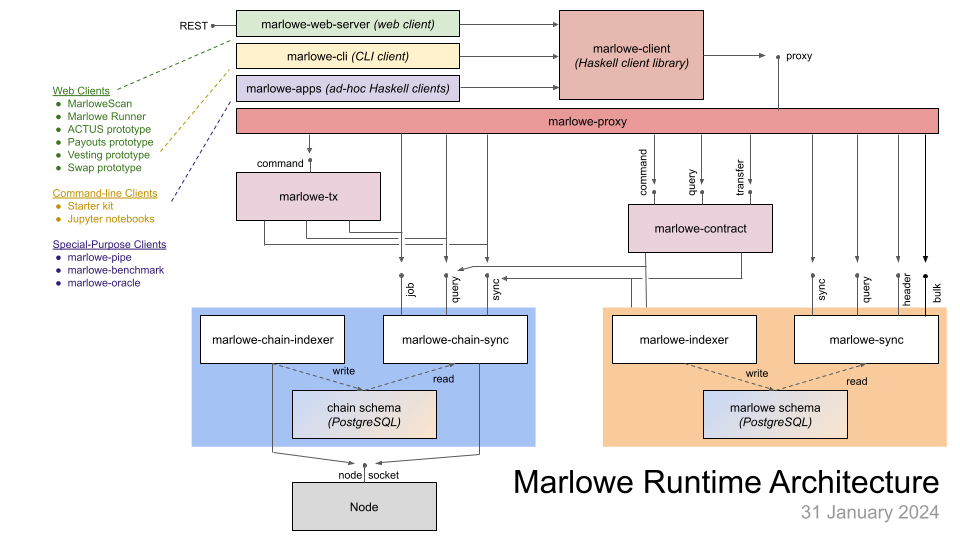

# Marlowe Runtime Documentation

Marlowe Runtime is the application backend for managing Marlowe contracts. It provides easy-to-use, higher-level APIs (application programming interfaces) and complete backend services that enable developers to build and deploy enterprise and Web(3) (D)app solutions using Marlowe, but without having to assemble “plumbing” that manually orchestrates a backend workflow for a Marlowe-based application.

Runtime provides developers access to the off-chain logic required to run Marlowe contracts and track their progress. This involves querying information about contracts, discovering contracts, reading the history and state of a contract, and subscribing to live contract updates. It also involves interacting with contracts: creating new contracts, applying contract inputs, and withdrawing funds paid out to a party.

Developers of Web3 DApps who run Marlowe contracts can use the Marlowe Runtime as a backend service to create, run, and inspect contracts easily. The Marlowe Runtime will allow developers to actively collect data, monitor and notify about contract changes on the blockchain. Such a feature is necessary when integrating with the end-user interface. For example, it allows for displaying any prompts or error messages on the user interface, so that the user can take action, which will be then sent to the blockchain via Runtime, without the use of low-level tools.

Knowledge of Haskell or Plutus is not required for developers to communicate with Runtime. Communication with Runtime over REST and/or WebSocket APIs is language-agnostic, so developers can use a language of their choice (e.g., Python, JavaScript, or Rust). However, the Runtime backend can interact directly with Haskell-based clients.

## Architecture

The backend for Marlowe runtime consists of a chain-indexing service (`chainseekd`), a history-tracking service for Marlowe contracts (`marlowe-history`), a discovery service for Marlowe contracts (`marlowe-discovery`), and a transaction-creation service for Marlowe contracts (`marlowe-tx`). These backend services operate in concert and rely upon [cardano-node](https://github.com/input-output-hk/cardano-node/blob/master/README.rst) for blockchain connectivity and upon [PostgreSQL](https://www.postgresql.org/) for persistent storage. Access to the backend services is provided via a command-line client (`marlowe`), an AWS Lambda function (`marlowe-lambda`), or a REST/WebSocket server (`web-server`) that uses JSON payloads. Web applications can integrate with a [CIP-30 light wallet](https://cips.cardano.org/cips/cip30/) for transaction signing, whereas enterprise applications can integrate with [cardano-wallet](https://github.com/input-output-hk/cardano-wallet/blob/master/README.md), [cardano-cli](https://github.com/input-output-hk/cardano-node/blob/master/cardano-cli/README.md), or [cardano-hw-cli](https://github.com/vacuumlabs/cardano-hw-cli/blob/develop/README.md) for signing transactions.

## Backend Services

The backend services for use typed protocols over TCP sockets, with ports separate by concerns (i.e., control, query, and synchronization). Each service handles rollbacks via the use of intersection points that reference specific slots/blocks on the blockchain. Most of the data flow is stream-oriented and the services are as stateless as possible. The information flow within the backend maximizes the node as the single source of truth, thus minimizing the danger of downstream components receiving inconsistent information. The Haskell types in the client API for Runtime Clients are decoupled from dependencies upon the numerous Cardano packages for the ledger, node, plutus, etc., so that a Haskell client for Runtime has very few Runtime or Cardano dependencies in its `.cabal` file.

See the [tutorial for the Marlowe Runtime command-line-interface](tutorial.md) or the [deployment instructions for the Marlowe Runtime backend](deployment.md) for more information.

### Chain Seek Daemon

The `chainseekd` executable provides services for querying the blockchain for information that may relate to Marlowe contracts. It manages and updates partitioned PostgreSQL tables for all blocks, transactions, inputs, outputs, and assets on the blockchain, not just for Marlowe transactions. It handles rollbacks in the blockchain. It syncs from the genesis block rapidly for test networks like `preprod` and `preview`, but currently takes about 15 hours to sync from the genesis of `mainnet`.

Three APIs, accessible over three different TCP sockets, are provided:
- The *job* API provides one function:
	- Submit a transaction to the local Cardano node.
- The *query* API provides two functions:
	- Query the local state of the Cardano node for information such as the system start time, the protocol parameters, or the slotting.
	- Get the unspent UTxOs.
- The *sync* API streams or replays the block and transaction information from the Cardano node.

See `chainseekd`'s [help page](chainseekd.md) or its [deployment instructions](../../marlowe-chain-sync/ReadMe.md) for more information.

### Marlowe History

The `marlowe-history` executable provides services for querying the on-chain history of Marlowe contracts. It uses `chainseekd` to follow the progress of a set of Marlowe contract instances, and it handles rollbacks in the blockchain.

Three APIs, accessible over three different TCP sockets, are provided:
- The *job* API supports two operations:
	- Start following the history of a contract instance.
	- Stop following the history of a contract instance.
- The *query* API supports two types of queries:
	- Fetch the status of all contracts followed by the service.
	- Fetch the status of contracts in a provided set of contract identifiers.
- The *sync* API provides several capabilities:
	- Find a contract instance on the blockchain, starting from the genesis block.
	- Find a contract instance on the blockchain, starting from a list of intersection points on the blockchain.
	- Retrieve the next transactions for a contract instance on the blockchain after a specified point on the blockchain.
	- Follow the history of a contract instance.
	- Retrieve the current status of all of the contract instances being followed.

See `marlowe-history`'s [help page](marlowe-history.md) for more information.

### Marlowe Discovery

The `marlowe-discovery` executable provides services for discoverying the on-chain presence of Marlowe contracts. It uses `chainseekd` to detect the presence of contract instance of known versions of Marlowe, and it handles rollbacks in the blockchain.

Two APIs, accessible over two different TCP sockets, are provided:
- The *query* API supports two types of queries:
	- Fetch the contract information for all Marlowe contract instances.
	- Fetch the contract information for all Marlowe contract instances that use a particular currency symbol for their role tokens.
- The *sync* API provides two capabilities:
	- Retrieve the contract information for all Marlowe contracts after a specified point on the blockchain.
	- Retrieve the most recent valid block header from a given list of intersection points on the blockchain.

See `marlowe-discovery`'s [help page](marlowe-discovery.md) for more information.

### Marlowe Transaction

The `marlowe-tx` executable provides services related to building and submitting transactions for Marlowe contracts. It uses `chainseekd` and `marlowe-history` to gather the information needed to create and apply inputs to Marlowe contract instances. It also communicates with the Cardano node to submit transactions after they have been signed.

There are three categories of Marlowe transactions on the blockchain:
- The creation of a new Marlowe contract.
- The application of zero or more inputs to a Marlowe contract:
	- Deposit funds.
	- Make a choice.
	- Notify the contract to check a condition.
- The withdrawal of funds paid out by the contract, in cases where the funds are paid to a Marlowe *role* instead of a public-key-hash address.

The UTxO diagrams below show the typical patterns of inputs and outputs in the three categories of Marlowe transactions. The `marlowe-tx` service constructs transactions according to the constraints of the Marlowe language, the funds available in the wallet, and the state of the ledger.

| Creation | Application of Inputs (Deposit, Choose, Notify, Timeout) | Withdrawal of Funds Paid |
|---|---|---|
|  |  |  |

The *command* API, accessible over a TCP socket, provides the following capabilities:
- Build the creation transaction for a Marlowe contract.
- Build an input-application transaction for a contract instance.
- Build a withdrawal transaction for a Marlowe payout.
- Submit a transaction to the Cardano node.

See `marlowe-tx`'s [help page](marlowe-tx.md) for more information.

## Command-Line Interface

The `marlowe` executable provides a command-line interface to interacting with Marlowe Runtime services. All communication is via TCP sockets with a Haskell-centric serialization format. It can be used to discover, query, create, apply inputs, withdraw, or submit Marlowe transactions. Note that it does not support private-key management and it defers signing to external tools such as [cardano-wallet](https://github.com/input-output-hk/cardano-wallet/blob/master/README.md), [cardano-cli](https://github.com/input-output-hk/cardano-node/blob/master/cardano-cli/README.md), or [cardano-hw-cli](https://github.com/vacuumlabs/cardano-hw-cli/blob/develop/README.md).

See `marlowe-tx`'s various [help pages](marlowe-tx.md) for more information, or the tutorial for Marlowe runtime [as a Jupyter notebook](tutorial.ipynb) or in [markdown format](tutorial.md). There are more examples [here](../examples/).
- Building transactions
	- [Create a contract](marlowe/create.md)
	- [Advance a contract through a timeout](marlowe/advance.md)
	- [Apply a choice to a contract](marlowe/choose.md)
	- [Deposit funds into a contract](marlowe/deposit.md)
	- [Notify a contract](marlowe/notify.md)
	- [Apply multiple inputs to a contract](marlowe/apply.md)
	- [Withdraw funds paid by a contract](marlowe/withdraw.md)
- Submitting transactions
	- [Submit a signed transaction to the node](marlowe/submit.md)
- Querying history
	- [List the contracts being tracked](marlowe/ls.md)
	- [Add a contract to the set of tracked contracts](marlowe/add.md)
	- [Remove a contract from the set of tracked contracts](marlowe/rm.md)
	- [Output the History of a contract](marlowe/log.md)

## AWS Lambda Interface

The Marlowe Runtime client for AWS Lambda is documented in a separate repository, [`marlowe-lambda`](https://github.com/input-output-hk/marlowe-lambda). In brief, it enables users to create, apply inputs to, and withdraw funds from Marlowe contract instances; it also lets them list all of the Marlowe contracts on the blockchain and to examine their on-chain status and contents.

## Web Services

*The development of Marlowe Runtime web services is an ongoing work in progress.*

## Related Documentation

### Overview of Marlowe Language

-   [Marlowe website](https://marlowe-finance.io/)
-   [Marlowe language github repository](https://github.com/input-output-hk/marlowe/)
-   [Tutorial](https://play.marlowe-finance.io/doc/marlowe/tutorials/index.html)
-   Publications:
    -   Dmytro Kondratiuk, Pablo Lamela, Alexander Nemish, Simon Thompson, *[Standardized crypto-loans on the Cardano blockchain](https://iohk.io/en/research/library/papers/standardized-crypto-loans-on-the-cardano-blockchain/]*, February/2021, Workshop on Trusted Smart Contracts (Financial Cryptography 2021).
    -   Pablo Lamela, David Smith, Simon Thompson, *[Efficient static analysis of Marlowe contracts](https://iohk.io/en/research/library/papers/efficient-static-analysis-of-marlowe-contracts/)*, September/2020, ISoLA 2020.
    -   Pablo Lamela, Alexander Nemish, David Smith, Simon Thompson, *[Marlowe: implementing and analysing financial contracts on blockchain](https://iohk.io/en/research/library/papers/marlowe-implementing-and-analysing-financial-contracts-on-blockchain/)*, January/2020, Workshop on Trusted Smart Contracts (Financial Cryptography 2020).
    -   Pablo Lamela, Simon Thompson, *[Marlowe: financial contracts on blockchain](https://iohk.io/en/research/library/papers/marlowe-financial-contracts-on-blockchain/)*, October/2018, ISoLA 2018.

### Example Marlowe Contracts

- [Simple Examples](../../marlowe/example-contracts.md#simple-examples)
- [ACTUS Financial Contracts](../../marlowe/example-contracts.md#actus-financial-contracts)
- [Examples in Marlowe Playground](../../marlowe/example-contracts.md#examples-in-marlowe-playground)
- [Generating Marlowe from Haskell](../../marlowe/example-contracts.md#generating-marlowe-from-haskell)
- [Marlowe Runtime](../../marlowe/example-contracts.md#marlowe-runtime)
- [Cookbook of Miscellaneous Contracts](../../marlowe/example-contracts.md#cookbook-of-miscellaneous-contracts)
- [Solutions to Hackathon Challenges](../../marlowe/example-contracts.md#solutions-to-hackathon-challenges)

### Marlowe Language and Semantics

-   [Executable specification in Isabelle](https://github.com/input-output-hk/marlowe/isabelle/)
-   [Marlowe Specification, Version 3](../marlowe/specification/marlowe-isabelle-specification-4f9fa249fa51ec09a4f286099d5399eb4301ed49.pdf)

### Marlowe Implementation on Cardano

-   [Marlowe-Cardano specification](../../marlowe/specification/marlowe-cardano-specification.md)
-   [Marlowe-Cardano github repository](https://github.com/input-output-hk/marlowe-cardano/)
-   [Test report](../marlowe/test/test-report.md)
-   [Testing framework](../marlowe/test/)

### Testing tools:

-   [Marlowe CLI](../../marlowe-cli/ReadMe.md)
-   [Scripted on-chain tests](../../marlowe-cli/run-nonpab-tests.sh)
-   [DSL-based off- and on-chain tests](../../marlowe-cli/test/non-pab)
-   [Debugging cookbook](../debugging-cookbook.md)
