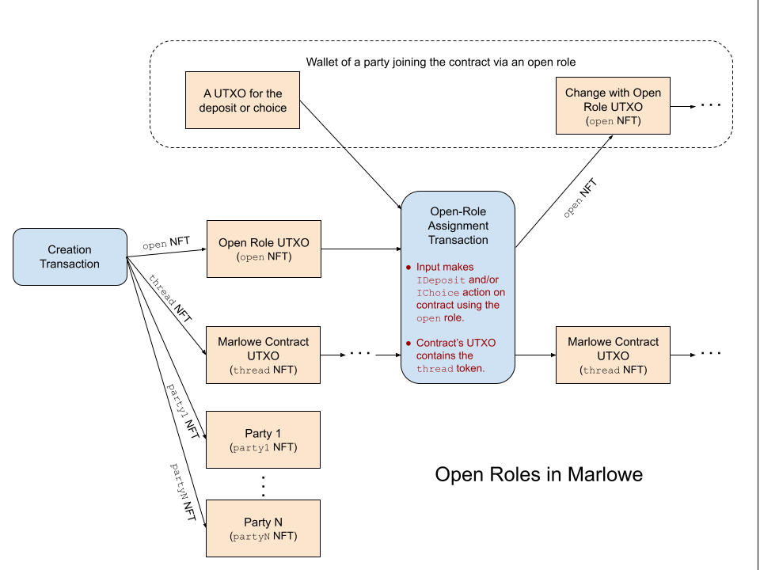
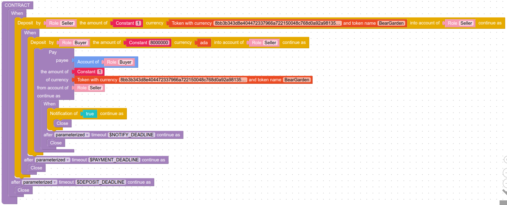

# Open Roles in Marlowe

Although all the roles in a Marlowe contract must be specified when the contract is instantiated on the block-chain, the contract's role tokens need not be distributed to payment addresses at that time. Some roles can be left "open" for later assignment and distribution by sending them to a Plutus script called the open-roles validator when they are initially minted. That Plutus script holds the role token until a party makes an `IDeposit` or `IChoice` action as input to the contract; as they perform that action in a transaction, the open-role validator releases the role token to their wallet. This allows parties not identified by address at the time of the contract's instantiation to later participate in the contract.


## Details

One or more open roles can be included in a Marlowe contract by specifying them when Marlowe Runtime builds the transaction for instantiating the contract.

-   The creation transaction for the Marlowe contract does the following:
    -   Places the thread token in the contract's UTXO.
    -   Creates a UTXO for the open-roles validator.
        -   The `Datum` references the thread token that is placed in the contract's UTXO.
        -   The `Value` contains the open-role token.
-   The open-role assignment transaction does the following:
    -   Transfers the open-role token to the change address for the transaction.
    -   Verifies the validity of the transaction.
        -   The open-role validator ensures that `IDeposit` and/or `IChoice` actions for the open role are present in the input.
        -   The open-role validator ensures that the contract's UTXO contains the required thread token.
        -   The Marlowe semantics validator does its usual validation, including checking that the relevant inputs are authorized by the open-role token.




### Minting open roles

If role tokens are minted when the contract is created, specify the *thread role* required by the open-role validator and each *open role*. The example below has a thread role name `Thread`, and open role named `Buyer`, and a standard role named `Seller`. In the example below, the creation transaction will mint and send the thread role `Thread` to the Marlowe contract, the open role `Buyer` to the open-roles validator, and the role `Seller` to the seller's wallet address.

```yaml
roles:
  Buyer:
    script: OpenRole
  Seller: addr_test1vq9prvx8ufwutkwxx9cmmuuajaqmjqwujqlp9d8pvg6gupczgtm9j
threadRoleName: Thread
```

### Pre-minted open roles

If role tokens have already been minted and are held in the wallet of the contract's creator, then specify the policy ID, the name of the thread token, and the names of the open-role tokens. In the example below, the creation transaction will send the thread role token `Thread` to the Marlowe contract and the open role `Buyer` to the open-roles validator. Any standard role tokens will have to be distributed to parties manually.

```yaml
roles:
  script: OpenRole
  policyId: ac5591a09baca1e04b5b2f086210cd1a9451032e02c1a327d13ee767
  openRoleNames:
    - Buyer
threadRoleName: Thread
```

### Distribution of open-role tokens

The open-role validator authorizes the distribution of the open-role token that it holds to anyone who performs the contract's first action that takes the open role as input. After they have received the open-role token, they can use it as a role token for any future inputs to the contract or for any withdrawals from the role-payout validator address.

Furthermore, the open-role validator will only validate if the Marlowe contract holds the thread token specified when the open-role validator is created. This ties the open role to a particular Marlowe contract.


### Security restriction for open roles

Marlowe's prevention of double-satisfaction attacks requires that no external payments be made from a Marlowe contract if another Plutus script runs in the transaction. Thus, if an open-role is distributed in a transaction, the transaction cannot do `Pay` to parties or implicit payments upon `Close`. Typically, the distribution of an open-role in a Marlowe contract will be followed by a `Notify TrueObs` case so that further execution of the contract does not proceed in that transactions. External payments can be made in subsequent transactions.


## Example

The open-roles validator lets *anyone with a Cardano address* make a deposit or choice input for a contract that uses open roles. A simple use case for open roles is when a seller might offer a token for sale to anyone who pays the sales price.

1. The seller creates a contract that offers one `BearGarden` token for sale at the price of 8 ada.
2. The seller deposits the `BearGarden` token.
3. Anyone can join the contract by depositing the sale price of 8 ada into the contract. In that transaction, the open-role validator will pay them the `Buyer` token so that they are now a party to the contract.
4. Anyone notifies the contract to complete its operation and pay the 8 ada to Marlowe's role-payout validator address for the benefit of the seller and one `BearGarden` for the benefit of the buyer. The `Notify TrueObs` is present because of the aforementioned security restriction.
5. The seller withdraws their 8 ada from the role-payout validator address.
6. The buyer withdraws their one `BearGarden` from the role-payout validator address.



### Prerequisites

Select the Cardano network and Marlowe Runtime instance.


```bash
export CARDANO_NODE_SOCKET_PATH=node.socket
export CARDANO_TESTNET_MAGIC=1

CARDANO_CLI=$(which cardano-cli)
MARLOWE_CLI=$(which marlowe-cli)

MRT_URL=http://127.0.0.1:18080
```

Set the signing key and address for the contract's creator.


```bash
PAYMENT_ADDR=$(cat payment.testnet.address)
PAYMENT_SKEY=payment.skey
echo $PAYMENT_ADDR
```

    addr_test1vq9prvx8ufwutkwxx9cmmuuajaqmjqwujqlp9d8pvg6gupczgtm9j


### Design the contract

Set the deadlines for action.


```bash
DEPOSIT_DEADLINE=$((1000 * $(date -u -d "$date + 10 minutes" +%s)))
PAYMENT_DEADLINE=$((1000 * $(date -u -d "$date + 30 minutes" +%s)))
NOTIFY_DEADLINE=$((1000 * $(date -u -d "$date + 35 minutes" +%s)))
```

Create a JSON file containing the contract.


```bash
yaml2json << EOI > contract.json
when:
- case:
    party:
      role_token: Seller
    deposits: 1
    of_token:
      currency_symbol: 8bb3b343d8e404472337966a722150048c768d0a92a9813596c5338d
      token_name: BearGarden
    into_account:
      role_token: Seller
  then:
    when:
    - case:
        party:
          role_token: Buyer
        deposits: 8000000
        of_token:
          currency_symbol: ''
          token_name: ''
        into_account:
          role_token: Seller
      then:
        pay: 1
        token:
          currency_symbol: 8bb3b343d8e404472337966a722150048c768d0a92a9813596c5338d
          token_name: BearGarden
        to:
          account:
            role_token: Buyer
        from_account:
          role_token: Seller
        then:
          when:
          - case:
              notify_if: true
            then: close
          timeout: $NOTIFY_DEADLINE
          timeout_continuation: close
    timeout: $PAYMENT_DEADLINE
    timeout_continuation: close
timeout: $DEPOSIT_DEADLINE
timeout_continuation: close
EOI
cat contract.json
```

    {"timeout":1698255877000,"timeout_continuation":"close","when":[{"case":{"deposits":1,"into_account":{"role_token":"Seller"},"of_token":{"currency_symbol":"8bb3b343d8e404472337966a722150048c768d0a92a9813596c5338d","token_name":"BearGarden"},"party":{"role_token":"Seller"}},"then":{"timeout":1698257077000,"timeout_continuation":"close","when":[{"case":{"deposits":8000000,"into_account":{"role_token":"Seller"},"of_token":{"currency_symbol":"","token_name":""},"party":{"role_token":"Buyer"}},"then":{"from_account":{"role_token":"Seller"},"pay":1,"then":{"timeout":1698257377000,"timeout_continuation":"close","when":[{"case":{"notify_if":true},"then":"close"}]},"to":{"account":{"role_token":"Buyer"}},"token":{"currency_symbol":"8bb3b343d8e404472337966a722150048c768d0a92a9813596c5338d","token_name":"BearGarden"}}}]}}]}


### Transaction 1. Create the contract

Craft the request specifying the contract and its role tokens.


```bash
USE_PREMINTED_ROLES=0

if [[ "$USE_PREMINTED_ROLES" == 1 ]]
then

# The request takes the following form if role tokens have already been minted.

yaml2json << EOI > request-1.json
version: v1
contract: $(cat contract.json)
roles:
  script: OpenRole
  policyId: ac5591a09baca1e04b5b2f086210cd1a9451032e02c1a327d13ee767
  threadRoleName: Thread
  openRoleNames:
    - Buyer
minUTxODeposit: $((2 * 1000000))
metadata: {}
tags: {}
EOI

else

# The request takes the following form if Marlowe Runtime will mint the role tokens.

yaml2json << EOI > request-1.json
version: v1
contract: $(cat contract.json)
roles:
  Thread:
    script: ThreadRole
  Buyer:
    script: OpenRole
  Seller: $PAYMENT_ADDR
minUTxODeposit: $((2 * 1000000))
metadata: {}
tags: {}
EOI

fi

cat request-1.json
```

    {"contract":{"timeout":1698255877000,"timeout_continuation":"close","when":[{"case":{"deposits":1,"into_account":{"role_token":"Seller"},"of_token":{"currency_symbol":"8bb3b343d8e404472337966a722150048c768d0a92a9813596c5338d","token_name":"BearGarden"},"party":{"role_token":"Seller"}},"then":{"timeout":1698257077000,"timeout_continuation":"close","when":[{"case":{"deposits":8000000,"into_account":{"role_token":"Seller"},"of_token":{"currency_symbol":"","token_name":""},"party":{"role_token":"Buyer"}},"then":{"from_account":{"role_token":"Seller"},"pay":1,"then":{"timeout":1698257377000,"timeout_continuation":"close","when":[{"case":{"notify_if":true},"then":"close"}]},"to":{"account":{"role_token":"Buyer"}},"token":{"currency_symbol":"8bb3b343d8e404472337966a722150048c768d0a92a9813596c5338d","token_name":"BearGarden"}}}]}}]},"metadata":{},"minUTxODeposit":2000000,"roles":{"Buyer":{"script":"OpenRole"},"Seller":"addr_test1vq9prvx8ufwutkwxx9cmmuuajaqmjqwujqlp9d8pvg6gupczgtm9j","Thread":{"script":"ThreadRole"}},"tags":{},"version":"v1"}


Request that Marlowe Runtime build the creation transaction.


```bash
curl "$MRT_URL/contracts" \
  -X POST \
  -H 'Content-Type: application/json' \
  -H "X-Change-Address: $PAYMENT_ADDR" \
  -d @request-1.json \
  -o response-1.json \
  -sS
```

Record the contract ID for future use.


```bash
CONTRACT_ID="$(jq -r '.resource.contractId' response-1.json)"
echo "CONTRACT_ID = $CONTRACT_ID"
```

    CONTRACT_ID = f905e3c58e65be86ecd62ef3573b26a06cb18b88788605eb37e530911beda3b7#1


One can view the contract and its subsequent transactions on MarloweScan:


```bash
echo "https://preprod.marlowescan.com/contractView?tab=info&contractId=${CONTRACT_ID/#/%23}"
```

    https://preprod.marlowescan.com/contractView?tab=info&contractId=%23f905e3c58e65be86ecd62ef3573b26a06cb18b88788605eb37e530911beda3b7#1


Extract the unsigned transaction from the response.


```bash
jq '.resource.txBody' response-1.json > tx-1.unsigned
jq -r .type tx-1.unsigned
```

    TxBodyBabbage


Submit the transaction.


```bash
$MARLOWE_CLI transaction submit \
  --tx-body-file tx-1.unsigned \
  --required-signer $PAYMENT_SKEY \
  --timeout 600s
```

    TxId "f905e3c58e65be86ecd62ef3573b26a06cb18b88788605eb37e530911beda3b7"


### Transaction 2. The seller deposits the `BearGarden` token.

Generate the JSON for making the deposit.


```bash
$MARLOWE_CLI input deposit \
  --deposit-party Seller \
  --deposit-account Seller \
  --deposit-amount 1 \
  --deposit-token 8bb3b343d8e404472337966a722150048c768d0a92a9813596c5338d.BearGarden \
  --out-file input-2.json
json2yaml input-2.json
```

    input_from_party:
      role_token: Seller
    into_account:
      role_token: Seller
    of_token:
      currency_symbol: 8bb3b343d8e404472337966a722150048c768d0a92a9813596c5338d
      token_name: BearGarden
    that_deposits: 1


Craft the request for Marlowe Runtime.


```bash
yaml2json << EOI > request-2.json
version: v1
inputs: [$(cat input-2.json)]
metadata: {}
tags: {}
EOI
cat request-2.json
```

    {"inputs":[{"input_from_party":{"role_token":"Seller"},"into_account":{"role_token":"Seller"},"of_token":{"currency_symbol":"8bb3b343d8e404472337966a722150048c768d0a92a9813596c5338d","token_name":"BearGarden"},"that_deposits":1}],"metadata":{},"tags":{},"version":"v1"}


Compute the URL for submitting transactions for the contract.


```bash
CONTRACT_URL="$MRT_URL/`jq -r '.links.contract' response-1.json`"
echo "CONTRACT_URL = $CONTRACT_URL"
```

    CONTRACT_URL = http://127.0.0.1:18080/contracts/f905e3c58e65be86ecd62ef3573b26a06cb18b88788605eb37e530911beda3b7%231


Request that Marlowe Runtime build the deposit transaction.


```bash
curl "$CONTRACT_URL/transactions" \
  -X POST \
  -H 'Content-Type: application/json' \
  -H "X-Change-Address: $PAYMENT_ADDR" \
  -d @request-2.json \
  -o response-2.json \
  -sS
```

Extract the unsigned transaction from the response.


```bash
jq '.resource.txBody' response-2.json > tx-2.unsigned
jq -r .type tx-2.unsigned
```

    TxBodyBabbage


Submit the transaction.


```bash
$MARLOWE_CLI transaction submit \
  --tx-body-file tx-2.unsigned \
  --required-signer $PAYMENT_SKEY \
  --timeout 600s
```

    TxId "f8c9d984b4a368c92ac5e5425188840f08b6fd51d2150f82f850c827fbfd555a"


### Transaction 3. The buyer deposits 8 ada and receives the `Buyer` role token.

Generate the JSON for making the deposit.


```bash
$MARLOWE_CLI input deposit \
  --deposit-party Buyer \
  --deposit-account Seller \
  --deposit-amount 8000000 \
  --out-file input-3.json
json2yaml input-3.json
```

    input_from_party:
      role_token: Buyer
    into_account:
      role_token: Seller
    of_token:
      currency_symbol: ''
      token_name: ''
    that_deposits: 8000000


Craft the request for Marlowe Runtime.


```bash
yaml2json << EOI > request-3.json
version: v1
inputs: [$(cat input-3.json)]
metadata: {}
tags: {}
EOI
cat request-3.json
```

    {"inputs":[{"input_from_party":{"role_token":"Buyer"},"into_account":{"role_token":"Seller"},"of_token":{"currency_symbol":"","token_name":""},"that_deposits":8000000}],"metadata":{},"tags":{},"version":"v1"}


Request that Marlowe Runtime build the deposit transaction.


```bash
curl "$CONTRACT_URL/transactions" \
  -X POST \
  -H 'Content-Type: application/json' \
  -H "X-Change-Address: $PAYMENT_ADDR" \
  -d @request-3.json \
  -o response-3.json \
  -sS
```

Extract the unsigned transaction from the response.


```bash
jq '.resource.txBody' response-3.json > tx-3.unsigned
jq -r .type tx-3.unsigned
```

    TxBodyBabbage


Submit the transaction.


```bash
$MARLOWE_CLI transaction submit \
  --tx-body-file tx-3.unsigned \
  --required-signer $PAYMENT_SKEY \
  --timeout 600s
```

    TxId "d8491c4749882db4c8a9d6a61983883b795fb6796c20841ec9186f6726e1e5a3"


### Transaction 4. Notify the contract to pay the `BearGarden` and 8 ada

Generate the JSON for notifying the contract.


```bash
$MARLOWE_CLI input notify \
  --out-file input-4.json
json2yaml input-4.json
```

    input_notify
    ...


Craft the request for Marlowe Runtime.


```bash
yaml2json << EOI > request-4.json
version: v1
inputs: [$(cat input-4.json)]
metadata: {}
tags: {}
EOI
cat request-4.json
```

    {"inputs":["input_notify"],"metadata":{},"tags":{},"version":"v1"}


Request that Marlowe Runtime build the notification transaction.


```bash
curl "$CONTRACT_URL/transactions" \
  -X POST \
  -H 'Content-Type: application/json' \
  -H "X-Change-Address: $PAYMENT_ADDR" \
  -d @request-4.json \
  -o response-4.json \
  -sS
```

Extract the unsigned transaction from the response.


```bash
jq '.resource.txBody' response-4.json > tx-4.unsigned
jq -r .type tx-4.unsigned
```

    TxBodyBabbage


Submit the transaction.


```bash
$MARLOWE_CLI transaction submit \
  --tx-body-file tx-4.unsigned \
  --required-signer $PAYMENT_SKEY \
  --timeout 600s
```

    TxId "9dc3a66a7a4cb26b281970833fe86a43507294e09e907de6c3bf078a6c5511e2"


### Transaction 5. The buyer withdraws the `BearGarden` token.

Compute the URL for that transaction that paid to Marlowe's role-payout validator address.


```bash
TX4_URL="$MRT_URL/$(jq -r .links.transaction response-4.json)"
echo "TX4_URL = $TX4_URL"
```

    TX4_URL = http://127.0.0.1:18080/contracts/f905e3c58e65be86ecd62ef3573b26a06cb18b88788605eb37e530911beda3b7%231/transactions/9dc3a66a7a4cb26b281970833fe86a43507294e09e907de6c3bf078a6c5511e2


Fetch the list of payouts available for withdrawal.


```bash
curl -sS "$TX4_URL" \
| jq .resource.payouts \
> payouts.json
json2yaml payouts.json
```

    - assets:
        lovelace: 1211110
        tokens:
          8bb3b343d8e404472337966a722150048c768d0a92a9813596c5338d:
            BearGarden: 1
      payoutId: 9dc3a66a7a4cb26b281970833fe86a43507294e09e907de6c3bf078a6c5511e2#1
      role: Buyer
    - assets:
        lovelace: 8000000
        tokens: {}
      payoutId: 9dc3a66a7a4cb26b281970833fe86a43507294e09e907de6c3bf078a6c5511e2#2
      role: Seller


Craft the request for Marlowe Runtime.


```bash
yaml2json << EOI > request-5.json
payouts:
- $(jq -r '.[0].payoutId' payouts.json)
EOI
cat request-5.json
```

    {"payouts":["9dc3a66a7a4cb26b281970833fe86a43507294e09e907de6c3bf078a6c5511e2#1"]}


Request that Marlowe Runtime build the withdrawal transaction.


```bash
curl "$MRT_URL/withdrawals" \
  -X POST \
  -H 'Content-Type: application/json' \
  -H "X-Change-Address: $PAYMENT_ADDR" \
  -d @request-5.json \
  -o response-5.json \
  -sS
```

Extract the unsigned transaction from the response.


```bash
jq '.resource.txBody' response-5.json > tx-5.unsigned
jq -r .type tx-5.unsigned
```

    TxBodyBabbage


Submit the transaction.


```bash
$MARLOWE_CLI transaction submit \
  --tx-body-file tx-5.unsigned \
  --required-signer $PAYMENT_SKEY \
  --timeout 600s
```

    TxId "f605194da995697a10122dc656e4ad7f7851881123bf43d6ee3d2f1200e6a021"


### Transaction 6. The seller withdraws the 8 ada.

Craft the request for Marlowe Runtime.


```bash
yaml2json << EOI > request-6.json
payouts:
- $(jq -r '.[1].payoutId' payouts.json)
EOI
cat request-6.json
```

    {"payouts":["9dc3a66a7a4cb26b281970833fe86a43507294e09e907de6c3bf078a6c5511e2#2"]}


Request that Marlowe Runtime build the withdrawal transaction.


```bash
curl "$MRT_URL/withdrawals" \
  -X POST \
  -H 'Content-Type: application/json' \
  -H "X-Change-Address: $PAYMENT_ADDR" \
  -d @request-6.json \
  -o response-6.json \
  -sS
```

Extract the unsigned transaction from the response.


```bash
jq '.resource.txBody' response-6.json > tx-6.unsigned
jq -r .type tx-6.unsigned
```

    TxBodyBabbage


Submit the transaction.


```bash
$MARLOWE_CLI transaction submit \
  --tx-body-file tx-6.unsigned \
  --required-signer $PAYMENT_SKEY \
  --timeout 600s
```

    TxId "c644dcaa30357b30ee17be147bc52e1cdecca02eeb29ad32b1672918d3c13c5b"

