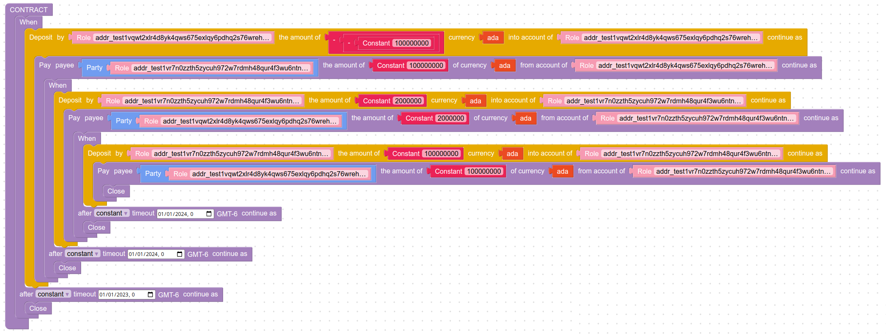
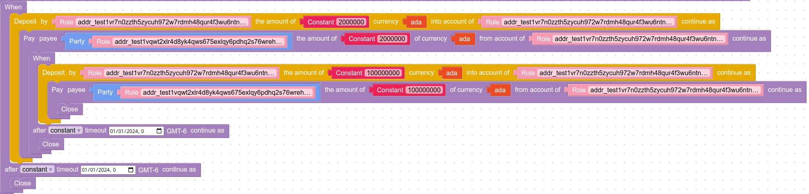
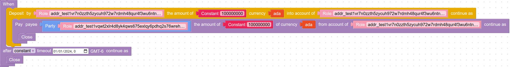

# Marlowe Runtime Tutorial: The ACTUS Principal at Maturity (PAM) Contract

This tutorial demonstrates how to run an example Marlowe contract, the ACTUS Principal at Maturity (PAM) contract, using the Marlowe Runtime backend and its command-line tool. See [tutorial.ipynb](tutorial.ipynb) to view this tutorial as a Jupyter notebook. There are more examples [here](../examples/).

## Prerequisites

Before proceeding with this tutorial, one might want to become familiar with the [Marlowe Runtime](ReadMe.md). In particular, this tutorial requires that the Marlowe Runtime backend has been installed and is running. There are two methods for running the Marlowe Runtime backend:
1. [Deploy using Docker](docker.md)
2. [Deploy individual services manually](deployment.md)

This tutorial assumes that all Marlowe Runtime services are using their default port numbers and are running on the local host. Running this tutorial also requires the [Nix package manager](https://nixos.org). Visit https://nixos.org or [Cardano-specific instructions](https://github.com/input-output-hk/marlowe-cardano/blob/main/README.adoc#nix-advice) for guidance on setting up Nix.

There are two methods for running this tutorial onself:
1. Execute commands from within this Jupyter notebook.
2. Execute commands from within a Nix shell.

Either method will provide a development environment containing the requisite command-line tools:
- `marlowe`
- `marlowe-cli`
- `cardano-cli`
- `json2yaml`
- `yaml2json`
- `jq`
- `sed`

### Running the Tutorial from within this Jupyter notebook

In a shell terminal, clone the Marlowe Cardano git repository and launch a Jupyter notebook server:
```bash
git clone https://github.com/input-output-hk/marlowe-cardano.git
cd marlowe-cardano/marlowe-runtime/doc/
nix run ../../marlowe-cli
```
This should trigger a Jupyter web page to be displayed on one's browser. Double-click on the `tutorial.ipynb` file to open the notebook. To run this tutorial, simply execute each cell of this notebook in sequence.

### Running the Tutorial from within a Nix shell

In a shell terminal, clone the Marlowe Cardano git repository and enter a Nix development shell for Marlowe Runtime:
```bash
git clone https://github.com/input-output-hk/marlowe-cardano.git
nix develop
cd marlowe-cardano/marlowe-runtime/doc/
```

This should result in a new shell being opened, with a prompt starting with `[nix develop:`. To run this tutorial, simply copy and paste the commands in each cell of this notebook into the terminal containing the Nix shell.

## The ACTUS Principal at Maturity (PAM) Contract

The ACTUS PAM contract is simply a loan with periodic interest payments on a fixed schedule and a final payment of the principal. For brevity, we demonstrate this contract with just one installment of interest, followed by the repayment of the principal.

The contract will be created from a template using the `marlowe-cli template actus` command, but it could also be created in the [Marlowe Playground](https://marlowe-playground-staging.plutus.aws.iohkdev.io/) or any other Marlowe-contract design tool that can output a Marlowe contract in JSON format. The contract looks like the following in Blockly format:



## Preliminaries

Since we will be running the contract on the Cardano blockchain, we need to specify the network we are using and set up several payment addresses and signing keys.

### Select the Cardano network

Make sure that the Marlowe Runtime backend services are running and using the default values for their ports.

The environment variable `CARDANO_NODE_SOCKET_PATH` must point to the socket file of the Cardano node and the enviornment variable `CARDANO_TESTNET_MAGIC` must equal the numeric value for the network magic. In this example, we use the `preview` network.


```bash
export CARDANO_NODE_SOCKET_PATH=node.socket
export CARDANO_TESTNET_MAGIC=2
```

### Participants

The ACTUS PAM contract has two participants:
1. The *party* that lends the funds.
2. The *counterparty* that receives the loan and pays it back with interest.

We create payment keys, signing keys, and addresses for the two participants.

#### The Party

First we specify the filenames of the payment and signing keys for the party.


```bash
PARTY_SKEY=john-fletcher.skey
PARTY_VKEY=john-fletcher.vkey
```

Create the first party's keys, if necessary.


```bash
if [[ ! -e "$PARTY_SKEY" ]]
then
  cardano-cli address key-gen --signing-key-file "$PARTY_SKEY" --verification-key-file "$PARTY_VKEY"
fi
PARTY_ADDR=$(cardano-cli address build --testnet-magic "$CARDANO_TESTNET_MAGIC" --payment-verification-key-file "$PARTY_VKEY")
echo "The party has the address $PARTY_ADDR."
```

    The party has the address addr_test1vqwt2xlr4d8yk4qws675exlqy6pdhq2s76wrehkjggkvr0cerfe8r.


Now use Daedalus or some other method to fund the address with at least 150 test Ada. Test ada can be obtained at https://docs.cardano.org/cardano-testnet/tools/faucet and Daedalus is available at https://buildkite.com/input-output-hk/daedalus.

We check that the party's address has been funded.


```bash
cardano-cli query utxo --testnet-magic "$CARDANO_TESTNET_MAGIC" --address "$PARTY_ADDR"
```

                               TxHash                                 TxIx        Amount
    --------------------------------------------------------------------------------------
    487036f0f07eefc03392381a15e2ecb02cb8882379fff1da0a48fa8ca636810b     1        150000000 lovelace + TxOutDatumNone


#### The Counterparty

Next we specify the filenames of the payment and signing keys for the counterparty.


```bash
COUNTERPARTY_SKEY=thomas-kyd.skey
COUNTERPARTY_VKEY=thomas-kyd.vkey
```

Create the second party's keys, if necessary.


```bash
if [[ ! -e "$COUNTERPARTY_SKEY" ]]
then
  cardano-cli address key-gen --signing-key-file "$COUNTERPARTY_SKEY" --verification-key-file "$COUNTERPARTY_VKEY"
fi
COUNTERPARTY_ADDR=$(cardano-cli address build --testnet-magic "$CARDANO_TESTNET_MAGIC" --payment-verification-key-file "$COUNTERPARTY_VKEY")
echo "$COUNTERPARTY_ADDR"
```

    addr_test1vrnw6sc84eycd9j3jp0nfu7q2n8gxvze7wx7g5d8srhyr4qduxruz


Now use Daedalus or some other method to fund the address with at least 150 test Ada. 

We check that the party's address has been funded.


```bash
cardano-cli query utxo --testnet-magic "$CARDANO_TESTNET_MAGIC" --address "$COUNTERPARTY_ADDR"
```

                               TxHash                                 TxIx        Amount
    --------------------------------------------------------------------------------------
    487036f0f07eefc03392381a15e2ecb02cb8882379fff1da0a48fa8ca636810b     2        150000000 lovelace + TxOutDatumNone


### Time computations


```bash
SECOND=1000
MINUTE=$((60 * SECOND))
```


```bash
NOW="$(($(date -u +%s) * SECOND))"
echo "$NOW"
```

    1666925573000


## Design the Contract

We set the parameters for the ACTUS PAM contract, first in environment variables and then in the JSON file that contains the full set of ACTUS parameters. See [marlowe-actus](../../marlowe-actus/README.md) for more information on using ACTUS in Marlowe.


```bash
SECOND=1000
MINUTE=$((60 * SECOND))
NOW="$(($(date -u +%s) * SECOND))"

ADA=1000000
MINIMUM_ADA=$((3 * ADA))

PRINCIPAL=100
INTEREST_RATE=0.02
INTEREST=$(jq -n $PRINCIPAL*$INTEREST_RATE)

STATUS_DATE=$(date -d "$(date -u -R -d @$((NOW/1000)))" +"%Y-%m-%dT00:00:00")
INITIAL_EXCHANGE_DATE=$(date -d "$(date -u -R -d @$((NOW/1000))) + 1 year" +"%Y-01-01T00:00:00")
MATURITY_DATE=$(date -d "$(date -u -R -d @$((NOW/1000))) + 2 year" +"%Y-01-01T00:00:00")
```


```bash
yaml2json << EOI > tutorial.actus
scheduleConfig:
  businessDayConvention: "NULL"
  endOfMonthConvention: "EOM"
  calendar: "NC"
maturityDate: "$MATURITY_DATE"
contractId: "0"
enableSettlement: false
initialExchangeDate: "$INITIAL_EXCHANGE_DATE"
contractRole: "RPA"
penaltyType: "O"
cycleAnchorDateOfInterestPayment: "$INITIAL_EXCHANGE_DATE"
contractType: "PAM"
notionalPrincipal: $PRINCIPAL
contractPerformance: "PF"
collateralAmount: 0
dayCountConvention: "30E360"
accruedInterest: 0
statusDate: "$STATUS_DATE"
cycleOfInterestPayment: "P1YL1"
prepaymentEffect: "N"
nominalInterestRate: $INTEREST_RATE
interestCalculationBase: "NT"
EOI
cat tutorial.actus
```

    {"accruedInterest":0,"collateralAmount":0,"contractId":"0","contractPerformance":"PF","contractRole":"RPA","contractType":"PAM","cycleAnchorDateOfInterestPayment":"2023-01-01T00:00:00","cycleOfInterestPayment":"P1YL1","dayCountConvention":"30E360","enableSettlement":false,"initialExchangeDate":"2023-01-01T00:00:00","interestCalculationBase":"NT","maturityDate":"2024-01-01T00:00:00","nominalInterestRate":0.02,"notionalPrincipal":100,"penaltyType":"O","prepaymentEffect":"N","scheduleConfig":{"businessDayConvention":"NULL","calendar":"NC","endOfMonthConvention":"EOM"},"statusDate":"2022-10-27T00:00:00"}


Now use the `marlowe-cli template actus` command to convert the ACTUS parameters into a Marlowe contract. See the documentation for [marlowe-cli template](../../marlowe-cli/doc/template.md) for more information.


```bash
marlowe-cli template actus \
  --minimum-ada "$MINIMUM_ADA" \
  --party "$PARTY_ADDR" \
  --counter-party "$COUNTERPARTY_ADDR" \
  --actus-terms-file  tutorial.actus \
  --out-contract-file tutorial-1.contract \
  --out-state-file /dev/null
```

View the contract, which closely corresponds to the Blocky diagram shown above for the contract.


```bash
json2yaml tutorial-1.contract
```

    timeout: 1672531200000
    timeout_continuation: close
    when:
    - case:
        deposits:
          negate:
            negate: 100000000
        into_account:
          address: addr_test1vqwt2xlr4d8yk4qws675exlqy6pdhq2s76wrehkjggkvr0cerfe8r
        of_token:
          currency_symbol: ''
          token_name: ''
        party:
          address: addr_test1vqwt2xlr4d8yk4qws675exlqy6pdhq2s76wrehkjggkvr0cerfe8r
      then:
        from_account:
          address: addr_test1vqwt2xlr4d8yk4qws675exlqy6pdhq2s76wrehkjggkvr0cerfe8r
        pay: 100000000
        then:
          timeout: 1704067200000
          timeout_continuation: close
          when:
          - case:
              deposits: 2000000
              into_account:
                address: addr_test1vrnw6sc84eycd9j3jp0nfu7q2n8gxvze7wx7g5d8srhyr4qduxruz
              of_token:
                currency_symbol: ''
                token_name: ''
              party:
                address: addr_test1vrnw6sc84eycd9j3jp0nfu7q2n8gxvze7wx7g5d8srhyr4qduxruz
            then:
              from_account:
                address: addr_test1vrnw6sc84eycd9j3jp0nfu7q2n8gxvze7wx7g5d8srhyr4qduxruz
              pay: 2000000
              then:
                timeout: 1704067200000
                timeout_continuation: close
                when:
                - case:
                    deposits: 100000000
                    into_account:
                      address: addr_test1vrnw6sc84eycd9j3jp0nfu7q2n8gxvze7wx7g5d8srhyr4qduxruz
                    of_token:
                      currency_symbol: ''
                      token_name: ''
                    party:
                      address: addr_test1vrnw6sc84eycd9j3jp0nfu7q2n8gxvze7wx7g5d8srhyr4qduxruz
                  then:
                    from_account:
                      address: addr_test1vrnw6sc84eycd9j3jp0nfu7q2n8gxvze7wx7g5d8srhyr4qduxruz
                    pay: 100000000
                    then: close
                    to:
                      party:
                        address: addr_test1vqwt2xlr4d8yk4qws675exlqy6pdhq2s76wrehkjggkvr0cerfe8r
                    token:
                      currency_symbol: ''
                      token_name: ''
              to:
                party:
                  address: addr_test1vqwt2xlr4d8yk4qws675exlqy6pdhq2s76wrehkjggkvr0cerfe8r
              token:
                currency_symbol: ''
                token_name: ''
        to:
          party:
            address: addr_test1vrnw6sc84eycd9j3jp0nfu7q2n8gxvze7wx7g5d8srhyr4qduxruz
        token:
          currency_symbol: ''
          token_name: ''


## Run the Contract

Running this example contract to completion involves four transactions on the blockchain:
1. Create the contract by depositing the minimum Ada required to store the contract on the blockchain.
2. The party deposits the funds for the loan, which triggers the payment of the principal to the counterparty.
3. The counterparty deposits their first (and only) installment of interest, which triggers its payment to the party.
4. The counterparty deposits the principal, which triggers its payment and the repayment of the minimum Ada back to the party.

### Transaction 1. Create the contract

We use the `marlowe create` command to build the transaction that creates the contract. This requires the following input data:
- `--core-file`: The name of Core Marlowe JSON file containing the contract to be created.
- `--min-utxo`: The amount of Ada to be deposited in the contract when it is created, so that the Cardano ledger's minimum-UTxO requirement is satisfied.
- `--change-address`: The Cardano address to which the leftover change from the transaction will be sent.
- `--address`: The Cardano address whose unspent UTxOs will be used to pay for the transaction.
- `--manual-sign`: The name of the file that will be created to store the unsigned transaction.

The command will create the unsigned transaction the identifier for the transaction, which is also the identifier for the Marlowe contract instance. See the [help page](marlowe/create.md) for more information about this command.


```bash
TX_1=$(
marlowe create \
  --core-file tutorial-1.contract \
  --min-utxo "$MINIMUM_ADA" \
  --change-address "$PARTY_ADDR" \
  --address "$PARTY_ADDR" \
  --manual-sign tutorial-1.txbody \
| sed -e 's/^.*"\([^\\]*\)\\.*$/\1/' \
)
CONTRACT_ID="$TX_1"
echo "CONTRACT_ID = TX_1 = $CONTRACT_ID"
```

    CONTRACT_ID = TX_1 = 54f75925a350a9cf80ff8d917b94826ab5747a126d670fa1fb4bdf4298bdd219#1


For security reasons, Marlowe Runtime will not sign transactions or handle signing keys. To sign the transaction here, we use the `cardano-cli transaction sign` tool, but any wallet or signing tool could be used.


```bash
cardano-cli transaction sign \
  --tx-body-file tutorial-1.txbody \
  --out-file     tutorial-1.tx \
  --signing-key-file "$PARTY_SKEY"
```

We now submit the transaction using Marlowe Runtime and wait for the confirmation.


```bash
marlowe submit tutorial-1.tx
```

    "{\"blockHeaderHash\":\"3c69e702facde686d13646acffc7f983dee236d2bfec470ada6e3ad8b8ead7f9\",\"blockNo\":320096,\"slotNo\":6922384}"


### View the result of creating the contract

We can now view the UTxO that holds the newly created contract. First we need to compute the address of the Marlowe contract.


```bash
CONTRACT_ADDR=$(marlowe-cli contract address)
echo "$CONTRACT_ADDR"
```

    addr_test1wp4f8ywk4fg672xasahtk4t9k6w3aql943uxz5rt62d4dvqu3c6jv


We now query the blockchain at this address, just printing this one UTxO. We see that the contract has the 3 Ada that was used to create the contract and it has a datum hash that records the contract and its state.


```bash
cardano-cli query utxo --testnet-magic "$CARDANO_TESTNET_MAGIC" --address "$CONTRACT_ADDR" | sed -n -e "1,2p;/${TX_1//#*/}/p"
```

                               TxHash                                 TxIx        Amount
    --------------------------------------------------------------------------------------
    54f75925a350a9cf80ff8d917b94826ab5747a126d670fa1fb4bdf4298bdd219     1        3000000 lovelace + TxOutDatumHash ScriptDataInBabbageEra "853ad3c1d92a5de8505923b65d039e2d4759a3786f7df70a811d716b9c8506df"


The balance of funds at the party's address reduced by the 3 Ada and the transaction fee.


```bash
cardano-cli query utxo --testnet-magic "$CARDANO_TESTNET_MAGIC" --address "$PARTY_ADDR"
```

                               TxHash                                 TxIx        Amount
    --------------------------------------------------------------------------------------
    54f75925a350a9cf80ff8d917b94826ab5747a126d670fa1fb4bdf4298bdd219     0        146785395 lovelace + TxOutDatumNone


### Use Marlowe Runtime to query information about the contract

Now that we know the contract identifier, we can ask Marlowe Runtime to watch the progress of the contract on the blockchain. See the [help page](marlowe/add.md) for more information about the `marlowe add` command.


```bash
marlowe add "$CONTRACT_ID"
```

    54f75925a350a9cf80ff8d917b94826ab5747a126d670fa1fb4bdf4298bdd219#1


See that the contract is being watched by Marlowe Runtime. See the [help page](marlowe/ls.md) for more information on the `marlowe ls` command.


```bash
marlowe ls
```

    54f75925a350a9cf80ff8d917b94826ab5747a126d670fa1fb4bdf4298bdd219#1


We can also view the contract's history, which is just the single creation transaction. See the [help page](marlowe/log.md) for more information about the `marlowe log` command.


```bash
marlowe log --show-contract "$CONTRACT_ID"
```

    mtransaction 54f75925a350a9cf80ff8d917b94826ab5747a126d670fa1fb4bdf4298bdd219 (creation)
    mContractId:      54f75925a350a9cf80ff8d917b94826ab5747a126d670fa1fb4bdf4298bdd219#1
    SlotNo:          6922384
    BlockNo:         320096
    BlockId:         3c69e702facde686d13646acffc7f983dee236d2bfec470ada6e3ad8b8ead7f9
    ScriptAddress:   addr_test1wp4f8ywk4fg672xasahtk4t9k6w3aql943uxz5rt62d4dvqu3c6jv
    Marlowe Version: 1
    
        When [
          (Case
             (Deposit Address "addr_test1vqwt2xlr4d8yk4qws675exlqy6pdhq2s76wrehkjggkvr0cerfe8r" Address "addr_test1vqwt2xlr4d8yk4qws675exlqy6pdhq2s76wrehkjggkvr0cerfe8r"
                (Token "" "")
                (NegValue
                   (NegValue
                      (Constant 100000000))))
             (Pay Address "addr_test1vqwt2xlr4d8yk4qws675exlqy6pdhq2s76wrehkjggkvr0cerfe8r"
                (Party Address "addr_test1vrnw6sc84eycd9j3jp0nfu7q2n8gxvze7wx7g5d8srhyr4qduxruz")
                (Token "" "")
                (Constant 100000000)
                (When [
                   (Case
                      (Deposit Address "addr_test1vrnw6sc84eycd9j3jp0nfu7q2n8gxvze7wx7g5d8srhyr4qduxruz" Address "addr_test1vrnw6sc84eycd9j3jp0nfu7q2n8gxvze7wx7g5d8srhyr4qduxruz"
                         (Token "" "")
                         (Constant 2000000))
                      (Pay Address "addr_test1vrnw6sc84eycd9j3jp0nfu7q2n8gxvze7wx7g5d8srhyr4qduxruz"
                         (Party Address "addr_test1vqwt2xlr4d8yk4qws675exlqy6pdhq2s76wrehkjggkvr0cerfe8r")
                         (Token "" "")
                         (Constant 2000000)
                         (When [
                            (Case
                               (Deposit Address "addr_test1vrnw6sc84eycd9j3jp0nfu7q2n8gxvze7wx7g5d8srhyr4qduxruz" Address "addr_test1vrnw6sc84eycd9j3jp0nfu7q2n8gxvze7wx7g5d8srhyr4qduxruz"
                                  (Token "" "")
                                  (Constant 100000000))
                               (Pay Address "addr_test1vrnw6sc84eycd9j3jp0nfu7q2n8gxvze7wx7g5d8srhyr4qduxruz"
                                  (Party Address "addr_test1vqwt2xlr4d8yk4qws675exlqy6pdhq2s76wrehkjggkvr0cerfe8r")
                                  (Token "" "")
                                  (Constant 100000000) Close))] 1704067200000 Close)))] 1704067200000 Close)))] 1672531200000 Close
    


### Transaction 2. Party deposits loan amount

We use the `marlowe deposit` command to build the transaction that makes the first deposit for the contract. This requires the following input data:
- `--contract`: The identifier of the contract, which is the UTxO that created the contract.
- `--from-party`: The party making the deposit.
- `--to-party`: The internal account receiving the deposit.
- `--lovelace`: The amount of lovelace being deposited.
- `--validity-lower-bound`: The earliest POSIX time (in milliseconds) for which the transaction is valid.
- `--validity-upper-bound`: The latest POSIX time (in milliseconds) for which the transaction is valid.
- `--change-address`: The Cardano address to which the leftover change from the transaction will be sent.
- `--address`: The Cardano address whose unspent UTxOs will be used to pay for the transaction.
- `--manual-sign`: The name of the file that will be created to store the unsigned transaction.

The command will create the unsigned transaction the identifier for the transaction, which is also the identifier for the Marlowe contract instance. See the [help page](marlowe/create.md) for more information about this command.


```bash
RIGHT_NOW=$(($(date -u +%s)*SECOND))

TX_2=$(
marlowe deposit \
  --contract "$CONTRACT_ID" \
  --from-party "$PARTY_ADDR" \
  --to-party "$PARTY_ADDR" \
  --lovelace "$((PRINCIPAL*ADA))" \
  --validity-lower-bound "$((RIGHT_NOW-1*MINUTE))" \
  --validity-upper-bound "$((RIGHT_NOW+2*MINUTE))" \
  --change-address "$PARTY_ADDR" \
  --address "$PARTY_ADDR" \
  --manual-sign tutorial-2.txbody \
| sed -e 's/^.*"\([^\\]*\)\\.*$/\1/' \
)

echo "TX_2 = $TX_2"
```

    TX_2 = a244dbed33d04efd7cc20d85bde1633e04e2e981802036d10033ad480a09e9fe


Sign the transaction, as we ddid previously.


```bash
cardano-cli transaction sign \
  --tx-body-file tutorial-2.txbody \
  --out-file     tutorial-2.tx \
  --signing-key-file "$PARTY_SKEY"
```

Submit the transaction using Marlowe Runtime.


```bash
marlowe submit tutorial-2.tx
```

    "{\"blockHeaderHash\":\"9b6cb2f4942c55fe33cb8fba7e5d13d8e672cb55f32252ffced3dcb5b0dc9f4f\",\"blockNo\":320097,\"slotNo\":6922389}"


### View the result of depositing the funds.

Because the deposit passed through the contract, the amount of Ada in the contract hasn't changed. The new datum hash reflects the change in the state of the contract.


```bash
cardano-cli query utxo --testnet-magic "$CARDANO_TESTNET_MAGIC" --address "$CONTRACT_ADDR" | sed -n -e "1,2p;/${TX_2//#*/}/p"
```

                               TxHash                                 TxIx        Amount
    --------------------------------------------------------------------------------------
    a244dbed33d04efd7cc20d85bde1633e04e2e981802036d10033ad480a09e9fe     1        3000000 lovelace + TxOutDatumHash ScriptDataInBabbageEra "bc50044ff8005d8e541a3819cf9b88c43bc7818ca8ab1ab455d9c8a82d41d42d"


However, the party has 100 Ada fewer at their address.


```bash
cardano-cli query utxo --testnet-magic "$CARDANO_TESTNET_MAGIC" --address "$PARTY_ADDR"
```

                               TxHash                                 TxIx        Amount
    --------------------------------------------------------------------------------------
    a244dbed33d04efd7cc20d85bde1633e04e2e981802036d10033ad480a09e9fe     0        46031732 lovelace + TxOutDatumNone


Conversely, the counterparty has 100 Ada more at their address.


```bash
cardano-cli query utxo --testnet-magic "$CARDANO_TESTNET_MAGIC" --address "$COUNTERPARTY_ADDR"
```

                               TxHash                                 TxIx        Amount
    --------------------------------------------------------------------------------------
    487036f0f07eefc03392381a15e2ecb02cb8882379fff1da0a48fa8ca636810b     2        150000000 lovelace + TxOutDatumNone
    a244dbed33d04efd7cc20d85bde1633e04e2e981802036d10033ad480a09e9fe     2        100000000 lovelace + TxOutDatumNone


### Use Marlowe Runtime to Query the Contract

There are now two transactions in the contract instance's history.


```bash
marlowe log --show-contract "$CONTRACT_ID"
```

    mtransaction 54f75925a350a9cf80ff8d917b94826ab5747a126d670fa1fb4bdf4298bdd219 (creation)
    mContractId:      54f75925a350a9cf80ff8d917b94826ab5747a126d670fa1fb4bdf4298bdd219#1
    SlotNo:          6922384
    BlockNo:         320096
    BlockId:         3c69e702facde686d13646acffc7f983dee236d2bfec470ada6e3ad8b8ead7f9
    ScriptAddress:   addr_test1wp4f8ywk4fg672xasahtk4t9k6w3aql943uxz5rt62d4dvqu3c6jv
    Marlowe Version: 1
    
        When [
          (Case
             (Deposit Address "addr_test1vqwt2xlr4d8yk4qws675exlqy6pdhq2s76wrehkjggkvr0cerfe8r" Address "addr_test1vqwt2xlr4d8yk4qws675exlqy6pdhq2s76wrehkjggkvr0cerfe8r"
                (Token "" "")
                (NegValue
                   (NegValue
                      (Constant 100000000))))
             (Pay Address "addr_test1vqwt2xlr4d8yk4qws675exlqy6pdhq2s76wrehkjggkvr0cerfe8r"
                (Party Address "addr_test1vrnw6sc84eycd9j3jp0nfu7q2n8gxvze7wx7g5d8srhyr4qduxruz")
                (Token "" "")
                (Constant 100000000)
                (When [
                   (Case
                      (Deposit Address "addr_test1vrnw6sc84eycd9j3jp0nfu7q2n8gxvze7wx7g5d8srhyr4qduxruz" Address "addr_test1vrnw6sc84eycd9j3jp0nfu7q2n8gxvze7wx7g5d8srhyr4qduxruz"
                         (Token "" "")
                         (Constant 2000000))
                      (Pay Address "addr_test1vrnw6sc84eycd9j3jp0nfu7q2n8gxvze7wx7g5d8srhyr4qduxruz"
                         (Party Address "addr_test1vqwt2xlr4d8yk4qws675exlqy6pdhq2s76wrehkjggkvr0cerfe8r")
                         (Token "" "")
                         (Constant 2000000)
                         (When [
                            (Case
                               (Deposit Address "addr_test1vrnw6sc84eycd9j3jp0nfu7q2n8gxvze7wx7g5d8srhyr4qduxruz" Address "addr_test1vrnw6sc84eycd9j3jp0nfu7q2n8gxvze7wx7g5d8srhyr4qduxruz"
                                  (Token "" "")
                                  (Constant 100000000))
                               (Pay Address "addr_test1vrnw6sc84eycd9j3jp0nfu7q2n8gxvze7wx7g5d8srhyr4qduxruz"
                                  (Party Address "addr_test1vqwt2xlr4d8yk4qws675exlqy6pdhq2s76wrehkjggkvr0cerfe8r")
                                  (Token "" "")
                                  (Constant 100000000) Close))] 1704067200000 Close)))] 1704067200000 Close)))] 1672531200000 Close
    
    mtransaction a244dbed33d04efd7cc20d85bde1633e04e2e981802036d10033ad480a09e9fe
    mContractId: 54f75925a350a9cf80ff8d917b94826ab5747a126d670fa1fb4bdf4298bdd219#1
    SlotNo:     6922389
    BlockNo:    320097
    BlockId:    9b6cb2f4942c55fe33cb8fba7e5d13d8e672cb55f32252ffced3dcb5b0dc9f4f
    Inputs:     [NormalInput (IDeposit "\"addr_test1vqwt2xlr4d8yk4qws675exlqy6pdhq2s76wrehkjggkvr0cerfe8r\"" "\"addr_test1vqwt2xlr4d8yk4qws675exlqy6pdhq2s76wrehkjggkvr0cerfe8r\"" (Token "" "") 100000000)]
    
        When [
          (Case
             (Deposit Address "addr_test1vrnw6sc84eycd9j3jp0nfu7q2n8gxvze7wx7g5d8srhyr4qduxruz" Address "addr_test1vrnw6sc84eycd9j3jp0nfu7q2n8gxvze7wx7g5d8srhyr4qduxruz"
                (Token "" "")
                (Constant 2000000))
             (Pay Address "addr_test1vrnw6sc84eycd9j3jp0nfu7q2n8gxvze7wx7g5d8srhyr4qduxruz"
                (Party Address "addr_test1vqwt2xlr4d8yk4qws675exlqy6pdhq2s76wrehkjggkvr0cerfe8r")
                (Token "" "")
                (Constant 2000000)
                (When [
                   (Case
                      (Deposit Address "addr_test1vrnw6sc84eycd9j3jp0nfu7q2n8gxvze7wx7g5d8srhyr4qduxruz" Address "addr_test1vrnw6sc84eycd9j3jp0nfu7q2n8gxvze7wx7g5d8srhyr4qduxruz"
                         (Token "" "")
                         (Constant 100000000))
                      (Pay Address "addr_test1vrnw6sc84eycd9j3jp0nfu7q2n8gxvze7wx7g5d8srhyr4qduxruz"
                         (Party Address "addr_test1vqwt2xlr4d8yk4qws675exlqy6pdhq2s76wrehkjggkvr0cerfe8r")
                         (Token "" "")
                         (Constant 100000000) Close))] 1704067200000 Close)))] 1704067200000 Close
    


We see that the contract has become smaller after the party made their deposit of principal.



### Transaction 3. Counterparty repays the loan's interest

The counterparty now repays the interest.


```bash
RIGHT_NOW=$(($(date -u +%s)*SECOND))

TX_3=$(
marlowe deposit \
  --contract "$CONTRACT_ID" \
  --from-party "$COUNTERPARTY_ADDR" \
  --to-party "$COUNTERPARTY_ADDR" \
  --lovelace "$((INTEREST*ADA))" \
  --validity-lower-bound "$((RIGHT_NOW-1*MINUTE))" \
  --validity-upper-bound "$((RIGHT_NOW+2*MINUTE))" \
  --change-address "$COUNTERPARTY_ADDR" \
  --address "$COUNTERPARTY_ADDR" \
  --manual-sign tutorial-3.txbody \
| sed -e 's/^.*"\([^\\]*\)\\.*$/\1/' \
)

echo "TX_3 = $TX_3"
```

    TX_3 = c95e11ec5370a2c0e0d77356e54e9dfdea10bbc18a0097f5f3c40a27ce2f9c30


Sign the transaction.


```bash
cardano-cli transaction sign \
  --tx-body-file tutorial-3.txbody \
  --out-file     tutorial-3.tx \
  --signing-key-file "$COUNTERPARTY_SKEY"
```

Submit the transaction using Marlowe Runtime.


```bash
marlowe submit tutorial-3.tx
```

    "{\"blockHeaderHash\":\"7d1966e36ec7da2b2926ae489b606061a2f59e2ea38cf6b9ffcd5aadcf9f954a\",\"blockNo\":320098,\"slotNo\":6922414}"


### View the results of depositing the interest

The payment of interest passed through the contract, so the net Ada in the contract hasn't changed, even though the state of the contract did change.


```bash
cardano-cli query utxo --testnet-magic "$CARDANO_TESTNET_MAGIC" --address "$CONTRACT_ADDR" | sed -n -e "1,2p;/${TX_3//#*/}/p"
```

                               TxHash                                 TxIx        Amount
    --------------------------------------------------------------------------------------
    c95e11ec5370a2c0e0d77356e54e9dfdea10bbc18a0097f5f3c40a27ce2f9c30     1        3000000 lovelace + TxOutDatumHash ScriptDataInBabbageEra "a65cd52951315be368aaaaf3c4ceeb6e644e61c5c8628461eba7147672d88612"


The party received the interest payment of 2 Ada.


```bash
cardano-cli query utxo --testnet-magic "$CARDANO_TESTNET_MAGIC" --address "$PARTY_ADDR"
```

                               TxHash                                 TxIx        Amount
    --------------------------------------------------------------------------------------
    a244dbed33d04efd7cc20d85bde1633e04e2e981802036d10033ad480a09e9fe     0        46031732 lovelace + TxOutDatumNone
    c95e11ec5370a2c0e0d77356e54e9dfdea10bbc18a0097f5f3c40a27ce2f9c30     2        2000000 lovelace + TxOutDatumNone


The counterparty has 2 Ada and the transaction fee less than previously.


```bash
cardano-cli query utxo --testnet-magic "$CARDANO_TESTNET_MAGIC" --address "$COUNTERPARTY_ADDR"
```

                               TxHash                                 TxIx        Amount
    --------------------------------------------------------------------------------------
    a244dbed33d04efd7cc20d85bde1633e04e2e981802036d10033ad480a09e9fe     2        100000000 lovelace + TxOutDatumNone
    c95e11ec5370a2c0e0d77356e54e9dfdea10bbc18a0097f5f3c40a27ce2f9c30     0        147308372 lovelace + TxOutDatumNone


### Use Marlowe Runtime to query the contract

Now we see that there are three transactions in the contract's history.


```bash
marlowe log --show-contract "$CONTRACT_ID"
```

    mtransaction 54f75925a350a9cf80ff8d917b94826ab5747a126d670fa1fb4bdf4298bdd219 (creation)
    mContractId:      54f75925a350a9cf80ff8d917b94826ab5747a126d670fa1fb4bdf4298bdd219#1
    SlotNo:          6922384
    BlockNo:         320096
    BlockId:         3c69e702facde686d13646acffc7f983dee236d2bfec470ada6e3ad8b8ead7f9
    ScriptAddress:   addr_test1wp4f8ywk4fg672xasahtk4t9k6w3aql943uxz5rt62d4dvqu3c6jv
    Marlowe Version: 1
    
        When [
          (Case
             (Deposit Address "addr_test1vqwt2xlr4d8yk4qws675exlqy6pdhq2s76wrehkjggkvr0cerfe8r" Address "addr_test1vqwt2xlr4d8yk4qws675exlqy6pdhq2s76wrehkjggkvr0cerfe8r"
                (Token "" "")
                (NegValue
                   (NegValue
                      (Constant 100000000))))
             (Pay Address "addr_test1vqwt2xlr4d8yk4qws675exlqy6pdhq2s76wrehkjggkvr0cerfe8r"
                (Party Address "addr_test1vrnw6sc84eycd9j3jp0nfu7q2n8gxvze7wx7g5d8srhyr4qduxruz")
                (Token "" "")
                (Constant 100000000)
                (When [
                   (Case
                      (Deposit Address "addr_test1vrnw6sc84eycd9j3jp0nfu7q2n8gxvze7wx7g5d8srhyr4qduxruz" Address "addr_test1vrnw6sc84eycd9j3jp0nfu7q2n8gxvze7wx7g5d8srhyr4qduxruz"
                         (Token "" "")
                         (Constant 2000000))
                      (Pay Address "addr_test1vrnw6sc84eycd9j3jp0nfu7q2n8gxvze7wx7g5d8srhyr4qduxruz"
                         (Party Address "addr_test1vqwt2xlr4d8yk4qws675exlqy6pdhq2s76wrehkjggkvr0cerfe8r")
                         (Token "" "")
                         (Constant 2000000)
                         (When [
                            (Case
                               (Deposit Address "addr_test1vrnw6sc84eycd9j3jp0nfu7q2n8gxvze7wx7g5d8srhyr4qduxruz" Address "addr_test1vrnw6sc84eycd9j3jp0nfu7q2n8gxvze7wx7g5d8srhyr4qduxruz"
                                  (Token "" "")
                                  (Constant 100000000))
                               (Pay Address "addr_test1vrnw6sc84eycd9j3jp0nfu7q2n8gxvze7wx7g5d8srhyr4qduxruz"
                                  (Party Address "addr_test1vqwt2xlr4d8yk4qws675exlqy6pdhq2s76wrehkjggkvr0cerfe8r")
                                  (Token "" "")
                                  (Constant 100000000) Close))] 1704067200000 Close)))] 1704067200000 Close)))] 1672531200000 Close
    
    mtransaction a244dbed33d04efd7cc20d85bde1633e04e2e981802036d10033ad480a09e9fe
    mContractId: 54f75925a350a9cf80ff8d917b94826ab5747a126d670fa1fb4bdf4298bdd219#1
    SlotNo:     6922389
    BlockNo:    320097
    BlockId:    9b6cb2f4942c55fe33cb8fba7e5d13d8e672cb55f32252ffced3dcb5b0dc9f4f
    Inputs:     [NormalInput (IDeposit "\"addr_test1vqwt2xlr4d8yk4qws675exlqy6pdhq2s76wrehkjggkvr0cerfe8r\"" "\"addr_test1vqwt2xlr4d8yk4qws675exlqy6pdhq2s76wrehkjggkvr0cerfe8r\"" (Token "" "") 100000000)]
    
        When [
          (Case
             (Deposit Address "addr_test1vrnw6sc84eycd9j3jp0nfu7q2n8gxvze7wx7g5d8srhyr4qduxruz" Address "addr_test1vrnw6sc84eycd9j3jp0nfu7q2n8gxvze7wx7g5d8srhyr4qduxruz"
                (Token "" "")
                (Constant 2000000))
             (Pay Address "addr_test1vrnw6sc84eycd9j3jp0nfu7q2n8gxvze7wx7g5d8srhyr4qduxruz"
                (Party Address "addr_test1vqwt2xlr4d8yk4qws675exlqy6pdhq2s76wrehkjggkvr0cerfe8r")
                (Token "" "")
                (Constant 2000000)
                (When [
                   (Case
                      (Deposit Address "addr_test1vrnw6sc84eycd9j3jp0nfu7q2n8gxvze7wx7g5d8srhyr4qduxruz" Address "addr_test1vrnw6sc84eycd9j3jp0nfu7q2n8gxvze7wx7g5d8srhyr4qduxruz"
                         (Token "" "")
                         (Constant 100000000))
                      (Pay Address "addr_test1vrnw6sc84eycd9j3jp0nfu7q2n8gxvze7wx7g5d8srhyr4qduxruz"
                         (Party Address "addr_test1vqwt2xlr4d8yk4qws675exlqy6pdhq2s76wrehkjggkvr0cerfe8r")
                         (Token "" "")
                         (Constant 100000000) Close))] 1704067200000 Close)))] 1704067200000 Close
    
    mtransaction c95e11ec5370a2c0e0d77356e54e9dfdea10bbc18a0097f5f3c40a27ce2f9c30
    mContractId: 54f75925a350a9cf80ff8d917b94826ab5747a126d670fa1fb4bdf4298bdd219#1
    SlotNo:     6922414
    BlockNo:    320098
    BlockId:    7d1966e36ec7da2b2926ae489b606061a2f59e2ea38cf6b9ffcd5aadcf9f954a
    Inputs:     [NormalInput (IDeposit "\"addr_test1vrnw6sc84eycd9j3jp0nfu7q2n8gxvze7wx7g5d8srhyr4qduxruz\"" "\"addr_test1vrnw6sc84eycd9j3jp0nfu7q2n8gxvze7wx7g5d8srhyr4qduxruz\"" (Token "" "") 2000000)]
    
        When [
          (Case
             (Deposit Address "addr_test1vrnw6sc84eycd9j3jp0nfu7q2n8gxvze7wx7g5d8srhyr4qduxruz" Address "addr_test1vrnw6sc84eycd9j3jp0nfu7q2n8gxvze7wx7g5d8srhyr4qduxruz"
                (Token "" "")
                (Constant 100000000))
             (Pay Address "addr_test1vrnw6sc84eycd9j3jp0nfu7q2n8gxvze7wx7g5d8srhyr4qduxruz"
                (Party Address "addr_test1vqwt2xlr4d8yk4qws675exlqy6pdhq2s76wrehkjggkvr0cerfe8r")
                (Token "" "")
                (Constant 100000000) Close))] 1704067200000 Close
    


We see that the contract has become even smaller after the counterparty made their deposit of interest.



### Transaction 4. Counterparty repays the loan's principal

The counterparty repays the principal.


```bash
RIGHT_NOW=$(($(date -u +%s)*SECOND))

TX_4=$(
marlowe deposit \
  --contract "$CONTRACT_ID" \
  --from-party "$COUNTERPARTY_ADDR" \
  --to-party "$COUNTERPARTY_ADDR" \
  --lovelace "$((PRINCIPAL*ADA))" \
  --validity-lower-bound "$((RIGHT_NOW-1*MINUTE))" \
  --validity-upper-bound "$((RIGHT_NOW+2*MINUTE))" \
  --change-address "$COUNTERPARTY_ADDR" \
  --address "$COUNTERPARTY_ADDR" \
  --manual-sign tutorial-4.txbody \
| sed -e 's/^.*"\([^\\]*\)\\.*$/\1/' \
)

echo "TX_4 = $TX_4"
```

    TX_4 = 5f399752c56bb5f335ec7a590d9018d50d23bcdbe173911e364da58e30ca16a3


Sign the transaction.


```bash
cardano-cli transaction sign \
  --tx-body-file tutorial-4.txbody \
  --out-file     tutorial-4.tx \
  --signing-key-file "$COUNTERPARTY_SKEY"
```

Submit the transaction using Marlowe Runtime.


```bash
marlowe submit tutorial-4.tx
```

    "{\"blockHeaderHash\":\"a484733eaf37997c3c7bc5a1572cae001b50842cbd037852cd73bb269f63c08b\",\"blockNo\":320099,\"slotNo\":6922431}"


### View the results of depositing the principal

The contract closed, so there is no UTxO at the contract address.


```bash
cardano-cli query utxo --testnet-magic "$CARDANO_TESTNET_MAGIC" --address "$CONTRACT_ADDR" | sed -n -e "1,2p;/${TX_4//#*/}/p"
```

                               TxHash                                 TxIx        Amount
    --------------------------------------------------------------------------------------


The party received their 100 Ada of principal and their initial 3 Ada used to create the contract.


```bash
cardano-cli query utxo --testnet-magic "$CARDANO_TESTNET_MAGIC" --address "$PARTY_ADDR"
```

                               TxHash                                 TxIx        Amount
    --------------------------------------------------------------------------------------
    5f399752c56bb5f335ec7a590d9018d50d23bcdbe173911e364da58e30ca16a3     1        103000000 lovelace + TxOutDatumNone
    a244dbed33d04efd7cc20d85bde1633e04e2e981802036d10033ad480a09e9fe     0        46031732 lovelace + TxOutDatumNone
    c95e11ec5370a2c0e0d77356e54e9dfdea10bbc18a0097f5f3c40a27ce2f9c30     2        2000000 lovelace + TxOutDatumNone


The counterparty's balance has dropped by the principal amount, and the transaction fee.


```bash
cardano-cli query utxo --testnet-magic "$CARDANO_TESTNET_MAGIC" --address "$COUNTERPARTY_ADDR"
```

                               TxHash                                 TxIx        Amount
    --------------------------------------------------------------------------------------
    5f399752c56bb5f335ec7a590d9018d50d23bcdbe173911e364da58e30ca16a3     0        46770803 lovelace + TxOutDatumNone
    a244dbed33d04efd7cc20d85bde1633e04e2e981802036d10033ad480a09e9fe     2        100000000 lovelace + TxOutDatumNone


### Use Marlowe Runtime to view the full history of the contract

We now see the final transaction in the contract's history.


```bash
marlowe log --show-contract "$CONTRACT_ID"
```

    mtransaction 54f75925a350a9cf80ff8d917b94826ab5747a126d670fa1fb4bdf4298bdd219 (creation)
    mContractId:      54f75925a350a9cf80ff8d917b94826ab5747a126d670fa1fb4bdf4298bdd219#1
    SlotNo:          6922384
    BlockNo:         320096
    BlockId:         3c69e702facde686d13646acffc7f983dee236d2bfec470ada6e3ad8b8ead7f9
    ScriptAddress:   addr_test1wp4f8ywk4fg672xasahtk4t9k6w3aql943uxz5rt62d4dvqu3c6jv
    Marlowe Version: 1
    
        When [
          (Case
             (Deposit Address "addr_test1vqwt2xlr4d8yk4qws675exlqy6pdhq2s76wrehkjggkvr0cerfe8r" Address "addr_test1vqwt2xlr4d8yk4qws675exlqy6pdhq2s76wrehkjggkvr0cerfe8r"
                (Token "" "")
                (NegValue
                   (NegValue
                      (Constant 100000000))))
             (Pay Address "addr_test1vqwt2xlr4d8yk4qws675exlqy6pdhq2s76wrehkjggkvr0cerfe8r"
                (Party Address "addr_test1vrnw6sc84eycd9j3jp0nfu7q2n8gxvze7wx7g5d8srhyr4qduxruz")
                (Token "" "")
                (Constant 100000000)
                (When [
                   (Case
                      (Deposit Address "addr_test1vrnw6sc84eycd9j3jp0nfu7q2n8gxvze7wx7g5d8srhyr4qduxruz" Address "addr_test1vrnw6sc84eycd9j3jp0nfu7q2n8gxvze7wx7g5d8srhyr4qduxruz"
                         (Token "" "")
                         (Constant 2000000))
                      (Pay Address "addr_test1vrnw6sc84eycd9j3jp0nfu7q2n8gxvze7wx7g5d8srhyr4qduxruz"
                         (Party Address "addr_test1vqwt2xlr4d8yk4qws675exlqy6pdhq2s76wrehkjggkvr0cerfe8r")
                         (Token "" "")
                         (Constant 2000000)
                         (When [
                            (Case
                               (Deposit Address "addr_test1vrnw6sc84eycd9j3jp0nfu7q2n8gxvze7wx7g5d8srhyr4qduxruz" Address "addr_test1vrnw6sc84eycd9j3jp0nfu7q2n8gxvze7wx7g5d8srhyr4qduxruz"
                                  (Token "" "")
                                  (Constant 100000000))
                               (Pay Address "addr_test1vrnw6sc84eycd9j3jp0nfu7q2n8gxvze7wx7g5d8srhyr4qduxruz"
                                  (Party Address "addr_test1vqwt2xlr4d8yk4qws675exlqy6pdhq2s76wrehkjggkvr0cerfe8r")
                                  (Token "" "")
                                  (Constant 100000000) Close))] 1704067200000 Close)))] 1704067200000 Close)))] 1672531200000 Close
    
    mtransaction a244dbed33d04efd7cc20d85bde1633e04e2e981802036d10033ad480a09e9fe
    mContractId: 54f75925a350a9cf80ff8d917b94826ab5747a126d670fa1fb4bdf4298bdd219#1
    SlotNo:     6922389
    BlockNo:    320097
    BlockId:    9b6cb2f4942c55fe33cb8fba7e5d13d8e672cb55f32252ffced3dcb5b0dc9f4f
    Inputs:     [NormalInput (IDeposit "\"addr_test1vqwt2xlr4d8yk4qws675exlqy6pdhq2s76wrehkjggkvr0cerfe8r\"" "\"addr_test1vqwt2xlr4d8yk4qws675exlqy6pdhq2s76wrehkjggkvr0cerfe8r\"" (Token "" "") 100000000)]
    
        When [
          (Case
             (Deposit Address "addr_test1vrnw6sc84eycd9j3jp0nfu7q2n8gxvze7wx7g5d8srhyr4qduxruz" Address "addr_test1vrnw6sc84eycd9j3jp0nfu7q2n8gxvze7wx7g5d8srhyr4qduxruz"
                (Token "" "")
                (Constant 2000000))
             (Pay Address "addr_test1vrnw6sc84eycd9j3jp0nfu7q2n8gxvze7wx7g5d8srhyr4qduxruz"
                (Party Address "addr_test1vqwt2xlr4d8yk4qws675exlqy6pdhq2s76wrehkjggkvr0cerfe8r")
                (Token "" "")
                (Constant 2000000)
                (When [
                   (Case
                      (Deposit Address "addr_test1vrnw6sc84eycd9j3jp0nfu7q2n8gxvze7wx7g5d8srhyr4qduxruz" Address "addr_test1vrnw6sc84eycd9j3jp0nfu7q2n8gxvze7wx7g5d8srhyr4qduxruz"
                         (Token "" "")
                         (Constant 100000000))
                      (Pay Address "addr_test1vrnw6sc84eycd9j3jp0nfu7q2n8gxvze7wx7g5d8srhyr4qduxruz"
                         (Party Address "addr_test1vqwt2xlr4d8yk4qws675exlqy6pdhq2s76wrehkjggkvr0cerfe8r")
                         (Token "" "")
                         (Constant 100000000) Close))] 1704067200000 Close)))] 1704067200000 Close
    
    mtransaction c95e11ec5370a2c0e0d77356e54e9dfdea10bbc18a0097f5f3c40a27ce2f9c30
    mContractId: 54f75925a350a9cf80ff8d917b94826ab5747a126d670fa1fb4bdf4298bdd219#1
    SlotNo:     6922414
    BlockNo:    320098
    BlockId:    7d1966e36ec7da2b2926ae489b606061a2f59e2ea38cf6b9ffcd5aadcf9f954a
    Inputs:     [NormalInput (IDeposit "\"addr_test1vrnw6sc84eycd9j3jp0nfu7q2n8gxvze7wx7g5d8srhyr4qduxruz\"" "\"addr_test1vrnw6sc84eycd9j3jp0nfu7q2n8gxvze7wx7g5d8srhyr4qduxruz\"" (Token "" "") 2000000)]
    
        When [
          (Case
             (Deposit Address "addr_test1vrnw6sc84eycd9j3jp0nfu7q2n8gxvze7wx7g5d8srhyr4qduxruz" Address "addr_test1vrnw6sc84eycd9j3jp0nfu7q2n8gxvze7wx7g5d8srhyr4qduxruz"
                (Token "" "")
                (Constant 100000000))
             (Pay Address "addr_test1vrnw6sc84eycd9j3jp0nfu7q2n8gxvze7wx7g5d8srhyr4qduxruz"
                (Party Address "addr_test1vqwt2xlr4d8yk4qws675exlqy6pdhq2s76wrehkjggkvr0cerfe8r")
                (Token "" "")
                (Constant 100000000) Close))] 1704067200000 Close
    
    mtransaction 5f399752c56bb5f335ec7a590d9018d50d23bcdbe173911e364da58e30ca16a3 (close)
    mContractId: 54f75925a350a9cf80ff8d917b94826ab5747a126d670fa1fb4bdf4298bdd219#1
    SlotNo:     6922431
    BlockNo:    320099
    BlockId:    a484733eaf37997c3c7bc5a1572cae001b50842cbd037852cd73bb269f63c08b
    Inputs:     [NormalInput (IDeposit "\"addr_test1vrnw6sc84eycd9j3jp0nfu7q2n8gxvze7wx7g5d8srhyr4qduxruz\"" "\"addr_test1vrnw6sc84eycd9j3jp0nfu7q2n8gxvze7wx7g5d8srhyr4qduxruz\"" (Token "" "") 100000000)]
    
    


## Cleanup

Remove the contract from history tracking. See the [help page](marlowe/rm.md) for more information on the `marlowe rm` command.


```bash
marlowe rm "$CONTRACT_ID"
```

    54f75925a350a9cf80ff8d917b94826ab5747a126d670fa1fb4bdf4298bdd219#1


```bash
marlowe ls
```
