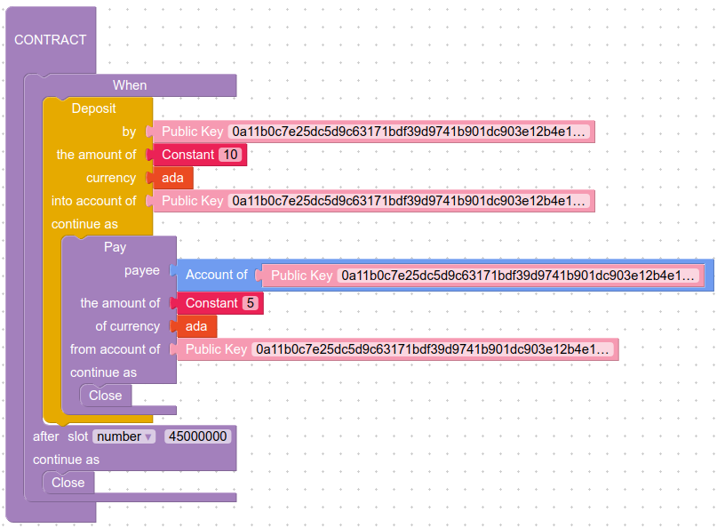

# Marlowe CLI Tutorial: Extended Example

This example for using `marlowe-cli` runs a Marlowe three-step contract on `testnet`.

1.  The contract is initially funded with 3 ADA.
2.  The sole party then deposits 10 ADA.
3.  The contract then permits 5 ADA to be payed back to the party.
4.  Finally, the contract closes and the remaining 8 ADA is withdrawn.

Here is the contract in Marlowe format;

<table>
<tr>
<td>
<ol>
<li value="0">The contract is initially funded with 3 ADA.
<li value="1">The sole party then deposits 10 ADA.
<li value="2">The contract then permits 5 ADA to be payed back to the party.
<li value="3">Finally, the contract closes and the remaining 8 ADA is withdrawn.
</ol>
<td>
<td rowspan="2">

</td>
</tr>
<tr>
<td>
<pre>
When
    [Case
        (Deposit
            (PK "0a11b0c7e25dc5d9c63171bdf39d9741b901dc903e12b4e162348e07")
            (PK "0a11b0c7e25dc5d9c63171bdf39d9741b901dc903e12b4e162348e07")
            (Token "" "")
            (Constant 10)
        )
        (Pay
            (PK "0a11b0c7e25dc5d9c63171bdf39d9741b901dc903e12b4e162348e07")
            (Account (PK "0a11b0c7e25dc5d9c63171bdf39d9741b901dc903e12b4e162348e07"))
            (Token "" "")
            (Constant 5)
            Close
        )]
    90000000 Close
</pre>
</td>
</tr>
</table>

## 1. Select the network.

Make sure that `marlowe-cli`, `cardano-cli`, and `jq` have been installed on the path for the `bash` shell. Set the environment variable `CARDANO_NODE_SOCKET_PATH` to point to the location of the socket for the `cardano-node` service. In this tutorial, we use the public `testnet`:

    NETWORK=testnet
    MAGIC="--testnet-magic 1097911063"
    export CARDANO_NODE_SOCKET_PATH=$PWD/$NETWORK.socket

## 2. Select the wallet.

Select a wallet for use in this tutorial and specify the files with the signing and payment keys. The address of this wallet is stored in the environment variable `ADDRESS_P`.

    PAYMENT_SKEY=payment.skey
    PAYMENT_VKEY=payment.vkey
    ADDRESS_P=$(cardano-cli address build $MAGIC --payment-verification-key-file $PAYMENT_VKEY)
    PUBKEYHASH_P=$(cardano-cli address key-hash --payment-verification-key-file $PAYMENT_VKEY)

## 3. Find the contract address.

Next we compute the contract address.

    ADDRESS_S=$(marlowe-cli address $MAGIC)
    echo $ADDRESS_S

## 4. Create the Plutus script for the validator.

Now we create the Plutus script for the contract.

    marlowe-cli validator $MAGIC --out-file example.plutus

## 5. Generate the example contract, state, and inputs files for each step.

Because the contract has three steps, we generate three sets of contracts, states, and inputs. Then we create the datums and validators for each step.

    marlowe-cli example --write-files > /dev/null
    for i in 0 1 2
    do
      sed -e '/pk_hash/s/"d7604c[^"]*"$/"'$PUBKEYHASH_P'"/' \
          -e   '/bytes/s/"d7604c[^"]*"$/"'$PUBKEYHASH_P'"/' \
          -i example-$i.contract                            \
          -i example-$i.state                               \
          -i example-$i.inputs
      marlowe-cli datum    --contract-file example-$i.contract \
                           --state-file    example-$i.state    \
                           --out-file      example-$i.datum
      marlowe-cli redeemer --inputs-file   example-$i.inputs   \
                           --out-file      example-$i.redeemer
    done

## 6. Find some funds, and enter the selected UTxO as "TX_0".

Before running the contract, we need to put funds into it. Examine the UTxOs at the wallet address:

    cardano-cli query utxo $MAGIC --address $ADDRESS_P

Select one of these UTxOs for use in funding the contract, naming it `TX_0`, and then build and submit the funding transaction:

    TX_0=eea8f4cae07b0cd72c4996193edb4a87b5c0b8e04aa068f071bf7e16a5db0611#0

## 7. Fund the contract by sending the initial funds and setting the initial state.

    TX_1=$(
    marlowe-cli create $MAGIC                                  \
                       --socket-path $CARDANO_NODE_SOCKET_PATH \
                       --script-address $ADDRESS_S             \
                       --tx-out-datum-file example-2.datum     \
                       --tx-out-value 3000000                  \
                       --tx-in $TX_0                           \
                       --change-address $ADDRESS_P             \
                       --out-file tx.raw                       \
    | sed -e 's/^TxId "\(.*\)"$/\1/'
    )
    echo TxId $TX_1
    
    marlowe-cli submit $MAGIC                                  \
                       --socket-path $CARDANO_NODE_SOCKET_PATH \
                       --required-signer $PAYMENT_SKEY         \
                       --tx-body-file tx.raw

## 8. Wait until the transaction is appears on the blockchain.

    cardano-cli query utxo $MAGIC --address $ADDRESS_S

## 9. Deposit 10 ADA.

The first step of the contract involves depositing 10 ADA.

    TX_2=$(
    marlowe-cli advance $MAGIC                                   \
                        --socket-path $CARDANO_NODE_SOCKET_PATH  \
                        --script-address $ADDRESS_S              \
                        --tx-in-script-file example.plutus       \
                        --tx-in-redeemer-file example-2.redeemer \
                        --tx-in-datum-file example-2.datum       \
                        --required-signer $PAYMENT_SKEY          \
                        --tx-in-marlowe $TX_1#1                  \
                        --tx-in $TX_1#0                          \
                        --tx-in-collateral $TX_1#0               \
                        --tx-out-datum-file example-1.datum      \
                        --tx-out-value 13000000                  \
                        --tx-out $ADDRESS_P+50000000             \
                        --change-address $ADDRESS_P              \
                        --invalid-before    40000000             \
                        --invalid-hereafter 80000000             \
                        --out-file tx.raw                        \
    | sed -e 's/^TxId "\(.*\)"$/\1/'
    )
    echo TxId $TX_2
    
    marlowe-cli submit $MAGIC                                  \
                       --socket-path $CARDANO_NODE_SOCKET_PATH \
                       --required-signer $PAYMENT_SKEY         \
                       --tx-body-file tx.raw

## 10. Wait until the transaction is appears on the blockchain.

    cardano-cli query utxo $MAGIC --address $ADDRESS_S

## 11. Pay 5 ADA back.

Now the contract allows 5 ADA to be paid from the contract.

    TX_3=$(
    marlowe-cli advance $MAGIC                                   \
                        --socket-path $CARDANO_NODE_SOCKET_PATH  \
                        --script-address $ADDRESS_S              \
                        --tx-in-script-file example.plutus       \
                        --tx-in-redeemer-file example-1.redeemer \
                        --tx-in-datum-file example-1.datum       \
                        --required-signer $PAYMENT_SKEY          \
                        --tx-in-marlowe $TX_2#1                  \
                        --tx-in $TX_2#0                          \
                        --tx-in-collateral $TX_2#0               \
                        --tx-out-datum-file example-0.datum      \
                        --tx-out-value 8000000                   \
                        --tx-out $ADDRESS_P+50000000             \
                        --change-address $ADDRESS_P              \
                        --invalid-before    40000000             \
                        --invalid-hereafter 80000000             \
                        --out-file tx.raw                        \
    | sed -e 's/^TxId "\(.*\)"$/\1/'
    )
    echo TxId $TX_3
    
    marlowe-cli submit $MAGIC                                  \
                       --socket-path $CARDANO_NODE_SOCKET_PATH \
                       --required-signer $PAYMENT_SKEY         \
                       --tx-body-file tx.raw

## 12. Wait until the transaction is appears on the blockchain.

    cardano-cli query utxo $MAGIC --address $ADDRESS_S

## 13. Withdrawn the remaining 8 ADA.

Finally, the contract allows the remaining 8 ADA to be paid out.

    TX_4=$(
    marlowe-cli close $MAGIC                                  \
                      --socket-path $CARDANO_NODE_SOCKET_PATH \
                      --tx-in-script-file example.plutus      \
                      --tx-in-redeemer-file example-0.redeemer\
                      --tx-in-datum-file example-0.datum      \
                      --tx-in-marlowe $TX_3#1                 \
                      --tx-in $TX_3#0                         \
                      --tx-in-collateral $TX_3#0              \
                      --tx-out $ADDRESS_P+8000000             \
                      --change-address $ADDRESS_P             \
                      --invalid-before    40000000            \
                      --invalid-hereafter 80000000            \
                      --out-file tx.raw                       \
    | sed -e 's/^TxId "\(.*\)"$/\1/'
    )
    echo TxId $TX_4
    
    marlowe-cli submit $MAGIC                                  \
                       --socket-path $CARDANO_NODE_SOCKET_PATH \
                       --required-signer $PAYMENT_SKEY         \
                       --tx-body-file tx.raw

## 14. See that the transaction succeeded.

After the transaction is recorded on the blockchain, we see that the funds were removed from the script address and are in the wallet.

    cardano-cli query utxo $MAGIC --address $ADDRESS_S
    
    cardano-cli query utxo $MAGIC --address $ADDRESS_P
