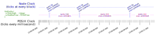
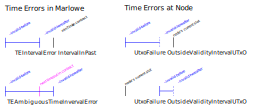

# The Marlowe Debugging Cookbook

*   [General approaches](#general-approaches)
    *   [Intrastructure](#infrastructure)
    *   [Marlowe semantics](#marlowe-semantics)
    *   [Time intervals](#time-intervals)
    *   [Transactions](#transactions)
    *   [Marlowe validator script](#marlowe-validator-script)
*   [Specific approaches](#specific-approaches)
    *   [TEApplyNoMatchError](#reapplynomatcherror)
    *   [TEAmbiguousTimeIntervalError](#teambiguoustimeintervalerror)
*   [Debugging Plutus](#debugging-plutus)
*   [Profiling Marlowe](#profiling-marlowe)


# General Approaches


## Infrastructure

*   Deserialization errors in Marlowe backend log files indicate inconsistency between the versions of components like `cardano-wallet`, `plutus-chain-index`, `marlowe-pab`, `marlowe-dashboard-server` or `marlowe-dashboard-client`. Check to make sure the commit hashes of each component matches that in the repository's [cabal.project](../cabal.project) file.
*   The PAB is silent about some configuration errors such as incorrect port numbers, missing files, or a bad path to the cardano node socket. If some backend components show no activity on their logs when they logically should, then meticulously check configuration options.
*   Time-related errors, especially `"L1+"`, indicate that the slot-to-time configuration `SlotConfig` for the PAB is inconsistent with that for the node's current epoch. Use the `marlowe-cli util slotting` command to determine the correct slotting parameters for the PAB.
*   Any "network magic" errors indicate that some PAB components are connecting to the wrong cardano testnet.


## Marlowe Semantics

*   Pay attention to the timeouts in `When` clauses of a contract:
    *   Does the timeout trigger the intended movement of funds between accounts?
    *   Is the timeout consistent with other timeouts in `Case` statements?
*   At the semantic level, these Marlowe errors can occur:
    *   `TEAmbiguousTimeIntervalError`: The time interval for a transaction straddles the timeout of a `When` statement.
    *   `TEApplyNoMatchError`: The attempted application of input to the contract was illegal.
    *   `TEIntervalError IntervalError`
        *   `InvalidInterval`: The start of the time interval is after its end.
        *   `IntervalInPast`: The interval falls before the current time.
    *   `TEUselessTransaction`: The attempted application of input does not change the state of the contract.
    *   `TEHashMismatch`: An incorrect contract was provided for the merkleized continuation.


## Time Intervals

Properly formulating time intervals is key to successful Marlowe contract execution. Here are the conditions that must hold for the time interval of applying inputs to a Marlowe contract.

Let . . .
*   `minTime` be the minimum time specified in the contract state.
*   `timeInterval[0]` be the start of the time interval ("invalid before") for submitting the transaction.
*   `timeInterval[1]` be the end of the time interval ("invalid hereafter") for submitting the transaction.
*   `nodeTime` be the current time at the node.
*   `clockTime` be the actual wallclock time.
*   `blockTime` be the time when the transaction leaves the memory pool and is executed by the block-producing node.
*   `nextTimeout` be the next timeout in the contract.
*   `nextNextTimeout` be the next timeout *in the contract's timeout continuation*, if any.

Always ensure . . .
*   Valid interval: `timeInterval[0] < timeInterval[1]`.
*   Ready to apply inputs: `minTime <= timeInterval[0]`.
*   Ready for node: `timeInterval[0] <= nodeTime < timeInterval[1]`.

If applying inputs for a `Case` clause in a `When` statement . . .
*   Before timeout: `timeInterval[1] <= nextTimeOut`.

Instead, if instead letting a timeout on a `When` statement by applying empty inputs `[]` . . .
*   After timeout: `nextTimeOut < timeInterval[0]`.
*   Not too long: `timeInterval[1] < nextNextTimeout`.

Remember . ..
*   Node time lags clock time: `nodeTime <= clockTime`.
    *   The `nodeTime` typically lags behind `clockTime` by a few seconds to even more than a minute, depending upon the testnet.
*   Confirmation delay: `blockTime at confirmation > clockTime at submission`.
    *   The `blockTime` can be seconds or minutes after the `nodeTime` when the transaction is submitted.

Here is a diagram that shows how the clock on the node jumps over slot numbers, whereas the POSIX clock progresses steadily. Each time a block is made, the node clock will report the current slot to be one plus the slot of the previous block; when a new block is make, the node would report that slot as the current slot. The time between blocks varies between about 2 seconds and 90+ seconds, depending upon network conditions, so the node clock is quite jerky. It is the node clock that is used to check the validity range (`--invalid-before` and `--invalid-hereafter`) in Marlowe and Plutus transactions, so that might be out of sync with the wall clock. Slot numbers at the node are reported as POSIX milliseconds to the Marlowe contract or any Plutus script, which means that the contract only sees integral seconds (if `scSLotLength = 1000`, as it is for most networks). 



Some of the possible timing errors are illustrated in the next diagram:




## Transactions

Transaction failures occur in either phase 1 validation (ledger rules) or phase 2 validator (Plutus execution). This section discusses ledger failures and the next one discusses script failures.

*   Validity-range errors typically result for submitting a transaction at the wrong time or using the wrong time-to-slot conversion: see the previous section on time intervals, but also check the slotting via `marlowe-cli util slotting`.
*   `TxBodyError TxBodyEmptyTxIns` indicates that a faucet or wallet is empty.
*   `TxBodyError TxBodyOutputNegative` indicates that a faucet or wallet has insufficient funds.
*   `TxBodyError NonAdaAssetsUnbalanced` indicates that the presence of native tokens have caused a problem.
*   Mysterious deserialization errors such as `Tag "toCardanoPaymentKeyHash (32 bytes)" DeserialisationError` may occur in cases where the Marlowe state (in the `Datum`) contains an invalid public key hash, currency symbol, or other byte sequence. (Generally, problems in the contract state in its creation transaction or in the contract itself can cause problems like this.) Check to make sure that all public key hashes and currency symbols are 28 bytes long. The Marlowe semantics do not enforce the size of these bytestrings, but the ledger rules do: this means that a contract might operate normally until a transaction is created that uses such a public key hash or currency symbol, at which time CBOR deserialization will fail and the contract will become unexecutable.
*   Script transactions for wallets that only contain UTxOs with native tokens will fail because collateral must be a pure-ADA UTxO.
*   Be careful regarding whether addresses contain staking keys or not, as this can affect the result of UTxO queries. The PAB and chain index mostly ignore the staking part of an address, but the Wallet does not. If it looks like the Marlowe backend is not finding UTxOs that are clearly on chain, then the presence or absence of staking information in the address may be the culprit.
*   Transactions whose size in bytes exceed the protocol limits will be rejected.
*   Plutus validation errors can mask the failure of the Wallet to balance a transaction, select coins, or compute fees.
*   Plutus validation's exceeding execution memory or cost might be reported by the Wallet as an inexplicable failure to balance the transaction.


## Marlowe Validator Script

*   If a transaction fails phase two validation, a terse Marlowe error will be reported in the Plutus trace log:
    *   `"a"`: The slot/time validity range for the transaction is infinite or semi-infinite. The range should be finite/bounded.
    *   `"b"`: All accounts must have positive balances.
    *   `"c"`: A transaction containing a contract that closes may not also include the creation of a new contract.
    *   `"d"`: The datum or value at the script output does not match the contract's transition.
    *   `"o"`: Outputing to two Marlowe scripts with the same address in the same transaction is forbidden.
    *   `"p"`: Insufficient value is paid to a public-key address.
    *   `"r"`: Insufficient value is paid in a role payout. This may occur because the role payout was adjusted to satisfy the minimum-ADA ledger rule, despite that adjustment violating the terms of the contract.
    *   `"s"`: A required public-key signature was not present in the transaction.
    *   `"t"`: The role token authorizing the application of input is not present in the transaction.
    *   `"v"`: The value input from the script does not match that specified in its datum.
    *   `"w"`: Inputting from two Marlowe scripts with the same address in the same transaction is forbidden.
    *   `"x"`: The input datum was not provided to the script.
    *   If these errors occur during Plutus validation but not outside of it, then there likely is a clock inconsistency between local time and the node.
        *   `"i" = TEAmbiguousTimeIntervalError`: The time interval for a transaction straddles the timeout of a `When` statement.
        *   `"j" = TEIntervalError InvalidInterval`: The start of the time interval is after its end.
        *   `"k" = IntervalInPast`: The interval falls before the current time.
        *   `"m" = TEHashMismatch`: An incorrect contract was provided for the merkleized continuation.
        *   `"n" = TEApplyNoMatchError`: The attempted application of input to the contract was illegal.
        *   `"u" = TEUselessTransaction`: The attempted application of input does not change the state of the contract.
*   Validation error codes not mentioned above result from Plutus or Plutus Apps functions: those generally are upper case letters and numbers.


## Specific Approaches


### TEApplyNoMatchError

Here is an example of how to debug a MarloweEvaluationError TEApplyNoMatchError using the PAB logs:

1.  Find the line that shows the inputs received by the PAB by examining its log:
    ```console
    [DEBUG:applyInputs] inputs = [ClientInput (IDeposit \"Lender\" \"Lender\" (Token \"\" \"\") 20590000)]
    ```
2.  A few lines after that, find the line that shows the state of the contract prior to the inputs:
    ```console
    [DEBUG:mkStep] currentState = MarloweData {marloweState = State {accounts = Map {unMap = [((PK
    \"55ff7536247204d8775d1310209e32899b51b9962619f01f711c22ad\",Token \"\" \"\"),2000000)]},choices
    = Map {unMap = []}, boundValues = Map {unMap = []}, minTime = POSIXTime {getPOSIXTime = 1650317347999}},
    marloweContract = When [Case (Deposit \"Borrower\" \"Borrower\" (Token \"\" \"\") (AddValue (Constant
    4000000) (Constant 20590000))) (Pay \"Borrower\" (Party \"Lender\") (Token \"\" \"\") (AddValue
    4000001) (Constant 4000000) (Constant 20590000)) Close)] (POSIXTime {getPOSIXTime = 1650318846678}) Close}
    ```
3.   Compare them to see that the input is appropriate for the current state of the contract. In this case we see that Marlowe Run sent a deposit from the Lender but the that contract was ready for the deposit from the Borrower. Hence the input truly did not match any of the Case clauses. (This might have been a result of the frontend not receiving the notification from the backend that the previous deposit by the Lender was successful, or the frontend might not have updated its state or the cards after it did receive that notification. Tracing websocket traffic would reveal which occurred.)


### TEAmbiguousTimeIntervalError

Here is another example, this time of how to debug a MarloweEvaluationError TEAmbiguousTimeIntervalError from the PAB logs:

1.  Find the current time:
    ```console
    [DEBUG:applyInputs] current time = POSIXTime {getPOSIXTime = 1650318276999}
    ```
2.  A few lines later, find the validity interval for the transaction:
    ```console
    [DEBUG:applyInputs] timeInterval = Just (POSIXTime {getPOSIXTime = 1650317947678},POSIXTime
    {getPOSIXTime = 8639977881599999})
    ```
3.  A few lines later, find the state of the contract prior to the input:
    ```console
    [DEBUG:mkStep] currentState = MarloweData {marloweState = State {accounts = Map {unMap = [((PK
    \"55ff7536247204d8775d1310209e32899b51b9962619f01f711c22ad\",Token \"\" \"\"),2000000)]}, choices
    = Map {unMap = []}, boundValues = Map {unMap = []}, minTime = POSIXTime {getPOSIXTime =
    1650317347999}}, marloweContract = When [Case (Deposit \"Borrower\" \"Borrower\" (Token \"\" \"\") (
    AddValue (Constant 4000000) (Constant 20590000))) (Pay \"Borrower\" (Party \"Lender\") (Token \"\"
    \"\") (AddValue (Constant 4000000) (Constant 20590000)) Close)] (POSIXTime {getPOSIXTime =
    1650318846678}) Close}
    ```
4.  From that state, find the `minTime` parameter and the next timeout.
5.  Organize this information sorted tabularly:
    |                |                  |
    |----------------|-----------------:|
    | minTime        |    1650317347999 |
    | interval start |    1650317948000 |
    | current	      |    1650318276999 |
    | next timeout   |    1650318846678 |
    | interval end   | 8639977881599000 |
6. In this case we see that the validity interval straddles the next timeout, thus truly creating ambiguity. For some reason Marlowe Run didn't wait until the timeout in order to close this contract by applying empty inputs.


## Debugging Plutus

This example illustrates manually passing serialized data from a Plutus validator and then deserializing it. It uses [`Plutus.Debug`](https://github.com/input-output-hk/marlowe-cardano/blob/07538266e1a4ef747da7e0263f69eac645f6904c/marlowe/src/Plutus/Debug.hs).


### Instrument the validator

Change `traceIfFalse` to [`Plutus.Debug.debugIfFalse`](https://github.com/input-output-hk/marlowe-cardano/blob/07538266e1a4ef747da7e0263f69eac645f6904c/marlowe/src/Plutus/Debug.hs#L61) with added arguments containing the data to be passed out of the script. Here we change
```Haskell
traceIfFalse "R" $ any (checkScriptOutput addr hsh value) allOutputs
```
to
```Haskell
debugIfFalse "R" (addr, hsh, value, allOutputs) $ any (checkScriptOutput addr hsh value) allOutputs
```
, which only works if the data being serialized has `IsData` instances.


### Run the script

In this example, we tried to submit a failing script and received the following output:
```console
TxBodyScriptExecutionError [(ScriptWitnessIndexTxIn 2,ScriptErrorEvaluationFailed (CekError An error has occurred:  User error:
The provided Plutus code called 'error'.
Caused by: (unBData #d8799f4152d8799fd8799fd87a9f581c571dc6f3488905883a346746540f94254be3b5151a3845fc83fc1c9effd87a80ffd87a80a140a1401a05f5e1009fd8799fd8799fd8799f581ce1ce601c08286179ae7ae6ef3a38262d4112cab0663a68dfb8e9edc5ffd87a80ffa140a14000d87a80ffd8799fd8799fd87a
9f581cb81ade746787c130f13f0cc28d72d19a755c49684fccc3d5abdd6f62ffd87a80ffa140a1401a002dc6c0d8799f58206d1de149d42e49c15e33104441c1298ce8b11b0eef7d48994bf452c3dea7b427ffffd8799fd8799fd8799f581c90304fe1d67fbcad6ce67e6a32d37f0d75f159701b7328bee5912dc9ffd87a80ffa240a1401a0
5f5e100581c8bb3b343d8e404472337966a722150048c768d0a92a9813596c5338da14f54686f6d61734d6964646c65746f6e01d87a80ffd8799fd8799fd8799f581ce1ce601c08286179ae7ae6ef3a38262d4112cab0663a68dfb8e9edc5ffd87a80ffa240a1401a002dc6c0581c8bb3b343d8e404472337966a722150048c768d0a92a981
3596c5338da14c4a6f686e466c65746368657201d87a80ffffffff)) [])]
```

### Deserialize the data

Start a cabal REPL session and import the necessary functions:
```Haskell
import Plutus.Debug
import Plutus.V1.Ledger.Address (Address)
import Plutus.V1.Ledger.Scripts (DatumHash)
import Plutus.V1.Ledger.Value (Value)
import Plutus.V1.Ledger.Api (TxOut)
import PrettyPrinter.Extras (pretty)
```

#### Raw Plutus Data

One can see the Plutus `Data` using the `recoverPlutusData` function:
```Haskell
message = "d8799f4152d8799fd8799fd87a9f581c571dc6f3488905883a346746540f94254be3b5151a3845fc83fc1c9effd87a80ffd87a80a140a1401a05f5e1009fd8799fd8799fd8799f581ce1ce601c08286179ae7ae6ef3a38262d4112cab0663a68dfb8e9edc5ffd87a80ffa140a14000d87a80ffd8799fd8799fd87a9f581cb81ade746787c130f13f0cc28d72d19a755c49684fccc3d5abdd6f62ffd87a80ffa140a1401a002dc6c0d8799f58206d1de149d42e49c15e33104441c1298ce8b11b0eef7d48994bf452c3dea7b427ffffd8799fd8799fd8799f581c90304fe1d67fbcad6ce67e6a32d37f0d75f159701b7328bee5912dc9ffd87a80ffa240a1401a05f5e100581c8bb3b343d8e404472337966a722150048c768d0a92a9813596c5338da14f54686f6d61734d6964646c65746f6e01d87a80ffd8799fd8799fd8799f581ce1ce601c08286179ae7ae6ef3a38262d4112cab0663a68dfb8e9edc5ffd87a80ffa240a1401a002dc6c0581c8bb3b343d8e404472337966a722150048c768d0a92a9813596c5338da14c4a6f686e466c65746368657201d87a80ffffffff"
pretty $ recoverPlutusData message
```
```console
(Right <"R",
<<<"W\GS\198\243H\137\ENQ\136:4gFT\SI\148%K\227\181\NAK\SUB8E\252\131\252\FS\158">,
<>>,
<>,
{"": {"": 100000000}},
[<<<"\225\206`\FS\b(ay\174z\230\239:8&-A\DC2\202\176f:h\223\184\233\237\197">,
<>>,
{"": {"": 0}},
<>>,
<<<"\184\SUB\222tg\135\193\&0\241?\f\194\141r\209\154u\\IhO\204\195\213\171\221ob">,
<>>,
{"": {"": 3000000}},
<"m\GS\225I\212.I\193^3\DLEDA\193)\140\232\177\ESC\SO\239}H\153K\244R\195\222\167\180'">>,
<<<"\144\&0O\225\214\DEL\188\173l\230~j2\211\DEL\ru\241Yp\ESCs(\190\229\145-\201">,
<>>,
{"": {"": 100000000},
"\139\179\179C\216\228\EOTG#7\150jr!P\EOT\140v\141\n\146\169\129\&5\150\197\&3\141": {"ThomasMiddleton": 1}},
<>>,
<<<"\225\206`\FS\b(ay\174z\230\239:8&-A\DC2\202\176f:h\223\184\233\237\197">,
<>>,
{"": {"": 3000000},
"\139\179\179C\216\228\EOTG#7\150jr!P\EOT\140v\141\n\146\169\129\&5\150\197\&3\141": {"JohnFletcher": 1}},
<>>]>>)
```

#### Deserialization via `FromData`

The raw plutus data is tedious to read, so we deserialize it with `fromData`.
```Haskell
recoverFromData message :: Either String (String, (Address, Maybe DatumHash, Value, [TxOut]))
```
```console
Right (
  "R",
  (
    Address {addressCredential = ScriptCredential 571dc6f3488905883a346746540f94254be3b5151a3845fc83fc1c9e, addressStakingCredential = Nothing},
    Nothing,
    Value (Map [(,Map [("",100000000)])]),
    [
      TxOut {
        txOutAddress = Address {addressCredential = PubKeyCredential e1ce601c08286179ae7ae6ef3a38262d4112cab0663a68dfb8e9edc5, addressStakingCredential = Nothing},
        txOutValue = Value (Map []),
        txOutDatumHash = Nothing
      },
      TxOut {
        txOutAddress = Address {addressCredential = ScriptCredential b81ade746787c130f13f0cc28d72d19a755c49684fccc3d5abdd6f62, addressStakingCredential = Nothing},
        txOutValue = Value (Map [(,Map [("",3000000)])]),
        txOutDatumHash = Just 6d1de149d42e49c15e33104441c1298ce8b11b0eef7d48994bf452c3dea7b427
      },
      TxOut {
        txOutAddress = Address {addressCredential = PubKeyCredential 90304fe1d67fbcad6ce67e6a32d37f0d75f159701b7328bee5912dc9, addressStakingCredential = Nothing},
        txOutValue = Value (Map [(,Map [("",100000000)]),(8bb3b343d8e404472337966a722150048c768d0a92a9813596c5338d,Map [("ThomasMiddleton",1)])]),
        txOutDatumHash = Nothing
      },
      TxOut {
        txOutAddress = Address {addressCredential = PubKeyCredential e1ce601c08286179ae7ae6ef3a38262d4112cab0663a68dfb8e9edc5, addressStakingCredential = Nothing},
        txOutValue = Value (Map [(,Map [("",3000000)]),(8bb3b343d8e404472337966a722150048c768d0a92a9813596c5338d,Map [("JohnFletcher",1)])]),
        txOutDatumHash = Nothing
      }
    ]
  )
)
```
which gives a clearer view of the on-chain data.


## Profiling Marlowe

[Chapter 25 of *Real World Haskell*](http://book.realworldhaskell.org/read/profiling-and-optimization.html) provides an excellent, though now slightly dated, overview of profiling Haskell programs. The techniques there are applicable to Marlowe.

In this example we will profile the `marlowe-pab` executable.

1.  Add runtime options to the `.cabal` file for the executable that you want to profile. This isn't strictly necessary, but it does give you more options to control the profiling. In this case we add `-rtpopts -fprof-auto -fprof-cafs` to the `ghc-options` field of the `executable marlowe-pab` section in [marlowe-cardano/marlowe.cabal](marlowe.cabal).
2.  In Marlowe's top folder, open a Nix shell for profiling: `nix develop .#prof`. It may take hours to build all dependencies with profiling.
3.  Run the executable with extra runtime options for profiling: for example, `marlowe-pab +RTS -p -hc -RTS`.
4.  The executable will run far slower than normally. You can adjust the number of time slices and profiling resolution with RTS options like `-i`, `-C`, or `-V`. Run `marlowe-pab +RTS -?` to get a list of the available options along with a brief description of each.
5.  When the program terminates or is killed, there will be a pair of files, `marlowe-pab.prof` and `marlowe-pab.hp`.
6.  Examine `marlowe-pab.prof` in a text editor to see where time was spent and memory allocations occured.
7.  Use `hp2ps -c marlowe-pab.hp` to generate a PostScript file `marlowe-pab.ps` that displays memory usage over time. A tool like `ps2pdf` will convert that file from PostScript to a PDF that is more convenient to view.
