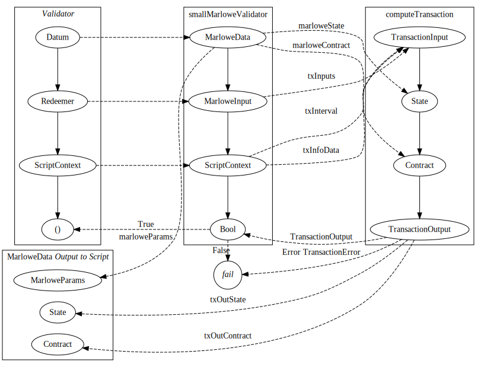

# On-Chain Transaction Specification for Marlowe


## Scope

This document defines the specification for Marlowe semantics's interface with the Cardano blockchain. Marlowe utilizes three Plutus scripts: (i) a monetary policy for the roles currency used in some Marlowe contracts; (ii) the Marlowe application validator script that enforces Marlowe semantics; and (iii) the Marlowe payout-validator script that allows the holder of a role token to withdraw funds paid by the Marlowe application. Marlowe semantics are defined in the Isabelle language and specified in [Marlowe Specification, Version 3 (draft)](marlowe-isabelle-specification-4f9fa249fa51ec09a4f286099d5399eb4301ed49.pdf).


## Contents

1. ["Participants in Marlowe Contracts"](#participants-in-marlowe-contracts) summarizes how participants of a Marlowe contract instance are represented on the blockchain.
2. ["Life Cycle of a Marlowe Contract"](#life-cycle-of-a-marlowe-contract) reviews the sequence of transaction types involved in executing a Marlowe contract instance on the blockchain.
3. ["Monetary Policy for Role Tokens"](#monetary-policy-for-role-tokens) discusses the minting of role tokens.
4. ["Representation of Marlowe Semantics in Plutus"](#representation-of-marlowe-semantics-in-plutus) outlines how Plutus types in Haskell relate to Marlowe types in Isabelle.
5. ["Merkleization"](#merkleization) describes how contracts optionally can be broken into Merkle trees of contract continuations.
6. ["Plutus Validator for Marlowe Semantics"](#plutus-validator-for-marlowe-semantics) specifies constraints on spending outputs at the Marlowe semantics validator address.
7. ["Plutus Validator for Marlowe Payouts"](#plutus-validator-for-marlowe-payouts) specifies constraints on spending output at the Marlowe payout validator address.
8. ["Summary Comparison of Haskell versus Isabelle Types"](#summary-comparison-of-haskell-versus-isabelle-types) tabulates the relationship between corresponding Haskell and Isabelle types.


## Participants in Marlowe Contracts

Marlowe contracts identify each participant by either a *public-key hash (PKH)* or a *role*. Marlowe semantics allow PKHs and roles to be freely mixed in contract logic.
- A Marlowe PKH corresponds to the hash of a Cardano payment verification key, `Hash PaymentKey`.
- A Marlowe role corresponds to a Cardano native token with the `TokenName`  for the role. (In Cardano, role names may be zero to thirty-two bytes long.) All of the role tokens in a given Marlowe contract instance must use the same  `CurrencySymbol` .


## Life Cycle of a Marlowe Contract

The execution of a Marlowe contract instance proceeds as a sequence of applications of inputs at the contract's script address.
1. Role tokens are typically minted prior to or within the creation transaction of the contract instance, though this is not enforced on-chain.
2. The creation transaction for the contract stores the state of the contract instance in the datum at the contract's script address.
3. Each transaction that interacts with the contract instance updates the state/datum at that same address.
4. If the contract instance pays funds to a role during application of inputs, those funds are sent to the address of the Marlowe payout-validator script, with a datum equal to the role name.
5. When a contract instance closes, there is no output to the contract's script address.

Thus each Marlowe contract instance is a finite sequence of continuations at the script address, from creation to closure. The following three UTxO diagrams illustrate the three typical types of Marlowe transactions.


## Monetary Policy for Role Tokens

Any Cardano monetary policy may be used to mint the role tokens used in a Marlowe contract instance. For security in standard Marlowe use cases, a one-time or locked minting policy such as `Plutus.Contracts.Currency.OneShotCurrency` is recommended. Exotic use cases might employ other monetary policies. It is the responsibility both of the developer of the off-chain code managing a contract instance and also of the user of the contract instance to verify that the monetary policy of the role tokens meets their security requirements.


## Representation of Marlowe Semantics in Plutus

Marlowe semantics are embodied in the Haskell function `computeTransaction` that follows [the Isabelle implementation of the Marlowe DSL](https://github.com/input-output-hk/marlowe/tree/master/isabelle/Core), as summarized in the [Appendix](#summary-comparison-of-haskell-versus-isabelle-types). Note that `computeTransaction` uses the `PlutusTx` types and functions instead of the standard-prelude or GHC-base Haskell ones.
```haskell
computeTransaction :: TransactionInput -> State -> Contract -> TransactionOutput
```

With the exception of `Input`, [the Isabelle types for Marlowe](https://github.com/input-output-hk/marlowe/blob/master/isabelle/Core/SemanticsTypes.thy) directly correspond to their Haskell representations, so below we only provide the definitions that will be later referenced in this document.
```haskell
data TransactionInput =
    TransactionInput
    {
      txInterval :: TimeInterval
    , txInputs   :: [Input]
    }

type TimeInterval = (POSIXTime, POSIXTime)

data State =
    State
    {
      accounts    :: Accounts
    , choices     :: Map ChoiceId ChosenNum
    , boundValues :: Map ValueId Integer
    , minTime     :: POSIXTime
    }

type Accounts = Map (AccountId, Token) Integer

data TransactionOutput =
    TransactionOutput
    {
      txOutWarnings :: [TransactionWarning]
    , txOutPayments :: [Payment]
    , txOutState    :: State
    , txOutContract :: Contract
    }
  | Error TransactionError
```

The `Input` of the Isabelle definition corresponds to the `InputContent` of the Haskell representation because the latter includes support for merkleization of a contract instance's continuations in `Case` statements. See the [next section](#merkleization) for further discussion of merkleization.
```haskell
data Input =
    NormalInput InputContent
  | MerkleizedInput InputContent BuiltinByteString Contract
```
In the above, the `BuiltinByteString` is the hash of the serialized continuation `Contract`.


## Merkelization

A contract can be represented as a tree of continuations ("sub-contracts") where each vertex is a contract and each edge follows either an `InputContent` made by a participant or a timeout. A `When` contract includes terms that are either (1) a `Case` which contains the `Action` that matches a particular `InputContent` via `NormalInput` and that explicitly includes the `Contract` continuation or (2) a `MerkleizedCase` which contains the `Action` that matches a particular `InputContent` via `MerkleizedInput` and that implicitly includes the continuation by reference to its Merkle hash. In the latter case `MerkleizedInput` includes both the Merkle hash of the continuation and the continuation `Contract` itself. The Plutus code must verify that the hash in the contract matches the hash in the input before it proceeds to use the continuation that was provided as input.

The Isabelle semantics do not include merkleization of Marlowe contracts, but the Haskell implementation does.


## Plutus Validator for Marlowe Semantics

The Marlowe validator is an unparameterized interpreter of Marlowe semantics. Thus, the script address of the Marlowe validator is independent of the particular contract instance and roles currency.
```haskell
smallMarloweValidator :: MarloweData -> MarloweInput -> ScriptContext -> Bool
```


### Types

The Plutus `Datum` for Marlowe simply bundles the role-currency and payout information with the `State` and the `Contract`:
```haskell
data MarloweData =
    MarloweData
    {
      marloweParams   :: MarloweParams
    , marloweState    :: State
    , marloweContract :: Contract
    }

data MarloweParams =
    MarloweParams
    {
      rolePayoutValidatorHash :: ValidatorHash
    }
```

The Plutus `Redeemer` provides the inputs for the semantics:
```haskell
type MarloweInput = [MarloweTxInput]

data MarloweTxInput =
    Input InputContent
  | MerkleizedTxInput InputContent BuiltinByteString
```
In the above, the `BuiltinByteString` is the hash of the serialized continuation of the contract. If `MerkleizedTxInput` is supplied in a redeemer, then the `ScriptContext` for the transaction must also contain an extra entry in its `txInfoData . scriptContextTxInfo` map from `DatumHash` to `Datum` for the serialized continuation of the contract.


### A Note about `Plutus.V1.Ledger.Value`

This specification relies on the following properties of `Plutus.V1.Ledger.Value` in the `plutus-ledger-api` package:
1. `instance Monoid Value`, where `mempty` is zero value for all tokens and `mappend` sums the amounts of corresponding token types.
2. `leq` is a partial ordering requiring that quantity of each token in the first operand is less than or equal to quanity of the corresponding token in the second operand, where a missing token in one operand represents a zero quantity.


### Relationship between Marlowe Validator and Semantics

The arguments of `computeTransaction` must be constructed as follows:
1. The `txInterval` of `TransactionInput` is derived from the `txInfoValidTimeRange . scriptContextInfo` of the `ScriptContext`, as detailed below.
2. The `txInputs` of `TransactionInput` is derived from the `MarloweInput` provided as the `Redeemer` and the `txInfoData . scriptContextTxInfo` of the `ScriptContext`, as detailed below.
3. The `State` is the `marloweState` of the `MarloweData` provided as the `Datum`.
4. The `Contract` is the `marloweContract` of the `MarloweData` provided as the `Datum`.
5. The new `Datum` at the script address is the `MarloweData` with the same `marloweParams` as originally, but with the new `txOutState` and `txOutContract` of the `TransactionOutput`.

In the diagram below, the upper three rectangles represent functions: the untyped `Validator`, the typed validator `smallMarloweValidator`, or the semantics's `computeTransaction`. The data values (ovals) are marshalled or passed from the untyped representation over to the semantics. The `computeTransaction` function validates the semantics and returns the required new state and contract instance. Conceptually, success or failure is passed to the untyped validator. The bottom rectangle packages the `Datum` that is provided as output for the continued progression of the Marlowe contract instance.




### Specification

Consider the application of the Marlowe validator and Marlowe semantics:
```haskell
validationResult = smallMarloweValidator marloweData marloweInput scriptContext

transactionOutput = computeTransaction transactionInput inState inContract
```

Furthermore, let `marloweValidatorHash :: ValidatorHash` be the hash of the Marlowe semantics script.

The validation fails (via returning `False` for `validationResult` or via the throwing of an error) if any of the following constraints does not hold. Fundamentally, all failures in Plutus are calls to `error` and all successes are returns of `()`. The typed Plutus validators obscure this distinction slightly by using `Bool` as the return type.


#### *Constraint 0.* Input to contract

The input present in the redeemer and script context is the input provided to the semantics computation.
```haskell
marloweInput ∪ txInfoValidRange (scriptContextTxInfo scriptContext) ∪ txInfoData (scriptContextTxInfo scriptContext) ≅ transactionInput
```
This is a congruence because `marloweInput` contains the input (perhaps including the Merkle hash of the contract's continuation) and the `txInfoValidRange` of the script context contains the validity interval for the transaction, whereas the `transactionInput` contains both. Any merkleized contract continuation is present in the `txInfoData` of the script context, whereas it is directly present in any `MerkleizedInput` of `transactionInput`. Also note that the script context may, in principle, contain an open, closed, or half-open/half-closed time interval, but Marlowe semantics requires a closed time interval.


#### *Constraint 1.* Typed validation

The datum, redeemer, and script context deserialize to the correct types.

Let `datum :: BuiltinData` and `redeemer :: BuiltinData` be the datum and redeemer in the script witness for spending the Marlowe UTxO, and let `scriptContext' :: BuiltinData` be the script context data.
```haskell
fromBuiltinData datum          ≡ (Just marloweData   :: Maybe MarloweData)
fromBuiltinData redeemer       ≡ (Just marloweInput :: Maybe MarloweInput)
fromBuiltinData scriptContext' ≡ (Just scriptContext :: Maybe ScriptContext)
```


#### *Constraint 2.* Single Marlowe script input

The output of exactly one Marlowe UTxO is spent in the transaction.
```haskell
filter (isMarloweAddress . txOutAddress . txInfoResolved) (txInfoInputs $ scriptContextTxInfo scriptContext) ≡ [TxInInfo _ (TxOut _ inValue _)]
  where isMarloweAddress (Address (ScriptCredential hash)) = hash == marloweValidatorHash
        isMarloweAddress _ = False
```
Hereafter we use `inValue` as the script value being spent.


#### *Constraint 3.* Single Marlowe output

There is a single output to the Marlowe script address unless the contract instance closes, in which case there is no output.
```haskell
txOutContract transactionOutput /= Close ⇒ filter (isMarloweAddress . txOutAddress) (txInfoOutputs $ scriptContextTxInfo scriptContext) ≡ [TxOut _ outValue (Just outDatum)]
  where isMarloweAddress (Address (ScriptCredential hash)) = hash == marloweValidatorHash
        isMarloweAddress _ = False
```
Hereafter we use `outValue` for the value being output to the script address and `outDatum` being the datum associated with that UTxO.


#### *Constraint 4.* No output to script on close

When a contract instance closes, the transaction does not output to the Marlowe script address.
```haskell
txOutContract transactionOutput == Close ⇒ filter (isMarloweAddress . txOutAddress) (txInfoOutputs $ scriptContextTxInfo scriptContext) ≡ []
  where isMarloweAddress (Address (ScriptCredential hash)) = hash == marloweValidatorHash
        isMarloweAddress _ = False
```


#### *Constraint 5.* Input value from script

The value of the Marlowe UTxO being spent exactly matches the value recorded in the Marlowe state.
```haskell
inValue ≡ foldMap toValue (accounts $ marloweState marloweData)
  where toValue ((_, Token currency name), count)) = Value.singleton currency name count
```


#### *Constraint 6.* Output value to script

The beginning balance plus the deposits equals the ending balance plus the payments.
```haskell
inValue + foldMap valueOfDeposit (fmap getInputContent transactionInput) ≡ outValue + foldMap valueOfPayment (txOutPayments transactionOutput)
  where getInputContent (Input inputContent) = inputContent
        getInputContent (MerkleizedTxInput inputContent _) = inputContent
        valueOfDeposit (IDeposit _ _ (Token currency name) count) = Value.singleton currency name count
        valueOfDeposit _ = mempty
        valueOfPayment (Payment _ (Party _) value)) = value
        valueOfPayment _ = mempty
```


#### *Constraint 7.* Input state

The input state of the transaction is the state input to the semantics computation.
```haskell
inState ≡ marloweState marloweData
```


#### *Constraint 8.* Input contract

The input contract instance of the transaction is the contract input to the semantics computation.
```haskell
inContract ≡ marloweContract marloweData
```


#### *Constraint 9.* Marlowe parameters

The Marlowe parameters are not changed by the transaction.
```haskell
Just $ marloweParams marloweData ≡ fmap marloweParams . fromBuiltinData $ getDatum outDatum
```


#### *Constraint 10.* Output state

The output state of the transaction matches the result of the semantics computation.
```haskell
Just $ txOutState transactionOutput ≡ fmap marloweState . fromBuiltinData $ getDatum outDatum
```


#### *Constraint 11.* Output contract

The output contract instance of the transaction matches the result of the semantics computation.
```haskell
Just $ txOutContract transactionOutput ≡ fmap marloweContract . fromBuiltinData $ getDatum outDatum
```


#### *Constraint 12.* Merkleized continuations

All of the merkleized contracts referenced in the input are provided to the script via the map of `DatumHash` to `Datum` that is provided to the validator via `ScriptContext`.
```haskell
all demerkleizes transactionInput ≡ True
  where demerkleizes (MerkelizedTxInput _ hash) = isJust (fromBuiltinData =<< lookup hash (txInfoData $ scriptContextTxInfo scriptContext) :: Maybe Contract)
        demerkleizes (Input _) = True
```


#### *Constraint 13.* Positive balances

All accounts in the state have positive balances.
```haskell
all ((> 0) . snd) (accounts $ marloweState marloweData) ≡ True
```


#### *Constraint 14.* Inputs authorized

The required signature or at least one role token is present in the transaction for each deposit or choice.
```haskell
all authorized (fmap getInputContent transactionInput) ≡ True
  where getInputContent (Input inputContent) = inputContent
        getInputContent (MerkleizedTxInput inputContent _) = inputContent
        authorized (IDeposit _ (PK hash) _ _) = authorizedHash hash
        authorized (IDeposit _ (Role role) _) = authorizedRole role
        authorized (IChoice (ChoiceId _ (PK hash)) _) = authorizedHash hash
        authorized (IChoice (ChoiceId _ (Role role)) _) = authorizedRole role
        authorized INotify = True
        authorizedHash hash = elem hash (txInfoSignatories $ scriptContextTxInfo scriptContext)
        authorizedRole role = Value.leq (Value.singleton (rolesCurrency $ marloweparams marloweData) role 1) spent
        spent = foldMap (txOutValue . txInInfoResolved) (txInfoInputs $ scriptContextTxInfo scriptContext)
```


#### *Constraint 15.* Sufficient payment

Sufficient funds are paid to the public keys or roles.
```haskell
all sufficient (txOutPayments transactionOutput)
  where sufficient (Payment _ (Party (PK hash)) value) = Value.leq value (foldMap (paidToHash hash) (txInfoOutputs $ scriptContextTxInfo scriptContext))
                   (Payment _ (Party (Role role)) value) = any (paysToRole role value) (txInfoOutputs $ scriptContextTxInfo scriptContext)
        paysToRole (TxOut txOutAddress txOutValue (Just hash)) role value = txOutAddress == (Ledger.scriptHashAddress . rolePayoutValidatorHash $ marloweParams marloweData)
                                                                              && lookup hash (txInfoData $ scriptContextTxInfo scriptContext) == Just (Datum $ toBuiltinData role)
                                                                              && Value.leq value txOutValue
        paysToRole _ _ = False
        paidToHash hash (TxOut (Address (PubKeyCredential hash') _) txOutValue _) = if hash == hash' then txOutValue else mempty
```

Note that the comparison is `leq` instead of equality because additional Ada may be required in the payment in order to satisfy the ledger's `minimum UTxO` constraint.


## Plutus Validator for Marlowe Payouts


The Marlowe payout validator for roles is a Plutus script parameterized by currency symbol.
```haskell
rolePayoutValidator :: (CurrencySymbol, TokenName) -> () -> ScriptContext -> Bool
```


### Specification

Consider the application of the Marlowe payout validator:
```haskell
validationResult' = rolePayoutValidator rolesCurrency' role () scriptContext
```

The validation fails (via returning `False` for `validationResult'` or via the throwing of an error) if any of the following constraints does not hold.


#### *Constraint 16.* Typed validation

The bytes for datum, redeemer, and script context deserialize to the correct types.

Let `datum :: BuiltinData` and `redeemer :: BuiltinData` be the datum and redeemer bytes in the script witness for spending the payout UTxO, and let `scriptContext' :: BuiltinData` be the script context bytes.
```haskell
fromBuiltinData datum          ≡ (Just role          :: Maybe TokenName)
fromBuiltinData redeemer       ≡ (Just ()            :: Maybe ())
fromBuiltinData scriptContext' ≡ (Just scriptContext :: Maybe ScriptContext)
```


#### *Constraint 17.* Payment authorized

The role token matching the datum must be spent in the transaction in order to redeem funds from the script.
```haskell
Value.leq (Value.singleton rolesCurrency' role 1) spent
  where spent = foldMap (txOutValue . txInInfoResolved) (txInfoInputs $ scriptContextTxInfo scriptContext)
```


## Summary Comparison of Haskell versus Isabelle Types

This table compares . . .

- Isabelle types in [`BlockchainTypes`](https://github.com/input-output-hk/marlowe/blob/master/isabelle/Core/BlockchainTypes.thy), [`SemanticsTypes`](https://github.com/input-output-hk/marlowe/blob/master/isabelle/Core/SemanticsTypes.thy), [`Semantics`](https://github.com/input-output-hk/marlowe/blob/master/isabelle/Core/Semantics.thy)
- Marlowe-Cardano Haskell types [`Language.Marlowe.Core.V1`](../src/Language/Marlowe/Core/V1/) |

| Category                              | Isabelle           | Haskell            |
|---------------------------------------|--------------------|--------------------|
| Blockchain                            | AccountId          | AccountId          |
|                                       | Accounts           | Accounts           |
|                                       | ChoiceName         | ChoiceName         |
|                                       | ChosenNum          | ChosenNum          |
|                                       | -                  | Money              |
|                                       | TimeInterval       | TimeInterval       |
|                                       | Timeout            | Timeout            |
| Contract                              | Action             | Action             |
|                                       | Bound              | Bound              |
|                                       | Case               | Case Contract      |
|                                       | ChoiceId           | ChoiceId           |
|                                       | Contract           | Contract           |
|                                       | Observation        | Observation        |
|                                       | Party              | Party              |
|                                       | Payee              | Payee              |
|                                       | Token              | Token              |
|                                       | Value              | Value Observation  |
|                                       | ValueId            | ValueId            |
| Transaction                           | -                  | Input              |
|                                       | Input              | InputContent       |
|                                       | Payment            | Payment            |
|                                       | Environment        | Environment        |
|                                       | State              | State              |
|                                       | -                  | TransactionInput   |
|                                       | TransactionOutput  | TransactionOutput  |
| Result                                | -                  | ApplyAction        |
|                                       | ApplyAllResult     | ApplyAllResult     |
|                                       | ApplyResult        | ApplyResult        |
|                                       | ApplyWarning       | ApplyWarning       |
|                                       | IntervalError      | IntervalError      |
|                                       | IntervalResult     | IntervalResult     |
|                                       | ReduceEffect       | ReduceEffect       |
|                                       | ReduceResult       | ReduceResult       |
|                                       | ReduceStepResult   | ReduceStepResult   |
|                                       | ReduceWarning      | ReduceWarning      |
|                                       | TransactionError   | TransactionError   |
|                                       | TransactionWarning | TransactionWarning |
